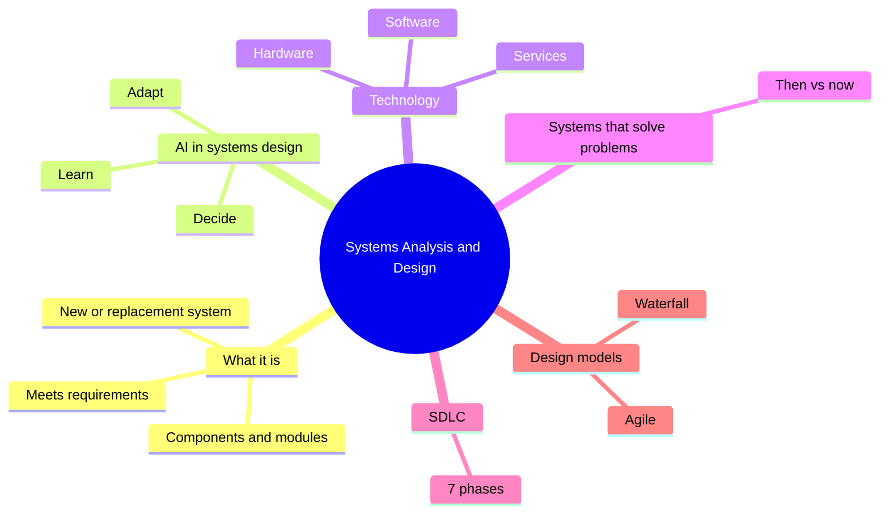
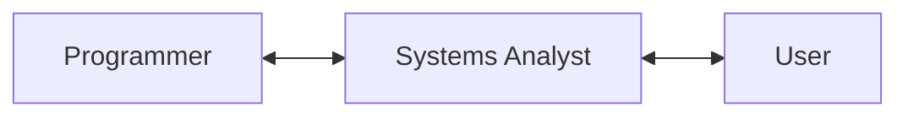
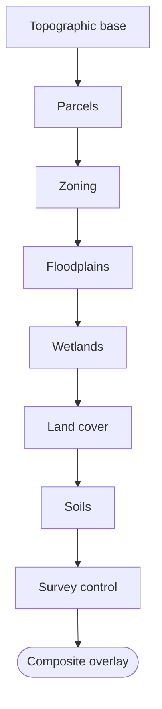
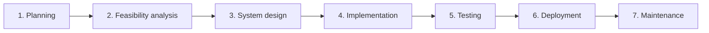
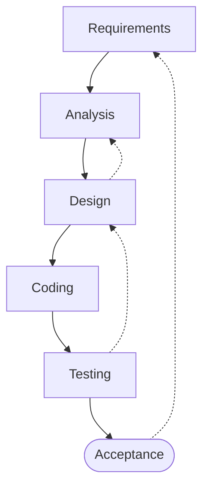
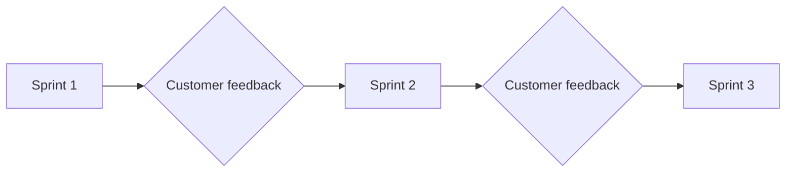

# Systems Analysis and Design: Introduction and Overview

The first thing this lecture wants you to know is that **[[Systems Analysis and Design]] is about more than coding programs for computers.** Coding is one part of the work. Before anyone writes code, someone has to understand the problem, decide what the new system must do, and plan how it will work. That planning work is what this course is about.



## What is Systems Analysis and Design?

> [!note] Definition
> ***Systems Analysis and Design*** is the process of setting up a **new system**, or **replacing an older system**, by defining its **components or modules** so that it satisfies specific **requirements**.

Put simply, you look at what an organization needs, then break the solution into smaller parts (modules) that together do the job. The "requirements" are the list of things the system has to do for the people who will use it.

> [!warning] Common misconception
> Many students think this field is mostly programming. Programming only happens in one phase ([[#Phase 4 Implementation|Implementation]]). Most of the analyst's work is understanding people, processes, and requirements.

## The field keeps changing: AI in systems design

The slides point out that the IT world is always changing, and that **AI is here to stay**. AI systems are now built into systems design.

> [!note] Definition
> ***[[Artificial Intelligence]] (AI)*** means using computers to do things that traditionally require human intelligence.

A few points from the slides about AI:

- AI can process **much larger amounts of data** than a human can.
- The goal is for it to **recognize patterns, make decisions, and judge** the way a human would.
- To do that, an AI system needs **lots of data** built into it.

> [!important] AI fused with systems design
> AI can now be combined with Systems Analysis and Design. When that happens, a system does its job efficiently and can also **learn, adapt, and make intelligent decisions** on its own.

> [!example] Smart automotive technology
> The slides use a smart car as the example. A modern car's system does more than follow fixed instructions: it collects data from sensors and uses it to react to what is happening around it.

## Course objectives

The objectives slides give a roadmap of what the course will cover. Many of these topics get their own lectures later, so here they are only named.

| Objective | What it covers |
|---|---|
| What is systems analysis | The basic idea and how it developed over time |
| Design and analysis concepts and methods | The tools and approaches analysts use |
| Role of the [[Systems Analyst]] | What the job involves, and "do you have what it takes?" |
| [[Business Profile]] and [[Business Model]] | What they are and why the analyst needs them |
| Internet business strategies | **B2C** (Business to Consumer) and **B2B** (Business to Business) |
| Types of [[Information Systems]] | Five types, and who uses each one |
| Types of analysis | [[Structured Analysis]], [[Object-Oriented Analysis]], [[Agile]] method |
| The [[Waterfall]] method | A sequential design process where one phase flows into the next |

The five types of information systems named on the slides are:

1. [[Management Information Systems]] (MIS)
2. [[Transaction Processing Systems]] (TPS)
3. [[Decision Support Systems]] (DSS)
4. [[Executive Information Systems]] (EIS)
5. [[Expert Systems]] (ES)

> [!tip] Extra reading
> The slides only list these five types for now. If you want a head start, GeeksforGeeks has an overview: https://www.geeksforgeeks.org/types-of-information-system/

### The analyst sits in the middle

One objectives slide shows three pictures in a row: **Programmer ↔ System Analyst ↔ User**. Another shows "The Computer Guy" ↔ "System Analyst".



The analyst is the link between the people who **use** a system and the people who **build** it. Users describe their problems in business language; programmers need precise technical instructions. The analyst translates in both directions.

## What is technology?

To be a Systems Analyst you need to understand what technology represents. The slides define it as a combination of three things:

> [!note] Definition
> ***Technology*** is a combination of **hardware**, **software**, and **services** that people use to communicate and share information.

| Part | Meaning | Example |
|---|---|---|
| Hardware | The physical equipment | A phone, a laptop, a server |
| Software | The programs that run on the hardware | A banking app |
| Services | What the technology provides to people | Online bill payment, e-transfers |

> [!important]
> According to the slides, technology today is **essential for a business to succeed**.

## Systems that solve problems: then and now

A large part of the lecture is a series of examples. Each one shows a system we use today and asks: **what was it like before?** The point is to see that every one of these systems was designed by someone to solve a real problem, usually a slow, manual, paper-based process.

| System | How it works now (from the slides) | Question from the slides |
|---|---|---|
| Mobile / online banking | Outward and inward transactions, fund transfer using MMID, blocking an ATM card online, internal fund transfers | What did we do before? |
| Phone system | Users can text or dial directly anywhere | What was it like before? |
| Payroll systems | Net pay is deposited directly into the employee's bank account | What was this like in the past? |
| Banking activities | Pay bills, e-transfers, and check statements, all done online | What was it like before? |
| Stock market | Shares are traded over the Internet and investors get monthly summaries | What was the process before? |
| Mortgage applications | We give our SIN to lenders, they check credit ratings and employment status, and approve in minutes | What was it like in the past? |
| Library checkout | Hold the book and card under a scanner; get an email reminder if the book is late | What was the old procedure? |
| Buying a book | Order on the web, pay by credit card, get the book the next day | What did we do before? |
| Paying taxes | (Open question) | How is it done now? How was it done before? |
| University applications | Apply online and get accepted right away | How about booking courses and calculating grades? |
| Financial aid | Apply online and sometimes get immediate feedback | How was this handled in the past? |
| Enrolling in courses | Students enrol through the Internet; tuition is added to their account each time they add a course | What happened in the old days? |
| Medical records | Patient history and drug information | Compare the future to the past |
| Municipal [[Geographic Information System\|GIS]] | City maps and planning, built from layers (topographic base, parcels, zoning, floodplains, wetlands, land cover, soils, survey control, composite overlay) | How was this handled in the past? |
| Medical research and collaboration | (Open question) | How did doctors get information in the past? |

> [!example]- Some ideas for the "before" questions (try answering first)
> - **Banking:** visiting a branch in person, standing in line, writing paper cheques, receiving paper statements by mail.
> - **Phone:** calls went through an operator; long distance was expensive and there was no texting.
> - **Payroll:** employees received a paper cheque and had to deposit it themselves.
> - **Library:** a card with the due date was stamped by hand, and staff kept paper records of who borrowed what.
> - **Buying a book:** going to a bookstore, or ordering by mail and waiting weeks.
> - **Course enrolment:** lining up at the registrar's office with paper forms, with tuition calculated by hand.
> - **Municipal GIS:** separate paper maps drawn by hand, which were hard to update and compare.
>
> Notice the pattern: the old way was manual, slow, and paper based. A new system replaced it.

> [!tip] How to use these examples
> The last example slide, "Suggest other systems: then and now", asks for student input. Pick a system you use every week (food delivery, bus schedules, streaming) and ask the same two questions. Thinking this way is the habit of a Systems Analyst: look at how a process works today and imagine how a system could improve it.

The GIS layers can be pictured like this: each layer holds one kind of data, and the system stacks them to produce a combined map.



## The System Development Life Cycle (SDLC)

> [!note] Definition
> The ***[[Systems Development Life Cycle]] (SDLC)*** is a framework for **planning, building, and maintaining** systems so that they meet client or industry requirements. It contains a number of **phases**.

The slides describe seven phases.



### Phase 1: Planning

Planning is the **foundation of any successful software development project**. During this phase the team gathers and documents the project's **goals, objectives, and requirements**. This is where [[Requirements Gathering]] happens.

### Phase 2: Feasibility analysis

A [[Feasibility Study]] **evaluates whether the project is technically and financially viable**, meaning whether it can actually be built and whether it is worth the money. The work in this phase includes:

- evaluating the technical requirements
- estimating costs
- performing a **risk analysis**

### Phase 3: System design

Using the requirements gathered during planning, the team creates a **blueprint** that shows how the software will function, including the **user interface design**.

To show how the system will work, designers use diagrams such as:

- process flow diagrams
- [[Data Flow Diagram|data flow diagrams]]
- [[UML]] diagrams

> [!tip] Extra reading
> Lucidchart has a clear visual guide to UML diagram types: https://www.lucidchart.com/pages/uml-diagram-types

### Phase 4: Implementation

Also called the **development phase**. This is where the design becomes a working application, and it is where the **actual coding** takes place.

> [!important]
> Coding shows up in phase 4 of 7. Everything before it is analysis and design, which is why the lecture opened by saying the field is more than coding.

### Phase 5: Testing

The team **identifies and fixes bugs** and makes sure the software works as intended **before** it is deployed to users.

### Phase 6: Deployment

Once testing is complete, the system is **deployed to end users**. This usually includes a **beta-testing phase or pilot launch**, limited to a select group of users.

> [!example] Pilot launch
> A college might release a new course registration system to one program first. If those students run into problems, the team can fix them before the whole college switches over.

### Phase 7: Maintenance

Maintenance is the **last phase** of the SDLC. The system needs **ongoing support** to address issues, apply updates, and add new features.

### SDLC summary table

| Phase | Main question | Key output |
|---|---|---|
| 1. Planning | What do we need? | Documented goals, objectives, requirements |
| 2. Feasibility analysis | Can we build it, and can we afford it? | Technical evaluation, cost estimate, risk analysis |
| 3. System design | How will it work? | Blueprint, UI design, process/data flow and UML diagrams |
| 4. Implementation | Build it | Working code |
| 5. Testing | Does it work correctly? | Bugs found and fixed |
| 6. Deployment | Get it to users | Beta test or pilot, then full release |
| 7. Maintenance | Keep it running and improving | Fixes, updates, new features |

> [!tip] More on the SDLC
> - TutorialsPoint: https://www.tutorialspoint.com/sdlc/sdlc_overview.htm
> - GeeksforGeeks: https://www.geeksforgeeks.org/software-development-life-cycle-sdlc/

## Two basic system design models

The slides name two basic models used in system design.

### The Waterfall model

> [!note] Definition
> The ***[[Waterfall]] model*** is a **linear** approach to development in which **each phase must be completed before the next one begins**. One phase flows into the next, like water going down steps.

The waterfall diagram on the slides shows six steps: Requirements, Analysis, Design, Coding, Testing, and Acceptance. It also has arrows going **back up**: from Design back to Analysis, from Testing back to Design, and from Acceptance back to Requirements. Those arrows show that when a problem is found later, the team has to return to an earlier phase to fix it.



### The Agile model

> [!note] Definition
> The ***[[Agile]] model*** is a **more flexible** approach to software development. It emphasizes **collaboration**, **adaptability**, and **customer feedback**, and development happens in small, incremental cycles called ***sprints***.



### Waterfall vs Agile

| | Waterfall | Agile |
|---|---|---|
| Shape | Linear, one phase after another | Repeated small cycles (sprints) |
| Moving on | A phase must be finished before the next begins | Work is delivered in small increments |
| Flexibility | Low; going back to an earlier phase is costly | High; adapts as requirements change |
| Customer involvement | Mostly at the start (requirements) and end (acceptance) | Feedback throughout the project |

> [!warning] Common mistake
> The Waterfall diagram has backward arrows, but that does not make it Agile. In Waterfall, going back means redoing a finished phase. In Agile, revisiting and adjusting is built into every sprint.

> [!tip] More on the two models
> - Waterfall: https://www.geeksforgeeks.org/waterfall-model/
> - Agile: https://www.tutorialspoint.com/sdlc/sdlc_agile_model.htm

## Exercises

### Exercise 1 (Direct application)
A company's team has just finished writing the code for a new inventory app. According to the SDLC, which phase are they in, and which phase comes next?

> [!success]- Answer key
> They are in **Phase 4: Implementation** (the development phase), because that is where coding takes place. The next phase is **Phase 5: Testing**, where bugs are identified and fixed before the software reaches users.

### Exercise 2 (Direct application)
Classify each item as hardware, software, or service: (a) a tablet, (b) an e-transfer, (c) a spreadsheet program, (d) online bill payment, (e) a network router.

> [!success]- Answer key
> (a) Hardware, it is physical equipment. (b) Service, it is something the technology provides to people. (c) Software, it is a program. (d) Service. (e) Hardware.
> Together these match the slides' definition of technology: hardware, software, and services used to communicate and share information.

### Exercise 3 (Direct application)
A manager asks: "Before we spend money on this project, can we even build it, and is it worth the cost?" Which SDLC phase answers this question, and what three activities happen in it?

> [!success]- Answer key
> **Phase 2: Feasibility analysis.** It checks whether the project is technically and financially viable. The three activities are evaluating technical requirements, estimating costs, and performing a risk analysis.

### Exercise 4 (Applied variation)
A new library system is released to one branch for a month before every branch gets it. Staff at that branch report two bugs, which are fixed. Name the phase and the specific practice being used, and explain why it is useful.

> [!success]- Answer key
> This is **Phase 6: Deployment**, using a **pilot launch** (similar to beta testing) limited to a select group of users. It is useful because problems show up with a small group first, so they can be fixed before the whole organization depends on the system.

### Exercise 5 (Applied variation)
A client says: "I'm not sure exactly what I want yet. I'd like to see something working early and change it as we go." Which design model fits better, Waterfall or Agile? Explain using the definitions from the lecture.

> [!success]- Answer key
> **Agile.** The Waterfall model is linear: each phase must be completed before the next begins, so requirements need to be clear at the start. Agile is more flexible, relies on customer feedback, and delivers work in small incremental sprints, so the client can see early versions and ask for changes after each sprint.

### Exercise 6 (Applied variation)
Using the course enrolment example (students enrol online and tuition is added to their account each time they add a course), describe one thing that would happen in the Planning phase and one thing that would happen in the System design phase if you were building this system.

> [!success]- Answer key
> **Planning:** gather and document requirements, for example "a student must be able to add a course online" and "tuition must update automatically when a course is added".
> **System design:** create a blueprint of how it will work, such as the screens a student sees (user interface design) and a data flow diagram showing how the course selection flows into the student's tuition account.
> The key idea is that planning decides *what* the system must do, and design decides *how* it will do it.

### Exercise 7 (Challenge)
A food truck owner currently takes orders on paper and accepts only cash. Customers often wait 15 minutes. Acting as a Systems Analyst, walk through the seven SDLC phases for a mobile ordering system. Give one concrete activity per phase.

> [!success]- Answer key
> One possible answer:
> 1. **Planning:** interview the owner and customers; document requirements such as online ordering, card payment, and a "your order is ready" notification.
> 2. **Feasibility analysis:** check whether an existing ordering platform or a custom app is technically possible, estimate the cost, and consider risks (for example, weak mobile signal at event locations).
> 3. **System design:** sketch the app screens and draw a process flow from "customer places order" to "order ready".
> 4. **Implementation:** developers build the app.
> 5. **Testing:** place test orders to find bugs, such as duplicate orders or wrong totals.
> 6. **Deployment:** pilot it at one weekend event before using it every day.
> 7. **Maintenance:** fix issues reported by customers and add features later, such as a loyalty program.
> Any answer is correct if each activity matches the purpose of its phase.

### Exercise 8 (Challenge)
The lecture says AI can be fused with systems design so that systems can "learn, adapt, and make intelligent decisions". Choose one "now" system from the then-and-now examples (for example, mortgage approval or library checkout) and propose how AI could improve it further. What does the AI need in order to work, according to the slides?

> [!success]- Answer key
> Example: **mortgage approval.** Today the system checks credit ratings and employment status and approves in minutes. An AI component could recognize patterns in past applications to flag possible fraud or suggest a suitable loan amount.
> According to the slides, AI needs **lots of data** built into it to recognize patterns, make decisions, and judge like a human. So the analyst would have to plan for collecting and storing large amounts of past application data. (A good answer might also note that decisions like this affect people, so the system should be tested carefully.)

## Feynman practice

Explain each concept in your own words. Do not copy from the note above.

### Feynman: Systems Analysis and Design is more than coding

- [ ] **1. Explain it as if to a 12-year-old.** Imagine your younger cousin thinks "making an app" just means typing code. How would you explain what has to happen before anyone writes a line of code?
- [ ] **2. Where did you get stuck or use jargon?** Reread what you wrote. Highlight any word a 12-year-old wouldn't understand (for example "requirements" or "module").
- [ ] **3. Go back to the source and simplify.** For each highlighted word, write an analogy or example. (Hint: think about building a house.)
- [ ] **4. Organize and test.** Rewrite the explanation in 3 to 5 sentences. Could you teach it in 2 minutes?

### Feynman: The role of the Systems Analyst

- [ ] **1. Explain it as if to a 12-year-old.** The slides show Programmer ↔ System Analyst ↔ User. Using an everyday situation where one person translates between two others, explain what the analyst does.
- [ ] **2. Where did you get stuck or use jargon?** Highlight any technical words.
- [ ] **3. Go back to the source and simplify.** Replace each one with an example from school or work.
- [ ] **4. Organize and test.** Rewrite in 3 to 5 sentences.

### Feynman: The SDLC

- [ ] **1. Explain it as if to a 12-year-old.** Describe the seven phases as if you were planning and running a school event (a bake sale, a tournament). Which step matches feasibility? Which one matches maintenance?
- [ ] **2. Where did you get stuck or use jargon?** Highlight words like "deployment" or "viable".
- [ ] **3. Go back to the source and simplify.** Why does testing come before deployment? What would go wrong if you skipped feasibility?
- [ ] **4. Organize and test.** Rewrite in 3 to 5 sentences, keeping the phases in order.

### Feynman: Waterfall vs Agile

- [ ] **1. Explain it as if to a 12-year-old.** Using cooking a meal as the analogy, explain the difference between following a fixed recipe step by step and tasting and adjusting as you go.
- [ ] **2. Where did you get stuck or use jargon?** Highlight "linear", "incremental", "sprint".
- [ ] **3. Go back to the source and simplify.** What do the backward arrows in the waterfall diagram mean? When would you pick each model?
- [ ] **4. Organize and test.** Rewrite in 3 to 5 sentences.

### Feynman: AI in systems design

- [ ] **1. Explain it as if to a 12-year-old.** How would you explain the difference between a regular system and one that can "learn, adapt, and make decisions", using the smart car example?
- [ ] **2. Where did you get stuck or use jargon?** Highlight "patterns" or "data".
- [ ] **3. Go back to the source and simplify.** Why does AI need lots of data? Find an everyday comparison.
- [ ] **4. Organize and test.** Rewrite in 3 to 5 sentences.

## Flashcards (Anki import)

Copy the block below into a `.txt` file and import it in Anki with File > Import. Fields are tab separated: Front, Back, Tags.

```
#separator:tab
#html:false
#tags column:3
What is Systems Analysis and Design?	The process of setting up a new system or replacing an older one by defining its components or modules to satisfy specific requirements.	csd124 lecture-01
Is Systems Analysis and Design mainly about coding?	No. Coding is only one part (the Implementation phase); most of the work is understanding requirements and planning the system.	csd124 lecture-01
How do the slides define Artificial Intelligence?	Using computers to do things that traditionally require human intelligence.	csd124 lecture-01 ai
According to the slides, what are the goals of AI technology?	To recognize patterns, make decisions, and judge like humans.	csd124 lecture-01 ai
What does an AI system need in order to recognize patterns and make decisions?	Lots of data incorporated into it.	csd124 lecture-01 ai
What new capability does fusing AI with systems design give a system?	The ability to learn, adapt, and make intelligent decisions, not just operate efficiently.	csd124 lecture-01 ai
What three things make up technology, according to the slides?	Hardware, software, and services that people use to communicate and share information.	csd124 lecture-01
Where does the Systems Analyst sit between the programmer and the user?	In the middle, as the link that translates between the users' needs and the programmers' technical work.	csd124 lecture-01 analyst
What does B2C stand for?	Business to Consumer.	csd124 lecture-01
What does B2B stand for?	Business to Business.	csd124 lecture-01
Name the five types of information systems listed in the slides.	MIS, TPS, DSS, EIS, and Expert Systems (ES).	csd124 lecture-01
What is the SDLC?	The System Development Life Cycle: a framework for planning, building, and maintaining systems so they meet client or industry requirements.	csd124 lecture-01 sdlc
What happens in SDLC Phase 1 (Planning)?	Goals, objectives, and requirements are gathered and documented.	csd124 lecture-01 sdlc
What does SDLC Phase 2 (Feasibility analysis) evaluate?	Whether the project is technically and financially viable.	csd124 lecture-01 sdlc
Which three activities take place in feasibility analysis?	Evaluating technical requirements, estimating costs, and performing a risk analysis.	csd124 lecture-01 sdlc
What is produced in SDLC Phase 3 (System design)?	A blueprint of how the software will function, including the user interface design.	csd124 lecture-01 sdlc
Which diagrams are used in the system design phase to show how the system will function?	Process flow, data flow, and UML diagrams.	csd124 lecture-01 sdlc
In which SDLC phase does the actual coding take place?	Phase 4: Implementation (the development phase).	csd124 lecture-01 sdlc
What is the purpose of SDLC Phase 5 (Testing)?	To identify and fix bugs so the software works as intended before it is deployed to users.	csd124 lecture-01 sdlc
What does deployment typically include before a full release?	A beta-testing phase or pilot launch limited to a select group of users.	csd124 lecture-01 sdlc
Why is maintenance needed after a system is deployed?	To address issues, apply updates, and add new features.	csd124 lecture-01 sdlc
What is the Waterfall model?	A linear approach to development in which each phase must be completed before the next one begins.	csd124 lecture-01 waterfall
What do the backward arrows in the waterfall diagram represent?	Returning to an earlier phase when a problem is found later (e.g. Testing back to Design, Acceptance back to Requirements).	csd124 lecture-01 waterfall
What is the Agile model?	A flexible approach emphasizing collaboration, adaptability, and customer feedback, with development in small incremental cycles.	csd124 lecture-01 agile
What are the small incremental development cycles in Agile called?	Sprints.	csd124 lecture-01 agile
Why is Agile a better fit than Waterfall when requirements are unclear?	Agile gathers customer feedback every sprint and adapts, while Waterfall expects each phase to be finished before moving on.	csd124 lecture-01 agile waterfall
```

## Tags

#csd124 #systemsanalysis #systemdesign #sdlc #waterfall #agile #artificialintelligence #informationsystems #systemsanalyst #requirements
