# Process Flow and Data Flow Diagrams

This lecture picks up the [[Systems Development Life Cycle]] again and focuses on its first two phases: **Systems Initiation** and **Systems Analysis**. Along the way it compares the traditional [[Waterfall]] method with newer approaches ([[Joint Application Design|JAD]], [[Rapid Application Development|RAD]] and [[Agile]]). It then introduces the two diagrams an analyst uses to describe a system: the [[Process Flow Diagram]] and the [[Data Flow Diagram]] (DFD).

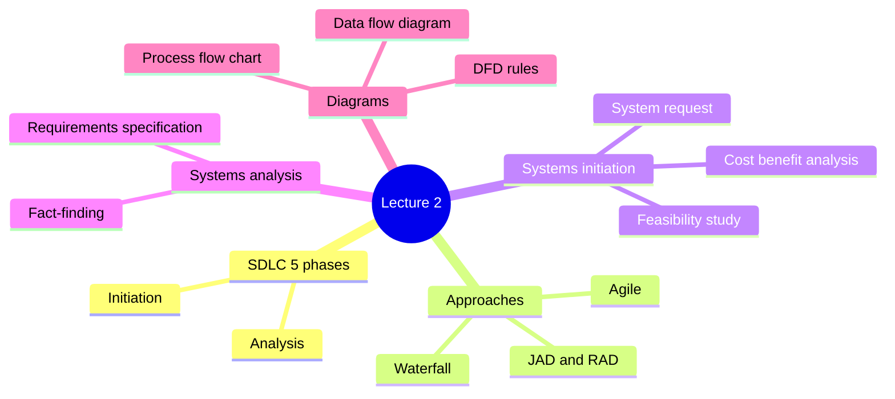

## The SDLC in 5 phases

The first slide shows the SDLC as a **cycle** of five phases. Two yellow arrows point at phases 1 and 2, because those are the phases this lecture covers.

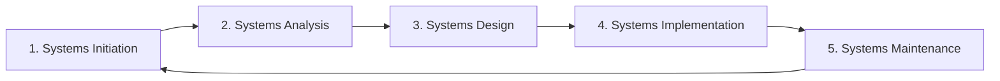

> [!warning] Five phases or seven?
> In [[Lecture 01 - Systems Analysis Overview|Lecture 01]] the SDLC had seven phases (Planning, Feasibility, Design, Implementation, Testing, Deployment, Maintenance). This lecture uses a **5-phase** version. The work is the same, only grouped differently: here, feasibility is part of Systems Initiation, and testing and deployment fall under Implementation. Know both versions, and use the one your instructor asks for.

The arrow from Maintenance back to Initiation matters. When a system gets old or the business changes, a new request starts the cycle again.

## The Waterfall method: the traditional way

> [!note] Definition
> The ***[[Waterfall]] method*** is the traditional way of designing systems. **One phase flows into the next**, so it is a ***sequential design process***.

The slide's diagram goes down like steps: Requirements, Analysis, Design, Coding, Testing, Acceptance. It also has three arrows going back up: Design to Analysis, Testing to Design, and Acceptance to Requirements. These show that a problem found late forces the team to go back and redo an earlier phase.

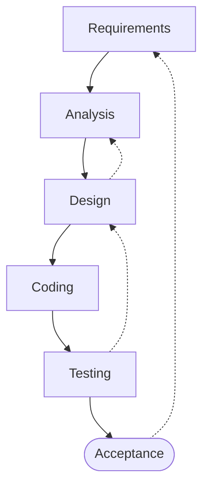

## Newer approaches

The slide marks this topic as **Important**. Newer development approaches are more **team based**: IT staff and system users work together to speed up the process.

### Joint Application Design (JAD)

> [!note] Definition
> ***[[Joint Application Design]] (JAD)*** brings a group of users together to **meet intensively with systems analysts**. The goal is to help with **information gathering** and defining the **system requirements**.

Instead of the analyst interviewing people one at a time over several weeks, everyone who matters sits in the same room and works out the requirements together.

### Rapid Application Development (RAD)

> [!note] Definition
> ***[[Rapid Application Development]] (RAD)*** **speeds up the SDLC**. Users take part in the **design and development** tasks in a more interactive, iterative way.

Because users are involved while the system is being built, they can **give feedback much sooner** than in the traditional SDLC, where they often see the system only near the end.

| | JAD | RAD |
|---|---|---|
| What it speeds up | Information gathering and requirements | The whole SDLC |
| Users do what? | Meet intensively with analysts | Take part in design and development |
| Main benefit | Requirements are agreed faster, with everyone present | Users give feedback much sooner |

> [!tip] Extra reading
> GeeksforGeeks on RAD: https://www.geeksforgeeks.org/software-engineering-rapid-application-development-model-rad/

### The Agile approach

The slide calls Agile an alternative and describes it as an ***interactive construction approach***. Its diagram has four boxes: System Initiation, Construction, Review, Production. Construction is drawn as a stack of boxes (several versions), and a curved arrow goes from Review back to Construction.

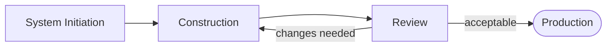

How it works, according to the slides:

- The team builds **small prototypes** and changes them a number of times.
- Changes follow **regular review meetings with stakeholders**, called ***scrums***.
- This continues **until the prototype becomes an acceptable product**.
- Each cycle includes **design, code and test** activities and usually lasts **one to four weeks**. This period is called a ***sprint***.

> [!important] The idea behind Agile
> Produce **working software as soon as possible**, while planning in a more **adaptive** way that can handle **changes to system requirements**.

> [!example] Agile in practice
> A team building a class-scheduling app shows students a basic prototype after a two-week sprint. In the scrum, students say they need a "conflict warning" when two classes overlap. The next sprint adds it. After a few rounds, the app is accepted and moves to production.

## Phase 1: Systems Initiation

This phase is:

- the **starting point** for a system
- **invoked following a [[System Request]]**
- usually generated from a ***[[Business Case]]***, meaning *the reason for the request*

> [!note] Definition
> A ***system request*** is a **formal document** that outlines the **main requirements** for a new system, or for **changes to an existing one**.

### What happens after a system request is received

1. An **initial investigation** checks whether the requirements can be satisfied by an **IT solution**.
2. The systems analyst usually does a ***[[Feasibility Study]]***.
3. A number of **factors must be considered before final approval**.

One of those factors is money. The question is: **can the requirements be completed within the proposed budget?** To answer it, the analyst does a ***[[Cost-Benefit Analysis]]***, which weighs what the system will cost against what the business will gain from it.

> [!important] A new system is not always the answer
> The analyst may decide that the requirements can be met by **making better use of the existing IT systems** or by **changing how the business works**, rather than building a new system.

If a new system **is** required and **management gives approval**, a more detailed analysis of the requirements happens in **Phase 2, Systems Analysis**.

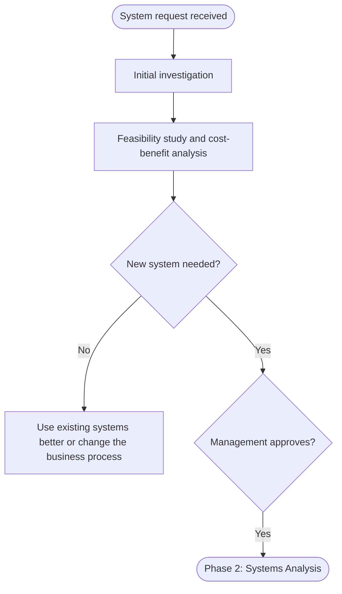

### Alternative approaches in a feasibility study

The slides note that a feasibility study may look at **several alternative ways** to satisfy the requirements:

| Alternative | What it means |
|---|---|
| Use the existing system and modify it | Keep what the business already has and change it to fit the new requirements |
| Develop a new system **in house** | The organization's own IT staff build it |
| Purchase a ***canned system*** | Buy ready-made software off the shelf |
| **Outsource** | Pay an outside company to build or run the system |

> [!example] A small gym wants online class booking
> The analyst could add a booking page to the gym's existing website (modify), have the gym's one IT person build an app (in house), buy an existing gym-booking product (canned), or hire a software company to build one (outsource). The cost-benefit analysis helps choose between them.

## Phase 2: Systems Analysis

> [!note] What this phase produces
> Systems Analysis identifies the **detailed system requirements** in order to produce a ***[[Requirements Specification]] document***. This document specifies **what is needed to meet users' requirements**.

In detail, the analyst must identify:

- **what data is needed**
- **what processes must be performed**

### Fact-finding activities

To find those requirements, the analyst performs ***[[Fact-Finding]]*** activities:

- **Meetings** with the relevant [[Stakeholders]] of the new system to find out what they need. These can be one on one or a **JAD session** with several people present.
- **Questionnaires**
- **Observation** of existing business processes
- **Reviewing existing system documentation**, including collecting **sample system documents** (forms, reports, receipts)

> [!note] Definition
> ***Fact-finding*** is the process of using **research, meetings, interviews, questionnaires, sampling**, and other techniques to collect information about **system problems, requirements, and preferences**. It is also called ***information gathering*** or ***data collection***.

The slides say systems analysis is usually accompanied by a **fact-finding document** that records what was learned.

## Where to begin? Process flow charts

> [!note] Definition
> A ***[[Process Flow Diagram|process flow chart]]*** is a way of **visually organizing your workflow**. It uses **different shapes connected by lines**, and **each shape is one individual step**. It shows each process involved in the systems design.

A process flow diagram **keeps track of tasks**. It shows the **sequence** of tasks within a process, so it is clear **what needs to be done and in what order**.

### Process flow symbols

| Symbol | Name | Function |
|---|---|---|
| Oval | Start/end | Start or end point |
| Arrow (line) | Arrows | Connector that shows relationships between the shapes |
| Parallelogram | Input/Output | Input or output |
| Rectangle | Process | A process (a step) |
| Diamond | Decision | A decision (usually a yes/no question) |

Here are the same shapes as Mermaid draws them:

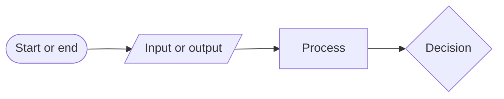

> [!tip] Extra reading
> Lucidchart explains flowchart symbols with pictures: https://www.lucidchart.com/pages/flowchart-symbols-meaning-explained

### Example: processing a customer food order

The slide's example follows a customer food order **from the moment it is placed to delivery**.

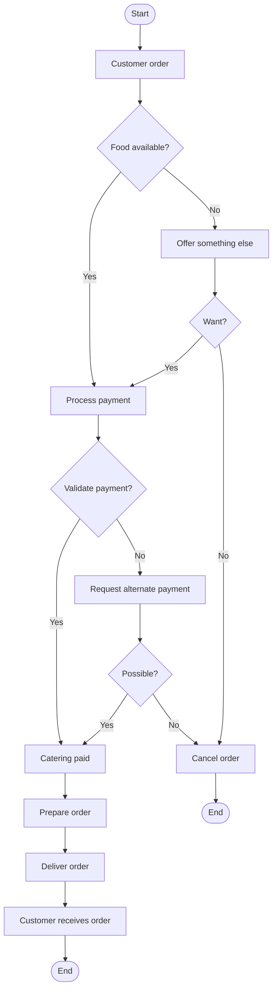

How to read it:

1. The customer places an order.
2. **Decision:** is the food available? If not, the restaurant offers something else. If the customer doesn't want the alternative, the order is cancelled and the process ends.
3. If there is food the customer wants, payment is processed.
4. **Decision:** is the payment valid? If not, the restaurant asks for another payment method. If that isn't possible, the order is cancelled.
5. Once the payment goes through (catering paid), the order is prepared and delivered, and the customer receives it.

> [!tip] Every diamond needs at least two exits
> Each decision in the example has a "Yes" path and a "No" path. When you draw your own chart, check every diamond: if one answer has nowhere to go, you have missed a case.

## From requirements to a logical model

The **requirements specification** is used to build a ***[[Logical Model]]***. A logical model shows **what** needs to be produced, **but not how** it will be built.

In ***[[Structured Analysis]]***, this includes **process and data modelling**:

- data flow and process flow diagrams (DFDs)
- business process descriptions

## Data Flow Diagrams (DFDs)

> [!note] Definition
> A ***[[Data Flow Diagram]] (DFD)*** shows **the flow of information** for any process or system. It uses defined symbols (rectangles, circles and arrows) plus short text labels to show **data inputs, outputs, storage points**, and the **routes between each destination**.

> [!important] It's a roadmap of how data travels through a system.

A DFD can **show things that would be hard to explain in words**, and it works for both **technical and nontechnical audiences**. A manager and a programmer can read the same DFD.

### DFD symbols

| Symbol | Looks like | What it represents |
|---|---|---|
| **Process** | Rounded box with a number on top (e.g. 1.0) | Something that transforms or moves data |
| **Data store** | Open-ended rectangle, often with an ID like D1 | Where data is kept (a file or database) |
| **External entity / actor** | Plain rectangle | A person, organization, or system outside the system that sends or receives data |
| **Data flow** | Labelled arrow | Data moving from one place to another |

> [!warning] Process flow chart vs DFD
> A process flow chart shows the **order of steps** and has **decisions** (diamonds). A DFD shows **where data goes** and where it is **stored**, with no decisions and no start/end ovals. Ask yourself: "am I showing *what happens next*, or *where the data moves*?"

> [!tip] Extra reading
> Lucidchart's DFD guide has symbols and examples: https://www.lucidchart.com/pages/data-flow-diagram

In the Mermaid versions below, external entities are plain rectangles, processes are rounded boxes, and data stores are cylinders.

### Example 1: restaurant ordering system

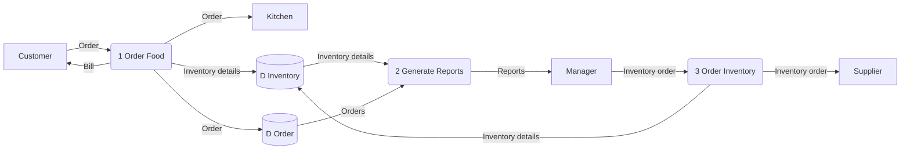

- The **customer** sends an order to process 1, *Order Food*, and gets a bill back.
- *Order Food* sends the order to the **kitchen**, records it in the **Order** data store, and updates the **Inventory** data store.
- Process 2, *Generate Reports*, reads both data stores and sends reports to the **manager**.
- The manager sends an inventory order to process 3, *Order Inventory*, which orders from the **supplier** and updates the inventory records.

### Example 2: customer payment

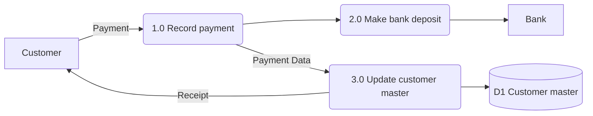

The customer's payment is recorded (1.0). From there it goes two ways: it is deposited at the **bank** (2.0), and the payment data is used to update the customer's record (3.0) in the **Customer master** data store. The customer then receives a receipt.

### Example 3: look for the flow of data (hospital)

This slide shows the whole Hospital Management System as **one process** in the middle, with the external entities around it. The task is to follow each arrow and see what data goes in and out.

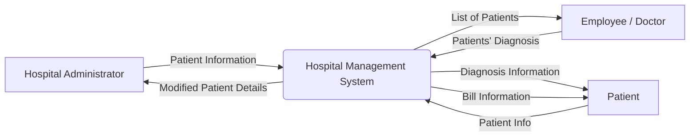

| External entity | Sends to the system | Receives from the system |
|---|---|---|
| Hospital Administrator | Patient information | Modified patient details |
| Employee / Doctor | Patients' diagnosis | List of patients |
| Patient | Patient info | Diagnosis information, bill information |

## DFD rules

### Rules for a process

- **No process can have only outputs.** Data cannot come from nowhere.
- **No process can have only inputs.** A process that takes in data and produces nothing is a dead end (sometimes called a "black hole").
- **No process can produce outputs with insufficient inputs.** The outputs must be possible to create from the data that comes in.

The slide's picture shows it: a process with two arrows going out and none coming in is **incorrect**; one input and two outputs is **correct**. Two inputs and no output is **incorrect**; two inputs and one output is **correct**.

> [!example] Insufficient inputs
> A process called *Calculate pay* receives only the employee's name. It cannot produce a paycheque amount, because it also needs hours worked and pay rate. The diagram is wrong until those inputs are added.

### Rules for data stores

Data never moves on its own. **A process must always move it.**

| Incorrect | Correct |
|---|---|
| Data store to data store | Data store, then process, then data store |
| Outside source (external entity) to data store | External entity, then process, then data store |
| Data store to outside sink (external entity) | Data store, then process, then external entity |

A ***source*** is an external entity that sends data into the system. A ***sink*** is an external entity that receives data from it. (The slide writes "outside sink (Database or file)", but its picture draws the sink as an external entity rectangle, the same shape as the source.)

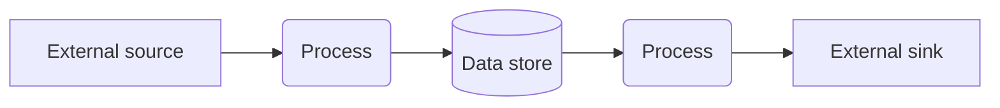

> [!warning] Common mistake
> Drawing an arrow straight from **Customer** to the **Orders** data store. A customer can't write into a database directly; something (a process like *Take order*) has to receive the data and store it. Check every arrow that touches a data store: the other end must be a process.

## Exercises

### Exercise 1 (Direct application)
Match each description to a process flow symbol: (a) "Is the item in stock?", (b) "Print receipt", (c) "Start", (d) "Pack the item".

> [!success]- Answer key
> (a) **Diamond**, it is a decision with yes/no answers. (b) **Parallelogram**, printing a receipt is an output. (c) **Oval**, start and end points. (d) **Rectangle**, it is a process step.

### Exercise 2 (Direct application)
A manager says: "Our staff keep losing track of customer complaints." Before anything else, the analyst checks whether the problem could be fixed with the current CRM software. Which SDLC phase is this, and what is it called when the analyst checks whether an IT solution is worthwhile and affordable?

> [!success]- Answer key
> This is **Phase 1, Systems Initiation**. The complaint problem is the business case (the reason for the request). The analyst runs a **feasibility study**, including a **cost-benefit analysis**. The slides say the analyst may decide the requirements can be met by making better use of existing IT systems, which is what checking the current CRM is.

### Exercise 3 (Direct application)
Name four fact-finding techniques from the lecture, and say which one fits this situation best: the analyst wants to know how cashiers actually handle refunds, not how the manual says they should.

> [!success]- Answer key
> Techniques: meetings/interviews with stakeholders (individual or JAD), questionnaires, observation of existing business processes, reviewing existing documentation and collecting sample documents.
> **Observation** fits best. Documentation shows how the process is supposed to work; watching cashiers shows how it really works.

### Exercise 4 (Applied variation)
Find the rule violations in this DFD description:
1. The *Customer* entity sends "Address change" directly to the *Customer file* data store.
2. Process *Generate invoice* has two input arrows and no output arrows.
3. Data moves from the *Orders* data store directly to the *Archive* data store.

> [!success]- Answer key
> 1. Violates a **data store rule**: data cannot move from an outside source to a data store without a process. Fix: Customer sends to a process (e.g. *Update address*), which writes to the Customer file.
> 2. Violates a **process rule**: no process can have only inputs. An invoice process must output an invoice (for example to the customer).
> 3. Violates a **data store rule**: data cannot move from one data store to another directly. Fix: add a process such as *Archive old orders* between them.

### Exercise 5 (Applied variation)
A hospital wants a new appointment system. The patients' needs are unclear and likely to change once they try it. Compare how Waterfall and Agile would handle this, using the lecture's descriptions.

> [!success]- Answer key
> **Waterfall** is sequential: requirements are fixed at the start and each phase flows into the next. If patients change their minds after testing, the team has to go back to an earlier phase, which is costly.
> **Agile** builds small prototypes in sprints of one to four weeks and reviews them with stakeholders in scrums. Changing requirements are expected, and working software is available early. Agile fits this situation better.

### Exercise 6 (Applied variation)
Draw a process flow chart (or describe it step by step with symbols) for a library book checkout: the student scans their card; if the card is not valid, checkout is refused; if it is valid, the book is scanned; if the student already has 5 books, checkout is refused; otherwise a due-date slip is printed.

> [!success]- Answer key
> One possible chart:
> ```mermaid
> flowchart TD
>     S([Start]) --> SC[/Scan student card/]
>     SC --> V{Card valid?}
>     V -->|No| R[Refuse checkout]
>     V -->|Yes| SB[/Scan book/]
>     SB --> L{Already 5 books?}
>     L -->|Yes| R
>     L -->|No| P[/Print due-date slip/]
>     P --> E([End])
>     R --> E
> ```
> Scanning and printing are input/output (parallelograms), the two checks are decisions (diamonds), refusing is a process (rectangle). Both decisions have a Yes and a No path.

### Exercise 7 (Challenge)
A coffee shop wants a loyalty system. Draw a DFD (Mermaid or on paper) with these parts: external entities *Customer* and *Owner*; processes *Record purchase* and *Generate monthly report*; one data store *Loyalty points*. Make sure it follows every process and data store rule.

> [!success]- Answer key
> ```mermaid
> flowchart LR
>     C[Customer] -->|Purchase details| P1("1.0 Record purchase")
>     P1 -->|Points balance| C
>     P1 -->|Updated points| D1[("D1 Loyalty points")]
>     D1 -->|Points data| P2("2.0 Generate monthly report")
>     P2 -->|Monthly report| O[Owner]
> ```
> Check the rules: each process has at least one input and one output; the Customer never touches the data store directly (process 1.0 does); the Owner gets data from the store only through process 2.0. Process 2.0 has enough input (points data) to produce the report.

### Exercise 8 (Challenge)
A small college wants to replace its paper-based transcript requests. Walk through Phase 1 (Systems Initiation) and Phase 2 (Systems Analysis). Name the documents produced, at least two alternatives the feasibility study could compare, and two fact-finding techniques you would use with whom.

> [!success]- Answer key
> **Phase 1:** The registrar submits a **system request** (formal document with the main requirements), based on a **business case** such as "paper requests take two weeks and get lost". The analyst does an initial investigation and a **feasibility study** with a **cost-benefit analysis**, comparing alternatives such as buying a **canned** student-records add-on versus **developing in house**. Management approves.
> **Phase 2:** The analyst uses **fact-finding**, for example a **JAD session** with registrar staff and a **questionnaire** to students, plus **collecting sample documents** (the current paper request form). The output is a **requirements specification document** stating what data (student ID, delivery address) and what processes (verify identity, charge fee, send transcript) are needed. This then feeds a logical model such as a DFD.

## Feynman practice

Explain each concept in your own words. Do not copy from the note above.

### Feynman: Systems Initiation and the feasibility study

- [ ] **1. Explain it as if to a 12-year-old.** Your family wants a new car because the old one breaks down. Using that story, explain what a system request, a business case, and a cost-benefit analysis are. When might the answer be "fix the old car" instead?
- [ ] **2. Where did you get stuck or use jargon?** Reread what you wrote. Highlight any word a 12-year-old wouldn't understand (for example "feasibility" or "canned system").
- [ ] **3. Go back to the source and simplify.** For each highlighted word, write an analogy. Match the four alternatives (modify, in house, canned, outsource) to options for getting a car.
- [ ] **4. Organize and test.** Rewrite the explanation in 3 to 5 sentences. Could you teach it in 2 minutes?

### Feynman: Fact-finding in Systems Analysis

- [ ] **1. Explain it as if to a 12-year-old.** You are organizing a class trip and need to know what everyone wants. How would you use meetings, questionnaires, observation, and old documents to find out? What would your "requirements specification" say?
- [ ] **2. Where did you get stuck or use jargon?** Highlight words like "stakeholder" or "JAD session".
- [ ] **3. Go back to the source and simplify.** Why can observation reveal things an interview can't?
- [ ] **4. Organize and test.** Rewrite in 3 to 5 sentences.

### Feynman: Process flow chart vs data flow diagram

- [ ] **1. Explain it as if to a 12-year-old.** Using making a sandwich, explain the difference between a chart that shows *the order of steps* and a diagram that shows *where the ingredients come from and go*.
- [ ] **2. Where did you get stuck or use jargon?** Highlight "data store", "external entity", "decision".
- [ ] **3. Go back to the source and simplify.** Why does a flow chart have diamonds and a DFD doesn't? What plays the role of the fridge (data store) in your analogy?
- [ ] **4. Organize and test.** Rewrite in 3 to 5 sentences.

### Feynman: DFD rules

- [ ] **1. Explain it as if to a 12-year-old.** Using a school kitchen (ingredients in, meals out, a pantry), explain why a process can't have only inputs or only outputs, and why food can't jump from one pantry to another by itself.
- [ ] **2. Where did you get stuck or use jargon?** Highlight "source", "sink", "insufficient inputs".
- [ ] **3. Go back to the source and simplify.** Think of one real example of a process that would have insufficient inputs.
- [ ] **4. Organize and test.** Rewrite in 3 to 5 sentences.

### Feynman: Waterfall vs JAD, RAD and Agile

- [ ] **1. Explain it as if to a 12-year-old.** Using building a treehouse with friends, explain the difference between planning everything first and then building (Waterfall) and building a small part, showing it, and adjusting (Agile).
- [ ] **2. Where did you get stuck or use jargon?** Highlight "sprint", "scrum", "prototype", "iterative".
- [ ] **3. Go back to the source and simplify.** How do JAD and RAD make users part of the team? Why does that give feedback sooner?
- [ ] **4. Organize and test.** Rewrite in 3 to 5 sentences.

## Flashcards (Anki import)

Copy the block below into a `.txt` file and import it in Anki with File > Import. Fields are tab separated: Front, Back, Tags.

```
#separator:tab
#html:false
#tags column:3
What are the 5 phases of the SDLC in this lecture?	Systems Initiation, Systems Analysis, Systems Design, Systems Implementation, Systems Maintenance.	csd124 lecture-02 sdlc
How does the slide describe the Waterfall method?	The traditional way: one phase flows into the next in a sequential design process.	csd124 lecture-02 waterfall
How are newer development approaches different from the traditional way?	They are team based: IT staff and system users work together to speed up the process.	csd124 lecture-02
What is Joint Application Design (JAD)?	A group of users meets intensively with systems analysts to help with information gathering and system requirements.	csd124 lecture-02 jad
What is Rapid Application Development (RAD)?	An approach that speeds up the SDLC by involving users in design and development in an interactive, iterative way.	csd124 lecture-02 rad
Why do users give feedback sooner in RAD than in the traditional SDLC?	Because they take part in design and development tasks while the system is being built.	csd124 lecture-02 rad
In Agile, what are the regular review meetings with stakeholders called?	Scrums.	csd124 lecture-02 agile
In Agile, what is a sprint?	A short period of one to four weeks that includes design, code and test activities.	csd124 lecture-02 agile
What is the main idea behind the Agile approach?	Produce working software as soon as possible while planning adaptively to allow for changing requirements.	csd124 lecture-02 agile
What triggers Phase 1, Systems Initiation?	A system request, usually generated from a business case.	csd124 lecture-02 initiation
What is a business case?	The reason for the system request.	csd124 lecture-02 initiation
What is a system request?	A formal document outlining the main requirements for a new system or changes to an existing one.	csd124 lecture-02 initiation
What is the first thing done once a system request is received?	An initial investigation to see whether the requirements can be satisfied by an IT solution.	csd124 lecture-02 initiation
Which analysis answers "Can the requirements be completed within the proposed budget?"	A cost-benefit analysis.	csd124 lecture-02 feasibility
Besides building a new system, what might the analyst recommend after a feasibility study?	Making better use of existing IT systems or changing the existing business process.	csd124 lecture-02 feasibility
Name the four alternative approaches a feasibility study may compare.	Use the existing system and modify it, develop in house, purchase a canned system, outsource.	csd124 lecture-02 feasibility
What is a canned system?	Ready-made software bought off the shelf instead of being built.	csd124 lecture-02 feasibility
What document does Phase 2, Systems Analysis, produce?	A requirements specification document stating what is needed to meet users' requirements.	csd124 lecture-02 analysis
What two things must be identified in detail during Systems Analysis?	What data is needed and what processes must be performed.	csd124 lecture-02 analysis
What is fact-finding?	Using research, meetings, interviews, questionnaires, sampling and other techniques to collect information about system problems, requirements and preferences.	csd124 lecture-02 analysis
What are two other names for fact-finding?	Information gathering and data collection.	csd124 lecture-02 analysis
What is a process flow chart?	A visual way to organize a workflow, using shapes connected by lines, each shape being one step.	csd124 lecture-02 processflow
In a process flow chart, what does a diamond represent?	A decision.	csd124 lecture-02 processflow
In a process flow chart, what does a parallelogram represent?	Input or output.	csd124 lecture-02 processflow
In a process flow chart, what does an oval represent?	A start or end point.	csd124 lecture-02 processflow
What does a logical model show?	What needs to be produced, but not how.	csd124 lecture-02 dfd
What is a data flow diagram (DFD)?	A diagram showing the flow of information for a process or system: inputs, outputs, storage points and routes, a roadmap of how data travels.	csd124 lecture-02 dfd
What are the four DFD symbols?	Process, data store, external entity/actor, and data flow (arrow).	csd124 lecture-02 dfd
Name the three rules for a DFD process.	No process can have only outputs; none can have only inputs; none can produce outputs with insufficient inputs.	csd124 lecture-02 dfd
Why can't data move directly from one data store to another in a DFD?	Data must always be moved by a process.	csd124 lecture-02 dfd
Why can't an external entity send data straight into a data store in a DFD?	A process must receive the data and move it into the store.	csd124 lecture-02 dfd
```

## Tags

#csd124 #systemsanalysis #systemdesign #sdlc #waterfall #agile #jad #rad #feasibilitystudy #factfinding #requirements #processflow #flowchart #dfd #dataflowdiagram
