	# Data Flow Diagrams and Requirements

This lecture goes deeper into the tools an analyst uses during [[Systems Analysis]]. It starts with the stages of systems analysis and a longer, 8-phase version of the development sequence. Then it revisits [[Process Flow Diagram|process flow diagrams]] and [[Data Flow Diagram|data flow diagrams]] (DFDs) with new examples, and introduces **DFD levels** (the context diagram, or Level 0, and Level 1). It ends with the documents that come out of analysis: the fact-finding document, the [[Software Requirements Specification]] (SRS), [[Use Case|use cases]], and the difference between scope, requirements and design.

Several slides repeat material from [[Lecture 02 - Process Flow and Data Flow Diagrams|Lecture 02]]. Those parts are summarized here, with a link back for the full explanation.

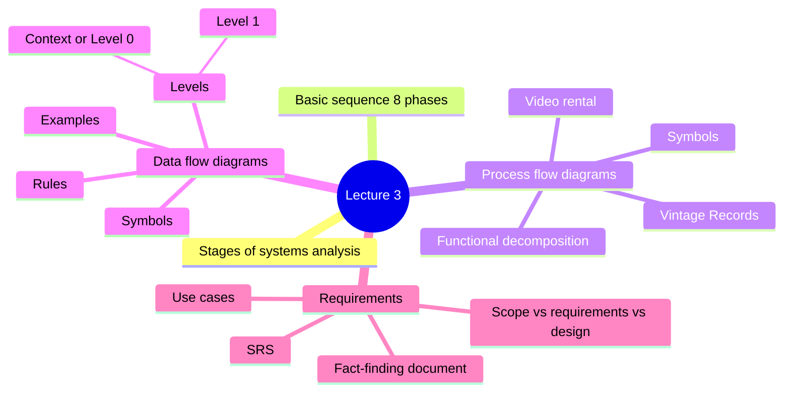

## Stages involved in systems analysis

The first slide shows systems analysis as a staircase of six steps. Each step builds on the one below it.

| Step | Stage | What it means |
|---|---|---|
| 1 | Problem identification | Figure out what is wrong or what the business needs |
| 2 | Requirement gathering | Collect what the users and the business need from the system |
| 3 | [[Feasibility Study]] | Check whether a solution is possible and worth it |
| 4 | Designing the system | Plan how the system will look and work |
| 5 | Putting the system into action | Build and launch it |
| 6 | Keeping the system running smoothly | Support and maintain it |

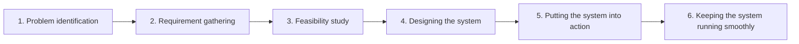

## The basic sequence (8 phases)

The next two slides give a more detailed sequence with **eight** phases, each with its own activities.

> [!warning] Yet another version of the life cycle
> Lecture 01 used 7 phases, Lecture 02 used 5, and this slide uses 8 (it adds **Evaluation** at the end). The activities are the same ideas grouped in different ways. Learn the activities in each phase rather than memorizing a single number.

| Phase | Main activities |
|---|---|
| 1. **Planning** | Define project ***scope*** and objectives. Do feasibility studies (***technical, economic, operational***). Identify [[Stakeholders]] and gather initial requirements. |
| 2. **Analysis** | Gather detailed requirements through interviews, surveys and workshops. Analyze the current systems and processes (***as-is analysis***). Create models such as data flow diagrams and use cases to represent the requirements. |
| 3. **Design** | Develop the ***system architecture*** (high-level design). Create detailed design specifications (database design, interface design, etc.). Prepare prototypes or wireframes for user feedback. |
| 4. **Implementation** | Develop the actual system from the design specifications. Do ***unit testing*** and ***integration testing***. Prepare user documentation and training materials. |
| 5. **Testing** | Do system testing to make sure the system meets the requirements. Run ***[[User Acceptance Testing]] (UAT)*** with stakeholders. Fix issues and bugs found during testing. |
| 6. **Deployment** | Deploy the system in a live environment. Train the end users. Make sure data migration and integration with existing systems work. |
| 7. **Maintenance** | Monitor performance and user feedback. Provide ongoing support. Add updates and enhancements as needed. |
| 8. **Evaluation** | Check whether the system meets its original objectives. Gather feedback for future improvements. Document lessons learned for future projects. |

> [!note] Terms worth knowing from this table
> - ***As-is analysis***: studying how the current system and processes work today, before changing anything.
> - ***Unit testing*** checks one small piece of the code on its own. ***Integration testing*** checks that the pieces work together.
> - ***User acceptance testing (UAT)***: the real users try the system and confirm it does what they need.
> - ***Data migration***: moving the data from the old system into the new one.

> [!tip] Where DFDs fit
> The Analysis phase lists "create models (e.g., data flow diagrams, use cases)". Everything else in this lecture is about those models and the documents that hold them.

## Process flow diagrams

### Where to begin?

> [!note] Definition
> A ***[[Process Flow Diagram|process flow chart]]*** is a way of **visually organizing your workflow**. It uses **different shapes connected by lines**, and each shape is **one individual step**. It shows each process involved in the systems design.

The slide's example is the same as Lecture 02: processing a customer food order from the moment it is placed until delivery. See [[Lecture 02 - Process Flow and Data Flow Diagrams#Example: processing a customer food order|the food order flowchart]] for the full diagram.

### Process flow symbols

| Symbol | Name | Function |
|---|---|---|
| Oval | Start/end | A start or end point |
| Arrow | Arrows | A connector that shows relationships between the shapes |
| Parallelogram | Input/Output | Input or output |
| Rectangle | Process | A process (one step) |
| Diamond | Decision | A decision |

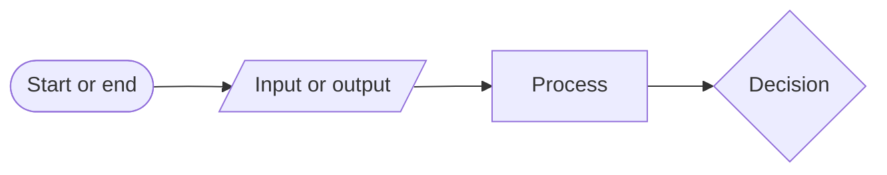

### The video rental system: process diagram

> [!note] Definition
> ***Process Flow Diagrams (PFD)*** are a **graphical way of describing a process, its constituent tasks, and their sequence**.

The slide shows the whole video rental store as a single box numbered **0**, with a two-way arrow to the **Customer** and an arrow out to the **Manager**.

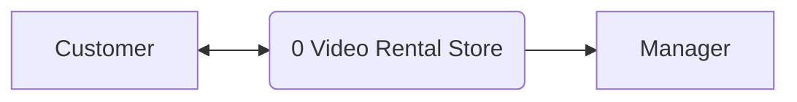

> [!important] What a process diagram leaves out
> The slide says it in big letters: a process diagram **does not show storage or data flow**. It tells you *what steps happen and in what order*, but not *what data moves* or *where it is kept*. That gap is what the DFD fills (see the [[#The video rental system: data flow diagram|DFD version]] of this same example below).

### Example: Vintage Records

This flowchart shows how a customer orders from an online record store called Vintage Records.

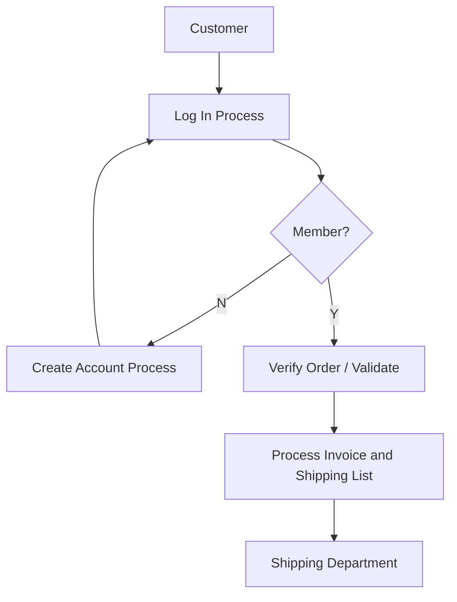

How to read it:

1. The customer starts the **log in** process.
2. **Decision:** is the customer a member?
   - **No:** they go through the **create account** process, and the arrow loops back to log in.
   - **Yes:** the order is **verified and validated**.
3. The system **processes the invoice and shipping list**, which go to the **shipping department**.

> [!tip] Notice the loop
> The "No" path doesn't end the process. Creating an account sends the customer back to log in, so a new customer eventually reaches the same "Yes" path as an existing one.

### Functional decomposition: library management

> [!note] Definition
> ***[[Functional Decomposition]]*** means breaking a big system into smaller and smaller functions, drawn as a tree. The top box is the whole system; each level below splits a function into its parts.

The slide's example breaks down a **Library Management** system:

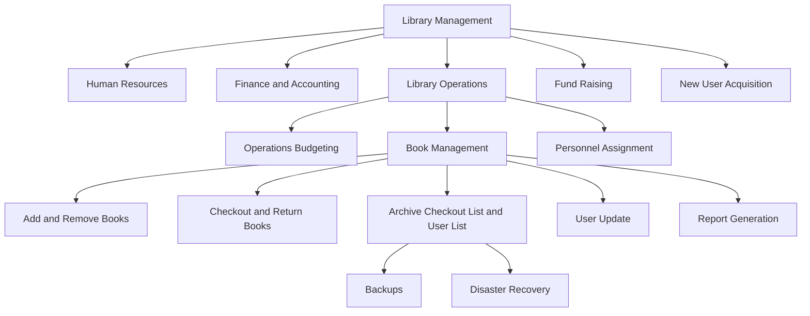

Only one branch is expanded at each level (Library Operations, then Book Management, then Archive), to show how you keep going down until each box is a small, clear task. The two lowest boxes, **Backups** and **Disaster Recovery**, are highlighted in green on the slide.

> [!example] Reading the tree
> "Checkout and Return Books" is part of Book Management, which is part of Library Operations, which is part of Library Management. Each step down answers the question "what is this made of?"

## From requirements to a logical model

The ***[[Requirements Specification]]*** is used to build a ***[[Logical Model]]***, which represents **what** needs to be produced **but not how**. In ***[[Structured Analysis]]***, this includes process and data modelling: data flow and process flow diagrams (DFDs), plus business process descriptions.

## Data flow diagrams (DFDs)

> [!note] Definition
> A ***[[Data Flow Diagram]] (DFD)*** shows **the flow of information** for any process or system. It uses defined symbols like rectangles, circles and arrows, plus short text labels, to show **data inputs, outputs, storage points** and the **routes between each destination**.

> [!important] It's a roadmap of how data travels through a system.

A DFD can **visually show things that would be hard to explain in words**, and it works for both **technical and nontechnical audiences**.

### DFD symbols

| Symbol | Looks like | What it represents |
|---|---|---|
| **Process** | Rounded box with a number on top (e.g. 1.0) | Something that transforms or moves data |
| **Data store** | Open-ended rectangle, often with an ID (D, D1) | Where data is kept (a file or database) |
| **External entity / actor** | Plain rectangle | A person, organization or system outside the system that sends or receives data |
| **Data flow** | Labelled arrow | Data moving from one place to another |

> [!warning] Two drawing styles appear in the slides
> Most examples draw processes as **rounded rectangles** with a number on top. The clothes ordering and railway examples draw processes as **circles**. Both mean the same thing. The DFD definition itself mentions "rectangles, circles and arrows". Pick one style and stay consistent within a diagram.

In the Mermaid diagrams below, external entities are plain rectangles, processes are rounded boxes (or circles where the slide uses circles), and data stores are cylinders.

### The video rental system: data flow diagram

This is the DFD version of the video rental store from the process diagram above. Now you can see the data and where it is stored.

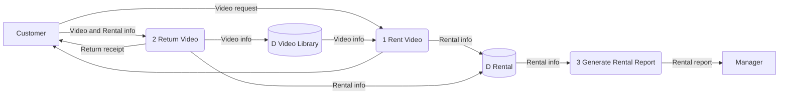

- **1 Rent Video:** the customer sends a video request. The process reads video info from the **Video Library** store, records rental info in the **Rental** store, and sends something back to the customer (the label on that arrow is hidden behind the slide title).
- **2 Return Video:** the customer sends video and rental info. The process updates both data stores and gives the customer a return receipt.
- **3 Generate Rental Report:** reads rental info from the **Rental** store and sends a rental report to the **manager**.

> [!tip] Layout advice from the slide
> This DFD has **3 processes, 2 external entities and 2 data stores**. The processes sit **in the middle**, with the data stores and external entities **on the sides**. That layout makes the diagram easier to follow.

### More DFD examples (also in Lecture 02)

The restaurant ordering, customer payment and hospital examples are the same as last week. Short versions:

**Restaurant ordering.** The customer orders through *1 Order Food* and gets a bill. The order goes to the kitchen and into the **Order** store, and inventory details go to the **Inventory** store. *2 Generate Reports* reads both stores and sends reports to the manager. The manager sends an inventory order to *3 Order Inventory*, which orders from the supplier and updates the inventory.

**Customer payment.**

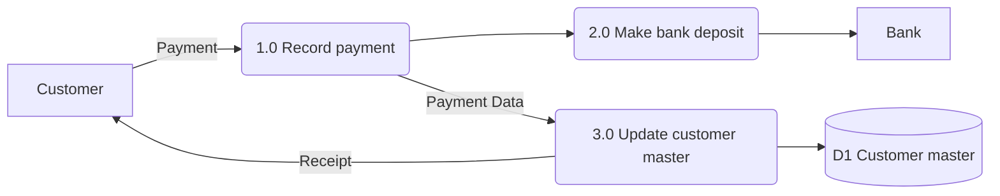

**Hospital: look for the flow of data.** The whole Hospital Management System is one process in the middle. The administrator sends patient information and gets modified patient details back; the doctor sends patients' diagnosis and gets a list of patients; the patient sends patient info and gets diagnosis information and bill information.

Full diagrams and explanations: [[Lecture 02 - Process Flow and Data Flow Diagrams#Data Flow Diagrams (DFDs)|Lecture 02, DFD examples]].

## DFD rules

### Rules for a process

- **No process can have only outputs.**
- **No process can have only inputs.**
- **No process can produce outputs with insufficient inputs.**

The slide's picture: a process with only outgoing arrows is incorrect, one with an input and outputs is correct. A process with two inputs and nothing going out is incorrect; two inputs and one output is correct.

### Rules for data stores

Data never moves on its own. **It must be moved by a process.**

| Incorrect | Correct |
|---|---|
| Data store directly to another data store | Data store, process, data store |
| Outside source directly to a data store | Outside source, process, data store |
| Data store directly to an outside sink | Data store, process, outside sink |

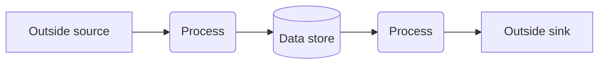

> [!warning] Common mistake
> Drawing an arrow from an external entity straight into a data store (for example *Customer* to *Orders*). Check every arrow that touches a data store: the other end must always be a process.

More detail and examples: [[Lecture 02 - Process Flow and Data Flow Diagrams#DFD rules|Lecture 02, DFD rules]].

## DFD levels

A DFD can be drawn at different levels of detail. You start with the big picture and then "zoom in".

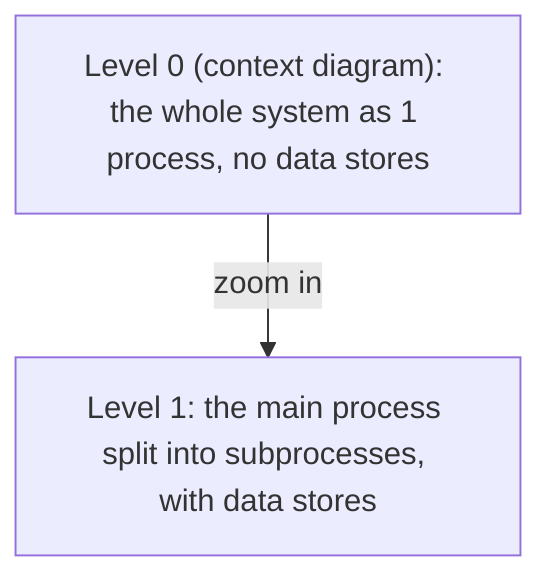

### Context diagram (Level 0)

> [!note] Definition
> A ***[[Context Diagram|context data flow diagram]]***, also called a ***Level 0 diagram***, uses **only one process to represent the functions of the entire system**. It **does not include data stores**.

The context diagram shows the system as a black box. You see who talks to it (the external entities) and what data goes in and out, but nothing about what happens inside.

**Steps to draw a context diagram (from the slide):**

1. Define the process (usually just **1**).
2. Create a list of all **external entities** (all people and systems).
3. Create a list of the **data flows**.
4. Draw the diagram.

#### Example: clothes ordering system (context)

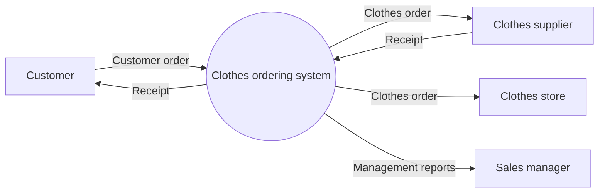

| External entity | Sends to the system | Receives from the system |
|---|---|---|
| Customer | Customer order | Receipt |
| Clothes supplier | Receipt | Clothes order |
| Clothes store | (nothing) | Clothes order |
| Sales manager | (nothing) | Management reports |

### Level 1 DFD

A **Level 1** diagram opens up the single process from Level 0 and shows the **subprocesses** inside it, the **data stores** they use, and the flows between them. The external entities stay the same.

**Steps to draw a Level 1 DFD (from the slide):**

1. Define the processes (the **main process and the subprocesses**).
2. Create a list of all **external entities** (all people and systems).
3. Create a list of the **data stores**.
4. Create a list of the **data flows**.
5. Draw the diagram.

> [!important] Context vs Level 1 steps
> The Level 1 list has one extra step: **list the data stores**. That makes sense, because the context diagram has no data stores at all.

#### Example: clothes ordering system (Level 1)

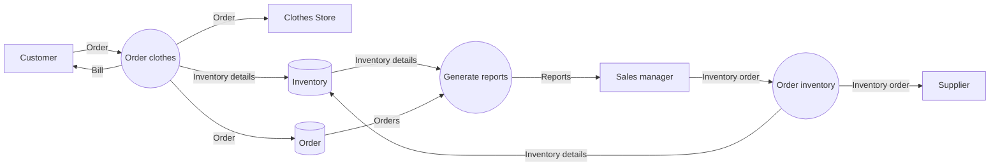

The one "Clothes ordering system" circle from the context diagram is now three processes: *Order clothes*, *Generate reports* and *Order inventory*, plus two data stores, *Inventory* and *Order*. This has the same structure as the restaurant example.

#### Example: vehicle maintenance depot

**Level 0.** The depot is one process (numbered 0). Mechanics send data into it, and it sends data to the customer. The arrows have no labels on this slide.

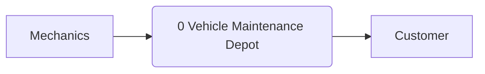

**Level 1.** The depot is split into three processes and three data stores.

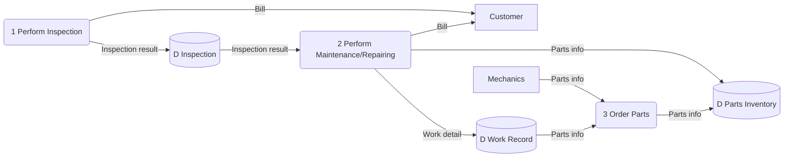

- *1 Perform Inspection* bills the customer and saves the inspection result.
- *2 Perform Maintenance/Repairing* reads the inspection result, bills the customer, records the work done, and updates parts info.
- *3 Order Parts* gets parts info from the mechanics and from the work record, and updates the parts inventory.

#### Example: railway reservation

**0-level DFD:**

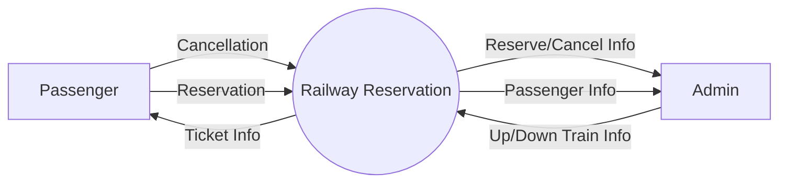

**1-level DFD:**

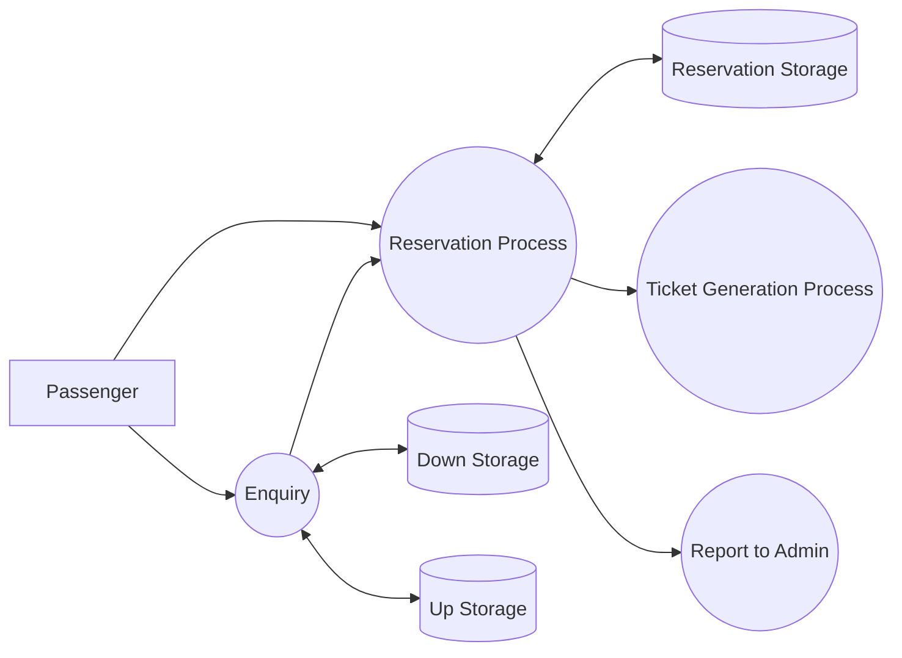

At level 1, the passenger can either make an **enquiry** (which reads from the up and down train storage) or go to the **reservation process**, which reads and writes **reservation storage** and then triggers **ticket generation** and a **report to the admin**. Data stores appear here for the first time; the 0-level diagram had none.

#### Example: doctor's appointment system

**Level 0:**

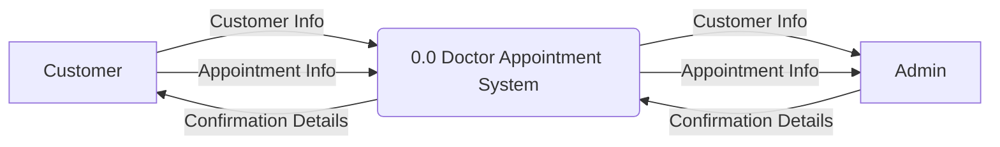

**Level 1:** process 0.0 is broken into four subprocesses, numbered **1.1 to 1.4**.

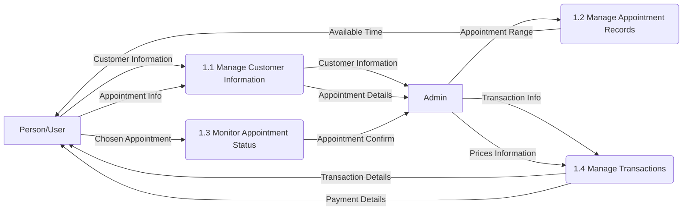

| Subprocess | Gets | Gives |
|---|---|---|
| 1.1 Manage Customer Information | Customer information and appointment info from the user | Customer information and appointment details to the admin |
| 1.2 Manage Appointment Records | Appointment range from the admin | Available time to the user |
| 1.3 Monitor Appointment Status | Chosen appointment from the user | Appointment confirmation to the admin |
| 1.4 Manage Transactions | Transaction info and prices from the admin | Transaction details and payment details to the user |

> [!tip] Numbering shows the level
> In the Level 0 diagram the system is process **0.0**. Its subprocesses at Level 1 are **1.1, 1.2, 1.3, 1.4**. Numbers like these tell you which diagram a process belongs to and where it came from.

> [!tip] Extra reading
> GeeksforGeeks on DFD levels: https://www.geeksforgeeks.org/levels-in-data-flow-diagrams-dfd/
> Lucidchart's DFD guide: https://www.lucidchart.com/pages/data-flow-diagram

## Documenting the requirements

### The fact-finding document

Systems analysis is **usually accompanied by a fact-finding document**.

> [!note] Definition
> ***[[Fact-Finding]]*** is the process of using **research, meetings, interviews, questionnaires, sampling**, and other techniques to collect information about **system problems, requirements, and preferences**. It is also called ***information gathering*** or ***data collection***.

### Software Requirements Specification (SRS)

> [!note] Definition
> A ***[[Software Requirements Specification]] (SRS)*** describes the **behavior that is required of the software, before the software is designed, built and tested**.

**Why it is needed.** Picture a project kickoff meeting. The developers talk about databases and other technical details. The business analysts focus on user needs and project goals. Neither group fully understands the other, and that leads to **delays, unmet requirements, or even project failure**.

The SRS fixes this by being a **common blueprint** that keeps all teams on the same page. It translates complex technical needs into a format that is well organized and understandable, so the teams can work together efficiently.

> [!example] Without an SRS
> The business side asks for "fast checkout". The developers build a one-click purchase button. The business actually meant "the cashier screen must load in under 2 seconds". An SRS would have written the requirement down clearly before anyone started building.

#### What an SRS contains

The slide gives this outline:

1. **Project background**
   - a) Purpose of the project
   - b) Scope of the project
   - c) Other background information
2. **Perspectives**
   - a) Who will use the system? Stakeholders?
   - b) Who can provide input about the system?
3. **Project objectives**
   - a) Known business rules
   - b) System information and/or diagrams
   - c) Assumptions and dependencies
   - d) Design and implementation constraints
4. **Risks**
5. **Known future enhancements**
6. **References**

> [!tip] Where your DFDs go
> Section 3b, "System information and/or diagrams", is where the DFDs and use case diagrams from the analysis phase belong.

> [!tip] Extra reading
> GeeksforGeeks on the SRS format: https://www.geeksforgeeks.org/software-engineering-software-requirement-specification-srs/

### Use cases

> [!note] Definition
> A ***[[Use Case]]*** is a **description of a specific interaction that a user may have with the system**.

Use cases represent **specific things a system or process can do**. The slide compares them to **scenes in a play**: each one is a short, self-contained story of an actor doing one thing with the system.

#### Example: library system use case diagram

In a ***[[Use Case Diagram]]***, the **actors** (stick figures) stand outside a box that represents the system, and each **use case** is an oval inside the box. A line connects an actor to each use case they take part in.

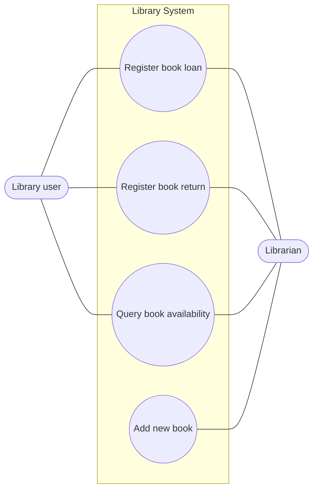

| Use case | Library user | Librarian |
|---|---|---|
| Register book loan | Yes | Yes |
| Register book return | Yes | Yes |
| Query book availability | Yes | Yes |
| Add new book | No | Yes |

Only the librarian can add a new book. Both actors take part in the other three use cases.

> [!warning] Use case diagram vs DFD
> A use case diagram shows **who can do what** with the system. It has no data stores and no data flows. A DFD shows **how data moves and where it is stored**. Both are models created during the Analysis phase, but they answer different questions.

> [!tip] Extra reading
> Lucidchart on use case diagrams: https://www.lucidchart.com/pages/uml-use-case-diagram

## Requirements vs design

Many people have trouble telling **scope**, **requirements** and **design** apart. The slide separates them like this:

| Term | What it describes | Where it is documented |
|---|---|---|
| ***Scope*** | The **needs of the organization** | A ***vision and scope document*** |
| ***Requirements*** | The **behavior of the software** that will satisfy those needs | The SRS |
| ***Design*** | **How** those requirements will be implemented technically | Design specifications |

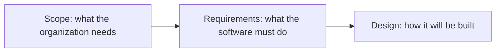

> [!example] One project, three levels
> - **Scope:** "The clinic needs patients to book appointments without phoning."
> - **Requirement:** "The system shall show available time slots and let a patient pick one."
> - **Design:** "Time slots are stored in an `appointments` table; the booking page calls the slots API."

> [!important] Requirements stay on the "what" side
> This matches the logical model idea from earlier: requirements and DFDs describe **what** the system must do. **How** it gets built belongs to design.

## Exercises

### Exercise 1 (Direct application)
Classify each item as a process flow chart feature or a DFD feature: (a) a diamond labelled "Member?", (b) an open-ended rectangle labelled "D Rental", (c) a labelled arrow "Rental info", (d) an oval labelled "Start".

> [!success]- Answer key
> (a) **Process flow chart**: diamonds are decisions, and DFDs don't have decisions.
> (b) **DFD**: an open-ended rectangle is a data store, and the slides say a process diagram does not show storage.
> (c) **DFD**: a labelled arrow naming the data is a data flow. A flowchart arrow only connects steps in order.
> (d) **Process flow chart**: ovals are start and end points.

### Exercise 2 (Direct application)
Put these SRS items under the correct outline section: "The system must run on the college's existing servers", "Registrar staff and students", "Possible mobile app next year", "Data may be lost during migration".

> [!success]- Answer key
> - "Must run on existing servers" belongs in **3d, Design and implementation constraints**.
> - "Registrar staff and students" belongs in **2a, Perspectives: who will use the system?**
> - "Possible mobile app next year" belongs in **5, Known future enhancements**.
> - "Data may be lost during migration" belongs in **4, Risks**.

### Exercise 3 (Direct application)
Label each statement as scope, requirement or design: (a) "The gym needs to reduce no-shows for classes." (b) "Booking data is stored in a PostgreSQL database." (c) "The system shall send a reminder 24 hours before each booked class."

> [!success]- Answer key
> (a) **Scope**: a need of the organization. (b) **Design**: how something will be implemented technically. (c) **Requirement**: behavior the software must have to satisfy the need.

### Exercise 4 (Applied variation)
Look at the vehicle maintenance Level 1 DFD. Process *1 Perform Inspection* sends a bill to the customer and an inspection result to the Inspection store. Which DFD rule does it break as drawn, and how would you fix it?

> [!success]- Answer key
> No arrows go **into** *1 Perform Inspection*; it only has outputs. That breaks the rule **"no process can have only outputs"**: the bill and inspection result can't come from nowhere. A fix is to add an input, for example a "Vehicle details" or "Inspection request" flow from the customer. It also helps to check the Level 0 diagram: there, the customer only *receives* data, so the Level 0 diagram would need the same new flow from the customer to stay consistent.

### Exercise 5 (Applied variation)
Using the steps from the slide, draw the **context diagram** (Level 0) for a food delivery app. External entities: Customer, Restaurant, Driver. The customer sends an order and receives an order confirmation. The restaurant receives the order and sends a "ready for pickup" notice. The driver receives the delivery details and sends a delivery confirmation.

> [!success]- Answer key
> Step 1: one process, *Food delivery system*. Step 2: entities Customer, Restaurant, Driver. Step 3: flows as listed. Step 4:
> ```mermaid
> flowchart LR
>     C[Customer] -->|Order| S(("Food delivery system"))
>     S -->|Order confirmation| C
>     S -->|Order| R[Restaurant]
>     R -->|Ready for pickup| S
>     S -->|Delivery details| D[Driver]
>     D -->|Delivery confirmation| S
> ```
> It has only one process and **no data stores**, as a context diagram should.

### Exercise 6 (Applied variation)
Draw a use case diagram (Mermaid or on paper) for a college parking system. A *Student* can buy a permit and view their permit. A *Parking officer* can view a permit and issue a ticket.

> [!success]- Answer key
> ```mermaid
> flowchart LR
>     ST([Student])
>     PO([Parking officer])
>     subgraph PS[Parking System]
>         U1((Buy permit))
>         U2((View permit))
>         U3((Issue ticket))
>     end
>     ST --- U1
>     ST --- U2
>     U2 --- PO
>     U3 --- PO
> ```
> Actors stay outside the system box, use cases are ovals inside it. "View permit" is shared by both actors, like "Query book availability" in the library example.

### Exercise 7 (Challenge)
Take your food delivery context diagram from Exercise 5 and expand it to **Level 1**. Use the five steps from the slide. Include at least three subprocesses and two data stores, and make sure the external flows match Level 0.

> [!success]- Answer key
> Step 1: processes *1 Take order*, *2 Notify restaurant*, *3 Assign driver*. Step 2: Customer, Restaurant, Driver. Step 3: data stores *D1 Orders*, *D2 Drivers*. Step 4: flows below. Step 5:
> ```mermaid
> flowchart LR
>     C[Customer] -->|Order| P1("1 Take order")
>     P1 -->|Order confirmation| C
>     P1 -->|Order| D1[("D1 Orders")]
>     D1 -->|Order| P2("2 Notify restaurant")
>     P2 -->|Order| R[Restaurant]
>     R -->|Ready for pickup| P3("3 Assign driver")
>     D2[("D2 Drivers")] -->|Available drivers| P3
>     D1 -->|Delivery address| P3
>     P3 -->|Delivery details| D[Driver]
>     D -->|Delivery confirmation| P3
>     P3 -->|Delivery status| D1
> ```
> Checks: every external flow from Level 0 (order, order confirmation, ready for pickup, delivery details, delivery confirmation) still appears. Every process has inputs and outputs. No entity touches a data store directly, and no data store connects to another store without a process. Process 3 has enough input (address, available drivers, ready notice) to produce delivery details. (Strictly, *D2 Drivers* also needs some process that writes driver data; a full model would add one, for example *4 Update driver availability*.)

### Exercise 8 (Challenge)
A small bakery wants online pre-orders. Describe the path from **scope** to the analysis models: write one scope statement, two requirements, name which DFD level you would draw first and what it would contain, and say where in the SRS outline the DFD and the business rule "orders must be placed 24 hours ahead" would go.

> [!success]- Answer key
> **Scope:** "The bakery needs customers to reserve items in advance so less food is wasted." (the organization's need, in a vision and scope document).
> **Requirements:** "The system shall let customers choose items and a pickup date." "The system shall send the owner a daily list of pre-orders." (behavior of the software).
> **First DFD:** the **context diagram (Level 0)**, one process *Bakery pre-order system*, external entities Customer and Owner, flows such as pre-order, confirmation, daily order list. No data stores yet. Then a Level 1 would add subprocesses and a *Pre-orders* data store.
> **SRS placement:** the DFD goes in **3b, System information and/or diagrams**; the 24-hour rule goes in **3a, Known business rules**.

## Feynman practice

Explain each concept in your own words. Do not copy from the note above.

### Feynman: Process diagram vs data flow diagram

- [ ] **1. Explain it as if to a 12-year-old.** Using the video rental store, explain why the slide says a process diagram "does not show storage or data flow". What can you see in the video rental DFD that you can't see in the one-box process diagram?
- [ ] **2. Where did you get stuck or use jargon?** Reread what you wrote. Highlight any word a 12-year-old wouldn't understand (for example "data store" or "external entity").
- [ ] **3. Go back to the source and simplify.** For each highlighted word, write an analogy. What in a real video store plays the role of the *Rental* and *Video Library* data stores?
- [ ] **4. Organize and test.** Rewrite the explanation in 3 to 5 sentences. Could you teach it in 2 minutes?

### Feynman: Context diagram (Level 0) vs Level 1

- [ ] **1. Explain it as if to a 12-year-old.** Using a map of a country versus a map of one city, explain what a context diagram shows and what Level 1 adds. Why does the context diagram have only one process and no data stores?
- [ ] **2. Where did you get stuck or use jargon?** Highlight words like "subprocess", "level", "decompose".
- [ ] **3. Go back to the source and simplify.** Compare the clothes ordering context and Level 1 diagrams. Which flows stayed the same, and what appeared that wasn't there before?
- [ ] **4. Organize and test.** Rewrite in 3 to 5 sentences. Include why the Level 1 steps add "list the data stores".

### Feynman: Functional decomposition

- [ ] **1. Explain it as if to a 12-year-old.** Using "planning a birthday party", break the job into smaller jobs the way the library tree breaks down Library Management. When do you stop breaking things down?
- [ ] **2. Where did you get stuck or use jargon?** Highlight any technical words you used.
- [ ] **3. Go back to the source and simplify.** How is a functional decomposition tree different from a flowchart? (Hint: does the tree show order?)
- [ ] **4. Organize and test.** Rewrite in 3 to 5 sentences.

### Feynman: The SRS

- [ ] **1. Explain it as if to a 12-year-old.** Imagine two friends building a treehouse: one only talks about wood and nails, the other only talks about what the treehouse is for. How would a shared written plan help? Connect this to the SRS.
- [ ] **2. Where did you get stuck or use jargon?** Highlight "specification", "stakeholder", "constraint", "dependency".
- [ ] **3. Go back to the source and simplify.** Pick three sections of the SRS outline and give a treehouse example for each.
- [ ] **4. Organize and test.** Rewrite in 3 to 5 sentences.

### Feynman: Scope vs requirements vs design

- [ ] **1. Explain it as if to a 12-year-old.** Using ordering a custom cake, explain the difference between what the party needs (scope), what the cake must be like (requirements), and how the baker will make it (design).
- [ ] **2. Where did you get stuck or use jargon?** Highlight anything that sounds technical.
- [ ] **3. Go back to the source and simplify.** Where do use cases and DFDs fit in this picture: scope, requirements or design? Why?
- [ ] **4. Organize and test.** Rewrite in 3 to 5 sentences.

## Flashcards (Anki import)

Copy the block below into a `.txt` file and import it in Anki with File > Import. Fields are tab separated: Front, Back, Tags.

```
#separator:tab
#html:false
#tags column:3
What are the six stages of systems analysis shown in the staircase slide?	Problem identification, requirement gathering, feasibility study, designing the system, putting the system into action, keeping the system running smoothly.	csd124 lecture-03 systemsanalysis
Which phase does the 8-phase basic sequence add after Maintenance?	Evaluation: assess whether the system meets its original objectives, gather feedback, document lessons learned.	csd124 lecture-03 sdlc
What three types of feasibility study are listed in the Planning phase?	Technical, economic and operational.	csd124 lecture-03 feasibility
What is an as-is analysis?	Analyzing the current systems and processes before changing them.	csd124 lecture-03 analysis
Which two kinds of testing happen in the Implementation phase of the 8-phase sequence?	Unit testing and integration testing.	csd124 lecture-03 sdlc
What is user acceptance testing (UAT)?	Testing done with stakeholders to confirm the system meets their needs (part of the Testing phase).	csd124 lecture-03 sdlc
How do the slides define a Process Flow Diagram (PFD)?	A graphical way of describing a process, its constituent tasks, and their sequence.	csd124 lecture-03 processflow
What two things does a process flow diagram NOT show?	Storage and data flow.	csd124 lecture-03 processflow
In the Vintage Records flowchart, what happens if the customer is not a member?	They go through the Create Account process and then loop back to Log In.	csd124 lecture-03 processflow
What is functional decomposition?	Breaking a system into smaller and smaller functions, drawn as a tree.	csd124 lecture-03 decomposition
In the library functional decomposition, which two tasks sit under "Archive Checkout List and User List"?	Backups and Disaster Recovery.	csd124 lecture-03 decomposition
What does a DFD show?	The flow of information for a process or system: inputs, outputs, storage points and the routes between them.	csd124 lecture-03 dfd
What layout makes a DFD easier to read, according to the video rental slide?	Processes in the middle, data stores and external entities on the sides.	csd124 lecture-03 dfd
What is another name for a context data flow diagram?	A Level 0 diagram.	csd124 lecture-03 dfd-levels
How many processes does a context diagram use?	Only one, representing the functions of the entire system.	csd124 lecture-03 dfd-levels
Does a context (Level 0) DFD include data stores?	No. Data stores first appear at Level 1.	csd124 lecture-03 dfd-levels
What are the 4 steps to draw a context diagram?	Define the process (usually 1), list all external entities, list the data flows, draw the diagram.	csd124 lecture-03 dfd-levels
Which step does drawing a Level 1 DFD add compared with a context diagram?	Create a list of the data stores (and define subprocesses, not just one process).	csd124 lecture-03 dfd-levels
What does a Level 1 DFD show that Level 0 does not?	The subprocesses inside the system and the data stores they use.	csd124 lecture-03 dfd-levels
In the doctor's appointment example, how are the Level 1 subprocesses of process 0.0 numbered?	1.1, 1.2, 1.3, 1.4.	csd124 lecture-03 dfd-levels
What must move data between a data store and anything else in a DFD?	A process.	csd124 lecture-03 dfd-rules
What is a fact-finding document?	The document that usually accompanies systems analysis, recording information collected through research, meetings, interviews, questionnaires and sampling.	csd124 lecture-03 factfinding
What does an SRS describe?	The behavior required of the software, before it is designed, built and tested.	csd124 lecture-03 srs
What problem does an SRS solve at a project kickoff?	Developers and business analysts misunderstand each other; the SRS is a common blueprint that keeps all teams on the same page.	csd124 lecture-03 srs
Name the six top-level sections of the SRS outline.	Project background, perspectives, project objectives, risks, known future enhancements, references.	csd124 lecture-03 srs
In which SRS section do known business rules and diagrams go?	Project objectives (3a known business rules, 3b system information and/or diagrams).	csd124 lecture-03 srs
What is a use case?	A description of a specific interaction a user may have with the system.	csd124 lecture-03 usecase
What do the slides compare use cases to?	Scenes in a play.	csd124 lecture-03 usecase
In the library use case diagram, which use case can only the librarian perform?	Add new book.	csd124 lecture-03 usecase
What does scope describe, and where is it documented?	The needs of the organization; in a vision and scope document.	csd124 lecture-03 requirements
What is the difference between requirements and design?	Requirements document the behavior the software must have; design shows how those requirements will be implemented technically.	csd124 lecture-03 requirements
```

## Tags

#csd124 #systemsanalysis #systemdesign #sdlc #processflow #flowchart #functionaldecomposition #dfd #dataflowdiagram #contextdiagram #dfdlevels #factfinding #requirements #srs #usecase #scope
