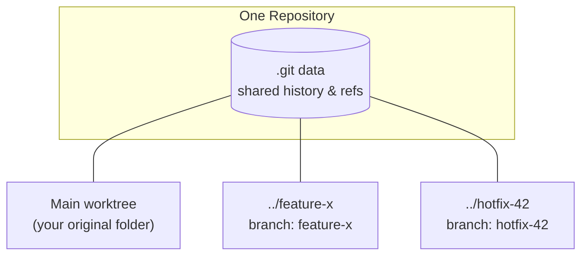
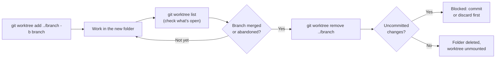

> [!note] What problem does this solve?
> Normally, a Git repository has **one working directory** tied to **one checked-out branch**. If you need to jump to a different branch mid-task, you either commit half-finished work, or run `git stash` and hope you remember to pop it later. A **worktree** removes that trade-off: it lets you check out multiple branches from the same repository **at the same time**, each in its own folder.

Picture two situations that come up constantly in this course and in real jobs:

- You're mid-way through a lab exercise on the `lecture` branch, and a `lab` branch needs attention right now. Stashing works, but it's easy to forget what you stashed and why.
- At a job, you're deep into a feature branch when a bug report comes in that needs a fix on `main`. Switching branches in the same folder means either committing unfinished work or stashing it.

With a worktree, you just open a **second folder** that has the other branch already checked out, do the work there, and come back to the first folder exactly as you left it. You don't stash anything, and you don't commit early just to save your spot.

# Creating a Worktree

> [!important] Keep worktrees outside the repo folder
> Always place a new worktree **outside** your current repository folder, typically one level up in the parent directory. Nesting a worktree inside the repo it came from creates a repository-inside-a-repository, which Git does not handle well.

**From a brand-new branch:**

```bash
git worktree add ../my-branch -b my-branch
```

This does three things in one command: creates a folder named `my-branch` next to your repo, creates a new branch called `my-branch`, and checks that branch out inside the new folder.

**From a branch that already exists:**

```bash
git worktree add ../my-branch-work my-branch
```

Here `my-branch` already exists (locally or fetched from a remote). This checks it out into a new folder named `my-branch-work`. The folder name and branch name don't have to match.

# Managing and Viewing Worktrees

Once you've got more than one worktree going, you'll want a way to see what's checked out where:

```bash
git worktree list
```

This prints the absolute path, current commit hash, and active branch for every worktree attached to the repository: a quick way to answer "wait, which folder has which branch?" without opening each one.

# Removing a Worktree

Once a branch is done with (say its pull request just got merged), clean up the worktree with Git itself rather than just deleting the folder:

```bash
git worktree remove ../my-branch-work
```

> [!warning] This is a safety check, not just a delete
> `git worktree remove` first checks for uncommitted changes in that folder. If it finds any, it blocks the removal instead of silently discarding your work. Only once the folder is clean does it delete it and unmount the worktree connection from Git.

If a worktree folder gets deleted some other way (`rm -rf`, dragging it to the trash, anything that bypasses Git), Git has no way to know that happened. It will keep listing that worktree as if it still exists. Clean up these dangling references with:

```bash
git worktree prune
```

# Important Rules to Remember

| Rule | What it means in practice |
|---|---|
| **No duplicate checkouts** | Git refuses to let the same branch be checked out in two worktrees at once. To work on that branch in a second location, check out something else first, or make a new branch. |
| **Shared `.git` context** | Every worktree reads and writes the same underlying history and `.git` data. Fetch a remote update in one worktree, and it's immediately visible in all the others: there is no syncing step. |

## The Worktree Model



## Typical Lifecycle



## Summary

- A **worktree** checks out a branch into its own folder while staying connected to the same repository, so you can have multiple branches open at once without stashing or committing early.
- Create one with `git worktree add <path> -b <new-branch>` (new branch) or `git worktree add <path> <existing-branch>` (existing branch), and always place it **outside** the current repo folder.
- `git worktree list` shows every active worktree's path, commit, and branch.
- `git worktree remove <path>` deletes a worktree, but only if it has no uncommitted changes.
- Deleting a worktree folder manually (instead of through Git) leaves a dangling reference. Clean it up with `git worktree prune`.
- The same branch can never be checked out in two worktrees simultaneously, and all worktrees share the same `.git` history.

## Exercises

### Exercise 1 (Direct application)
Write the single command that creates a new worktree in a sibling folder called `../feature-login`, on a brand-new branch also called `feature-login`.

> [!success]- Answer key
> ```bash
> git worktree add ../feature-login -b feature-login
> ```
> The `-b feature-login` flag tells Git to create the branch as part of the same command, rather than requiring the branch to already exist. The folder name and branch name happen to match here, but they don't have to.

### Exercise 2 (Direct application)
You've lost track of which folders on your machine have which branches checked out. What command shows you that, and what three pieces of information does it print per worktree?

> [!success]- Answer key
> ```bash
> git worktree list
> ```
> It prints, for each worktree: the absolute path to the folder, the current commit hash, and the active branch name.

### Exercise 3 (Applied variation)
A teammate already pushed a branch called `hotfix-42`, and you've fetched it, but it isn't checked out anywhere on your machine. Write the command to open it in a new worktree folder called `../hotfix-42-work`, without creating a new branch.

> [!success]- Answer key
> ```bash
> git worktree add ../hotfix-42-work hotfix-42
> ```
> Leaving out `-b` tells Git to check out the *existing* `hotfix-42` branch rather than create a new one. The folder name (`hotfix-42-work`) can differ from the branch name; Git doesn't require them to match.

### Exercise 4 (Applied variation)
The pull request for the branch in `../old-feature` just got merged. Walk through removing that worktree, including what happens if Git finds uncommitted changes there.

> [!success]- Answer key
> Run:
> ```bash
> git worktree remove ../old-feature
> ```
> Git first checks the folder for uncommitted changes. If it's clean, the folder is deleted and the worktree is unmounted from the repository. If it finds uncommitted changes, the removal is **blocked**: you'd need to commit or discard those changes first. (Git also supports a `--force` flag if you're certain the changes don't matter, but checking first is the safer habit.)

### Exercise 5 (Challenge)
You deleted a worktree folder with `rm -rf ../old-feature` instead of using Git. Now `git worktree list` still shows `../old-feature` as active, even though the folder is gone. What's happening, and how do you fix it?

> [!success]- Answer key
> Git tracks worktrees in its own internal records, separate from the filesystem. Deleting the folder directly (instead of through `git worktree remove`) doesn't update those records, so Git still believes the worktree exists. This is a **dangling worktree reference**.
> Fix it with:
> ```bash
> git worktree prune
> ```
> This scans for worktree references whose folders no longer exist and removes those stale entries, without touching anything else.

### Exercise 6 (Challenge)
You run `git worktree add ../same-branch my-branch`, but `my-branch` is already checked out in another worktree on your machine. The command fails. Explain why this restriction exists, and describe two different ways to resolve it without deleting either worktree.

> [!success]- Answer key
> Git enforces **no duplicate checkouts**: the same branch can never be checked out in two worktrees at the same time. This exists because a branch's working files and its committed state need to stay in sync with a single pointer. If two folders both claimed to *be* `my-branch`, changes in one wouldn't reliably show up in the other, and Git would have no way to reconcile that.
> Two ways to resolve it without deleting either worktree:
> 1. Check out `my-branch` in a *different* branch reference: create a new branch off it, e.g. `git worktree add ../same-branch -b my-branch-copy my-branch`.
> 2. If you no longer need the *other* worktree that has `my-branch` checked out, switch that worktree to a different branch first (freeing up `my-branch`), then run the original command.

## Feynman Practice

Use these prompts to explain each concept in your own words. Don't just re-read the notes above. Write the explanation yourself, and only come back to the source material to check for gaps.

### Feynman: Worktrees vs. `git stash`
**1. Explain it as if to a 12-year-old**
- [ ] Why would someone use a worktree instead of just running `git stash` when they need to switch branches for a bit?

**2. Where did you get stuck or use jargon without defining it?**
- [ ] Reread what you wrote. Mark with 🚧 any word a 12-year-old wouldn't understand (e.g. "checked out," "working directory").

**3. Go back to the source and simplify**
- [ ] For each 🚧, write an analogy or a concrete example.

**4. Organize and test the explanation**
- [ ] Rewrite the final explanation in 3-5 sentences. Could you teach this to someone in 2 minutes?

### Feynman: Creating a worktree (new branch vs. existing branch)
**1. Explain it as if to a 12-year-old**
- [ ] What's the difference between `git worktree add ../x -b x` and `git worktree add ../x x`? Why does the `-b` matter?

**2. Where did you get stuck or use jargon without defining it?**
- [ ] Mark any 🚧 jargon in your explanation.

**3. Go back to the source and simplify**
- [ ] Write a concrete example for each command variant.

**4. Organize and test the explanation**
- [ ] Rewrite the final explanation in 3-5 sentences.

### Feynman: The shared `.git` data model
**1. Explain it as if to a 12-year-old**
- [ ] If two worktrees are really "separate folders," why does fetching a remote update in one make it instantly visible in the other?

**2. Where did you get stuck or use jargon without defining it?**
- [ ] Mark any 🚧 jargon (e.g. "refs," "history").

**3. Go back to the source and simplify**
- [ ] Draw or describe the relationship between the `.git` folder and each worktree folder.

**4. Organize and test the explanation**
- [ ] Rewrite the final explanation in 3-5 sentences.

### Feynman: Safe removal and pruning
**1. Explain it as if to a 12-year-old**
- [ ] Why does `git worktree remove` sometimes refuse to delete a folder, and what does `git worktree prune` clean up that `remove` doesn't?

**2. Where did you get stuck or use jargon without defining it?**
- [ ] Mark any 🚧 jargon (e.g. "dangling reference," "unmount").

**3. Go back to the source and simplify**
- [ ] Write a concrete example of each command failing or succeeding.

**4. Organize and test the explanation**
- [ ] Rewrite the final explanation in 3-5 sentences.

## Tags

#git #version_control #cli #software_engineering #study_notes #CSD214
