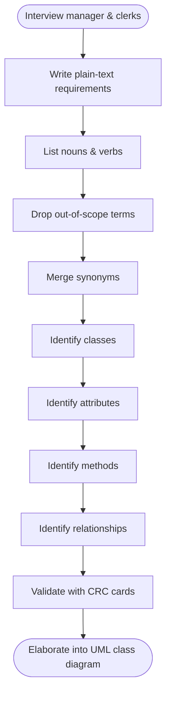
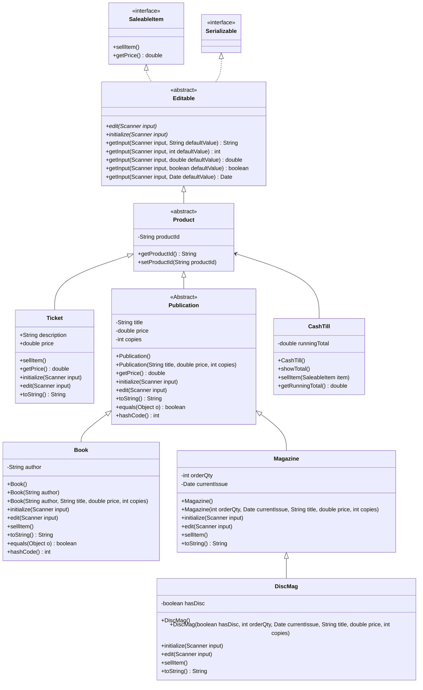

# Object-Oriented Software Analysis and Design

> [!note] Case study
> This lecture works through a single running example: a local bookstore owner who wants to replace manual spreadsheets with a system that manages **Books** and **Magazines**, sells event **Tickets**, and can eventually grow into a full e-commerce platform (an "Amazon for anything"). Every technique below is applied to that one scenario, end to end.

> [!tip] Objectives
> By the end of this material, you should be able to:
> - Analyse a requirements description for a retail system.
> - Identify items that fall outside the scope of the system.
> - Identify candidate classes, attributes, and methods from a retail context.
> - Document the resulting object-oriented architecture as a class diagram.

> [!tip] External reference
> [Gordon College's ATM Example System](https://www.math-cs.gordon.edu/courses/cps122/ATMExample/index.html) walks through the exact same OOA process on a different case study (an ATM instead of a bookstore) and is worth comparing against the steps here.

---

# The Problem Statement

Every design starts with a plain-language description of what's needed, gathered by interviewing the people who'll actually use the system: here, the shop manager and clerks. That description then gets mined for structure.

> [!quote] Requirements, as given to the team
> We need a system to manage a variety of items for sale. Initially, we will sell **Books**, **Magazines**, and **Tickets** for local literary events.
>
> Every **Product** in the system must have a unique Product ID. Because we want this to be an e-commerce platform, all items must be **Saleable** (they must have a price and a way to be sold) and **Serializable** (so they can be saved to a database or sent over a network).
>
> We need a way to **Edit** or **Initialize** the data for any item using a scanner/keyboard. When a user edits an item, the system should prompt for information and allow for default values.
>
> **Publications** are a specific type of product. They all have a title, a price, and a count of how many copies are in stock.
> - **Books** are publications that also have an author.
> - **Magazines** are publications that have a specific order quantity and a "current issue" date.
> - Some magazines are **Disc Mags**: magazines that include a physical supplement like a CD or DVD.
>
> **Tickets** are also products, but they aren't publications. They have a description and a price.
>
> Finally, we need a **Cash Till**. The till should be able to sell any saleable item, keep track of a running total of sales for the day, and show that total when requested.

The overall analysis loop is: interview → document requirements → identify essential features → produce a preliminary design, then repeat as the picture sharpens.

---

# Mining the Text: Nouns and Verbs

The core trick of object-oriented analysis: read the requirements and pull out every **noun** and every **verb**. Nouns point at entities, meaning future classes or attributes. Verbs point at actions, meaning future methods.

> [!note] Nouns found in the description
> Bookstore, Product, Product ID, Saleable Item, Book, Magazine, Disc Mag, Ticket, Publication, Title, Price, Copies, Author, Order Quantity, Issue Date, Disc, Cash Till, Running Total, Scanner.

> [!note] Verbs found in the description
> Sell item, Get price, Edit (item), Initialize, Get input, Show total, Record ID.

Not every noun survives, though. Two cleanup passes come next.

## Cutting what's outside the scope

Some words describe real-world context rather than something the software needs to model or do.

| Kind | Excluded item | Why it's out |
|---|---|---|
| Noun | "Bookstore" (the building) | The physical shop isn't a piece of data the software tracks |
| Noun | "Scanner" (the hardware) | The code uses a `Scanner` object, but the physical keyboard/device sits outside the model |
| Verb | "Moving beyond spreadsheets" | Contextual history, not a behavior the system performs |
| Verb | "Sending over a network" | Implied by the `Serializable` requirement, but not a method being designed in this pass |

## Merging synonyms

The same idea can show up under two names. Catching that early avoids accidentally building the same class twice under different labels.

- **Item = Product**
- **Inventory Count = Copies**
- **Sales Register = Cash Till**

---

# From Nouns and Verbs to Classes, Attributes, and Methods

Once the noun/verb list is trimmed and deduplicated, it sorts into three buckets: the shape of the class hierarchy, what each class needs to *know* (attributes), and what each class needs to *do* (methods).

## Candidate classes

| Category | Classes |
|---|---|
| **Interfaces** | `SaleableItem`, `Serializable` |
| **Abstract classes** | `Editable`, `Product`, `Publication` |
| **Concrete classes** | `Book`, `Magazine`, `DiscMag`, `Ticket`, `CashTill` |

> [!note] Interface vs. abstract class, in this design
> An **interface** (`SaleableItem`, `Serializable`) only promises *that* something can be done, with no implementation. An **abstract class** (`Editable`, `Product`, `Publication`) can hold shared fields and even partially-implemented behavior, but still can't be instantiated directly; only its concrete subclasses can.

## Candidate attributes ("what each class knows")

| Class | Attributes |
|---|---|
| `Product` | `productId` |
| `Publication` | `title`, `price`, `copies` |
| `Book` | `author` |
| `Magazine` | `orderQty`, `currentIssue` |
| `DiscMag` | `hasDisc` |
| `CashTill` | `runningTotal` |

## Candidate methods ("what each class does")

| Class | Methods |
|---|---|
| `SaleableItem` | `sellItem()`, `getPrice()` |
| `Editable` | `edit()`, `initialize()`, `getInput()` |
| `CashTill` | `showTotal()`, `sellItem(SaleableItem item)` |

---

# Common Characteristics: Inheritance, Interfaces, and Association

To make the design ready to grow into a full e-commerce catalogue, the classes are organized into a deep hierarchy rather than a flat list. That lets code treat a `Book` as a `Publication`, a `Product`, or just a `SaleableItem`, depending on what a given piece of code actually needs to know about it.

> [!important] Three kinds of relationship in this design
> 1. **Is-a (inheritance):** a `Book` **is a** `Publication`. A `Publication` **is a** `Product`.
> 2. **Interface implementation:** a `Product` **is** `Editable`. Every `Editable` item is also `Saleable` and `Serializable`.
> 3. **Association:** `CashTill` **has a relationship with** `Product`: it "uses" `SaleableItem`s to process a transaction, without being one itself.

The distinction between is-a and association matters: inheritance means "is a specialized version of," while association just means "collaborates with, without being one."

---

# CRC Cards: Stress-Testing the Design Before Writing Code

A list of classes, attributes, and methods still leaves an important question open: does the design actually *work*? **CRC (Class-Responsibility-Collaboration) cards** bridge the gap between a noun list and a formal class diagram by forcing the team to check, class by class, whether each one can actually answer the requests the others will make of it.

Each card has a class name, its **responsibilities** (what it knows and does), and its **collaborators** (which other classes it needs help from).

### CashTill

| Responsibilities                          | Collaborators  |
| ----------------------------------------- | -------------- |
| Keep track of the daily `runningTotal`.   | `SaleableItem` |
| Accept an item for purchase (`sellItem`). |                |
| Request the price from an item.           |                |
| Update the total based on the item price. |                |
| Display the final total to the user.      |                |

### Book

| Responsibilities | Collaborators |
|---|---|
| Know its own `author`, `title`, and `price`. | `Scanner` |
| Reduce `copies` in stock when sold. | |
| Provide its data for display (`toString`). | |
| Manage its own data updates (`edit`). | |

### Editable (Abstract)

| Responsibilities | Collaborators |
|---|---|
| Standardize how data is input from the user. | `Scanner` |
| Provide helper methods to handle default values. | |

> [!question]- Aside: why bother with CRC cards at all?
> Experienced designers rarely jump straight from a requirements description to code, since modern software is too complex to hold entirely in your head at once. UML diagrams are great for documentation, but they're rigid. CRC cards are **physical** (traditionally 4×6 index cards) and **tactile**: a team can move them around a table to feel out how the system fits together before committing to a diagram.
>
> **What they're for: discovery.**
> - *Discovering missing responsibilities:* a class turns out to be doing too much (a "God Object") and needs to be split.
> - *Discovering missing classes:* "wait, who's handling the tax calculation?" surfaces the need for a `TaxCalculator` class that wasn't in the original noun list.
> - *Discovering bad coupling:* if every class collaborates with every other class, the design is too tightly coupled.
>
> **How they help: anthropomorphism.** Designers run "walkthroughs," each holding one card and role-playing the class:
> - *CashTill:* "I am the CashTill. I am being told to sell an item. I don't know the price, so I'm going to ask you, the Book, for your price."
> - *Book:* "I am the Book. I have that price in my attributes. I will give it to you, and then I will subtract one from my copies count."
>
> If a card-holder can't find a responsibility on their own card to answer a request, the design is broken. It's far cheaper to catch that on a 10-cent index card than 1,000 lines into a broken Java implementation.

---

# Elaborating Classes: From CRC Cards to UML

Once a walkthrough proves the classes can hold a coherent conversation, each CRC card gets **elaborated** into formal UML syntax: the left-hand "responsibilities" become **methods**, and the "knowledge" a class needs becomes **attributes**.

> [!example] Elaboration example: CashTill's running total
> - **CRC responsibility:** "Keep track of the daily running total."
> - **UML attribute:** `- double runningTotal`
> - **UML method:** `+ getRunningTotal() : double`

The `-` and `+` prefixes are UML visibility markers: `-` for `private`, `+` for `public`. By the time every CRC card has gone through this pass, every line in the resulting class diagram has already been "stress-tested" through a walkthrough.

---

# The Finalized Class Diagram

This is the architecture the whole analysis converges on. It's deliberately built for growth: adding a new sellable category later (electronics, clothing, whatever comes next) means creating one new subclass of `Product`. Nothing above it in the hierarchy has to change.

> [!note] Reading the arrows
> - `<|..` = **realizes** an interface (dotted line, hollow triangle): `Editable` promises to be `SaleableItem` and `Serializable`.
> - `<|--` = **inherits from** a class (solid line, hollow triangle): `Book <|-- Publication` reads as "`Publication` is the parent of `Book`."
> - `<--` = **association** (plain arrow): `CashTill` depends on `Product`, without being one.

A deeper walkthrough of this exact diagram (constructors, overloaded methods, and why each visibility marker was chosen) is coming in the next lecture on advanced class design and UML.

If parts of this diagram feel unfamiliar, [[Week 1 - Java Review and In-Class Exercises]] covers the underlying mechanics: abstract classes, constructors that chain through `super()`, and why `equals()`/`hashCode()` get overridden together.

---

## Summary

- Object-oriented analysis starts from a plain-language requirements description and works it into a design through a repeatable sequence: list nouns/verbs → cut what's out of scope → merge synonyms → identify classes/attributes/methods → identify relationships.
- **Abstraction:** making `Product` and `Publication` abstract prevents anyone from instantiating a meaningless "generic product" that doesn't correspond to anything sellable.
- **Polymorphism:** `CashTill` can sell a `Book`, a `Magazine`, or a `Ticket` through one `sellItem(SaleableItem item)` method, because all three implement `SaleableItem`.
- **CRC cards** exist to catch broken responsibilities and missing classes cheaply, before any of this becomes actual code. A walkthrough that fails on an index card is much cheaper to fix than one buried in a class file.
- **Scalability:** the hierarchy is built so that adding a new sellable category (say, `Laptop`) only requires extending `Product` and implementing `SaleableItem`. Nothing existing has to change.

## Tags

#computer_science #oop #software_design #uml #crc_cards #java #study_notes
