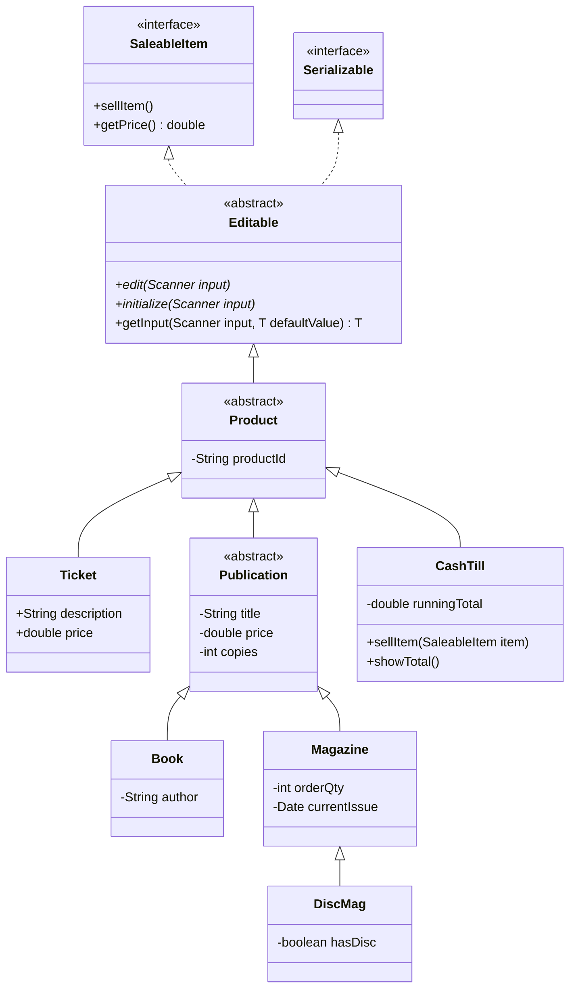
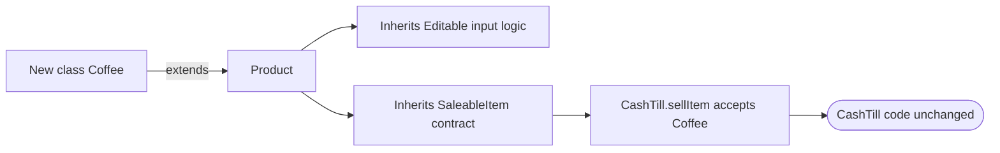
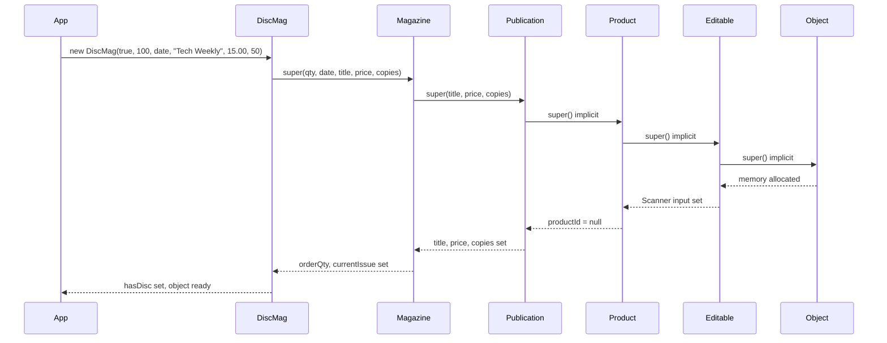
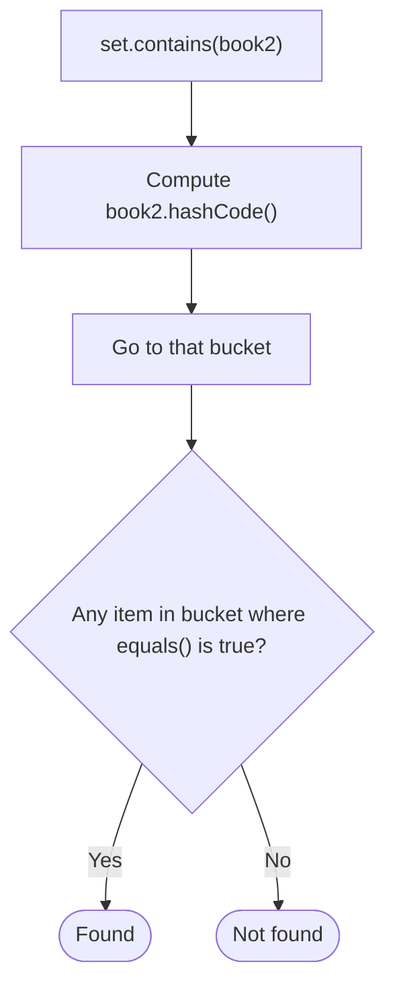
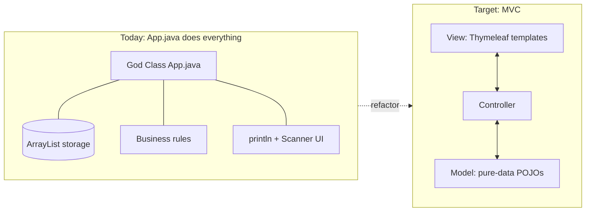
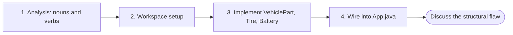
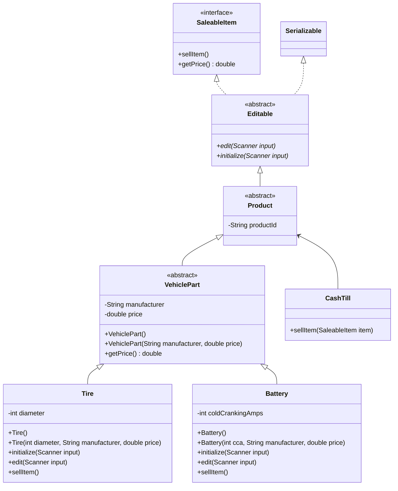

# Advanced Class Design, the Architecture of Data, and UML

> [!note] Where this lecture fits
> This lecture continues the Bookstore case study from [[Week 2 - Object-Oriented Software Analysis and Design]]. Last week produced the class diagram. This week explains *why* the diagram is shaped the way it is, how its constructors, `equals()`, `hashCode()` and `toString()` work, where the design is weak, and then walks through adding a brand-new "Auto Shop" department to the system in class.
>
> - **Course outcome:** 1. Describe and apply high-level software design principles.
> - **Outcome item:** 1.1 Construct and interpret UML diagrams, and discuss how they relate to OOP design.
> - **Reference project:** https://github.com/fcarella/lab1-exercise-fred-carella-csd214-s26

The course description frames the whole semester: every programmer has to learn to manage complexity. CSD214 does that through advanced data structures, design patterns, design principles, testing, [[Model-View-Controller|MVC]] frameworks and [[Object-Relational Mapping|Object-Relational Mappers (ORMs)]], all in Java. Course Outcome 1 has five learning objectives, and several of them come up in this lecture:

| Item | Objective |
|---|---|
| 1.1 | Construct and interpret UML diagrams, and relate them to OOP design |
| 1.2 | Design an OOP system from a problem description |
| 1.3 | Describe the components of the Model-View-Controller architecture |
| 1.4 | Explain the advantages of a tiered software architecture |
| 1.5 | Create modular software applications |

## Learning objectives

By the end of the session you should be able to:

- **Critique the Bookstore monolith.** Look at the current `App.java`, spot the *"God Class" anti-pattern*, and explain why adding a new department means surgery on that file (1.5).
- **Audit Separation of Concerns (SoC).** Find "design smells" such as UI code (`Scanner`) living inside data objects (`Book`, `Tire`), which breaks the [[Single Responsibility Principle]].
- **Deconstruct MVC.** Describe how Model, View and Controller roles should be split to fix the Bookstore's coupling problems (1.3).
- **Evaluate tiered (N-Tier) architecture.** Explain how a *Service Layer* and the *Repository Pattern* would let the Bookstore swap its "database" (an `ArrayList` today, MySQL later) without breaking the user interface (1.4).
- **Contrast "UI polymorphism" with "pure data."** Judge the `Editable` type: handy for console apps, a liability for web and security integration.
- **Plan for modularity.** Propose a refactoring that uses the **DTO (Data Transfer Object) Pattern** to shield internal models from malicious user input (1.5, 6.0).

---

## Step 0: The GitHub template workflow

Every lab from now on starts the same way, so the lecture practises it first.

1. **Prepare the template**
   - Go to https://github.com/fcarella/bookstore-2026-01-30.git
   - Click **Use this template** and pick **Create a new repository**.
   - Name it `lab1-exercise-your_name-csd214-s26` (for example `lab1-exercise-fred-carella-csd214-s26`).
   - Set it to **Public** and click **Create repository**.
2. **Clone it locally**
   - Copy the URL of your new repo.
   - In **IntelliJ Ultimate**, open **File > New > Project from Version Control**.
   - Paste the URL and click **Clone**.

> [!tip]
> A template repo gives you a fresh copy with no shared commit history. That is different from a fork, which stays linked to the original repository.

---

## From scripts to systems

In a first programming course you mostly write *scripts*: linear code inside `main` that does one job and exits. CSD214 builds *systems*, and systems need structure. Instead of loose variables, the real world is modelled with [[Object-Oriented Design]] (OOD).

### The case study: the Bookstore

The Bookstore sells **Books**, **Magazines** and **Tickets**. There are two ways to store them:

| Approach | What it looks like | Problem / benefit |
|---|---|---|
| **Bad** | Parallel arrays or lists: `String[] bookTitles`, `double[] bookPrices`, and so on for each kind of item | Every new product type needs a new set of arrays, and the arrays can drift out of sync |
| **Good** | A class hierarchy of "saleable items" | One container holds every product |

The layers of the good approach, from most general to most specific:

1. `SaleableItem` (**interface**): the contract. Everything must have a price and be sellable.
2. `Publication` (**abstract class**): shared traits such as title, copies and price.
3. `Book` (**concrete class**): specific traits such as author.

### The Bookstore UML diagram

The project keeps this diagram in `/documentation/bookstore-2026-01-30-142628.mmd`. Fields and most methods are trimmed here so the shape is easy to see. The full version with every member is in [[Week 2 - Object-Oriented Software Analysis and Design]].



> [!note] Reading the diagram
> - Dotted line with a hollow triangle (`<|..`): **realizes** an interface.
> - Solid line with a hollow triangle (`<|--`): **inherits from** a class.
> - `<<abstract>>` / `<<interface>>` are *stereotypes*: labels saying what kind of type the box is.
> - Methods ending in `*` are abstract (italic in the rendered PNG): subclasses must implement them.
> - `-` means `private`, `+` means `public`.
> - `getInput` is really five overloads in the original diagram (for `String`, `int`, `double`, `boolean` and `Date`). `T` here is just shorthand.

> [!warning] The drawn diagram vs. the in-class Mermaid code
> In the PNG, `CashTill` is drawn with an inheritance arrow into `Product`. In the Mermaid code for the Auto Shop exercise (and in Week 2) the same link is written as `Product <-- CashTill`, a plain **association**. The text of the lecture treats `CashTill` as something that *uses* `SaleableItem`s, so read it as an association.

---

## How the Bookstore design works

The design aims for code reuse, flexibility and [[Type Safety|type safety]]. Five ideas carry it.

### 1. The core abstraction: "everything is a Product"

`Product` is the abstract parent of `Ticket`, `Publication`, `Book`, `Magazine` and `DiscMag`. This is a **generalization** relationship: the specific classes are all special cases of one general idea.

That is what makes [[Polymorphism]] possible. The `CashTill` or an inventory list can be declared as `List<Product>` and never needs to know, at compile time, which concrete class each object is. A `Book` and a `Ticket` are handled the same way, as a `Product`.

### 2. Interface-driven behaviour: `SaleableItem`

`Product` says what the objects **are** (identity). `SaleableItem` says what they **can do** (behaviour).

- **The contract.** Any class implementing `SaleableItem` must provide `sellItem()` and `getPrice()`.
- **Decoupling.** `CashTill` depends only on the `SaleableItem` interface, never on `Book` or `Ticket`. This is effectively [[Dependency Inversion Principle|Dependency Inversion]]: the till only cares that the item has a price and can be sold.
- **Dynamic binding.** When `cashTill.sellItem(item)` runs, the Java runtime picks *at that moment* which `sellItem()` to execute. For a `Book` that might mean decrementing stock; for a `Ticket` it might just print a receipt.

```java
List<SaleableItem> cart = List.of(new Book(), new Ticket());
for (SaleableItem item : cart) {
    till.sellItem(item);   // the right sellItem() is chosen at runtime
}
```

### 3. Utility inheritance: the `Editable` abstract class

The root of the hierarchy is `Editable`, an abstract class holding all the console I/O logic (`Scanner`, `getInput`).

- **Code reuse.** Because `Product extends Editable`, *every* item in the store can talk to the console for free.
- **Separation of Concerns.** Parsing an `int` or a `Date` from the keyboard lives in one place. A `Book` doesn't know *how* input is parsed; it just calls `getInput()`, so it stays focused on its own fields.

> [!warning] "Editable interface" or "Editable abstract class"?
> The diagram marks `Editable` as `<<abstract>>`, but a few places in the slides call it the "Editable interface." It is an abstract class in this project. The lecture also comes back later to argue that putting console logic here is a design smell, which is covered in the God Class section below.

### 4. The `Publication` hierarchy (specialization)

`Publication` is an *intermediate* abstract class that groups the items sharing `title`, `price` and `copies`.

- **[[Inheritance]].** `Book` and `Magazine` inherit those fields instead of each declaring them. That follows the **DRY (Don't Repeat Yourself)** principle.
- **Deep inheritance.** `DiscMag extends Magazine`, a very specific **specialization**. A `DiscMag` *is-a* `Magazine`, which *is-a* `Publication`, which *is-a* `Product`. It inherits everything from its ancestors (title, order quantity...) and adds one field of its own, `hasDisc`.

### 5. Extensibility: the [[Open-Closed Principle|Open/Closed Principle]]

The design can grow without editing existing code. Say the store starts selling **Coffee**:

1. Create `Coffee extends Product`.
2. `Coffee` is automatically `Editable` (it inherits the input logic).
3. `Coffee` is automatically a `SaleableItem` (it inherits the contract).
4. `CashTill` accepts `Coffee` right away, and not one line of `CashTill` changes.



> [!important] Summary of the design
> Specific items (`Book`, `Ticket`) are treated as general types (`Product`, `SaleableItem`). Application logic is written **once** against the general type, while specific behaviour (`sellItem`, `initialize`) is handled polymorphically by each concrete class.

---

## The Java Bean standard

Enterprise Java frameworks (Spring, Hibernate, Jakarta EE) expect data classes to follow the **[[Java Bean]]** pattern, first seen in lecture 1. A class is a bean when it has:

1. **Private fields** ([[Encapsulation]]).
2. **Public getters and setters.**
3. **A no-argument constructor** (the upcoming frameworks need it).
4. **`implements Serializable`** (optional, but common for saving data).

### Encapsulation protects rules, not just data

Encapsulation is about more than hiding fields. Its real job is **protecting invariant logic**, meaning rules that must always hold. `CashTill.java` shows this:

```java
public class CashTill {
    private double runningTotal; // PRIVATE!
    // We do NOT provide a setRunningTotal(double amount).
    // Why? Because we don't want a dev to accidentally set the till to $0.
    // Instead, we provide a controlled method:
    public void sellItem(SaleableItem item) {
        // Logic: logic ensures the total only goes UP, never down or replaced.
        runningTotal += item.getPrice();
    }
}
```

The rule here is "the running total only ever goes up." With a public setter, any code could break it. With only `sellItem()`, it can't.

> [!important] Takeaway
> Control **how** state changes. Don't just expose it.

> [!warning] Beans vs. blind setters
> "Every field gets a getter and a setter" is the general bean rule, but `CashTill` shows a deliberate exception: when a setter would let someone break an invariant, leave it out and offer a controlled method instead.

Reference: [W3Schools: Java Encapsulation](https://www.w3schools.com/java/java_encapsulation.asp)

---

## Constructor strategy

In CSD214, data classes ([[POJO|POJOs]]) usually get two constructors.

### 1. The no-arg constructor

```java
public Book() {
    super();
}
```

Later in the course, Hibernate (the ORM) and JSON libraries build objects using **[[Reflection]]**: they look for a constructor with *no arguments*, create an empty object, and then fill in the fields. Delete this constructor and the app will crash at Step 2 of the course roadmap.

### 2. The "loaded" constructor`

```java
public Book(String author, String title, double price, int copies) {
    super(title, price, copies); // Passes data up to Publication
    this.author = author;
}
```

This one is for developer convenience: you can build a complete object in one line while testing or seeding data.

---

## Deep dive: constructor chaining in `DiscMag`

Creating a child object doesn't run just one constructor. It sets off a chain that travels up the hierarchy to the root (`java.lang.Object`) and then back down.

> [!important] The golden rule of constructors
> A child object can't exist until its parent part is fully initialized. So **parent constructors always execute before child constructors.**

### The lineage of `DiscMag`

1. `java.lang.Object` (the root)
2. `Editable` (abstract parent)
3. `Product` (abstract parent)
4. `Publication` (abstract parent)
5. `Magazine` (concrete parent)
6. `DiscMag` (the child)

### The execution chain, step by step

`App.java` creates this object while populating data:

```java
DiscMag dm = new DiscMag(true, 100, new Date(), "Tech Weekly", 15.00, 50);
```

| Step | Constructor | Triggered by | What it does |
|---|---|---|---|
| 1 | `Object` | implicit | Allocates memory on the heap |
| 2 | `Editable` | implicit | Initializes the `Scanner input` field, so the object can read console input |
| 3 | `Product` | implicit | Initializes `productId` to `null` |
| 4 | `Publication` | `super(title, price, copies)` in `Magazine` | Finally sets `title`, `price` and `copies` |
| 5 | `Magazine` | `super(...)` in `DiscMag` | Sets `orderQty` and `currentIssue` |
| 6 | `DiscMag` | the `new` keyword in `App` | Sets `hasDisc` |

The code for steps 5 and 6:

```java
public Magazine(int orderQty, Date currentIssue, String title, double price, int copies) {
    super(title, price, copies); // Passes data up to Publication
    this.orderQty = orderQty;
    this.currentIssue = currentIssue;
}

public DiscMag(boolean hasDisc, int orderQty, Date currentIssue, String title, double price, int copies) {
    super(orderQty, currentIssue, title, price, copies); // Passes data up to Magazine
    this.hasDisc = hasDisc;
}
```

The order is easy to get backwards. `new DiscMag(...)` *calls* the `DiscMag` constructor first, but the first thing that constructor does is call `super(...)`. Each constructor's own body runs only after its parent has finished, so the bodies complete from the top down:



### The "super" bucket brigade

Think of a bucket brigade: data is passed **up** to the parent that owns it, and initialization flows back **down**.

| Class | What it receives | What it passes UP (`super`) | What it keeps/initializes (`this`) |
|---|---|---|---|
| `DiscMag` | hasDisc, qty, date, title, price, copies | qty, date, title, price, copies | `hasDisc` |
| `Magazine` | qty, date, title, price, copies | title, price, copies | `orderQty`, `currentIssue` |
| `Publication` | title, price, copies | nothing (implicit no-arg) | `title`, `price`, `copies` |
| `Product` | none | nothing | `productId` (default) |
| `Editable` | none | nothing | `Scanner input` |

### Why this matters for design (Outcome 1.2)

1. **DRY.** Without `super`, `DiscMag` would have to set `this.title`, `this.price` and so on by hand. With chaining, how a `Publication` gets built is defined once and reused everywhere.
2. **Encapsulation.** In `Publication`, `title` and `price` may well be `private`. Then `DiscMag` simply *can't* touch `this.title`. Its only option is to ask the parent, through the constructor chain, to initialize that data.

> [!warning] Common mistake
> A `super(...)` call must be the **first statement** in a constructor. If you leave it out, Java quietly inserts `super()` (the parent's no-arg constructor), and compilation fails if the parent doesn't have one.

Reference: [GeeksforGeeks: Constructor Chaining in Java](https://www.geeksforgeeks.org/constructor-chaining-java-examples/)

---

## Object identity: `equals()` and `hashCode()`

From the first course: `==` compares **memory addresses**. For business software you usually want to compare **business data** instead.

### The "twin books" problem

Two shipments of the exact same book arrive:

```java
Book book1 = new Book("J.K. Rowling", "Harry Potter", 29.99, 10);
Book book2 = new Book("J.K. Rowling", "Harry Potter", 29.99, 10);
if (book1 == book2) {
    System.out.println("They are the same book.");
} else {
    System.out.println("These are different."); // OUTPUTS THIS
}
```

`book1` lives at, say, address `0x123` and `book2` at `0x456`, so `==` says they differ. The fix is to override `equals()` to use **logical equality**: two books are equal when their data matches.

### Anatomy of an IntelliJ-generated `equals()` (`Book.java`)

```java
@Override
public boolean equals(Object o) {
    // 1. PERFORMANCE OPTIMIZATION
    // If the memory addresses are exactly the same, they must be equal.
    if (this == o) return true;
    // 2. TYPE SAFETY CHECK
    // If 'o' is null or a Toaster, it's not a Book.
    if (!(o instanceof Book)) return false;
    // 3. PARENT CHECK (The "Super" call)
    // Crucial! Ask Publication: "Do the titles, prices, and copies match?"
    if (!super.equals(o)) return false;
    // 4. CASTING & FIELD COMPARISON
    Book book = (Book) o;
    return Objects.equals(author, book.author);
}
```

| Step | Purpose |
|---|---|
| 1. `this == o` | Shortcut: same object, so equal |
| 2. `instanceof Book` | Rejects `null` and objects of the wrong type |
| 3. `super.equals(o)` | Lets `Publication` compare the fields it owns (title, price, copies) |
| 4. Cast + compare | Compares the field `Book` adds (`author`) |

> [!tip]
> `instanceof` returns `false` for `null`, so step 2 covers the null check as well.

### Why `hashCode()` too?

> [!important] Golden rule
> If you override `equals()`, you **must** override `hashCode()`.

Collections such as `HashMap` and `HashSet` don't check items one by one, which would be slow. They compute a "digital fingerprint" (an `int`) to decide which **bucket** to look in.

- **The contract:** if `book1.equals(book2)` is `true`, then `book1.hashCode()` **must** equal `book2.hashCode()`.
- **What goes wrong otherwise:** you add a `Book` to a `Set`, search for an equal book later, and Java says "not found" because it looked in the wrong bucket.



If `hashCode()` isn't overridden, `book1` and `book2` get different hash codes, land in different buckets, and the `equals()` check is never reached.

Reference: [Oracle Java SE docs: `Object.equals` and `Object.hashCode`](https://docs.oracle.com/en/java/javase/21/docs/api/java.base/java/lang/Object.html)

---

## Human representation: `toString()`

`toString()` is your main debugging tool.

- **Without an override:** `csd214.bookstore.pojos.Book@7ad041f3`, which tells you nothing useful.
- **With an override (`Book.java`):**

```java
@Override
public String toString() {
    // Reuses the parent's toString logic for shared fields
    return "Book{author='" + author + "', " + super.toString() + "}";
}
```

Output:

```
Book{author='J.K. Rowling', Publication{title='Harry Potter', price=29.99...}}
```

The same "ask the parent" idea shows up again: `Book` handles `author` and lets `Publication` describe its own fields through `super.toString()`.

---

## Live code walkthrough

In the IDE, open `src/main/java/csd214/bookstore/pojos/Publication.java` and `Book.java`, and look for:

1. **Inheritance:** `Book extends Publication`.
2. **`super` calls:**
   - In the constructor, `super(title, price, copies)` pushes data up.
   - In `initialize()`, `super.initialize()` runs the parent's console prompts first.
3. **Abstract class:** `Publication` is `abstract`. You never find a generic "Publication" on a shelf, only specific types, so it makes sense that it can't be instantiated.

---

## Architectural critique: the "God Class" anti-pattern

The Bookstore is a good example of object-oriented inheritance, but it has a serious structural weakness: the **[[God Class]] anti-pattern**. `App.java` is a "monolithic script" that violates **[[Separation of Concerns]] (SoC)**. To reach enterprise scale (think Amazon), these problems have to be named first.

### 1. Monolithic responsibility

A God Class knows too much or does too much. `App` currently handles all of this:

| Concern | What `App.java` does |
|---|---|
| **Data storage** | Keeps the `ArrayList<SaleableItem>`, which acts as a mock database |
| **Business logic** | Decides the rules for adding, editing and selling items |
| **User interface** | Makes every `System.out.println` call and reads every `Scanner` input |

### 2. Tightly coupled UI (the Scanner problem)

The biggest design smell sits in `Editable` and in the `initialize()` methods of the POJOs (`Book`, or your own niche items).

- **The issue:** `Scanner` logic lives *inside* data objects.
- **The consequence:** a `Book` should represent "paper and ink" (data). Right now it also knows how to "type on a keyboard" (UI). Move this code to a web server or a mobile app and it breaks, because there is no console or keyboard for the `Book` to use.

### 3. Maintenance fragility

The logic is hard-coded into a big `switch` in `App.java`, so the system isn't **modular** (Outcome 1.5).

- Each new "niche" product forces surgical edits in several places: the `addItem` menu, the `switch` logic and the `listAny` filter.
- In a proper [[Tiered Architecture]] (Outcome 1.4), you could add a new product type without touching the application's core engine.

### 4. The path to MVC (Outcome 1.3)

The fix is to migrate, eventually, to the **[[Model-View-Controller]] (MVC)** pattern:

- **Model:** the POJOs (`Book`, `Ticket`, niche items) become "pure data" with no `Scanner` code.
- **View:** the UI moves to **Thymeleaf HTML templates** (Lab 7).
- **Controller:** a dedicated class handles the traffic between the user and the data.



> [!note] Course roadmap
> The monolith stays for now so the next labs can focus on JDBC and SQL (Labs 3-5). To reach **Spring Boot (Lab 6)**, `Editable` will have to be removed and the system moved toward a decoupled, modular design.

Reference: [GeeksforGeeks: MVC Design Pattern](https://www.geeksforgeeks.org/mvc-design-pattern/)

---

## In-class exercise: from analysis to architecture, the "Auto Shop"

This exercise follows the same process you'll use in Lab 1: analyse, design, and implement a new **Automotive Parts** department inside the Bookstore monolith.



### Step 1: Analysis (noun/verb extraction)

Before writing code, define the domain. The Bookstore owner has bought a small auto-parts supply chain and wants it in the system.

> [!quote] Problem statement
> "We need to sell **Vehicle Parts**. Every part has a specific **Part Number** and a **Manufacturer**. Specifically, we carry **Tires**, which have a specific **Diameter** (e.g., 17 inches), and **Batteries**, which have a **Cold Cranking Amps (CCA)** rating. When we sell a part, we must record the sale in the till and decrement the inventory."

| Nouns (potential classes/fields) | Verbs (potential methods) |
|---|---|
| Vehicle Part, Part Number, Manufacturer, Tire, Diameter, Battery, CCA | Sell Part, Initialize Data, Edit Part |

**Synonyms**, so nothing is built twice:

- `Part Number` = `Product ID`
- `Manufacturer` = `Brand`

> [!note]
> In Lab 1 you'll use AI to help design your *own* niche product, following these same steps.

### The Auto Shop class diagram

Only the niche classes are shown, but they plug into the full Bookstore diagram:



The diagram has four levels:

| Level | Types | Role |
|---|---|---|
| 1. Interfaces | `SaleableItem`, `Editable` | Define the contract |
| 2. Abstract root | `Product` | Provides `productId`, which maps to the Auto Part Number |
| 3. Niche abstract | `VehiclePart` | Abstract, since nobody sells a "generic part". Holds `manufacturer` and `price` so `Tire` and `Battery` stay DRY |
| 4. Concrete children | `Tire`, `Battery` | The "leaf" nodes, and the only classes in this hierarchy you can create with `new` |

Reference: [Mermaid class diagram syntax](https://mermaid.js.org/syntax/classDiagram.html)

### Step 2: Workspace setup

Same as [[#Step 0 The GitHub template workflow|Step 0]]. Skip it if you already cloned the template.

### Step 3: Implementing the niche hierarchy

This is where abstraction and the bucket-brigade constructor chain get applied. The teacher's reference implementation is at https://github.com/fcarella/lab1-exercise-fred-carella-csd214-s26.git. In class, the instructor builds `VehiclePart` live, uses IntelliJ's **Generate** tools to follow the Java Bean standard, and wires a `Tire` into the `App` menu. The session is recorded in Microsoft Teams for later review.

#### 3.1 The abstract root: `VehiclePart.java`

It's abstract because the shop never sells a "generic" vehicle part, only a Tire or a Battery.

1. **Inheritance:** `VehiclePart` extends `Product`.
2. **Shared state:** the common fields `manufacturer` and `price` live here (DRY).
3. **Encapsulation:** all fields `private`, with `public` getters and setters.
4. **Default logic:** implement `initialize(Scanner input)` and `edit(Scanner input)` here for the shared fields.

> [!note] Why no `super.initialize(input)` here?
> Normally you *would* call `super.initialize(input)` so `Product` could ask for the `productId`. In this design, though, `productId` is always generated by the system as a UUID, so there is nothing for the user to enter. The instructor discusses this in class.

#### 3.2 The concrete children: `Tire` and `Battery`

Requirements for both classes:

1. **Java Bean standard**
   - **No-arg constructor:** needed for Lab 4 (JPA).
   - **Loaded constructor:** the bucket brigade. `Tire` receives `diameter`, `manufacturer` and `price`, keeps `diameter`, and passes the rest **up** to `VehiclePart` with `super()`.
2. **Overriding behaviour**
   - **`initialize()`:** ask for the specific field (e.g. "Enter Diameter"). Call `super.initialize(input)` **first** so the parent can ask for manufacturer and price.
   - **`sellItem()`:** this is where [[Polymorphism]] shows. Give each part its own message (e.g. *"Testing voltage for Battery..."*).
3. **Identity (IntelliJ):** press **Alt+Insert** to generate `toString()`, `equals()` and `hashCode()`, so the system can tell when two tires in the inventory are identical.

> [!example] A sketch of `Tire` following these rules
> The exact prompts and helper calls depend on the template project. This only shows the structure.
> ```java
> public class Tire extends VehiclePart {
>     private int diameter;
>
>     public Tire() {                        // no-arg: needed for JPA later
>         super();
>     }
>
>     public Tire(int diameter, String manufacturer, double price) {
>         super(manufacturer, price);        // pass shared data UP
>         this.diameter = diameter;          // keep my own field
>     }
>
>     @Override
>     public void initialize(Scanner input) {
>         super.initialize(input);           // parent asks for manufacturer + price
>         System.out.print("Enter Diameter: ");
>         diameter = getInput(input, diameter);
>     }
>
>     @Override
>     public void sellItem() {
>         System.out.println("Checking tread and pressure for Tire...");
>     }
>
>     // edit(), getters/setters, toString(), equals(), hashCode() via Alt+Insert
> }
> ```

### Step 4: Wiring the niche into the monolith (`App.java`)

Once `VehiclePart`, `Tire` and `Battery` exist, they have to be wired into the main app. This is exactly why the current app is called a **monolith**: each new feature means editing `App.java` in several places.

#### 4.1 The `addItem()` menu and logic

1. **UI update**: add menu lines.

```java
System.out.println("5. Add Tire");
System.out.println("6. Add Battery");
```

2. **Logic update**: add matching `case`s.

```java
switch(choice) {
    case 1: item = new Book(); break;
    // ...
    case 5: item = new Tire(); break;
    case 6: item = new Battery(); break;
}
```

> [!important] Polymorphism doing the work
> You don't write any Tire-specific input code in `App`. Since `Tire` is an `instanceof Editable`, the existing line `((Editable)item).initialize(this.input);` runs *your* `Tire.initialize()` automatically.

#### 4.2 The `listAny()` filter

1. **Menu update:**

```java
System.out.println("6. Tires");
System.out.println("7. Batteries");
```

2. **Filter assignment:**

```java
switch(choice) {
    // ...
    case 6: filter = Tire.class; break;
    case 7: filter = Battery.class; break;
}
```

#### 4.3 Seeding data in `populate()`

To test without typing data every run, use **JavaFaker** to generate mock items inside the `populate()` loop. Use the **loaded constructor** so the fake data goes through the bucket-brigade chain.

```java
// Inside the for-loop in populate()
// Tire Generation
addItem(new Tire(
    faker.number().numberBetween(15, 22),     // diameter
    faker.company().name(),                   // manufacturer
    faker.number().randomDouble(2, 80, 400)   // price
));

// Battery Generation
addItem(new Battery(
    faker.number().numberBetween(500, 900),   // Cold Cranking Amps
    faker.company().name(),                   // manufacturer
    faker.number().randomDouble(2, 120, 300)  // price
));
```

### Discussion: the structural flaw

Look at `App.java` after these changes. To add one department you had to change:

- the menu strings,
- two separate `switch` statements,
- the population logic.

> [!question] Question for the class
> With 50 departments (Tools, Electronics, Furniture...), would `App.java` still be manageable, or would it become unreadable?

This need for "surgical modification" is the reason the course later moves to **Spring Boot**. In a tiered architecture you can add 1,000 product types without touching the core application code. That's the **Open/Closed Principle**: software should be *open for extension* and *closed for modification*.

> [!warning] Two kinds of "extension" in this lecture
> The class hierarchy already follows Open/Closed: `CashTill` needed no changes for `Tire`. `App.java` does not: its menus and `switch`es had to be edited. Both are true at the same time, and the second is the God Class problem.

**Next lecture:** Interfaces vs. Abstract Classes, and why `SaleableItem` is an interface while `Publication` is a class (Outcome 1.2).

---

## Summary

- A class hierarchy (`SaleableItem` → `Editable` → `Product` → `Publication` → `Book`...) lets one container and one `CashTill` handle every product type through polymorphism and dynamic binding.
- `Product` defines what objects *are*; `SaleableItem` defines what they *can do*. Depending on the interface decouples `CashTill` from concrete classes.
- Java Beans have private fields, getters/setters, a no-arg constructor and (often) `Serializable`. Encapsulation also means refusing setters that would break an invariant, as `CashTill.runningTotal` shows.
- Data classes get a no-arg constructor (for reflection-based frameworks) and a loaded constructor (for convenience).
- Constructors chain upward with `super(...)`. Parent constructor bodies finish before child ones, and each class initializes only its own fields.
- Override `equals()` for logical equality, and always override `hashCode()` with it so hash-based collections keep working. Override `toString()` for readable debugging output.
- `App.java` is a God Class that mixes storage, business rules and UI, and `Editable` puts `Scanner` code inside data objects. Future labs fix this with MVC, tiers and Spring Boot.
- The Auto Shop exercise walks through the full Lab 1 process: noun/verb analysis, diagram, abstract `VehiclePart`, concrete `Tire`/`Battery`, then wiring into `App.java`.

---

## Exercises

### Exercise 1 (Direct application)
Write the loaded constructor for `Battery`, given that `VehiclePart` has a constructor `VehiclePart(String manufacturer, double price)` and `Battery` has a private field `int coldCrankingAmps`.

> [!success]- Answer key
> ```java
> public Battery(int cca, String manufacturer, double price) {
>     super(manufacturer, price);   // must be the first statement
>     this.coldCrankingAmps = cca;
> }
> ```
> `Battery` receives three values but only owns one of them. `manufacturer` and `price` belong to `VehiclePart`, and they're private there, so `Battery` can't set them directly. It passes them up with `super(...)` and keeps only `coldCrankingAmps`. That's the bucket-brigade pattern from the `DiscMag` example.

### Exercise 2 (Direct application)
What does this print, and why?
```java
Book a = new Book("Tolkien", "The Hobbit", 19.99, 5);
Book b = new Book("Tolkien", "The Hobbit", 19.99, 5);
System.out.println(a == b);
System.out.println(a.equals(b));
```
Assume `Book` and `Publication` both override `equals()` as shown in the lecture.

> [!success]- Answer key
> ```
> false
> true
> ```
> `==` compares memory addresses. `a` and `b` are two separate objects created with two `new` calls, so the addresses differ. `equals()` has been overridden for logical equality: `Book.equals` checks the type, asks `Publication.equals` (via `super.equals`) whether title, price and copies match, and then compares `author`. All of those match, so it returns `true`.

### Exercise 3 (Direct application)
For `new Magazine(20, new Date(), "Wired", 8.50, 30)`, list the constructors that run, in the order their **bodies finish**, and what each one initializes.

> [!success]- Answer key
> 1. `Object`: allocates memory.
> 2. `Editable`: sets `Scanner input`.
> 3. `Product`: sets `productId` to `null`.
> 4. `Publication`: sets `title = "Wired"`, `price = 8.50`, `copies = 30` (reached by `Magazine`'s `super(title, price, copies)`).
> 5. `Magazine`: sets `orderQty = 20` and `currentIssue`.
>
> The `Magazine` constructor is *called* first, but its first statement is `super(...)`, so its own body can't finish until every ancestor has finished. That's why parents always complete before children.

### Exercise 4 (Applied variation)
A student overrides `equals()` in `Tire` (comparing `diameter` and calling `super.equals`) but forgets `hashCode()`. They then run:
```java
Set<Tire> stock = new HashSet<>();
stock.add(new Tire(17, "Michelin", 150.0));
System.out.println(stock.contains(new Tire(17, "Michelin", 150.0)));
```
What is the likely output, and what's the fix?

> [!success]- Answer key
> Most likely `false`. `HashSet` first uses `hashCode()` to pick a bucket. Without an override, `hashCode()` comes from `Object` and is based on object identity, so the two equal tires almost certainly get different hash codes and end up in different buckets. The set looks in the wrong bucket and never calls `equals()`.
>
> Fix: override `hashCode()` using the same fields `equals()` uses (for example with IntelliJ's Alt+Insert, which generates both together). That meets the contract "equal objects must have equal hash codes."

### Exercise 5 (Applied variation)
A teammate proposes adding `public void setRunningTotal(double amount)` to `CashTill` "so it follows the Java Bean standard." Argue for or against, using two ideas from the lecture.

> [!success]- Answer key
> Against. The Java Bean pattern usually calls for getters and setters, but encapsulation is about **protecting invariant logic**. `CashTill`'s rule is that the running total only goes up, and only through `sellItem()`. A public setter would let any code reset the till to $0 or overwrite it, which breaks that rule. The lecture's takeaway is to control *how* state changes rather than just exposing it. A read-only `getRunningTotal()` is fine, since reading can't break the invariant.

### Exercise 6 (Applied variation)
The store wants to sell **Gift Cards**, each with a `double value` and a `String recipientName`. Gift cards aren't publications or vehicle parts. (a) Where does `GiftCard` go in the hierarchy? (b) Which classes need no changes for `CashTill` to sell it? (c) Which parts of `App.java` *do* need to change?

> [!success]- Answer key
> (a) `GiftCard extends Product` directly, like `Ticket` and the Coffee example. It's neither a `Publication` nor a `VehiclePart`, so it shouldn't inherit their fields.
>
> (b) `CashTill` needs no change. `GiftCard` is automatically `Editable` and a `SaleableItem` through `Product`, and `CashTill.sellItem(SaleableItem item)` accepts any `SaleableItem`. That's the Open/Closed Principle working at the class level.
>
> (c) `App.java` still needs: a new line in the `addItem()` menu and a matching `case`, a new line in the `listAny()` menu and a `case` setting `filter = GiftCard.class`, and new seeding code in `populate()`. Those edits are the God Class / monolith problem.

### Exercise 7 (Challenge)
Suppose `VehiclePart` had *only* a loaded constructor `VehiclePart(String manufacturer, double price)` and no no-arg constructor. (a) What happens when you compile `public Tire() { }`? (b) Even if you fix that, what problem would appear later in the course?

> [!success]- Answer key
> (a) Compilation error. A constructor without an explicit `super(...)` gets an implicit `super()` call, which needs a no-arg constructor in `VehiclePart`, and there isn't one. (Once a class declares any constructor, Java no longer supplies a default one.)
>
> (b) Hibernate/JPA and JSON libraries create objects through reflection by calling the no-arg constructor and then setting fields. The lecture says the no-arg constructor is required for Lab 4 (JPA), and that deleting it will crash the app at Step 2 of the roadmap. Every class in the chain needs a working no-arg path, so `VehiclePart` should keep `public VehiclePart() { super(); }`.

### Exercise 8 (Challenge)
Using the lecture's MVC description, describe how `Tire.initialize(Scanner input)` would be split up once the Bookstore moves to MVC. Which parts go in the Model, the View and the Controller?

> [!success]- Answer key
> - **Model:** `Tire` becomes pure data: `diameter` plus inherited `manufacturer`, `price` and `productId`, with constructors, getters/setters, `equals`/`hashCode`/`toString`. No `Scanner`, no `println`, and no `initialize(Scanner)`.
> - **View:** the prompts ("Enter Diameter") become a form in a Thymeleaf HTML template (Lab 7) instead of console output.
> - **Controller:** a dedicated class receives the submitted form values, builds the `Tire` (for example through its loaded constructor or setters), and passes it on to be stored.
>
> This removes the "Scanner problem": the `Tire` no longer needs a console to exist, so the same model works in a web server or a mobile app.

---

## Feynman practice

Write every answer in your own words, without looking at the notes first. Then check against them.

### Feynman: "Everything is a Product" and polymorphism

- [ ] **1. Explain it to a 12-year-old.** How can one cash register sell a book, a concert ticket and a car tire without knowing which is which? Use a real-world analogy (a supermarket scanner, a vending machine...).
- [ ] **2. Find your gaps.** Reread your answer and ==highlight== any word a 12-year-old wouldn't know ("interface", "runtime", "dynamic binding"...).
- [ ] **3. Go back and simplify.** For each highlighted word, write an analogy or a concrete example from the Bookstore.
- [ ] **4. Organize and test.** Rewrite it in 3-5 sentences. Could you explain why `CashTill` didn't change when `Coffee` was added, in 2 minutes?

### Feynman: the "super" bucket brigade

- [ ] **1. Explain it to a 12-year-old.** When someone runs `new DiscMag(...)` with six values, where does each value end up, and why can't `DiscMag` just keep all six?
- [ ] **2. Find your gaps.** ==Highlight== any jargon ("constructor", "super", "private", "heap").
- [ ] **3. Go back and simplify.** Why does the parent have to finish before the child? Build an analogy (a house's foundation and floors? a relay race?) and test whether it really fits.
- [ ] **4. Organize and test.** Rewrite it in 3-5 sentences. Could you draw the up/down flow from memory?

### Feynman: `equals()` and `hashCode()`

- [ ] **1. Explain it to a 12-year-old.** Two identical copies of *Harry Potter* arrive. Why does Java say they're different, and what do you teach it so it says they're the same?
- [ ] **2. Find your gaps.** ==Highlight== "memory address", "logical equality", "hash", "bucket".
- [ ] **3. Go back and simplify.** Come up with an analogy for buckets (a library shelf system? mailboxes?). Use it to explain why a forgotten `hashCode()` makes a set answer "not found."
- [ ] **4. Organize and test.** Rewrite it in 3-5 sentences, including the one-sentence contract between the two methods.

### Feynman: the God Class and MVC

- [ ] **1. Explain it to a 12-year-old.** What's wrong with one person in a restaurant being the cook, the waiter and the cashier? Tie it back to `App.java`'s three jobs.
- [ ] **2. Find your gaps.** ==Highlight== "Separation of Concerns", "coupling", "monolith", "Open/Closed".
- [ ] **3. Go back and simplify.** Why would a `Book` that "knows how to use a keyboard" break on a web server? Explain it with your own example.
- [ ] **4. Organize and test.** In 3-5 sentences: what are Model, View and Controller in the future Bookstore, and what problem does the split fix?

---

## Flashcards

An Anki import file for this lecture is at `Flashcards/advanced-class-design-uml-flashcards.txt` (tab-separated, tags in column 3). In Anki: **File > Import**, select the file, and check the field mapping.

---

## Tags

#computer_science #programming #java #oop #software_design #uml #mermaid #inheritance #polymorphism #encapsulation #constructor_chaining #equals_hashcode #java_bean #god_class #mvc #open_closed_principle #csd214 #study_notes
