# UML Diagrams

> [!note] Where this lecture fits
> This is the companion lecture to [[Week 3 - Advanced Class Design, The Architecture of Data and UML]]. That lecture *used* UML to describe the Bookstore. This one explains the notation itself: what each box, symbol, line and arrowhead means, and when to use each kind of diagram. Most examples are written in [[Mermaid]] syntax, so you can paste them into Obsidian, GitHub, Notion or an IntelliJ plugin and see them rendered.
>
> The contents list also links to a JDBC lecture from CSD211. That material isn't part of this document.

## Objectives

By the end of the lecture you should be able to:

- explain what UML is and the role of its four most common diagrams;
- explain the purpose of, and draw, each of these four:
  - **class diagrams** (the most commonly used part of UML),
  - **object diagrams**,
  - **sequence diagrams**,
  - **package diagrams**.

---

## What is UML?

**[[UML]] (Unified Modeling Language)** is a precise *diagramming notation*. It's graphical, which makes a design easy to visualize.

> [!warning] UML is not a methodology
> UML tells you *how to draw* a design. It does not tell you *how to design* software or what steps to follow in a project. Think of it as a shared drawing language that every developer can read.

UML diagrams fall into two families. They're covered in detail in the [[#Summary of UML diagram types|summary]] at the end.

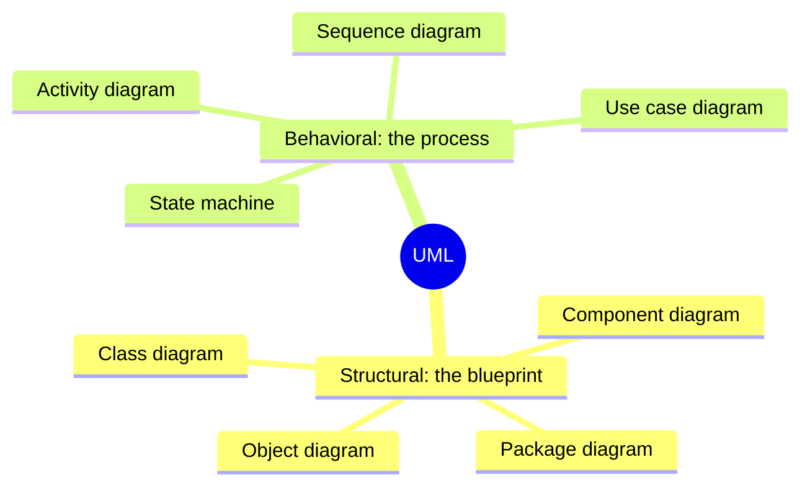

The four diagrams this lecture teaches are class, object, package and sequence.

---

## UML class diagrams

A **[[Class Diagram]]** shows one or more classes and how they relate to each other. Taken together, the class diagrams show the *architecture* of a system.

Each class is a box with three compartments:

1. a **unique name**;
2. a **list of attributes** with their types (`int`, `String`, ...);
3. a **list of methods** (the class's behaviours).

### A simple class

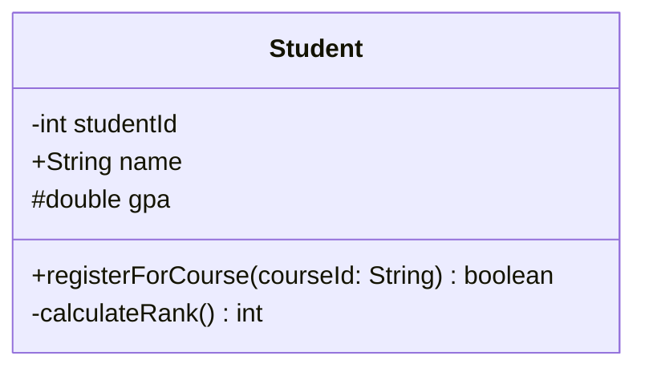

Reading it top to bottom: the class is `Student`; it has a private `studentId`, a public `name` and a protected `gpa`; it has a public method `registerForCourse` that takes a `String` and returns a `boolean`, and a private helper `calculateRank()` that returns an `int`.

Here is the same class in Java, so you can see how the diagram maps onto code:

```java
public class Student {
    private int studentId;
    public String name;
    protected double gpa;

    public boolean registerForCourse(String courseId) { /* ... */ return true; }
    private int calculateRank() { /* ... */ return 0; }
}
```

### Visibility and syntax key

| Symbol | Meaning | Example |
|---|---|---|
| `-` | **Private** | `-int balance` |
| `+` | **Public** | `+depositMoney()` |
| `#` | **Protected** | `#String id` |
| `~` | **Package** (default in Java) | `~void update()` |
| `-->` | **Association** | pointer from source to target |
| `1` | **Exactly one** | multiplicity |
| `0..*` | **Zero or more** | multiplicity |

> [!tip] How to write it in Mermaid
> Wrap the code in a `mermaid` code block. The general pattern for a class is:
> ````
> ```mermaid
> classDiagram
>     class Name {
>         -attribute: type
>         +method(param: type) returnType
>     }
> ```
> ````
> Mermaid accepts both `-int studentId` and `-studentId: int` for attributes. The lecture uses both styles.

Reference: [Mermaid class diagram syntax](https://mermaid.js.org/syntax/classDiagram.html)

### A class with a relationship

Java programs are made of many classes, and those classes use each other (through composition or inheritance). UML shows these relationships with **lines and arrows**.

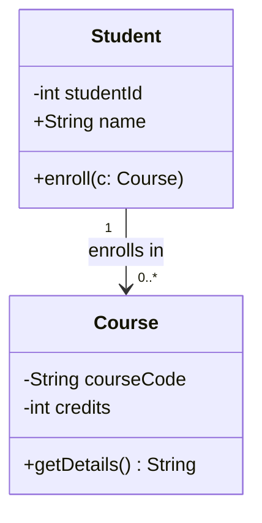

The `%%` prefix in Mermaid starts a comment. The lecture's version has `%% Relationship: A Student can have 0 to many courses` above the arrow, which is exactly what `"1" --> "0..*"` says.

### What a class diagram can show

| Category | Things you can show |
|---|---|
| **Classes** | attributes, operations (methods), visibility |
| **Relationships** | navigability, multiplicity, dependency, aggregation, composition |
| **Generalization / specialization** | inheritance, interfaces |
| **Keywords** | labels such as `<<abstract>>` and `<<interface>>` (called *stereotypes*) |

---

## Multiplicity

**[[Multiplicity]]** (also called *cardinality*) says *how many* objects can be on each end of a relationship.

| Notation | Meaning |
|---|---|
| `1` | Exactly one |
| `*` | Unlimited number (zero or more) |
| `0..*` | Zero or more |
| `1..*` | One or more (at least one) |
| `0..1` | Zero or one (optional) |
| `3..7` | A specified range: three through seven, inclusive |
| `0..4` | Between zero and four |
| `3, 5, 7` | Specific discrete numbers |

The multiplicity written at the **target end** of an association tells you how many target objects each *one* source object can be linked to.

> [!important] Always show multiplicity
> If a relationship has no multiplicity written on it, it is *unspecified*: nobody knows whether it means one, many or optional. Always write it, so nobody misreads the design.

### Worked example: an order system

This diagram (redrawn from the lecture) packs several relationship types into one model.

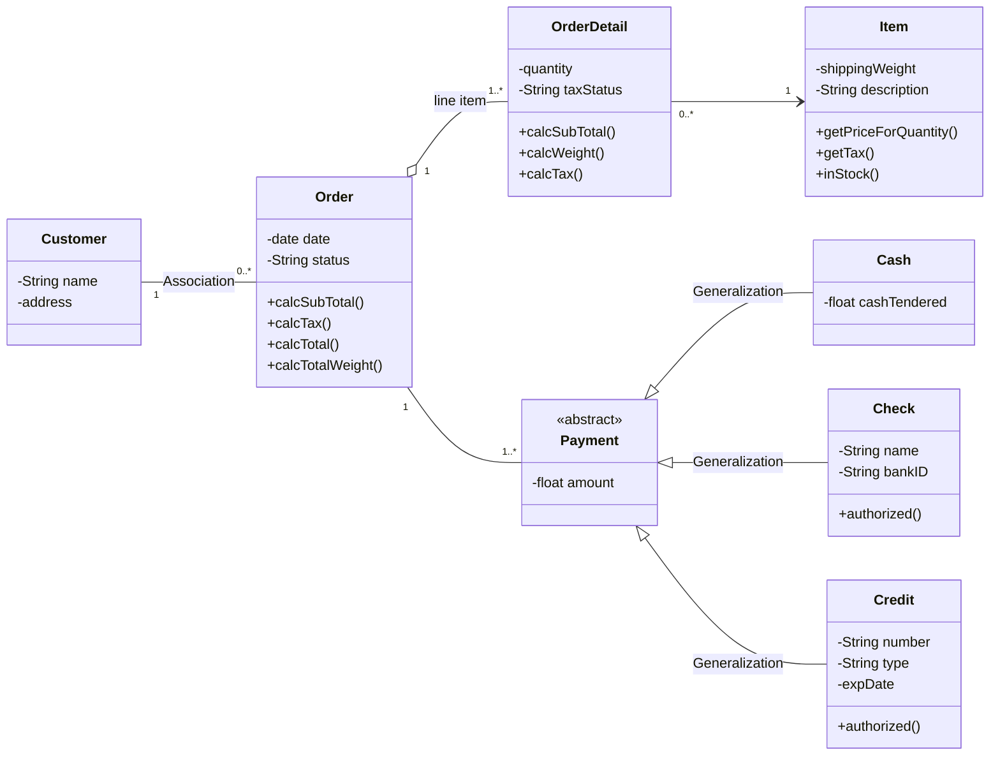

| Source | Target | Multiplicity | Relationship type | Meaning |
|---|---|---|---|---|
| Customer | Order | `1 : 0..*` | Association | One customer places zero or many orders. Each order belongs to exactly one customer. |
| Order | OrderDetail | `1 : 1..*` | Aggregation ("line item") | An order must have at least one line item, so an order can't exist with no items. Each line item belongs to exactly one order. |
| OrderDetail | Item | `0..* : 1` | Navigable (simple) association | Many line items, across many orders, can point to the same item (lots of people buy the same "Blue Pen"). Each line refers to exactly one item. |
| Order | Payment | `1 : 1..*` | Association | An order has one or more payments, which allows split payments (part cash, part credit). Each payment applies to exactly one order. |

> [!note] Why the Payment arrows have no numbers
> `Cash`, `Check` and `Credit` are connected to `Payment` by **[[Inheritance]]** (*is-a*), not by an association. A `Cash` object *is a type of* `Payment`; it isn't a collection of payments. Inheritance lines never carry multiplicity.

How each element appears in the diagram:

- **Abstract class:** `Payment` is marked `<<abstract>>` (drawn in italics in some tools).
- **Generalization:** the hollow-triangle arrows from `Cash`, `Check` and `Credit` to `Payment` are written `<|--`.
- **Aggregation:** the hollow diamond between `Order` and `OrderDetail` is written `o--`.
- **Multiplicity:** numbers like `1`, `0..*` and `1..*` sit at the ends of the lines.
- **Visibility:** `-` marks private attributes and `+` marks public operations.

---

## Types of relationships

The lecture lists six ways two classes can be connected, from the "is-a" family to the "has-a" family.

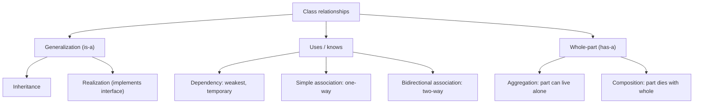

### Simple association (directed)

In an **[[Association]]**, Class A *uses* objects of Class B. Usually Class A has an attribute of type B.

**Navigability** goes from A to B: an A object can reach the B object(s) it is linked to, but B doesn't know anything about A.

> [!important] In code
> A simple association usually becomes an **instance variable** in Class A whose type is Class B.

Example: a `Customer` has an `Address`. The customer knows its address, but the address doesn't need to know who lives there.

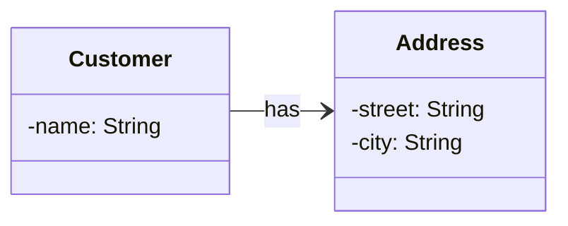

```java
public class Customer {
    private String name;
    private Address address;   // the association: Customer knows its Address
}

public class Address {
    private String street;
    private String city;       // no reference back to Customer
}
```

### Bidirectional association

Both classes know about each other, so you can navigate from A to B *and* from B to A.

Example: a `Student` knows which courses they're enrolled in, and a `Course` knows which students attend it.

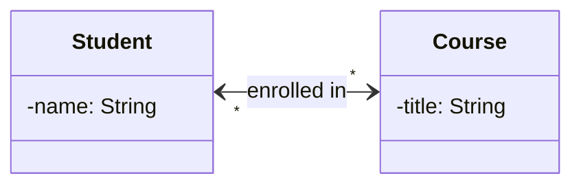

```java
public class Student {
    private String name;
    private List<Course> courses;    // Student -> Course
}

public class Course {
    private String title;
    private List<Student> students;  // Course -> Student
}
```

> [!warning] Two ways to write a bidirectional link
> The lecture's example draws arrowheads on both ends (`<-->`), while its summary table lists a plain line with no arrows (`--`). Both appear in practice: a line with no arrowheads means navigability isn't restricted to one direction. If you type the example from the slides, remove the spaces in `< -- >`, or Mermaid won't parse it.

### Dependency

A **[[Dependency]]** is a *uses-a* relationship and the weakest of all. One class depends on another only because it uses it as a **method parameter** or a **local variable**. It doesn't store it. If the supplier class changes, the client class might break.

Example: a `Printer` needs a `Document` to print, but it doesn't own the document.

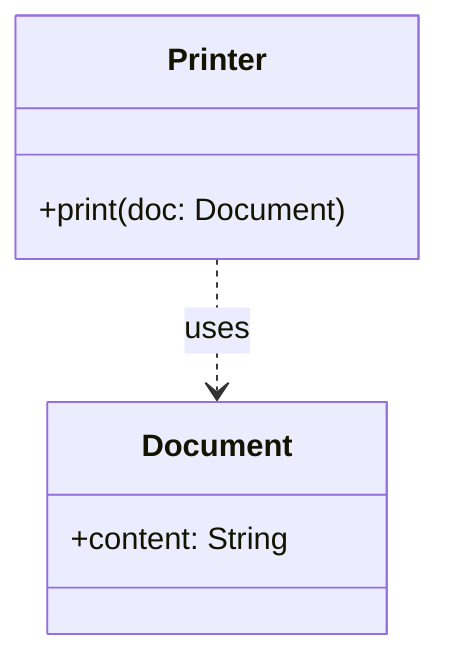

```java
public class Printer {
    // No Document field. The Document only shows up as a parameter.
    public void print(Document doc) {
        System.out.println(doc.content);
    }
}
```

> [!tip] Association or dependency?
> Ask: *does the class keep a reference in a field?* If yes, it's an association (solid line). If it only receives the object for one method call, it's a dependency (dashed line).

### Aggregation (weak "has-a")

**[[Aggregation]]** is a *has-a* relationship where the **part can exist on its own**, independent of the whole. It's drawn with a **hollow diamond** on the whole's side.

Example: a `Library` and its `Book`s. If the library closes, the books still exist and can move to another library or to someone's home.

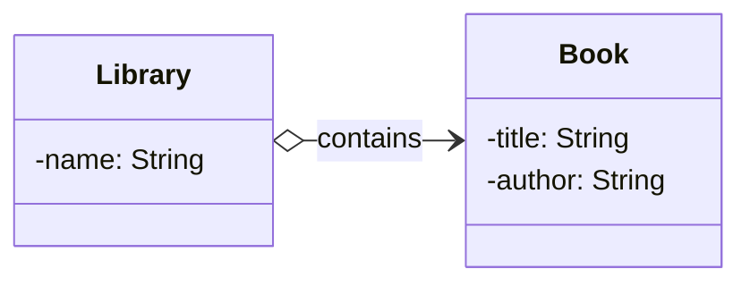

### Composition (strong "part-of")

**[[Composition]]** is a *part-of* relationship where the **part cannot exist without the whole**. If the parent is destroyed, the child is destroyed too. It's drawn with a **solid (filled) diamond** on the whole's side.

Example: a `House` and its `Room`s. Demolish the house and the rooms are gone.

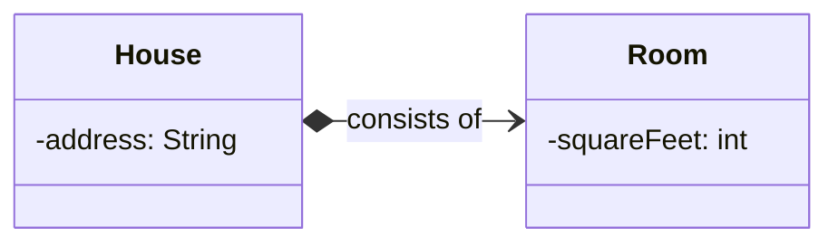

The Java difference between the two diamonds shows up in **who creates the part**:

```java
// Aggregation: the Book is created elsewhere and handed to the Library.
public class Library {
    private List<Book> books = new ArrayList<>();
    public void addBook(Book b) { books.add(b); }   // Book can outlive the Library
}

// Composition: the House creates its own Rooms and nobody else holds them.
public class House {
    private List<Room> rooms = new ArrayList<>();
    public House(int numberOfRooms) {
        for (int i = 0; i < numberOfRooms; i++) {
            rooms.add(new Room());                  // Rooms live and die with the House
        }
    }
}
```

> [!warning] Common mistake: diamond on the wrong end
> The diamond (hollow or filled) always goes on the **whole** (the owner): `Library o--> Book`, `House *--> Room`. Putting it on the part's end reverses the meaning.

### Inheritance (generalization)

**[[Inheritance]]** is the *is-a* relationship. A subclass inherits from a superclass and adds its own features. It's drawn with a **solid line and a hollow triangle** pointing at the parent.

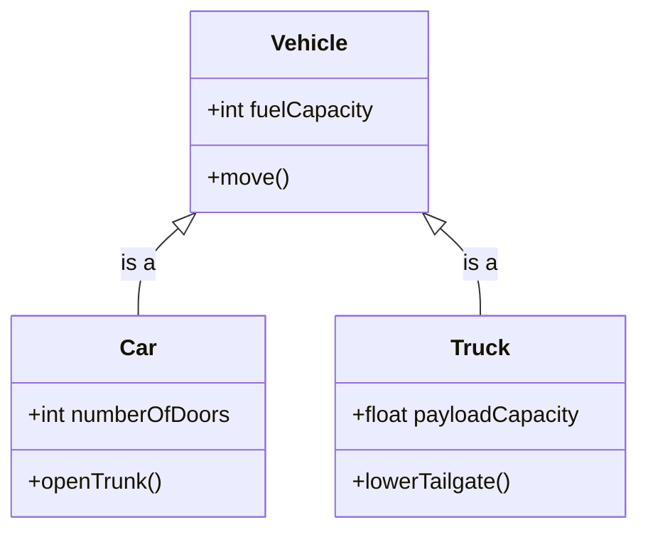

A second example from the lecture: `Publication <|-- Book : inherits`, where `Publication` has `title`, `author` and `getInfo()`, and `Book` adds `isbn` and `read()`.

```java
public class Car extends Vehicle {
    public int numberOfDoors;
    public void openTrunk() { /* ... */ }
}
```

Reference: [GeeksforGeeks: Association, Composition and Aggregation in Java](https://www.geeksforgeeks.org/association-composition-aggregation-java/)

### Mermaid relationship cheat sheet

| Type | Relationship | Mermaid | Notation |
|---|---|---|---|
| Inheritance | is a | `<\|--` | Solid line, hollow triangle at the parent |
| Realization | implements | `<\|..` | Dashed line, hollow triangle at the interface |
| Dependency | uses | `..>` | Dashed line with open arrow |
| Simple association | knows | `-->` | Solid line with open arrow |
| Bidirectional | link | `--` (or `<-->`) | Solid line, no arrows (or arrows on both ends) |
| Aggregation | has (weak) | `o--` | Hollow diamond at the owner |
| Composition | part of (strong) | `*--` | Solid diamond at the owner |

> [!warning] Two slips in the slides' tables
> The lecture's summary table describes inheritance as a "solid line with arrow". The arrowhead is specifically a **hollow triangle**, which is what separates it from a plain association arrow. Also, in the final "Quick Reference" table, the `|` in `<|--` and `<|..` broke the table's columns, so those two rows look garbled. They are inheritance (`<|--`) and realization (`<|..`).

---

## Realization and programming to an interface

The lecture calls this one of the most useful ideas in object-oriented design: **[[Realization]]** (implementing an interface) combined with **depending on abstractions**.

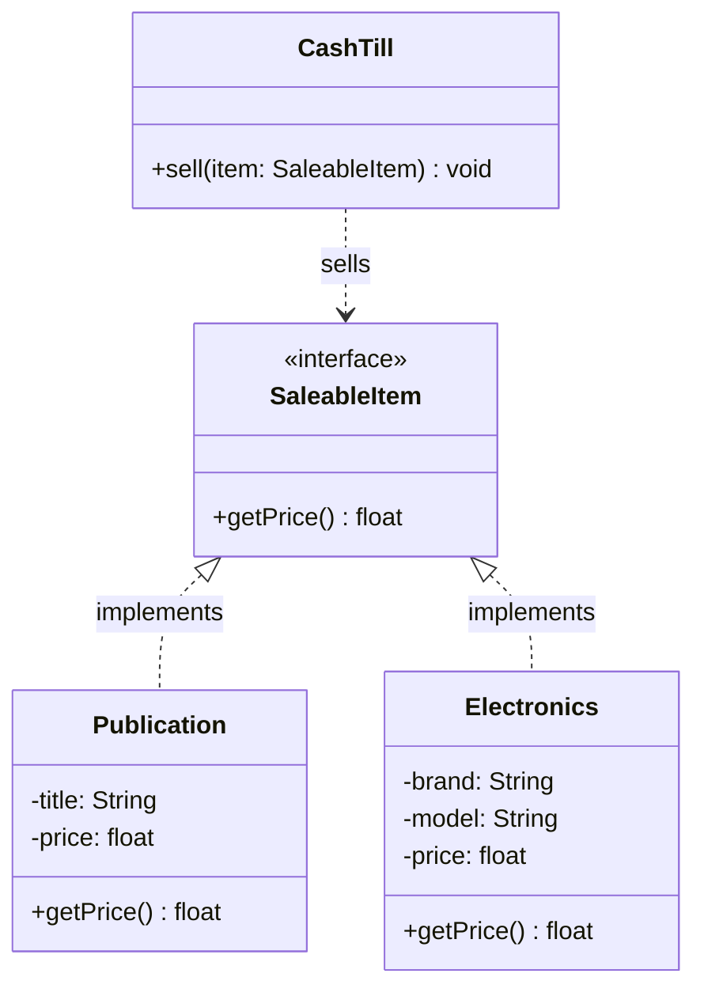

The three parts of the diagram:

1. **The interface `SaleableItem`.** The `<<interface>>` stereotype means you can't create a `SaleableItem` object. It's a **contract**: anything that wants to be "saleable" must provide `getPrice()`. It's the common ground between the things being sold and the machine selling them.
2. **The realization `Publication <|.. SaleableItem`.** A dotted line with a hollow triangle. `Publication` is a concrete class (like a Book or Magazine) that promises to provide the real logic for `getPrice()`. Unlike the interface, it has private data (`-title`, `-price`) to keep that promise.
3. **The dependency `CashTill ..> SaleableItem`.** A dashed line with an open arrow. `CashTill` doesn't have a `sell(Publication p)` method. It has `sell(item: SaleableItem)`. That's **programming to an [[Interfaces|interface]]**: the till only needs to know that whatever it's handed has a `getPrice()` method. It never needs to know `Publication` exists.

```java
public interface SaleableItem {
    float getPrice();
}

public class Electronics implements SaleableItem {
    private String brand;
    private String model;
    private float price;

    @Override
    public float getPrice() { return price; }
}

public class CashTill {
    public void sell(SaleableItem item) {   // accepts ANY saleable thing
        System.out.println("Charging " + item.getPrice());
    }
}
```

### Why this design works well

To start selling electronics, the original diagram only needed a new `Electronics` class with its own private fields and the required `getPrice()`, plus one `<|..` line to `SaleableItem`. Nothing else changed.

- **Extensibility:** you can add `Electronics`, `Food` or `Service` classes without changing a single line inside `CashTill`.
- **[[Polymorphism]]:** at runtime `CashTill` handles a `Publication` or an `Electronics` item the same way, because both "look like" a `SaleableItem`.
- **Low [[Coupling]]:** `CashTill` is decoupled from the details of `Publication`. It doesn't care about the `title`, only the price.

> [!note] Notation used here
> - `<<interface>>`: defines a set of behaviours with no implementation.
> - `<|..` (realization): a class implementing the "rules" of an interface.
> - `..>` (dependency): a *uses-a* relationship where one class depends on another's method signature to do a task.

---

## More class diagram examples

### Student and transcripts: a bounded multiplicity

Requirement: a student can have **between 0 and 4** transcripts.

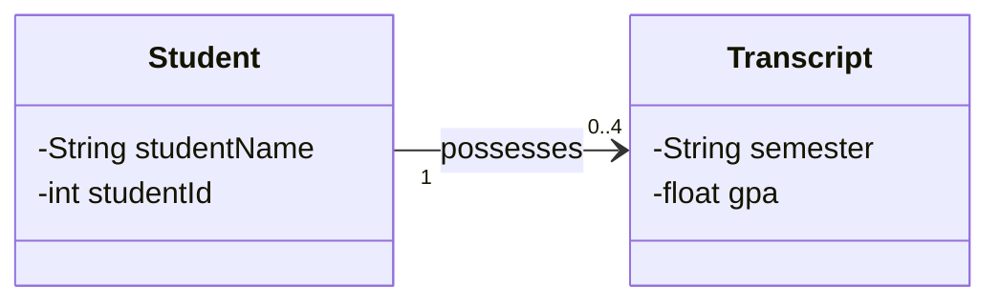

1. `0..4` sits next to `Transcript` (target multiplicity): one student has a minimum of 0 and a maximum of 4 transcripts.
2. `1` sits next to `Student` (source multiplicity): each transcript belongs to exactly one student.
3. `-->` (directed association): the student "knows about" their transcripts. In code, `Student` usually holds a `List` or array of `Transcript` objects.

### Library borrowing: multiplicity on both ends

Some rules need limits on **both** ends of the line.

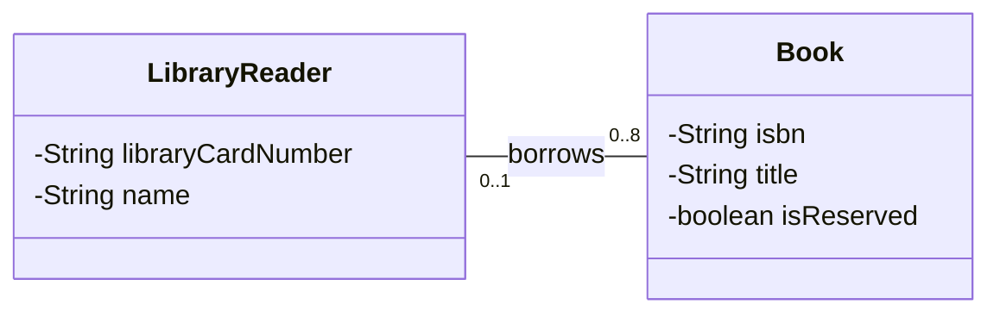

- **`0..8` on the Book side** describes the reader: one reader can have from 0 (nothing borrowed) up to 8 books checked out at once.
- **`0..1` on the LibraryReader side** describes the book: a specific book is either on the shelf (0 readers) or checked out by exactly 1 reader. Two people can't borrow it at the same time.

> [!tip] Reading multiplicity correctly
> To read a number, stand at the *opposite* class. "One `LibraryReader` has `0..8` Books" reads the number next to `Book`. "One `Book` has `0..1` LibraryReaders" reads the number next to `LibraryReader`. Students often attach the number to the wrong class.

In code this becomes:

```java
public class LibraryReader {
    private String libraryCardNumber;
    private String name;
    private List<Book> borrowedBooks = new ArrayList<>();   // limited to 8

    public boolean borrow(Book b) {
        if (borrowedBooks.size() >= 8) return false;
        borrowedBooks.add(b);
        return true;
    }
}

public class Book {
    private String isbn;
    private String title;
    private boolean isReserved;
    private LibraryReader currentBorrower;   // a LibraryReader, or null when on the shelf
}
```

### Body, hand, thumb and fingers: composition

The parts (Hand, Thumb, Finger) can't meaningfully exist without the whole (Body), and the parent object manages them. That makes this **composition**, with the solid diamond on the "whole" side.

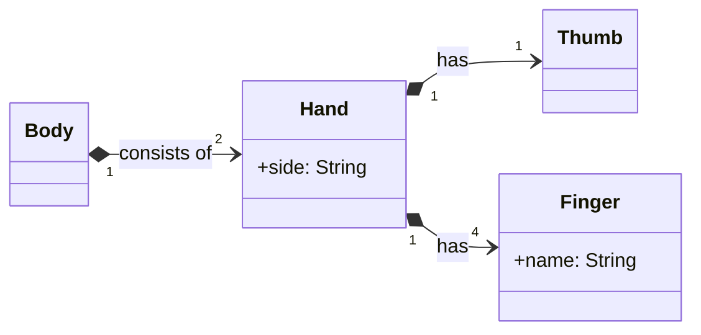

| Link | Multiplicity | Meaning |
|---|---|---|
| Body to Hand | `1` to `2` | The Body owns its two Hands. Delete the Body and the Hands are deleted too. |
| Hand to Thumb | `1` to `1` | Each hand is the whole for exactly one thumb. |
| Hand to Finger | `1` to `4` | Each hand has 4 fingers (the thumb is counted separately). |

> [!important] Why composition and not aggregation?
> - **Coincident lifetime:** a hand doesn't have a life independent of the body (in a standard biological model).
> - **Ownership:** a hand belongs to exactly one body at a time. Two bodies can't share it.
>
> When both of these hold, use the solid diamond.

### Bank accounts: inheritance plus association

This model needs two UML ideas at once:

1. **Inheritance (generalization)** to show that current and savings accounts are specific kinds of bank account.
2. **Association with multiplicity** to show that a customer can own any number (`*`) of accounts.

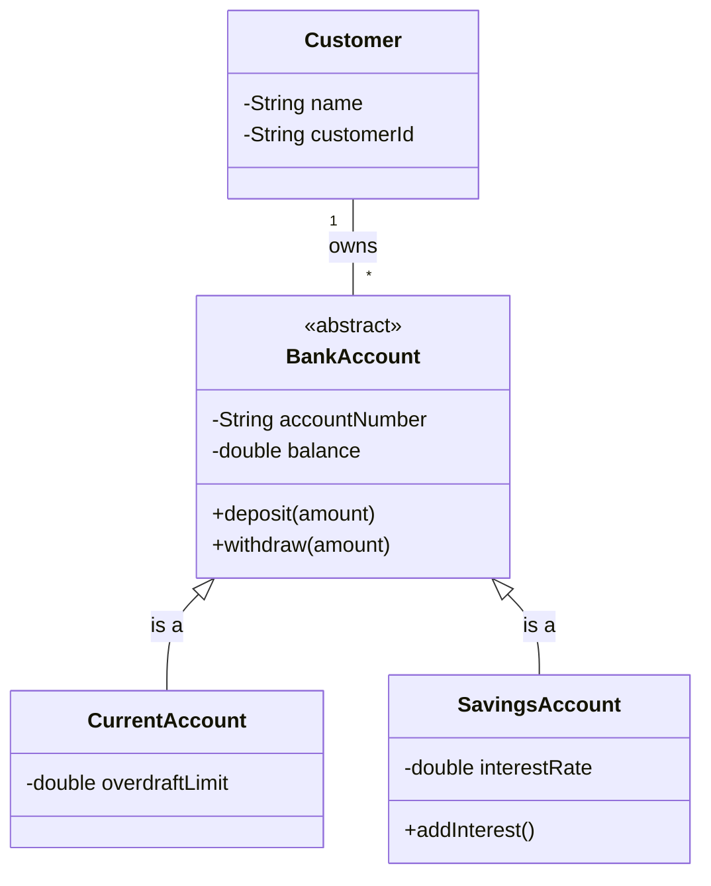

- **Inheritance (`<|--`):** `BankAccount` is the superclass. It's `<<abstract>>` because nobody has a "generic" account; it must be a specific type. `CurrentAccount` and `SavingsAccount` are subclasses that inherit `balance` and `accountNumber` and add their own features (`overdraftLimit`, `interestRate`).
- **Multiplicity (`"1" -- "*"`):** `*` means any number, from 0 upward. Since the line connects `Customer` to the **base class**, the count covers every account type below it, so it's the total of current plus savings accounts.
- **The "owns" association:** a simple structural link saying the customer owns the accounts.

> [!tip] Link to the parent, not the children
> Because `Customer` connects to `BankAccount` rather than to each child, adding an `InvestmentAccount` later only means adding one more subclass. The `Customer` relationship supports it automatically.

### Clock display: composition with an interface (Strategy Pattern)

The `Clock` doesn't need to know whether its screen is digital or analog. It only knows it has a `ClockDisplay`. The lecture names this the **[[Strategy Pattern]]** approach.

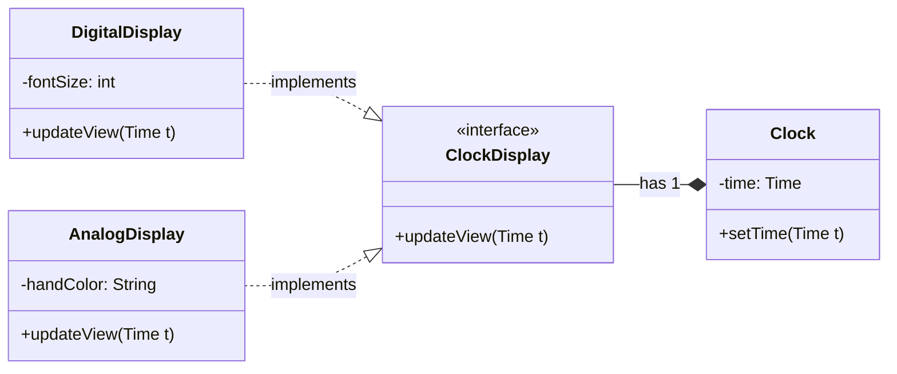

1. **The interface `ClockDisplay`** (`<<interface>>`) is a contract guaranteeing every display type has an `updateView()` method. Here the stereotype is written outside the class body, which Mermaid also accepts.
2. **Realization (`<|..`):** `DigitalDisplay` and `AnalogDisplay` both implement it. One draws pixels, the other moves physical hands, but they look identical to the `Clock`.
3. **Composition (`*--`):** the solid diamond at `Clock` means the display is part of the clock. Multiplicity `1`: the clock has exactly one display at a time.

Why this is considered good practice:

- **Swappability:** since `Clock` is linked to the *interface*, you can swap a `DigitalDisplay` for an `AnalogDisplay` at runtime without changing `Clock`'s code.
- **[[Abstraction]] and separation of concerns:** `Clock` handles time (seconds, minutes, hours) and the display classes handle visuals, which makes the code easier to maintain.

```java
public class Clock {
    private Time time;
    private ClockDisplay display;          // typed as the interface

    public Clock(ClockDisplay display) { this.display = display; }

    public void setTime(Time t) {
        this.time = t;
        display.updateView(t);             // works for any display type
    }
}
```

---

## UML package diagrams

A **[[Package Diagram]]** simplifies a big class diagram by grouping related elements (classes, interfaces, ...) into higher-level units. Think of packages as **folders** for your code architecture.

### Example: an e-commerce system

In a large e-commerce app you wouldn't look at 500 classes at once. You'd look at how the major subsystems (packages) interact.

The lecture's Mermaid code draws the individual classes (`StorefrontController --> UserSession`, `Order --> ShoppingCart --> LineItem`, `Product --> StockLevel`, `CreditCardProcessor --> TransactionLog`) and then the package-level dependencies:

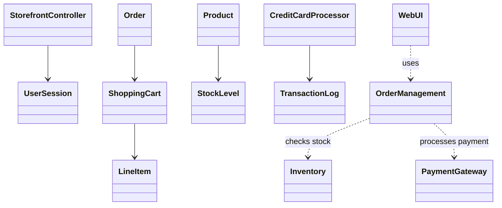

Zoomed out to the package level, the dependencies are:

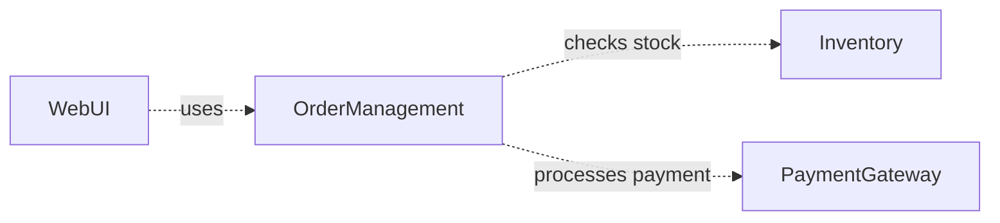

### Package diagram concepts

1. **The package symbol** is a **tabbed folder** containing logically related classes.
   - **[[Encapsulation]]:** packages can have visibility markers. A class can be *public* (visible to other packages) or *private* (hidden inside the folder).
2. **Package dependency (`..>`):** a dashed arrow means one package **depends on** another.
   - *Meaning:* if `Inventory` changes its public methods or data structures, `OrderManagement` may need updating too.
   - *Direction:* the arrow goes from the **client** (the one that needs info) to the **supplier** (the one providing it).

> [!note] Mermaid has no real package shape
> Mermaid can't draw UML's tabbed-folder symbol, which is why the lecture's examples are written as `classDiagram`s with each package as a box. In a dedicated UML tool the packages would appear as folders with classes inside them.

### Why use package diagrams?

- **High-level overview:** stakeholders can understand the system without getting lost in individual class variables.
- **Managing complexity:** developers can spot **circular dependencies** (package A depends on B, and B depends on A), which usually signal bad design.
- **Namespace organization:** packages map directly to `packages` in Java, `namespaces` in C#, and `modules` in Python/JavaScript.

```java
// The "Inventory" package in Java is literally a package declaration
package com.shop.inventory;

public class StockLevel { /* ... */ }
```

### Nesting packages

Packages can also be nested inside each other to show sub-systems. The lecture's example has `OrderService` depending on an `Authenticator` (`validates`) and a `QueryBuilder` (`persists`), with `ConnectionPool` and `Encryption` in the same system:

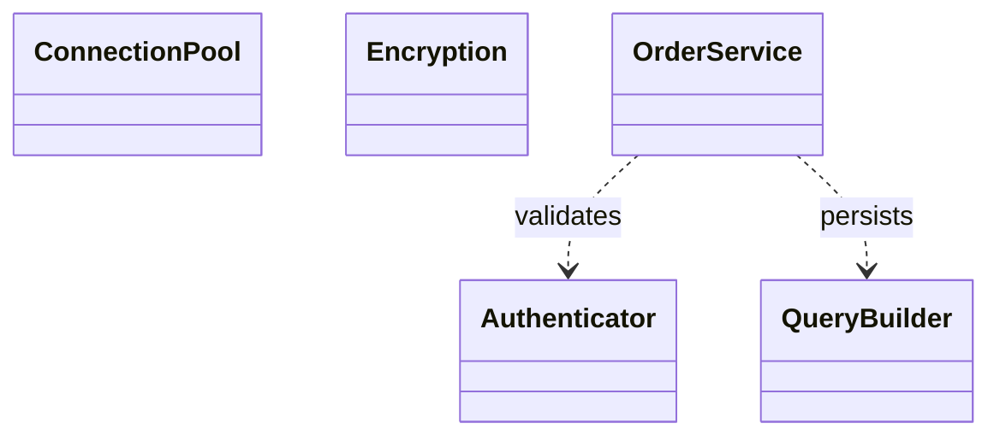

> [!warning] The nesting isn't visible in this example
> The slides' Mermaid code for this example only draws classes and dependencies, so the nesting itself doesn't show. Read it as: `OrderService` sits in one sub-system and depends on classes from security (`Authenticator`, `Encryption`) and data-access (`QueryBuilder`, `ConnectionPool`) sub-systems. The sub-system names here are illustrative and not from the slides.

Reference: [GeeksforGeeks: Package Diagram in UML](https://www.geeksforgeeks.org/package-diagram-introduction-elements-use-cases-and-benefits/)

---

## UML object diagrams

A class diagram is the **blueprint** ("a Library has Books"). An **[[Object Diagram]]** is a **snapshot** of the system at one moment ("the Downtown library currently has a copy of *1984*").

| | Class diagram | Object diagram |
|---|---|---|
| Boxes show | classes: `Library` | instances: `cityLibrary : Library` |
| Attributes show | types: `title: String` | values: `title = "1984"` |
| Lines are | associations, with multiplicities | **links** between specific objects, with *no* multiplicities |

### Example: a library snapshot

Objects are named with the pattern `instanceName : ClassName`.

```mermaid
classDiagram
    class `centralLibrary : Library` {
        name = "Central Library"
        location = "Downtown"
    }
    class `gatsbyBook : Book` {
        title = "The Great Gatsby"
        isbn = "123-456"
        status = "On Shelf"
    }
    class `orwellBook : Book` {
        title = "1984"
        isbn = "789-012"
        status = "Checked Out"
    }
    class `aliceReader : Reader` {
        name = "Alice Smith"
        cardNum = "998877"
    }
    `centralLibrary : Library` -- `gatsbyBook : Book` : contains
    `centralLibrary : Library` -- `orwellBook : Book` : contains
    `aliceReader : Reader` -- `orwellBook : Book` : borrows
```

1. **Object names (`instance : Class`):** `centralLibrary : Library` means `centralLibrary` is one specific instance of `Library`.
2. **State (attributes with values):** you see actual data, such as `centralLibrary` being in "Downtown".
3. **Links:**
   - *Containment:* the lines from the library to the two books show those two physical copies are in that library's inventory right now.
   - *Borrowing:* the link from `aliceReader` to `orwellBook` is one specific transaction. A class diagram would say "Readers can borrow Books"; this says "Alice has the copy of *1984* right now."

In Java, the snapshot is what you'd have in memory after running something like:

```java
Library centralLibrary = new Library("Central Library", "Downtown");
Book gatsbyBook = new Book("The Great Gatsby", "123-456", "On Shelf");
Book orwellBook = new Book("1984", "789-012", "Checked Out");
Reader aliceReader = new Reader("Alice Smith", "998877");
```

### When to use object diagrams

- **To explain complex logic:** when a class diagram is too abstract, an object diagram shows a real-world example.
- **To verify a design:** if the class diagram says a reader can have at most 8 books, draw an object diagram of a reader with 3 specific books and check that the model handles it.
- **Snapshots:** show the state of the system before and after an operation, like a before/after view of a database transaction.

---

## UML sequence diagrams

A **[[Sequence Diagram]]** is an *interaction* diagram. It shows how objects work with each other and **in what order**: a time-focused view of one specific process.

### Scenario: a reader borrows a book

Participants: the **Reader** (a human), the **Library System**, the **Catalogue** and the **Reader Account**.

```mermaid
sequenceDiagram
    actor Reader
    participant System as Library System
    participant Cat as Catalogue
    participant Acc as Reader Account

    Reader->>System: scanLibraryCard(cardId)
    activate System
    System->>Acc: validateStatus(cardId)
    activate Acc
    Acc-->>System: statusOK (no fines, under limit)
    deactivate Acc
    System-->>Reader: Prompt for Book ISBN
    deactivate System

    Reader->>System: scanBook(isbn)
    activate System
    System->>Cat: checkAvailability(isbn)
    activate Cat
    Cat-->>System: available
    deactivate Cat

    System->>Acc: recordLoan(isbn, dueDate)
    activate Acc
    Acc-->>System: loanConfirmed
    deactivate Acc

    System->>Cat: updateStatus(isbn, "Checked Out")
    System-->>Reader: Display Success & Due Date
    deactivate System
```

### Parts of a sequence diagram

1. **Lifelines (vertical lines):** the dashed vertical lines show that each object exists over time.
   - The **actor** (stick figure) is the human who starts the action.
   - **Participants** (boxes) are the objects inside the system.
2. **Activation bars (tall rectangles):** show exactly when an object is active, busy doing a task. Above, the `Catalogue` is only active while it checks availability.
3. **Messages (arrows):**
   - **Solid arrow (`->>`):** a *synchronous call*; the sender waits for a response.
   - **Dashed arrow (`-->>`):** a *return message*, the result of an earlier call.
4. **The flow of time:** time runs **top to bottom**. The first action is scanning the card and the last is the success message.

> [!tip] Sequence diagrams map onto method calls
> Each solid arrow is a method call on the receiving object (`System->>Acc: validateStatus(cardId)` is roughly `account.validateStatus(cardId)` inside the system's code). Each dashed arrow is that method's `return`.

### Alternative flows with `alt`

Sequence diagrams can also show "what if?" cases using **`alt` blocks**, which work like an `if/else`. For example, when the book is already checked out:

```mermaid
sequenceDiagram
    participant System
    participant Cat as Catalogue
    participant Reader

    System->>Cat: checkAvailability(isbn)
    alt is available
        Cat-->>System: available
        System->>System: Process Loan
    else is NOT available
        Cat-->>System: already on loan
        System-->>Reader: Show "Place Hold" option
    end
```

`System->>System` is a *self-message*: the system calling one of its own methods.

### Why use sequence diagrams?

- **Find logic gaps:** they help you notice a forgotten step, such as updating the catalogue status after the loan is confirmed.
- **Show the order of operations:** class diagrams show *structure*; sequence diagrams show *behaviour*.
- **API design:** they're good for planning how microservices or software modules should talk to each other.

Reference: [Mermaid sequence diagram syntax](https://mermaid.js.org/syntax/sequenceDiagram.html)

---

## Summary of UML diagram types

UML has two main categories: **structural diagrams** (what the system is made of) and **behavioral diagrams** (how the system acts).

### Structural diagrams: the "blueprint"

These show the *static* architecture of the system.

| Diagram | Purpose | Main idea |
|---|---|---|
| **Class diagram** | The most common UML diagram. Shows the system's building blocks. | Classes, attributes, methods and relationships (inheritance, association). |
| **Object diagram** | A snapshot of the system at one moment. | Real data values instead of types (the *1984* book instead of the Book class). |
| **Package diagram** | Organizes large systems into high-level folders. | Groups related classes to manage complexity and dependencies between modules. |
| **Component diagram** | Shows how a system is split into physical components. | Useful for microservices or modular software (database, UI, security API). |

### Behavioral diagrams: the "process"

These show the *dynamic* flow and timing of the system.

| Diagram | Purpose | Main idea |
|---|---|---|
| **Sequence diagram** | Order of messages between objects over time. | Chronological order of calls (Reader, then System, then Database). |
| **Use case diagram** | High-level goals of the system from the user's view. | *Who* (actor) can do *what* (use case), with no technical detail. |
| **Activity diagram** | A detailed flowchart of business logic. | Workflow, decisions (if/else) and parallel processes. |
| **State machine** | The lifecycle of a single object. | How an object changes state (an Order going from "Pending" to "Paid" to "Shipped"). |

### Quick reference: relationship notation

| Notation | Name | Meaning |
|---|---|---|
| `<\|--` | Inheritance | "Is a." A subclass extends a superclass. |
| `<\|..` | Realization | "Implements." A class fulfils an interface. |
| `*--` | Composition | "Part of" (strong). The part can't exist without the whole. |
| `o--` | Aggregation | "Has a" (weak). The part can exist on its own. |
| `-->` | Association | "Knows a." A structural link between two classes. |
| `..>` | Dependency | "Uses a." A temporary relationship (a method parameter). |

### Which diagram should you use?

```mermaid
flowchart TD
    Q{What are you doing?} -->|Designing code structure| C[Class diagram]
    Q -->|Explaining logic to a client| U[Use case diagram]
    Q -->|Debugging a complex process| S[Sequence diagram]
    Q -->|Organizing a large project| P[Package diagram]
    Q -->|Tracking an object's lifecycle| M[State machine diagram]
```

---

## Exercises

### Exercise 1 (Direct application)
Translate this Mermaid class into a Java class skeleton (fields and method signatures only):
```
class Account {
    -double balance
    #String ownerId
    ~int branchCode
    +deposit(amount: double) void
    -applyFee() boolean
}
```

> [!success]- Answer key
> ```java
> public class Account {
>     private double balance;
>     protected String ownerId;
>     int branchCode;                       // ~ = package-private: no keyword
>
>     public void deposit(double amount) { }
>     private boolean applyFee() { return false; }
> }
> ```
> Each visibility symbol maps to a Java access modifier: `-` is `private`, `#` is `protected`, `+` is `public`. `~` (package) has no keyword in Java; leaving the modifier off gives package-private access. In Mermaid the return type goes after the parentheses (`deposit(...) void`), while Java puts it before the method name.

### Exercise 2 (Direct application)
Write the multiplicity for each rule, and say which end of the line it goes on.
(a) A `Car` has exactly 4 `Wheel`s.
(b) A `Person` may or may not have a `Passport`.
(c) A `Playlist` must contain at least one `Song`.
(d) A `Team` has between 5 and 12 `Player`s.

> [!success]- Answer key
> (a) `4`, next to `Wheel`. (b) `0..1`, next to `Passport`. (c) `1..*`, next to `Song`. (d) `5..12`, next to `Player`.
>
> In every case the number sits at the **target** end, the class being counted, because it answers "how many targets does *one* source have?" For (d) it's a range like the lecture's `3..7`, inclusive at both ends.

### Exercise 3 (Direct application)
Name the relationship and give the Mermaid arrow for each Java snippet.
```java
// (a)
class Report { void exportTo(PdfWriter w) { w.write(this); } }
// (b)
class Engine { }
class Car { private Engine engine; }
// (c)
class Dog extends Animal { }
// (d)
class Duck implements Swimmer { }
```

> [!success]- Answer key
> (a) **Dependency**, `Report ..> PdfWriter`. `PdfWriter` only appears as a method parameter, and `Report` doesn't store it in a field.
>
> (b) **Simple (directed) association**, `Car --> Engine`. `Car` has an instance variable of type `Engine`, which is how the lecture says associations usually look in code. (If you also knew the `Car` creates the `Engine` and it never leaves the car, you could argue composition, `Car *-- Engine`. The snippet alone doesn't tell you that.)
>
> (c) **Inheritance**, `Animal <|-- Dog`. The triangle points at the parent.
>
> (d) **Realization**, `Swimmer <|.. Duck`. A dashed line, because `Swimmer` is an interface being implemented rather than a class being extended.

### Exercise 4 (Applied variation)
For each pair, choose aggregation or composition and justify it with the lecture's two tests (lifetime and ownership).
(a) `University` and `Department`
(b) `Playlist` and `Song`
(c) `Invoice` and `InvoiceLine`

> [!success]- Answer key
> (a) **Composition** (`University *-- Department`). A department doesn't exist outside its university, and it belongs to only one university.
>
> (b) **Aggregation** (`Playlist o-- Song`). Delete a playlist and the songs still exist in the library. One song can also be in many playlists, so the playlist doesn't exclusively own it.
>
> (c) **Composition** (`Invoice *-- InvoiceLine`). A line has no meaning without its invoice, and it belongs to exactly one. This matches the Hand/Body reasoning: coincident lifetime plus single ownership.
>
> Note the lecture's Order/OrderDetail example is drawn as aggregation even though an order needs at least one line. Multiplicity (`1..*`) and lifetime (aggregation vs. composition) are separate questions.

### Exercise 5 (Applied variation)
Draw a Mermaid class diagram for this description: "A `Gym` has many `Member`s. Each member holds exactly one `Membership`, which is either a `MonthlyMembership` or an `AnnualMembership`. `Membership` is abstract and has a `price` and a `getFee()` method. If a member leaves, their membership record is destroyed."

> [!success]- Answer key
> ```mermaid
> classDiagram
>     class Gym {
>         -String name
>     }
>     class Member {
>         -String name
>     }
>     class Membership {
>         <<abstract>>
>         -double price
>         +getFee() double
>     }
>     class MonthlyMembership
>     class AnnualMembership
>     Gym "1" o-- "*" Member : has
>     Member "1" *-- "1" Membership : holds
>     Membership <|-- MonthlyMembership
>     Membership <|-- AnnualMembership
> ```
> - Gym to Member is **aggregation**: members exist as people outside the gym. A plain association (`--`) would also be accepted.
> - Member to Membership is **composition**: "destroyed when the member leaves" is the coincident-lifetime test, and the multiplicity is exactly `1`.
> - The two membership types use **inheritance** to the `<<abstract>>` parent, with no multiplicities, as in the Payment example. Linking `Member` to the abstract `Membership` rather than to each child follows the bank-account tip: a new membership type needs no change to `Member`.

### Exercise 6 (Applied variation)
Given the `LibraryReader "0..1" -- "0..8" Book` class diagram, which of these object diagrams are **valid**? Explain each.
(a) `alice : LibraryReader` linked to 3 `Book` objects.
(b) One `Book` object linked to both `alice : LibraryReader` and `bob : LibraryReader`.
(c) `bob : LibraryReader` with no links.
(d) `carol : LibraryReader` linked to 9 `Book` objects.

> [!success]- Answer key
> (a) **Valid.** 3 is inside `0..8`.
> (b) **Invalid.** From the book's side the multiplicity is `0..1`, so one book can be borrowed by at most one reader.
> (c) **Valid.** `0..8` allows zero books.
> (d) **Invalid.** 9 is over the maximum of 8.
>
> This is the "verify design" use of object diagrams from the lecture: draw concrete snapshots and check them against the class diagram's multiplicities.

### Exercise 7 (Challenge)
Write a Mermaid sequence diagram for an ATM withdrawal. A `Customer` (actor) inserts a card into the `ATM`. The ATM asks the `Bank` to validate the PIN. If the balance is enough, the bank debits the account and the ATM dispenses cash; otherwise the ATM shows "Insufficient funds".

> [!success]- Answer key
> ```mermaid
> sequenceDiagram
>     actor Customer
>     participant ATM
>     participant Bank
>
>     Customer->>ATM: insertCard(cardId)
>     activate ATM
>     ATM->>Bank: validatePin(cardId, pin)
>     activate Bank
>     Bank-->>ATM: pinOK
>     deactivate Bank
>     Customer->>ATM: requestWithdrawal(amount)
>     ATM->>Bank: checkBalance(cardId, amount)
>     activate Bank
>     alt balance is enough
>         Bank->>Bank: debit(amount)
>         Bank-->>ATM: approved
>         ATM-->>Customer: Dispense cash
>     else balance too low
>         Bank-->>ATM: declined
>         ATM-->>Customer: Show "Insufficient funds"
>     end
>     deactivate Bank
>     deactivate ATM
> ```
> - The **actor** is the human who starts the process.
> - **Solid arrows** are calls where the sender waits; **dashed arrows** are returns.
> - **Activation bars** show when `ATM` and `Bank` are busy.
> - The **`alt`/`else`** block is the if/else, like the "Place Hold" example.
> - `Bank->>Bank` is a self-message, like `System->>System: Process Loan`.

### Exercise 8 (Challenge)
A food-delivery app has a `DeliveryApp` class that calls `new CarCourier()` directly and uses its `deliver()` method. The company now wants bike and drone couriers too. Redesign it as a class diagram using the ideas from the `CashTill` and `Clock` examples, and explain what changes in `DeliveryApp` when a fourth courier type is added.

> [!success]- Answer key
> ```mermaid
> classDiagram
>     class Courier {
>         <<interface>>
>         +deliver(orderId: String) void
>     }
>     class CarCourier {
>         +deliver(orderId: String) void
>     }
>     class BikeCourier {
>         +deliver(orderId: String) void
>     }
>     class DroneCourier {
>         +deliver(orderId: String) void
>     }
>     class DeliveryApp {
>         +dispatch(c: Courier, orderId: String) void
>     }
>     Courier <|.. CarCourier : implements
>     Courier <|.. BikeCourier : implements
>     Courier <|.. DroneCourier : implements
>     DeliveryApp ..> Courier : uses
> ```
> `DeliveryApp` now depends on the `Courier` **interface** (`..>`), not on any concrete class. That's programming to an interface, as with `CashTill ..> SaleableItem`. Adding a fourth type (say `WalkingCourier`) means writing one new class that `implements Courier`, with **no change** to `DeliveryApp`. This gives the extensibility, polymorphism and low coupling listed in the lecture.
>
> If the app kept *one* courier as a field and swapped it at runtime, you'd draw it like the Clock: `DeliveryApp *-- Courier` (or a plain association), still pointing at the interface.

---

## Feynman practice

Write each answer in your own words before checking the notes.

### Feynman: what UML is (and isn't)

- [ ] **1. Explain it to a 12-year-old.** Why would a team draw boxes and arrows before writing Java? Compare UML to something like building plans or a map. What does the drawing tell you, and what *doesn't* it tell you about how to do the project?
- [ ] **2. Find your gaps.** Reread your answer and ==highlight== any word a 12-year-old wouldn't know ("notation", "methodology", "architecture").
- [ ] **3. Go back and simplify.** For each highlighted word, write an analogy or example. Can you explain "notation, not methodology" without either word?
- [ ] **4. Organize and test.** Rewrite it in 3-5 sentences. Could you explain the difference between structural and behavioral diagrams in 2 minutes?

### Feynman: the six relationships

- [ ] **1. Explain it to a 12-year-old.** Using one setting (a school, a kitchen, a video game), give an example of inheritance, dependency, simple association, bidirectional association, aggregation and composition. How do you tell them apart when you look at the line?
- [ ] **2. Find your gaps.** ==Highlight== "navigability", "instance variable", "parameter", "lifetime".
- [ ] **3. Go back and simplify.** Why is a Printer/Document link dashed but a Customer/Address link solid? Why does the House/Room diamond get filled in but the Library/Book one doesn't? Explain each with your own example.
- [ ] **4. Organize and test.** Rewrite it in 3-5 sentences. Could you draw all six arrows from memory, with the diamond on the correct end?

### Feynman: multiplicity

- [ ] **1. Explain it to a 12-year-old.** In the library rule "a reader can borrow up to 8 books, and a book can be with at most one reader," where does each number go on the line, and why?
- [ ] **2. Find your gaps.** ==Highlight== "multiplicity", "cardinality", "source", "target", "unspecified".
- [ ] **3. Go back and simplify.** Why does the lecture say to *always* write multiplicity? Invent a misunderstanding that would happen if you left it off.
- [ ] **4. Organize and test.** In 3-5 sentences, explain why the `Payment` subclasses in the order example carry no numbers.

### Feynman: programming to an interface

- [ ] **1. Explain it to a 12-year-old.** How can a cash till sell a magazine today and a phone tomorrow without anyone rewriting the till? Use an analogy (a wall socket and plugs? a USB port?).
- [ ] **2. Find your gaps.** ==Highlight== "interface", "realization", "coupling", "polymorphism", "contract".
- [ ] **3. Go back and simplify.** Explain how the `Clock` can switch between digital and analog screens, using the same analogy as step 1. Does the analogy still fit?
- [ ] **4. Organize and test.** In 3-5 sentences, say what `<|..` and `..>` mean in the CashTill diagram and why the design is easy to extend.

### Feynman: class vs. object vs. sequence diagrams

- [ ] **1. Explain it to a 12-year-old.** Using a library, explain the blueprint (class diagram), the photo (object diagram) and the movie (sequence diagram). What does each one show that the others can't?
- [ ] **2. Find your gaps.** ==Highlight== "instance", "lifeline", "activation bar", "synchronous", "snapshot".
- [ ] **3. Go back and simplify.** Why do object diagrams have no multiplicities? Why does time flow downward in a sequence diagram?
- [ ] **4. Organize and test.** In 3-5 sentences, say which diagram you'd pick to design code, debug a process, or organize a big project, and why.

---

## Flashcards

An Anki import file for this lecture is at `Flashcards/uml-diagrams-flashcards.txt` (tab-separated, tags in column 3). In Anki: **File > Import**, select the file, and check the field mapping.

---

## Tags

#computer_science #programming #java #oop #software_design #uml #mermaid #class_diagram #object_diagram #sequence_diagram #package_diagram #multiplicity #association #aggregation #composition #inheritance #realization #dependency #interfaces #csd214 #study_notes
