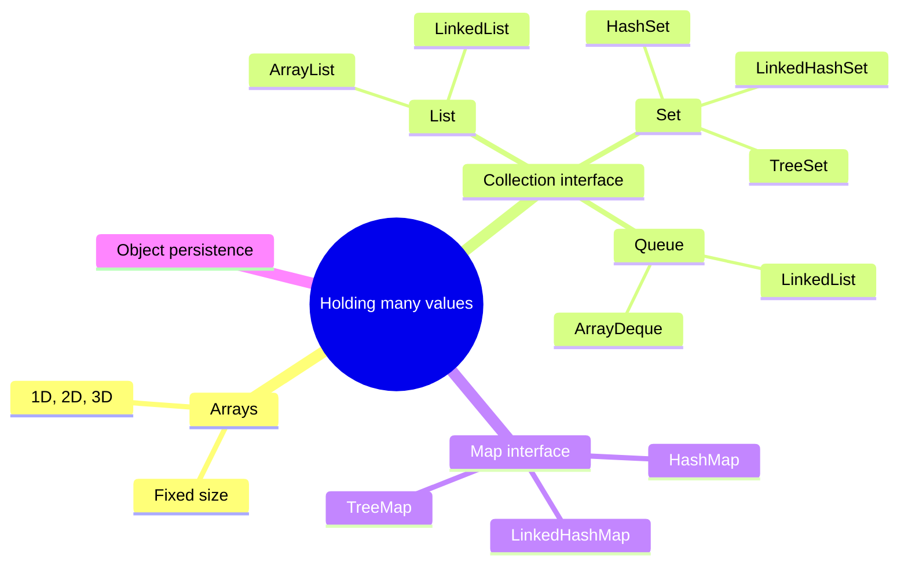
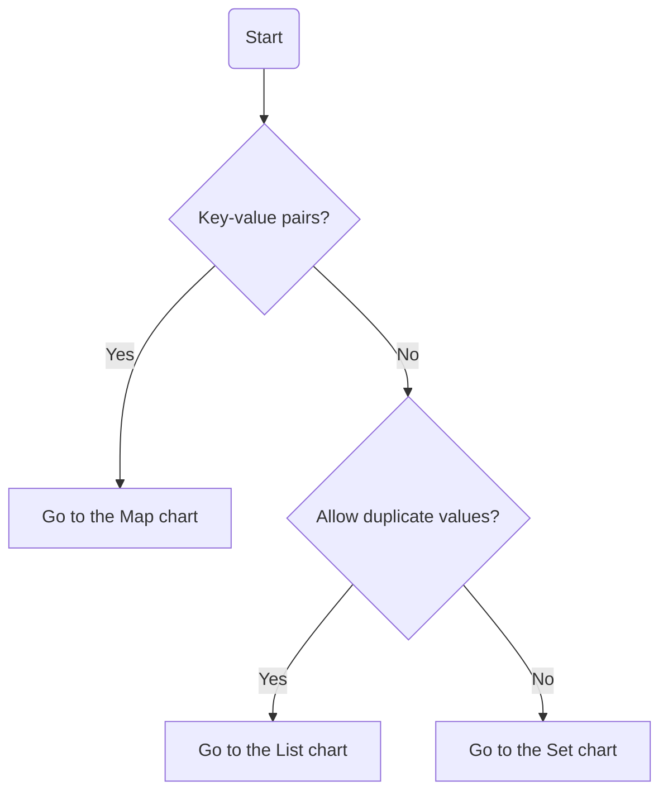
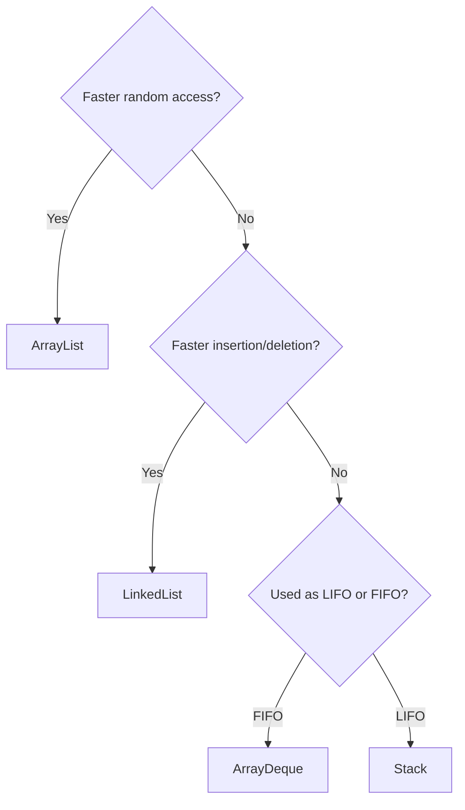
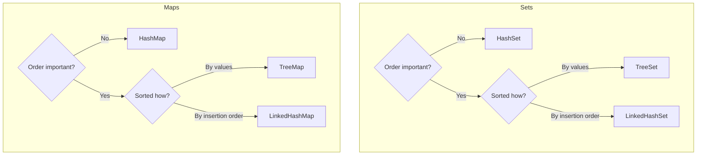
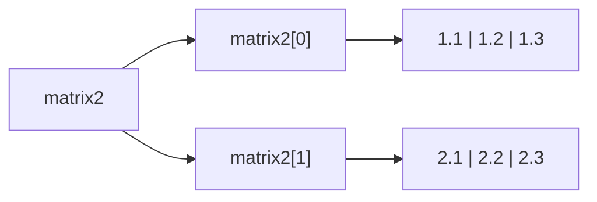
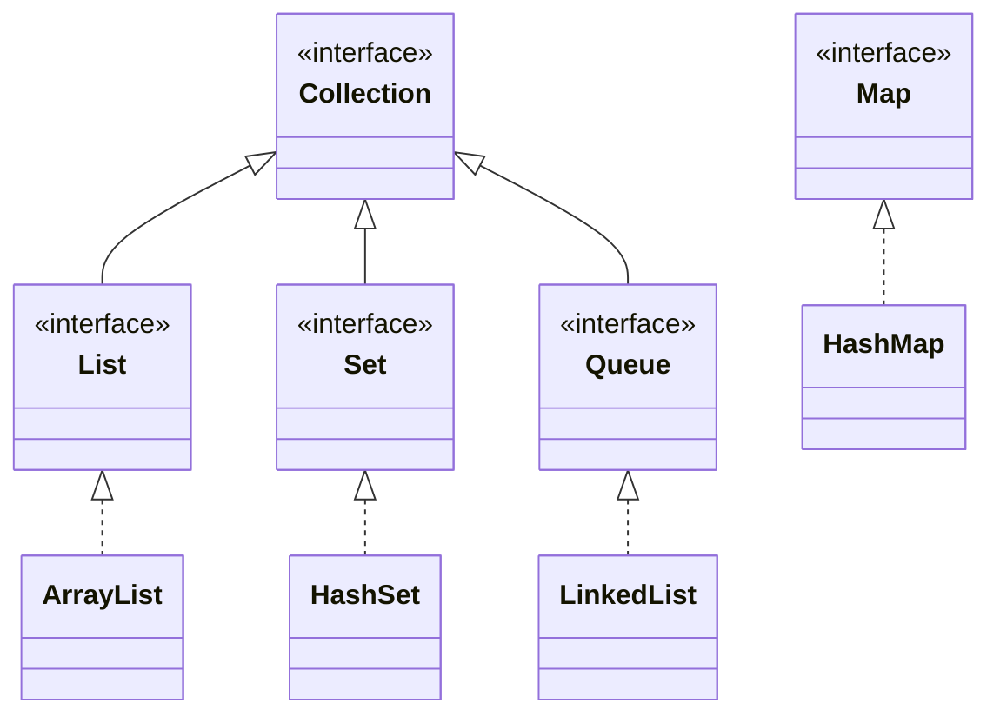
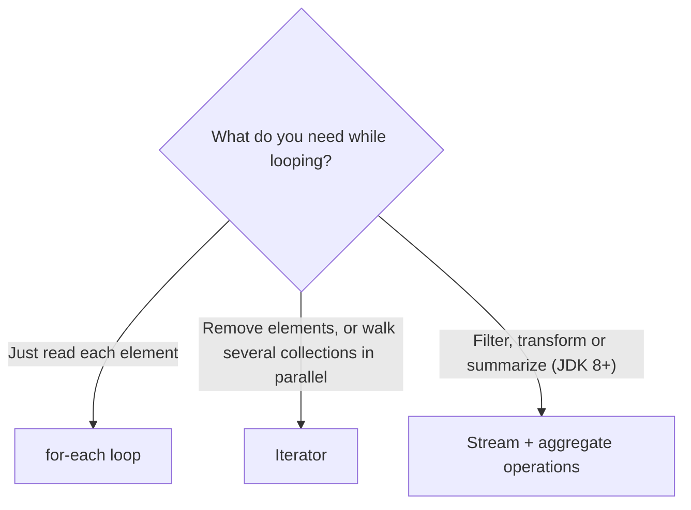
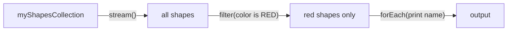

# Data Structures (Collections)

> [!note] Where this lecture fits
> Lecture 03.2 covers the ways Java lets you hold *many* values at once: plain **arrays**, and the classes of the **[[Java Collections Framework]]** (lists, sets, queues and maps). It ends with a short pointer to **object persistence**. The example code lives in the class repo: https://github.com/fcarella/csd214_class_repo_s26.git (files under `csd214.collection` and the `lecture5` package).



---

## Which one should I use?

The lecture opens with a decision chart for picking a collection class. You answer a few yes/no questions about your data and the chart lands on one class. It's split into three smaller diagrams here so each one stays readable.

**Step 1: what kind of data do you have?**



**Step 2a: duplicates allowed (lists, queues, stacks)**



**Step 2b: no duplicates (sets) and key-value pairs (maps)**

The set chart and the map chart ask the same two questions, so they're shown side by side.



| Your data | Order matters? | Pick |
|---|---|---|
| Key-value pairs | No | `HashMap` |
| Key-value pairs | Yes, sorted | `TreeMap` |
| Key-value pairs | Yes, insertion order | `LinkedHashMap` |
| No duplicates | No | `HashSet` |
| No duplicates | Yes, sorted | `TreeSet` |
| No duplicates | Yes, insertion order | `LinkedHashSet` |
| Duplicates OK, need fast random access | | `ArrayList` |
| Duplicates OK, need fast insert/delete | | `LinkedList` |
| Duplicates OK, first in first out | | `ArrayDeque` |
| Duplicates OK, last in first out | | `Stack` |

> [!tip] What "sorted by values" means for maps
> For `TreeMap` the chart says "by values", but a `TreeMap` keeps its entries sorted by **key**. For `TreeSet` the elements *are* the values, so "by values" fits there.

> [!tip] Reading the chart
> *Random access* means jumping straight to item number 500 without walking past the first 499. *LIFO* (last in, first out) is a stack of plates. *FIFO* (first in, first out) is a line at a coffee shop.

---

## Arrays

In Java, an **[[Arrays|array]]** is an object. It holds a fixed number of values that all have the **same type**: you can't put `int`s, `double`s and `float`s in one array.

When you create an array, Java fills every slot with the **default value** for its type:

| Element type | Default value |
|---|---|
| `boolean` | `false` |
| any numeric primitive (`int`, `double`, ...) | `0` |
| any reference type (`String`, `Person`, ...) | `null` |

The three things you'll do all the time:

| Task | Syntax |
|---|---|
| Read an item | `variable[i]` (where `i` is the index) |
| Set an item | `variable[i] = data` |
| Get the length | `variable.length` (no parentheses) |

### General syntax

```java
DataType[] variable = new DataType[ArraySize];
```

```java
int SIZE_OF_ARRAY = 10;

// declare an array of int's
int[] integerArray = new int[SIZE_OF_ARRAY];

// declare and initialize an array of int's
int[] integerArray2 = {1, 2, 3, 4};

// get the length of an array
int size = integerArray2.length;   // 4
```

> [!warning] Arrays hold references too
> The slide says arrays store "primitive data of the same type", but the same lecture creates `String names[] = new String[2];`. Arrays can hold objects as well. An **object array** stores *references* to the objects, which is why its slots start out as `null`.

### Filling and reading arrays (from `csd214.collection.Arrays.java`)

```java
// put values into an array
for (int i = 0; i < SIZE_OF_ARRAY; i++) {
    integerArray[i] = i;
}

// get values from an array
for (int i = 0; i < SIZE_OF_ARRAY; i++) {
    System.out.println("integerArray[" + i + "]=" + integerArray[i]);
}

// create an object array. It stores references to Strings
String names[] = new String[2];

// put values in an object array
for (int i = 0; i < names.length; i++) {
    names[i] = new String("firstname of person " + i + " lastname of person " + i);
}

// use for-each to access elements of an object array
for (String name : names) {
    System.out.println(name);
}
```

Both `int[] a` and `int a[]` are legal in Java. The lecture uses both styles.

> [!tip] Loop to `.length`, not to a hard-coded number
> The first two loops use `SIZE_OF_ARRAY`, which only works because it matches the array's size. Looping to `names.length` (as the later loops do) is safer: if the array size changes, the loop still fits.

### Two-dimensional arrays

A 2D array is an **array of arrays**. Think of a table with rows and columns.

```java
int ROWS = 2;
int COLUMNS = 3;
double matrix[][] = new double[ROWS][COLUMNS];

double matrix2[][] = {
    {1.1, 1.2, 1.3},
    {2.1, 2.2, 2.3}
};

int numRows = matrix2.length;      // 2: how many rows (inner arrays)
int numCols = matrix2[0].length;   // 3: length of the first row
for (int row = 0; row < numRows; row++) {
    for (int col = 0; col < numCols; col++) {
        System.out.print(matrix2[row][col] + " ");
    }
    System.out.println();
}
```

Output:

```
1.1 1.2 1.3 
2.1 2.2 2.3 
```



### Three-dimensional arrays and beyond

A 3D array is a **stack of 2D arrays**. A 4D array is a stack of 3D arrays, and so on.

```java
double matrix3[][][] = {
    // the first 2D array: matrix3[0][][]
    {
        {1.11, 1.21, 1.31, 1.41},
        {2.11, 2.21, 2.31, 2.41}
    },
    // the second 2D array: matrix3[1][][]
    {
        {1.12, 1.22, 1.32, 1.42},
        {2.12, 2.22, 2.32, 2.42}
    }
};

int num2dArrays       = matrix3.length;        // 2
int numRowsIn2dArray  = matrix3[0].length;     // 2
int numColsIn2dArray  = matrix3[0][0].length;  // 4

for (int numArrays = 0; numArrays < num2dArrays; numArrays++)
    for (int row = 0; row < numRowsIn2dArray; row++) {
        for (int col = 0; col < numColsIn2dArray; col++) {
            System.out.print(matrix3[numArrays][row][col] + " ");
        }
        System.out.println();
    }
```

> [!important] Getting each dimension's size
> Each extra `[0]` goes one level deeper: `matrix3.length` counts the 2D arrays, `matrix3[0].length` counts rows in the first one, and `matrix3[0][0].length` counts columns in its first row.

Reference: [Oracle tutorial: Arrays](https://docs.oracle.com/javase/tutorial/java/nutsandbolts/arrays.html)

---

## Collections

A **[[Collections|collection]]** is a container object that holds other objects. You use collections to store, retrieve, manipulate and pass around groups of data (the slides call this *aggregate data*). Unlike arrays, most collections grow and shrink as you add and remove items.

The Java JDK has two top-level interfaces:

- `java.util.Collection`: for **collecting** Java objects.
- `java.util.Map`: for **mapping** key/value pairs.

Their implementations are **not interchangeable**. A `HashMap` is not a `Collection`, and an `ArrayList` is not a `Map`.



The diagram shows the most commonly used implementation of each core interface, as listed in the lecture:

| Interface | Most common implementation |
|---|---|
| `Set` | `HashSet` |
| `List` | `ArrayList` |
| `Map` | `HashMap` |
| `Queue` | `LinkedList` |

### Creating a collection

`Collection<String> c` is a collection of Strings. The actual object could be a `List`, a `Set` or another kind of `Collection`. To build a list from an existing array:

```java
String[] c = {"Joe", "Jim", "Jack", "Jill", "Joe", "Kayleigh"};

List<String> listOfStrings = new ArrayList<String>(Arrays.asList(c));

// JDK 7 or later: the diamond operator <> lets Java infer the type
List<String> list = new ArrayList<>(Arrays.asList(c));
```

The `<String>` part is a **[[Generics|generic]]** type argument. It tells Java the collection only holds `String`s.

### What you can do with any Collection

The `Collection` interface is the most basic one. It gives every collection the same basic operations: adding elements, removing elements, getting the number of elements, and listing (iterating through) the contents.

| Group | Methods |
|---|---|
| Basic operations | `int size()`, `boolean isEmpty()`, `boolean contains(Object element)`, `boolean add(E element)`, `boolean remove(Object element)`, `Iterator<E> iterator()` |
| Whole-collection (bulk) operations | `boolean containsAll(Collection<?> c)`, `boolean addAll(Collection<? extends E> c)`, `boolean removeAll(Collection<?> c)`, `boolean retainAll(Collection<?> c)`, `void clear()` |
| Array operations | `Object[] toArray()`, `<T> T[] toArray(T[] a)` |

`E` stands for the element type, such as `String` in `Collection<String>`. `retainAll` keeps only the elements that are also in the other collection and removes the rest.

> [!example] A first collection program (from Wikibooks)
> ```java
> import java.util.Collection;   // Interface
> import java.util.ArrayList;    // Implementation
>
> public class CollectionProgram {
>     public static void main(String[] args) {
>         Collection myCollection = new ArrayList();
>         myCollection.add("1");
>         myCollection.add("2");
>         myCollection.add("3");
>         System.out.println("The collection contains " + myCollection.size() + " item(s).");
>
>         myCollection.clear();
>         if (myCollection.isEmpty()) {
>             System.out.println("The collection is empty.");
>         } else {
>             System.out.println("The collection is not empty.");
>         }
>     }
> }
> ```
> Output:
> ```
> The collection contains 3 item(s).
> The collection is empty.
> ```
> The variable's type is the interface (`Collection`) and the object is an implementation (`ArrayList`). This is [[Programming to an Interface|programming to an interface]]: you could swap `ArrayList` for `HashSet` and the rest of the code would still compile.

> [!warning] Raw types
> This example writes `Collection` and `ArrayList` with no `<String>`. That's called a **raw type**. It compiles (with warnings), but Java can't check what goes in. Write `Collection<String> myCollection = new ArrayList<>();` in your own code. The [[#Lists|Lists]] section below explains why.

References: [Oracle: Collections tutorial](http://docs.oracle.com/javase/tutorial/collections/index.html), [Oracle: Implementations](http://docs.oracle.com/javase/tutorial/collections/implementations/index.html), [Wikibooks: Java Collection Classes](http://en.wikibooks.org/wiki/Java_Programming/Collection_Classes)

---

## Traversing collections

*Traversing* means visiting each element one by one. The lecture shows three ways (see `csd214.collection.TraverseCollection.java`).



### 1. The for-each construct

The for-each loop walks through a collection or an array. This prints each element on its own line:

```java
for (Object o : collection)
    System.out.println(o);
```

Read the `:` as "in": *for each object `o` in `collection`*.

### 2. Iterators

An **[[Iterator]]** is an object that lets you move through a collection and **remove elements selectively** as you go.

```java
public interface Iterator<E> {
    boolean hasNext();
    E next();
    void remove(); // optional
}
```

| Method | What it does |
|---|---|
| `hasNext()` | Returns `true` if there are more elements. |
| `next()` | Returns the next element. |
| `remove()` | Removes the last element that `next()` returned from the underlying collection. |

Rules for `remove()`:

- You may call it **only once per call to `next()`**. Breaking this rule throws an exception.
- `Iterator.remove` is the **only safe way** to change a collection while you're iterating over it. If the collection is changed in any other way during the loop, the behaviour is unspecified.

Use an Iterator instead of for-each when you need to:

- **remove the current element.** The for-each loop hides its iterator, so you can't call `remove()`. That makes for-each unusable for filtering.
- **iterate over several collections in parallel.**

```java
// Remove every name that starts with "J"
Iterator<String> it = list.iterator();
while (it.hasNext()) {
    String name = it.next();
    if (name.startsWith("J")) {
        it.remove();   // safe: removes the element next() just returned
    }
}
```

> [!warning] Don't remove inside a for-each
> ```java
> for (String name : list) {
>     if (name.startsWith("J")) list.remove(name);   // modifies the list mid-loop
> }
> ```
> This changes the collection behind the hidden iterator's back. With an `ArrayList` it usually throws a `ConcurrentModificationException`. Use `Iterator.remove()` instead.

### 3. Aggregate operations (streams)

In JDK 8 and later, the preferred way to iterate is to get a **[[Streams|stream]]** from the collection and run **aggregate operations** on it. These are usually combined with **[[Lambda Expressions|lambda expressions]]** (`e -> ...`), which makes the code more expressive and shorter.

This walks a collection of shapes in order and prints the names of the red ones:

```java
myShapesCollection.stream()
    .filter(e -> e.getColor() == Color.RED)
    .forEach(e -> System.out.println(e.getName()));
```

Read it as a pipeline: take the shapes, keep only the red ones, print each name.



If the collection is large and your computer has enough cores, you can ask for a **parallel stream**, which splits the work across cores:

```java
myShapesCollection.parallelStream()
    .filter(e -> e.getColor() == Color.RED)
    .forEach(e -> System.out.println(e.getName()));
```

There are many ways to **collect** data with this API. Two examples from the lecture:

```java
// Convert each element to a String, then join them with commas
String joined = elements.stream()
    .map(Object::toString)
    .collect(Collectors.joining(", "));

// Sum the salaries of all employees
int total = employees.stream()
    .collect(Collectors.summingInt(Employee::getSalary));
```

`Object::toString` and `Employee::getSalary` are **method references**, a short way of writing `e -> e.toString()` and `e -> e.getSalary()`.

### Bulk operations vs. aggregate operations

The names sound alike, so don't mix them up.
	
| | Bulk operations | Aggregate operations |
|---|---|---|
| Examples | `containsAll`, `addAll`, `removeAll` | `filter`, `map`, `forEach`, `collect` on a stream |
| Since | Always part of the Collections API | JDK 8 |
| Modify the collection? | **Yes**, they are *mutative* | **No**, the underlying collection is left unchanged |

> [!important] Avoid mutation in lambdas
> Because aggregate operations don't change the collection, your lambdas shouldn't either. If code inside a lambda modifies shared data, it can break later when someone switches the stream to `parallelStream()`.

### The presidents example

```java
public class Person {
    public enum Sex {
        MALE, FEMALE
    }

    private String name;
    private LocalDate birthday;
    private Sex gender;
    private String emailAddress;

    public Person(String name, LocalDate birthday, Sex gender, String emailAddress) {
        this.name = name;
        this.birthday = birthday;
        this.gender = gender;
        this.emailAddress = emailAddress;
    }
    // ... getters such as getName()
}
```

```java
System.out.println("-// traverse method 3 - with aggregate methods------");

Person[] pres = {
    new Person("George W Bush", LocalDate.of(1946, Month.JULY, 6), Person.Sex.MALE, "newsadmin@whitehouse.gov"),
    new Person("Barack Obama",  LocalDate.of(1961, Month.AUGUST, 4), Person.Sex.MALE, "newsadmin@whitehouse.gov"),
    new Person("Donald Trump",  LocalDate.of(1946, Month.JUNE, 14), Person.Sex.MALE, "newsadmin@whitehouse.gov"),
    new Person("Joe Biden",     LocalDate.of(1942, Month.NOVEMBER, 20), Person.Sex.MALE, "newsadmin@whitehouse.gov")
};

List<Person> presidents = java.util.Arrays.asList(pres);

// traverse using aggregate operation forEach
presidents.stream().forEach(e -> System.out.println(e.getName()));
```

Output:

```
George W Bush
Barack Obama
Donald Trump
Joe Biden
```

> [!warning] `Arrays.asList` gives a fixed-size list
> The list returned by `Arrays.asList(pres)` is backed by the array, so calling `presidents.add(...)` or `presidents.remove(...)` throws `UnsupportedOperationException`. That's why the earlier example wraps it: `new ArrayList<>(Arrays.asList(c))` gives a normal list you can grow.

The slides then move to an in-class exercise using the Collections code in the `lecture5` package.

Reference: [Oracle: Aggregate Operations](https://docs.oracle.com/javase/tutorial/collections/streams/index.html)

---

## Sets

A **[[Set]]** is a `Collection` that **cannot contain duplicate elements**. If you add something that's already there, `add` returns `false` and nothing changes.

```java
import java.util.*;

public class FindDups {
    public static void main(String[] args) {
        String[] names = {"Joe", "George", "Michael", "James",   // some names
                          "Joe", "George", "Michael", "James"};  // repeat the names
        Set<String> s = new HashSet<String>();
        for (String a : names) {
            s.add(a);
        }
        // Although 8 names were added to the set, 4 were duplicates, so only 4 are printed
        System.out.println(s.size() + " distinct words: " + s);
    }
}
```

Output:

```
4 distinct words: [Joe, George, James, Michael]
```

> [!warning] HashSet doesn't keep your order
> The names went in as Joe, George, Michael, James, but came out as Joe, George, James, Michael. A `HashSet` makes no promise about order. If order matters, the decision chart says to use `LinkedHashSet` (insertion order) or `TreeSet` (sorted).

---

## Lists

A **[[List]]** is an **ordered** `Collection`, and it **may contain duplicates**. On top of what it inherits from `Collection`, the `List` interface adds:

| Operation type | What it means |
|---|---|
| Positional access | Work with elements by their numerical position (index) in the list. |
| Search | Look for an object and get back its position. |
| Iteration | Extends `Iterator` to use the list's sequential nature. |
| Range-view | Perform operations on a range (a slice) of the list. |

```java
List<String> l = new ArrayList<>(List.of("a", "b", "c", "b"));
l.get(1);          // positional access: "b"
l.set(0, "z");     // positional access: list is now [z, b, c, b]
l.indexOf("b");    // search: 1
l.subList(1, 3);   // range-view: [b, c]
```

### Why generics matter

Without generics, objects put into a collection are **upcast to `Object`**. That causes problems:

- You need to **cast** the reference back when you take an element out.
- You need to **know the type** of the object when you take it out.
- If the collection mixes different types, it's hard to find out at run time what type each element is.

Generics fix this by fixing the element type at compile time:

```java
// use generics: namesList can ONLY contain Strings
List<String> namesList = new ArrayList<String>();
namesList.add("Noel Hall");
namesList.add("Gilles Larock");
namesList.add("Gilles Larock");   // no error: lists allow duplicates

// traverse the list
for (String ss : namesList)
    System.out.println(ss);
```

> [!example] With and without generics
> ```java
> List raw = new ArrayList();          // raw type: holds Objects
> raw.add("hello");
> raw.add(42);                         // compiles, nothing stops it
> String s = (String) raw.get(1);      // ClassCastException at run time
>
> List<String> safe = new ArrayList<>();
> safe.add("hello");
> safe.add(42);                        // compile error: caught early
> String t = safe.get(0);              // no cast needed
> ```

---

## The Queue interface

A **[[Queue]]** is a collection for holding elements **before they are processed**. On top of the basic `Collection` operations, it adds its own insertion, removal and inspection methods:

```java
public interface Queue<E> extends Collection<E> {
    E element();
    boolean offer(E e);
    E peek();
    E poll();
    E remove();
}
```

Queues usually (but not always) order elements **FIFO**: first in, first out.

| Purpose | Throws an exception if it fails | Returns a special value if it fails |
|---|---|---|
| Insert at the tail | `add(e)` | `offer(e)` returns `false` |
| Remove the head | `remove()` | `poll()` returns `null` |
| Look at the head without removing | `element()` | `peek()` returns `null` |

```java
Queue<String> line = new LinkedList<>();
line.offer("Ana");
line.offer("Ben");
line.peek();   // "Ana" (still in the queue)
line.poll();   // "Ana" (removed)
line.poll();   // "Ben"
line.poll();   // null: queue is empty
```

Reference: [Oracle: The Queue Interface](https://docs.oracle.com/javase/tutorial/collections/interfaces/queue.html)

---

## The Map interface

A **[[Map]]** is an object that maps **keys to values**, like a dictionary that maps a word to its definition. A map **cannot contain duplicate keys**: each key maps to at most one value. (Two different keys *can* have the same value.)

| Group | Methods |
|---|---|
| Basic operations | `put`, `get`, `remove`, `containsKey`, `containsValue`, `size`, `isEmpty` |
| Bulk operations | `putAll`, `clear` |
| Collection views | `keySet`, `entrySet`, `values` |

The slide lists the last basic operation as "empty". The actual method is `isEmpty()`.

Java has three general-purpose `Map` implementations: **`HashMap`**, **`TreeMap`** and **`LinkedHashMap`**. Use the decision chart at the top to pick one.

```java
Map<String, Integer> grades = new HashMap<>();
grades.put("Ana", 85);
grades.put("Ben", 72);
grades.put("Ana", 90);              // same key: replaces 85 with 90

grades.get("Ana");                  // 90
grades.containsKey("Ben");          // true
grades.containsValue(72);           // true
grades.size();                      // 2

// Collection views
for (String name : grades.keySet())          System.out.println(name);
for (Integer g : grades.values())            System.out.println(g);
for (Map.Entry<String, Integer> e : grades.entrySet())
    System.out.println(e.getKey() + " -> " + e.getValue());
```

> [!tip] Collection views
> A map isn't a `Collection`, so you can't for-each over it directly. The three views turn it into something you can loop over: `keySet()` gives the keys (a `Set`, since keys are unique), `values()` gives the values (a `Collection`, since values can repeat), and `entrySet()` gives each key-value pair.

Reference: [Oracle: The Map Interface](https://docs.oracle.com/javase/tutorial/collections/interfaces/map.html)

---

## Object persistence

The last slide only points to code: `lecture5.ArrayListObjectPersistence` in the class repo, plus an external tutorial on object persistence. **[[Object Persistence]]** means saving objects (for example, an `ArrayList` of them) somewhere outside the running program, such as a file, so they can be loaded again the next time the program runs. Check the repo code for the exact technique used in class.

---

## Exercises

### Exercise 1 (Direct application)
What does this print?
```java
double[] prices = new double[3];
String[] labels = new String[2];
boolean[] flags = new boolean[1];
prices[1] = 4.5;
System.out.println(prices[0] + " " + prices[1] + " " + labels[1] + " " + flags[0] + " " + prices.length);
```

> [!success]- Answer key
> `0.0 4.5 null false 3`
>
> A new array fills every slot with its type's default: `0.0` for `double`, `null` for reference types like `String`, `false` for `boolean`. Only `prices[1]` was set. `prices.length` is the array's size, 3 (a field, so no parentheses).

### Exercise 2 (Direct application)
Use the lecture's decision chart to pick a class for each case:
(a) Store student IDs and make sure none is entered twice. Order doesn't matter.
(b) Store a word-to-definition dictionary that prints in alphabetical order.
(c) Store the steps of an "undo" feature, where the most recent action is undone first.
(d) Store a list of song titles (repeats allowed) where you often jump to song number *n*.

> [!success]- Answer key
> (a) **`HashSet`**: no key-value pairs, no duplicates, order not important.
>
> (b) **`TreeMap`**: key-value pairs (word to definition), order matters, sorted. A `TreeMap` sorts by key, which here is the word.
>
> (c) **`Stack`**: duplicates are fine (you can do the same action twice), and "most recent first" is LIFO.
>
> (d) **`ArrayList`**: duplicates allowed and you need fast random access.

### Exercise 3 (Direct application)
Given `int[][] grid = new int[4][7];`, write expressions for (a) the number of rows, (b) the number of columns, and (c) the bottom-right element. Then write nested loops that set every element to `row * col`.

> [!success]- Answer key
> (a) `grid.length` gives 4. (b) `grid[0].length` gives 7. (c) `grid[3][6]`, because indexes run from 0 to length minus 1.
> ```java
> for (int row = 0; row < grid.length; row++) {
>     for (int col = 0; col < grid[0].length; col++) {
>         grid[row][col] = row * col;
>     }
> }
> ```
> A 2D array is an array of arrays, so the outer `.length` counts rows and `grid[0].length` counts the entries in one row, just like `numRows` and `numCols` in the lecture's `matrix2` example.

### Exercise 4 (Applied variation)
Predict the output:
```java
List<String> list = new ArrayList<>(Arrays.asList("Joe", "Jim", "Joe", "Jill"));
Set<String> set = new HashSet<>(list);
Map<String, Integer> map = new HashMap<>();
for (String n : list) map.put(n, n.length());
System.out.println(list.size() + " " + set.size() + " " + map.size());
```

> [!success]- Answer key
> `4 3 3`
>
> The **list** keeps all four entries, since lists allow duplicates. The **set** drops the second "Joe", leaving 3. The **map** uses each name as a key; the second `put("Joe", 3)` replaces the first entry instead of adding a new one, because a map can't have duplicate keys. So it also has 3 entries.

### Exercise 5 (Applied variation)
Write a method `removeShort(List<String> words, int min)` that removes every word shorter than `min` characters from the list, **while looping over it**. Explain why a for-each loop is the wrong tool.

> [!success]- Answer key
> ```java
> public static void removeShort(List<String> words, int min) {
>     Iterator<String> it = words.iterator();
>     while (it.hasNext()) {
>         if (it.next().length() < min) {
>             it.remove();
>         }
>     }
> }
> ```
> The lecture says `Iterator.remove` is the only safe way to change a collection during iteration. A for-each loop hides its iterator, so you'd have to call `words.remove(...)`, which changes the list behind the iterator's back (unspecified behaviour; for an `ArrayList`, usually a `ConcurrentModificationException`). Each `it.remove()` here follows exactly one `it.next()`, which respects the "once per call to next" rule.

### Exercise 6 (Applied variation)
Using the lecture's `Person` class and the `presidents` list, write stream pipelines that:
(a) print the names of presidents born before 1950;
(b) produce one String with all the names separated by `" | "`.
Then say whether either pipeline changes `presidents`.

> [!success]- Answer key
> ```java
> // (a)
> presidents.stream()
>     .filter(p -> p.getBirthday().getYear() < 1950)
>     .forEach(p -> System.out.println(p.getName()));
>
> // (b)
> String all = presidents.stream()
>     .map(Person::getName)
>     .collect(Collectors.joining(" | "));
> ```
> (a) prints George W Bush, Donald Trump and Joe Biden. (b) gives `"George W Bush | Barack Obama | Donald Trump | Joe Biden"`. (This assumes `Person` has a `getBirthday()` getter, hidden behind the `.......` on the slide.)
>
> Neither pipeline changes `presidents`. Aggregate operations don't modify the underlying collection, unlike bulk operations such as `removeAll`. The pattern is the same as the lecture's `filter`/`forEach` shapes example and the `Collectors.joining` example.

### Exercise 7 (Challenge)
You're writing a word-frequency counter. Given a `String[] words`, build a structure that stores how many times each word appears, and prints the words **in the order they first appeared** with their counts. Pick the class with the decision chart, justify it, and write the code.

> [!success]- Answer key
> Word to count is a key-value pair, order matters, and the order is *insertion order*, so the chart lands on **`LinkedHashMap`**.
> ```java
> Map<String, Integer> counts = new LinkedHashMap<>();
> for (String w : words) {
>     if (counts.containsKey(w)) {
>         counts.put(w, counts.get(w) + 1);
>     } else {
>         counts.put(w, 1);
>     }
> }
> for (Map.Entry<String, Integer> e : counts.entrySet()) {
>     System.out.println(e.getKey() + ": " + e.getValue());
> }
> ```
> This uses three map ideas from the lecture: `containsKey`/`get`/`put` as basic operations, the fact that `put` on an existing key replaces the value (no duplicate keys), and the `entrySet()` collection view for looping. A `HashMap` would count correctly but could print in any order; a `TreeMap` would print alphabetically.

### Exercise 8 (Challenge)
A teammate writes this to process a print queue:
```java
List<String> jobs = new ArrayList<>();
jobs.add("report.pdf");
jobs.add("photo.png");
String next = jobs.get(0);
jobs.remove(0);
```
Rewrite it with the lecture's `Queue` interface, and explain what goes wrong in each version when the queue is empty and you try to get the next job.

> [!success]- Answer key
> ```java
> Queue<String> jobs = new LinkedList<>();
> jobs.offer("report.pdf");
> jobs.offer("photo.png");
> String next = jobs.poll();   // removes and returns the head: "report.pdf"
> ```
> A queue is the collection made for "holding elements prior to processing", and it's FIFO, so the first job added is the first one printed. `LinkedList` is the lecture's most common `Queue` implementation.
>
> On an empty queue, `poll()` returns `null` (and `peek()` also returns `null`), so you can check for it. The list version calls `jobs.get(0)` on an empty list, which throws `IndexOutOfBoundsException`. If you want an exception from a queue instead, use `remove()` or `element()`.

---

## Feynman practice

Write each answer in your own words before checking the notes.

### Feynman: arrays vs. collections

- [ ] **1. Explain it to a 12-year-old.** An egg carton and a backpack both hold things. Which one is like an array and which is like an `ArrayList`? What can the backpack do that the carton can't?
- [ ] **2. Find your gaps.** Reread your answer and ==highlight== any word a 12-year-old wouldn't know ("index", "default value", "reference", "fixed size").
- [ ] **3. Go back and simplify.** Why does a new `String[3]` start full of `null` while a new `int[3]` starts full of `0`? Explain with your analogy.
- [ ] **4. Organize and test.** In 3-5 sentences, explain what a 2D array is and why `matrix[0].length` gives the number of columns.

### Feynman: List, Set, Queue and Map

- [ ] **1. Explain it to a 12-year-old.** Using a school (class roster, attendance, cafeteria line, locker numbers), give one example each of a list, a set, a queue and a map. What makes each one different?
- [ ] **2. Find your gaps.** ==Highlight== "duplicate", "ordered", "FIFO", "key", "value".
- [ ] **3. Go back and simplify.** Why does `FindDups` print only 4 names when 8 were added? Why did they come out in a different order?
- [ ] **4. Organize and test.** Without looking, redraw the decision chart from "Key-value pairs?" down to all ten classes. Which questions did you forget?

### Feynman: three ways to traverse

- [ ] **1. Explain it to a 12-year-old.** You're checking every apple in a basket. When is just looking at each one enough (for-each)? When do you need to throw bad ones out as you go (Iterator)? When would you describe the result instead ("give me the red ones") and let someone else do the walking (streams)?
- [ ] **2. Find your gaps.** ==Highlight== "iterator", "hasNext", "stream", "lambda", "filter".
- [ ] **3. Go back and simplify.** Why can't a for-each loop remove elements? What happens if you try anyway?
- [ ] **4. Organize and test.** In 3-5 sentences, explain when you'd pick each of the three ways.

### Feynman: bulk vs. aggregate operations

- [ ] **1. Explain it to a 12-year-old.** Editing a document vs. taking a photo of it and drawing on the photo: which is like `removeAll`, and which is like `stream().filter(...)`?
- [ ] **2. Find your gaps.** ==Highlight== "mutative", "underlying collection", "parallel stream".
- [ ] **3. Go back and simplify.** Why does the lecture warn against changing data inside a lambda? Use the idea of several people writing on the same page at once.
- [ ] **4. Organize and test.** In 3-5 sentences, explain the difference between `addAll` and a stream that `collect`s results.

### Feynman: generics

- [ ] **1. Explain it to a 12-year-old.** A box labelled "anything" vs. a box labelled "only books": which is easier to unpack, and why?
- [ ] **2. Find your gaps.** ==Highlight== "upcast", "cast", "run time", "compile time".
- [ ] **3. Go back and simplify.** What goes wrong when you take an element out of a raw `List` and guess its type wrong? When does Java catch the mistake with `List<String>`?
- [ ] **4. Organize and test.** In 3-5 sentences, explain why `List<String> namesList = new ArrayList<>();` is better than `List namesList = new ArrayList();`.

---

## Flashcards

An Anki import file for this lecture is at `Flashcards/data-structures-collections-flashcards.txt` (tab-separated, tags in column 3). In Anki: **File > Import**, select the file, and check the field mapping.

---

## Tags

#computer_science #programming #java #data_structures #arrays #collections #java_collections_framework #list #set #queue #map #hashmap #iterator #streams #lambda #generics #object_persistence #csd214 #study_notes
