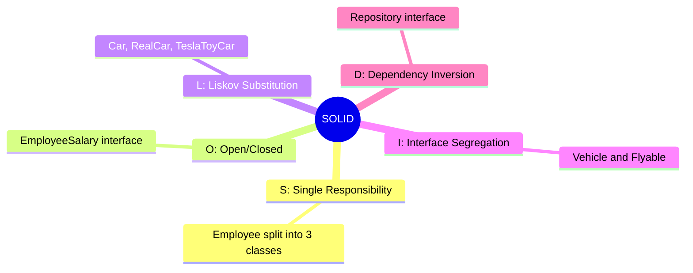
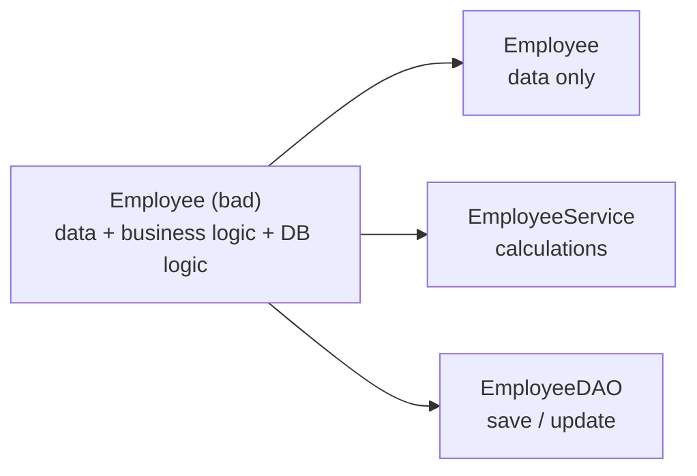
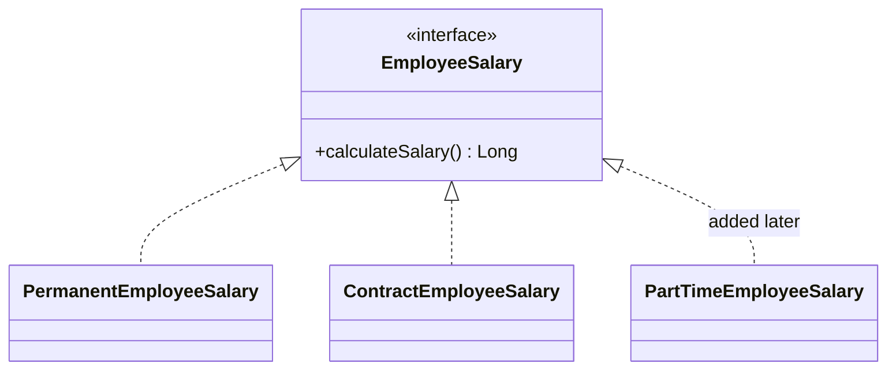
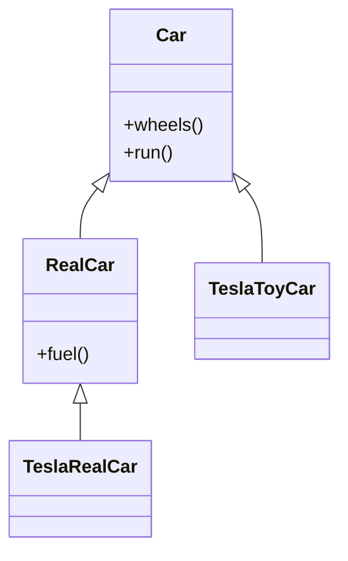
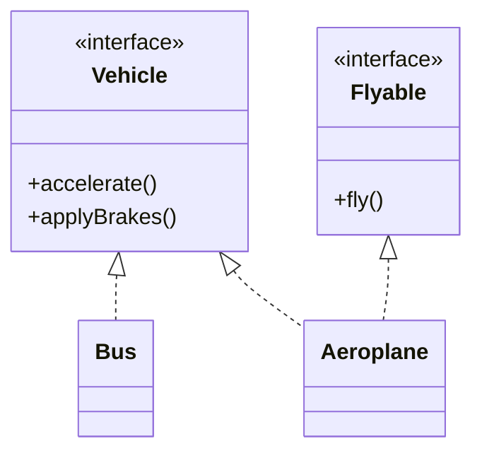
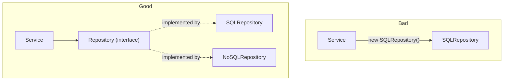
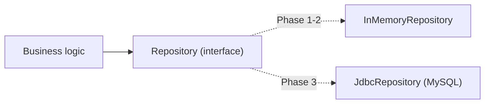
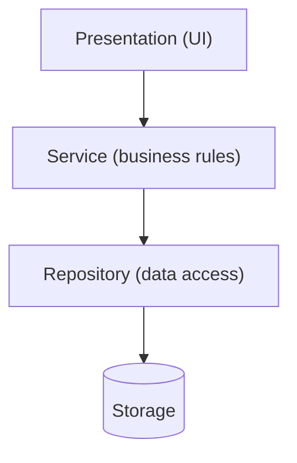
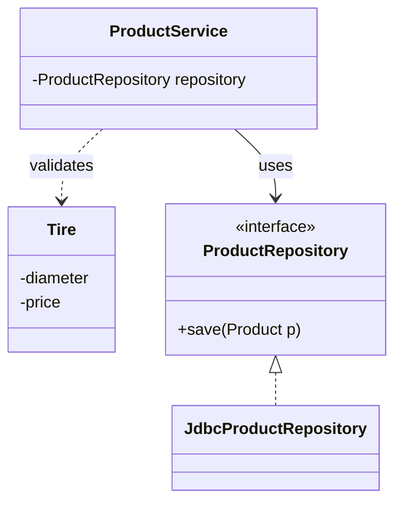

# SOLID Principles

> [!note] Where this lecture fits
> Lecture 03.3 covers the five **[[SOLID Principles]]**, a set of rules for designing classes so they are easier to change and maintain. Each principle comes with a "bad implementation" and a "good implementation" in Java. The examples are based on a Twitter/X thread by @vikasrajputin, and the class code is in the repo: https://github.com/fcarella/csd214_class_repo_s26.git (package `ca.saultcollege.csd214.solid_lecture`). The lecture ends by connecting SOLID to the upcoming labs (repositories, services and Spring Boot).

SOLID is an acronym. Each letter is one principle:

| Letter | Principle | One-line idea |
|---|---|---|
| **S** | [[Single Responsibility Principle]] (SRP) | A class should have only one reason to change. |
| **O** | [[Open-Closed Principle]] (OCP) | Open for extension, closed for modification. |
| **L** | [[Liskov Substitution Principle]] (LSP) | A child class must be usable wherever its parent is expected. |
| **I** | [[Interface Segregation Principle]] (ISP) | Don't force classes to implement methods they don't use. |
| **D** | [[Dependency Inversion Principle]] (DIP) | Depend on abstractions, not on concrete classes. |



> [!tip] A pattern you'll see five times
> Every principle in this lecture has the same shape: a class that works today but is painful to change, then a refactor that splits or abstracts something so the next change is cheap. While reading, ask yourself: *"What future change would hurt in the bad version?"*

---

## S: Single Responsibility Principle

> [!note] Definition
> A class should always have **one responsibility**, and there should be **only one reason to change it**.

### Bad implementation

This `Employee` class does three different jobs:

1. holds **personal details** (name, date of joining, salary package),
2. runs **business logic** (salary, leaves and tax calculations),
3. runs **database logic** (save and update).

```java
public class Employee {

    private String fullname;
    private String dateOfJoining;
    private String annualSalaryPackage;

    // business logic
    public long calculateEmployeeSalary(Employee emp) {
        return 0L;
    }

    public long calculateEmployeeLeaves(Employee emp) {
        return 0L;
    }

    public long calculateTaxOnSalary(Employee emp) {
        return 0L;
    }

    // persistence logic
    public Employee saveEmployee(Employee emp) {
        return null;
    }

    public Employee updateEmployee(Employee emp) {
        return null;
    }

    // setter and getters, toString + other overrides ...
}
```

The lecture's verdict: the class is **[[Coupling|tightly coupled]]**, hard to maintain, and has **multiple reasons to be modified**. A new tax rule, a new database, or a new field for the employee would all force you to open the same file.

### Good implementation

Split the one class into several, each with its own responsibility. This makes the classes **loosely coupled**, easier to maintain, and each one has only a single reason to change.

```java
public class Employee {
    private String fullName;
    private String dateOfJoining;
    private String annualSalaryPackage;

    // standard getters and setters methods
}

public class EmployeeService {
    public long calculateEmployeeSalary(Employee emp) {...}
    public long calculateEmployeeLeaves(Employee emp) {...}
    public long calculateTaxOnSalary(Employee emp) {...}
}

public class EmployeeDAO {
    public Employee saveEmployee(Employee emp) {...}
    public Employee updateEmployee(Employee emp) {...}
}
```



| Class | Responsibility | Changes when... |
|---|---|---|
| `Employee` | Holds the data ([[POJO]]) | the employee's fields change |
| `EmployeeService` | Business rules | salary, leave or tax rules change |
| `EmployeeDAO` | Saving to the database | the database or how we store data changes |

> [!tip] What "DAO" means
> **DAO** stands for **[[Data Access Object]]**: a class whose only job is to read and write data to storage. Later in the lecture the same role is called a **[[Repository Pattern|Repository]]**.

> [!warning] "One responsibility" does not mean "one method"
> `EmployeeService` has three methods and still follows SRP, because all three are business calculations. The question is how many *reasons to change* a class has, not how many methods it has.

---

## O: Open/Closed Principle

> [!note] Definition
> A class should be **open for extension** but **closed for modification**. You should be able to add new behaviour by writing *new* code, without editing code that already works.

### Bad implementation

`EmployeeSalary` calculates the salary based on the employee's type, using an `if`/`else if` chain:

```java
public class EmployeeSalary {

    public Long calculateSalary(Employee emp) {
        Long salary = null;

        if (emp.getType().equals("PERMANENT")) {
            salary = (totalWorkingDay * basicPay) + getCompanyBenefits() + getBonus();
        } else if (emp.getType().equals("CONTRACT")) {
            salary = (totalWorkingDay * basicPay);
        }
        return salary;
    }
}
```

The issue: if a new type comes along later (for example a **part-time employee**), you have to **modify** this method and add another `else if`. Every new type means editing, re-testing and possibly breaking code that already worked.

### Good implementation

Introduce an **[[Interfaces|interface]]** `EmployeeSalary`, then create one class per employee type that implements it:

```java
public interface EmployeeSalary {
    public Long calculateSalary();
}

public class PermanentEmployeeSalary implements EmployeeSalary {
    @Override
    public Long calculateSalary() {
        return (totalWorkingDay * basicPay) + getCompanyBenefits() + getBonus();
    }
}

public class ContractEmployeeSalary implements EmployeeSalary {
    @Override
    public Long calculateSalary() {
        return (totalWorkingDay * basicPay);
    }
}
```

When a new type arrives, you create a **new child class**. The core logic does not change.

```java
// Adding part-time employees: a new class, no edits to the others
public class PartTimeEmployeeSalary implements EmployeeSalary {
    @Override
    public Long calculateSalary() { ... }
}
```



> [!warning] The slide image swaps the formulas
> In the "good" diagram on the slide, `PermanentEmployeeSalary` returns only `totalWorkingDay * basicPay` and `ContractEmployeeSalary` adds benefits and bonus. That's the opposite of the "bad" version. The code above follows the bad version's logic (permanent employees get benefits and bonus), which is what the refactor should preserve. A refactor should change the structure, not the results.

> [!important] How OCP uses polymorphism
> Code that works with an `EmployeeSalary` reference just calls `calculateSalary()`. It doesn't know or care which class is behind it. This is **[[Polymorphism]]**, and it's what lets you add types without touching the caller.

Reference: [GeeksforGeeks: SOLID Principles in Programming](https://www.geeksforgeeks.org/solid-principle-in-programming-understand-with-real-life-examples/)

---

## L: Liskov Substitution Principle

> [!note] Definition
> **Child classes should be replaceable with their parent classes without breaking the behaviour of the code.** If a method expects a `Car`, giving it any subclass of `Car` must still work.

### Bad implementation

`Car` has three methods: `fuel()`, `wheels()` and `run()`. `TeslaRealCar` supports all of them. `TeslaToyCar` also extends `Car`, but a toy can't be fuelled, so it throws an exception:

```java
public class Car {
    public void fuel() {...}
    public void wheels() {...}
    public void run() {...}
}

public class TeslaToyCar extends Car {
    @Override
    public void fuel() {
        throw new IllegalStateException("Not Supported");
    }

    @Override
    public void run() {...}

    @Override
    public void wheels() {...}
}

public class TeslaRealCar extends Car {
    @Override
    public void fuel() {...}

    @Override
    public void run() {...}

    @Override
    public void wheels() {...}
}
```

This violates LSP. Anywhere in the code that uses a `Car`, you **can't** substitute a `TeslaToyCar`, because calling `fuel()` throws an exception.

```java
void refill(Car c) {
    c.fuel();   // fine for TeslaRealCar, crashes for TeslaToyCar
}
```

The slide calls `Car` a **"poorly inherited parent class"**: it promises something (`fuel()`) that not every child can deliver.

### Good implementation

Move `fuel()` out of `Car` into a new subclass `RealCar`. Now `Car` only has the generic functions **every** type of car supports, and `RealCar` adds fuelling.

```java
public class Car {
    public void wheels() {...}
    public void run() {...}
}

public class RealCar extends Car {
    public void fuel() {...}
}

public class TeslaToyCar extends Car {
    @Override
    public void run() {...}

    @Override
    public void wheels() {...}
}

public class TeslaRealCar extends RealCar {
    @Override
    public void fuel() {...}

    @Override
    public void run() {...}

    @Override
    public void wheels() {...}
}
```



Now `TeslaToyCar` and `TeslaRealCar` can each be substituted for their own parent class: a `TeslaToyCar` works anywhere a `Car` is expected, and a `TeslaRealCar` works anywhere a `RealCar` (or `Car`) is expected.

> [!important] The test for LSP
> If a subclass has to **throw "not supported"** or leave a method doing nothing to get past the compiler, the [[Inheritance]] hierarchy is probably wrong. The summary slide puts it this way: a `ToyCar` should not inherit from a `RealCar` if it can't do real-car things like `fuel()`.

---

## I: Interface Segregation Principle

> [!note] Definition
> An interface should only have methods that apply to **all** the classes that implement it. If an interface contains a method that only some classes need, the rest are forced to write a **dummy implementation**. Move such methods into a new interface.
>
> Summary-slide version: *clients should not be forced to depend on methods they do not use.*

### Bad implementation

The `Vehicle` interface includes `fly()`, but most vehicles (a bus, a car) can't fly. They still have to implement it:

```java
public interface Vehicle {
    void accelerate();
    void applyBrakes();
    void fly();
}

public class Bus implements Vehicle {
    @Override
    public void accelerate() {...}

    @Override
    public void applyBrakes() {...}

    @Override
    public void fly() {
        // dummy implementation
    }
}

public class Aeroplane implements Vehicle {
    @Override
    public void accelerate() {...}

    @Override
    public void applyBrakes() {...}

    @Override
    public void fly() {...}
}
```

`Bus` gives a dummy `fly()` because it can't fly. `Aeroplane` implements everything because it supports every operation.

### Good implementation

Pull `fly()` out into a new `Flyable` interface. `Vehicle` now only has methods that every vehicle supports, and `Aeroplane` implements **both** interfaces.

```java
public interface Vehicle {
    void accelerate();
    void applyBrakes();
}

public interface Flyable {
    void fly();
}

public class Bus implements Vehicle {
    @Override
    public void accelerate() {...}

    @Override
    public void applyBrakes() {...}
}

public class Aeroplane implements Vehicle, Flyable {
    @Override
    public void accelerate() {...}

    @Override
    public void applyBrakes() {...}

    @Override
    public void fly() {...}
}
```



> [!tip] Why this works in Java
> A Java class can **extend only one class** but **implement many interfaces**. That's why splitting interfaces into small pieces is cheap: a class just lists every interface it needs (`implements Vehicle, Flyable`).

> [!example] LSP vs. ISP
> The two look similar, since both remove a method that doesn't fit. The difference is where the problem lives:
>
> | | LSP | ISP |
> |---|---|---|
> | Problem in | a class [[Inheritance\|inheritance]] hierarchy | an [[Interfaces\|interface]] |
> | Symptom | a child throws an exception for a parent method | a class writes an empty "dummy" method |
> | Lecture fix | new subclass `RealCar` | new interface `Flyable` |

Reference: [Oracle Java Tutorial: Interfaces](https://docs.oracle.com/javase/tutorial/java/IandI/createinterface.html)

---

## D: Dependency Inversion Principle

> [!note] Definition
> A class should depend on **abstractions** (an interface or an [[Abstract Classes|abstract class]]) instead of **concrete implementations**.
> - This keeps classes **decoupled** from each other.
> - If the implementation changes, the class that refers to it through the abstraction **doesn't have to change**.

### Bad implementation

`Service` directly creates and uses a concrete class, `SQLRepository`:

```java
class SQLRepository {
    public void save() {...}
}

class NoSQLRepository {
    public void save() {...}
}

public class Service {

    // Here we've hard-coded SQLRepository
    // in-future if we need to support NoSQLRepository
    // then we need to modify our code

    private SQLRepository repository = new SQLRepository();

    public void save() {
        repository.save();
    }
}
```

The issue: `Service` is now **tightly coupled** with `SQLRepository`. If you later need to support `NoSQLRepository`, you have to change the `Service` class.

### Good implementation

Create a parent interface `Repository`. Both SQL and NoSQL repositories implement it. `Service` only refers to the `Repository` interface and receives the actual object **through its constructor**.

```java
interface Repository {
    void save();
}

class SQLRepository implements Repository {
    @Override
    public void save() {...}
}

class NoSQLRepository implements Repository {
    @Override
    public void save() {...}
}

public class Service {
    private Repository repository;

    // Here we're using interface as reference
    // not the concrete class so our code
    // can easily support other child classes
    // of the same interface.
    // For eg: NoSQLRepository class

    public Service(Repository repository) {
        this.repository = repository;
    }

    public void save() {
        repository.save();
    }
}
```

To switch to NoSQL, you pass a different object in. `Service` itself is not touched:

```java
Service sqlService   = new Service(new SQLRepository());
Service noSqlService = new Service(new NoSQLRepository());
```



> [!important] Passing the dependency in
> Handing `Service` its `Repository` through the constructor (instead of letting `Service` call `new`) is called **[[Dependency Injection]]**. The lecture calls doing this by hand **manual dependency injection**, and it's the practical way to apply DIP.

> [!warning] Interface type, not class type
> The field must be declared as `Repository`, not `SQLRepository`. If you write `private SQLRepository repository;` and still take it in the constructor, `Service` is coupled to SQL again and a `NoSQLRepository` won't fit.

---

## Summary of the five principles

| Principle | Concept | How the course applies it |
|---|---|---|
| **SRP** | A class should have one reason to change. | Move away from "**[[God Class|God Classes]]**" (like the current `App.java`) by separating data (POJO), logic (Service) and persistence (DAO/Repository). |
| **OCP** | Open for extension, closed for modification. | Use interfaces for logic (e.g. `EmployeeSalary`) so new types such as `PartTimeEmployee` are added as new classes without changing existing calculation logic. |
| **LSP** | Subtypes must be substitutable for their base types. | Keep inheritance hierarchies logical (a `ToyCar` should not inherit from a `RealCar` if it can't do things like `fuel()`). |
| **ISP** | Clients should not be forced to depend on methods they do not use. | Split large interfaces into smaller, specific ones (separate `Flyable` from `Vehicle`). |
| **DIP** | Depend on abstractions, not concretions. | Use a `Repository` interface so the `Service` layer doesn't care whether data comes from a `List`, a `SQLDatabase` or a `NoSQLDatabase`. |

> [!tip] What's a "God Class"?
> A **God Class** is one class that does almost everything in the program: user interface, storage and business rules all in one place. It's the extreme version of an SRP violation.

---

## How SOLID helps in this course

The last part of the lecture explains why SOLID is taught now: it prepares you for the next phases and labs.

### 1. Foundation for Phase 3 (persistence)

In Phases 1 and 2 you work with **volatile memory** (data in `ArrayList`s, lost when the program stops). Phase 3 introduces **persistent storage** with **MySQL**. Without SOLID, the obvious approach is to write SQL queries directly inside `App.java` or `Tire.java`.

SRP and DIP say otherwise:

- A `Tire` object **should not know how to save itself** to a database (SRP).
- Using DIP, you create a `Repository` interface. The app can then switch from an `InMemoryRepository` to a `JdbcRepository` **without changing a single line of business logic**. This is the core of Phase 3.



### 2. From monolith to Repository/Service (Lab 5)

In **Lab 1** you built a **[[Monolithic Architecture|monolith]]**: `App.java` handles the UI, storage and logic. That's fine for a small project, but it's a God Class (an SRP violation).

In **Lab 5**, SOLID justifies breaking the app into [[Layered Architecture|layers]]:

| Layer | Handles | Example |
|---|---|---|
| **Repository** (data access) | The "how" of storage | SQL, file, `List` |
| **Service** (business logic) | The "rules" | "Don't sell a Battery if it's out of stock" |
| **Presentation** (UI) | The "interaction" | console now, web later |



The result: by following **Interface Segregation** and **SRP**, you can change the UI (moving to the web in **Lab 7**) without rewriting the business rules or the database code.

### 3. Preparation for Spring Boot IoC (Lab 6)

**[[Inversion of Control]] (IoC)** is often the hardest concept for students. You're used to writing `Service s = new Service();`.

- **DIP is the gateway.** In Lab 5 you do **manual dependency injection**: passing objects through constructors, like the `Service(Repository repository)` example above.
- **The "aha" moment in Lab 6.** In [[Spring Boot]], the `@Autowired` and `@Service` annotations are just the framework **automating the Dependency Inversion Principle** for you. If you understand that a class should depend on an *interface* (abstraction) rather than a *class* (concretion), what Spring Boot does makes sense.

```java
// Lab 5: you wire it yourself
Service s = new Service(new JdbcRepository());

// Lab 6: Spring Boot wires it for you (same idea, automated)
@Service
public class ProductService {
    @Autowired
    private ProductRepository repository;
}
```

> [!note] About the Lab 6 snippet
> The lecture only names `@Autowired` and `@Service`. The snippet is just a sketch of where they go. You'll see the real Spring Boot code in Lab 6.

---

## The "Before & After" exercise: the Niche evolution

The lecture proposes a 15-minute refactor exercise (in your head or in the IDE).

**Before (Lab 1 monolith style).** `Tire.java` contains:

1. variables for diameter and price,
2. a method `saveToDatabase()` containing `Connection conn = DriverManager.getConnection(...)`,
3. a method `printInvoice()` containing `System.out.println(...)`.

```java
public class Tire {
    private double diameter;
    private double price;

    public void saveToDatabase() {
        Connection conn = DriverManager.getConnection(...);
        // SQL to insert this tire
    }

    public void printInvoice() {
        System.out.println(...);
    }
}
```

**Critique questions from the lecture:**
- If we change from MySQL to MongoDB, how many files do we break?
- If we change from a console app to a web app, does this class still work?

**After (SOLID style).** The decomposition:

| File | Role |
|---|---|
| `Tire.java` | Pure POJO (just data) |
| `ProductRepository.java` | An interface with `save(Product p)` |
| `JdbcProductRepository.java` | The implementation of the SQL logic |
| `ProductService.java` | Logic that checks a `Tire`'s price is valid before calling the repository |



**Success metric:** you should be able to see that the `Service` is now **closed for modification** but **open for extension** (OCP), because you can add a `Battery` or a `Laptop` without changing the core transaction logic.

> [!note] Coming next
> Services and repositories will be implemented in the upcoming labs.

---

## Exercises

### Exercise 1 (Direct application)
For each SOLID principle, name the class or interface that the lecture **added** in the "good" version to fix the problem.

> [!success]- Answer key
> - **SRP:** `EmployeeService` and `EmployeeDAO` (split out of `Employee`).
> - **OCP:** the `EmployeeSalary` interface, with `PermanentEmployeeSalary` and `ContractEmployeeSalary`.
> - **LSP:** the `RealCar` subclass, which now holds `fuel()`.
> - **ISP:** the `Flyable` interface, which now holds `fly()`.
> - **DIP:** the `Repository` interface, implemented by `SQLRepository` and `NoSQLRepository`.
>
> In every case the fix adds a new type that takes away a responsibility or a method that didn't belong where it was.

### Exercise 2 (Direct application)
Which principle does each snippet break?

(a)
```java
public class Penguin extends Bird {
    @Override
    public void fly() { throw new UnsupportedOperationException(); }
}
```
(b)
```java
public interface Printer { void print(); void scan(); void fax(); }
public class BasicPrinter implements Printer {
    public void print() {...}
    public void scan() { }   // does nothing
    public void fax()  { }   // does nothing
}
```
(c)
```java
public class ReportService {
    private PdfExporter exporter = new PdfExporter();
}
```

> [!success]- Answer key
> (a) **LSP.** Code that calls `fly()` on a `Bird` crashes if it gets a `Penguin`, so a `Penguin` can't be substituted for its parent. This is the `TeslaToyCar` throwing on `fuel()` again.
>
> (b) **ISP.** `BasicPrinter` is forced to write dummy `scan()` and `fax()` methods, just like `Bus` with `fly()`. Split it into `Printer`, `Scanner` and `Fax` interfaces.
>
> (c) **DIP.** `ReportService` creates a concrete class with `new`, so supporting a CSV exporter would mean editing `ReportService`. This is the `Service` hard-coding `SQLRepository`.

### Exercise 3 (Direct application)
Refactor this class so it follows SRP. Name each new class and list which methods go where.
```java
public class Student {
    private String name;
    private double[] grades;

    public double calculateAverage() {...}
    public boolean hasPassed() {...}
    public void saveToFile() {...}
    public void loadFromFile() {...}
}
```

> [!success]- Answer key
> Following the `Employee` / `EmployeeService` / `EmployeeDAO` split:
> - `Student`: only `name`, `grades`, and getters/setters (the POJO).
> - `StudentService`: `calculateAverage(Student s)` and `hasPassed(Student s)` (business rules).
> - `StudentDAO` (or `StudentRepository`): `saveStudent(Student s)` and `loadStudent(...)` (persistence).
>
> Now a new pass mark only changes `StudentService`, and switching from files to a database only changes the DAO. Each class has one reason to change.

### Exercise 4 (Applied variation)
A shop calculates discounts like this:
```java
public double discount(Customer c, double total) {
    if (c.getType().equals("REGULAR")) return total * 0.0;
    else if (c.getType().equals("MEMBER")) return total * 0.10;
    else if (c.getType().equals("VIP")) return total * 0.20;
    return 0;
}
```
Refactor it to follow OCP, then show what you'd write to add a `STUDENT` discount of 15%.

> [!success]- Answer key
> ```java
> public interface Discount {
>     double calculate(double total);
> }
>
> public class RegularDiscount implements Discount {
>     public double calculate(double total) { return 0.0; }
> }
> public class MemberDiscount implements Discount {
>     public double calculate(double total) { return total * 0.10; }
> }
> public class VipDiscount implements Discount {
>     public double calculate(double total) { return total * 0.20; }
> }
>
> // Adding students: one new class, nothing else changes
> public class StudentDiscount implements Discount {
>     public double calculate(double total) { return total * 0.15; }
> }
> ```
> Same shape as `EmployeeSalary`: the `if` chain becomes an interface plus one class per type. Adding `STUDENT` is an extension (a new class), not a modification of working code.

### Exercise 5 (Applied variation)
Using the lecture's good DIP version, write a third repository, `FileRepository`, and show how `Service` would use it. Which lines of `Service` change?

> [!success]- Answer key
> ```java
> class FileRepository implements Repository {
>     @Override
>     public void save() {
>         // write to a file
>     }
> }
>
> Service s = new Service(new FileRepository());
> s.save();
> ```
> **No lines of `Service` change.** `Service` only knows about the `Repository` interface and gets the object through its constructor, so any class that implements `Repository` fits. This is what the lecture means by "if implementation changes then the class referring to it via abstraction won't change". It also shows OCP: the system was extended with a new class.

### Exercise 6 (Applied variation)
A teammate "fixes" the `TeslaToyCar` LSP problem by making `TeslaToyCar.fuel()` an empty method instead of throwing an exception. Is the problem solved? Explain using both LSP and ISP.

> [!success]- Answer key
> No. Code like `refill(Car c)` would now silently do nothing for a toy car, which is still wrong behaviour; the caller expects the car to be fuelled. The child still can't really stand in for the parent, so LSP is still broken, just more quietly.
>
> An empty method is also the "dummy implementation" smell that ISP warns about. Both principles point to the same fix from the lecture: `fuel()` doesn't belong on every `Car`. Move it to `RealCar` (or to a separate interface) so `TeslaToyCar` never has to pretend.

### Exercise 7 (Challenge)
Apply the lecture's "Before & After" exercise to a `Battery` product. Write the `Battery` POJO, a `ProductService.sell(Product p)` method that refuses to sell a product that's out of stock, and explain why adding `Battery` didn't require changing `ProductRepository` or `JdbcProductRepository`.

> [!success]- Answer key
> ```java
> public class Battery extends Product {   // or implements Product
>     private int voltage;
>     // getters and setters
> }
>
> public class ProductService {
>     private ProductRepository repository;
>
>     public ProductService(ProductRepository repository) {
>         this.repository = repository;
>     }
>
>     public void sell(Product p) {
>         if (p.getStock() <= 0) {
>             throw new IllegalStateException("Out of stock");
>         }
>         p.setStock(p.getStock() - 1);
>         repository.save(p);
>     }
> }
> ```
> (The lecture doesn't show `Product`'s fields, so `getStock()`/`setStock()` are assumed here.)
>
> `ProductRepository.save(Product p)` works with the general `Product` type, so any new product (`Tire`, `Battery`, `Laptop`) already fits. That's the lecture's success metric: the service and repository are **closed for modification** and **open for extension** (OCP). The stock check lives in the Service because it's a business "rule" (the lecture's own example: "Don't sell a Battery if it's out of stock"). `ProductService` receiving the repository through its constructor is DIP and manual dependency injection.

### Exercise 8 (Challenge)
Design a small media app with an `AudioPlayer` (plays audio only) and a `VideoPlayer` (plays audio and video, and can show subtitles). A first draft has one interface:
```java
public interface MediaPlayer {
    void playAudio();
    void playVideo();
    void showSubtitles();
}
```
Redesign it so that no class writes a dummy method, and so a `MediaController` class can play audio on *any* player without knowing which concrete class it has. Name the principles you used.

> [!success]- Answer key
> ```java
> public interface AudioPlayable { void playAudio(); }
> public interface VideoPlayable { void playVideo(); }
> public interface Subtitled     { void showSubtitles(); }
>
> public class AudioPlayer implements AudioPlayable {
>     public void playAudio() {...}
> }
>
> public class VideoPlayer implements AudioPlayable, VideoPlayable, Subtitled {
>     public void playAudio() {...}
>     public void playVideo() {...}
>     public void showSubtitles() {...}
> }
>
> public class MediaController {
>     private AudioPlayable player;
>
>     public MediaController(AudioPlayable player) {
>         this.player = player;
>     }
>
>     public void play() { player.playAudio(); }
> }
> ```
> - **ISP:** the big interface is split like `Vehicle`/`Flyable`, so `AudioPlayer` never writes empty `playVideo()` or `showSubtitles()` methods.
> - **DIP:** `MediaController` depends on the `AudioPlayable` abstraction and receives it through the constructor, like `Service(Repository)`.
> - **LSP:** both players can be passed wherever an `AudioPlayable` is expected, and both really play audio.
> - **OCP:** a future `PodcastPlayer implements AudioPlayable` works with `MediaController` without changing it.

---

## Feynman practice

Write each answer in your own words before checking the notes.

### Feynman: Single Responsibility

- [ ] **1. Explain it to a 12-year-old.** A restaurant has a cook, a waiter and a cashier. What would go wrong if one person did all three jobs and the menu, the tables and the card machine all changed in the same week? How does that match the bad `Employee` class?
- [ ] **2. Find your gaps.** ==Highlight== any word a 12-year-old wouldn't know ("responsibility", "coupled", "persistence", "DAO", "POJO").
- [ ] **3. Go back and simplify.** For each highlighted word, write an analogy or example. Why does "one reason to change" not mean "one method"?
- [ ] **4. Organize and test.** In 3-5 sentences, explain why `Employee`, `EmployeeService` and `EmployeeDAO` are easier to maintain than one big class.

### Feynman: Open/Closed

- [ ] **1. Explain it to a 12-year-old.** A game console takes new game cartridges without anyone opening it up and rewiring it. How is that like adding `PartTimeEmployeeSalary` instead of editing the `if`/`else` chain?
- [ ] **2. Find your gaps.** ==Highlight== "extension", "modification", "interface", "polymorphism".
- [ ] **3. Go back and simplify.** Why is editing working code riskier than adding a new class? What could break?
- [ ] **4. Organize and test.** In 3-5 sentences, explain how an interface lets the calling code stay the same when a new employee type appears.

### Feynman: Liskov Substitution

- [ ] **1. Explain it to a 12-year-old.** If a friend asks you to bring "a car" to fill up at a gas station and you bring a toy Tesla, what happens? How does the lecture fix the family tree of cars?
- [ ] **2. Find your gaps.** ==Highlight== "substitute", "subclass", "parent class", "exception".
- [ ] **3. Go back and simplify.** Why is throwing `IllegalStateException("Not Supported")` a sign that the hierarchy is wrong, not just a small bug?
- [ ] **4. Organize and test.** In 3-5 sentences, explain why moving `fuel()` into `RealCar` makes both `TeslaToyCar` and `TeslaRealCar` safe to substitute.

### Feynman: Interface Segregation

- [ ] **1. Explain it to a 12-year-old.** A job form that asks every applicant "How many hours have you flown a plane?" even if they're applying to drive a bus: what's wrong with it? How does `Flyable` fix it?
- [ ] **2. Find your gaps.** ==Highlight== "interface", "implement", "dummy implementation", "client".
- [ ] **3. Go back and simplify.** How is ISP different from LSP? (One is about interfaces, one about inheritance. What's the symptom of each?)
- [ ] **4. Organize and test.** In 3-5 sentences, explain why `Aeroplane implements Vehicle, Flyable` is better than one big `Vehicle` interface.

### Feynman: Dependency Inversion and the labs

- [ ] **1. Explain it to a 12-year-old.** A lamp plugs into any wall socket, instead of being wired straight to one power plant. Which part is the `Repository` interface, and which parts are `SQLRepository` and `NoSQLRepository`?
- [ ] **2. Find your gaps.** ==Highlight== "abstraction", "concretion", "constructor", "dependency injection", "IoC".
- [ ] **3. Go back and simplify.** Why does passing the repository through the constructor make `Service` independent of the database? How does this connect to `@Autowired` in Spring Boot?
- [ ] **4. Organize and test.** In 3-5 sentences, explain how the Repository / Service / Presentation layers in Lab 5 let you switch from console to web, or from in-memory to MySQL, without rewriting everything.

---

## Flashcards

An Anki import file for this lecture is at `Flashcards/solid-principles-flashcards.txt` (tab-separated, tags in column 3). In Anki: **File > Import**, select the file, and check the field mapping.

---

## Tags

#computer_science #programming #java #oop #solid #design_principles #single_responsibility #open_closed #liskov_substitution #interface_segregation #dependency_inversion #dependency_injection #repository_pattern #software_design #csd214 #study_notes
