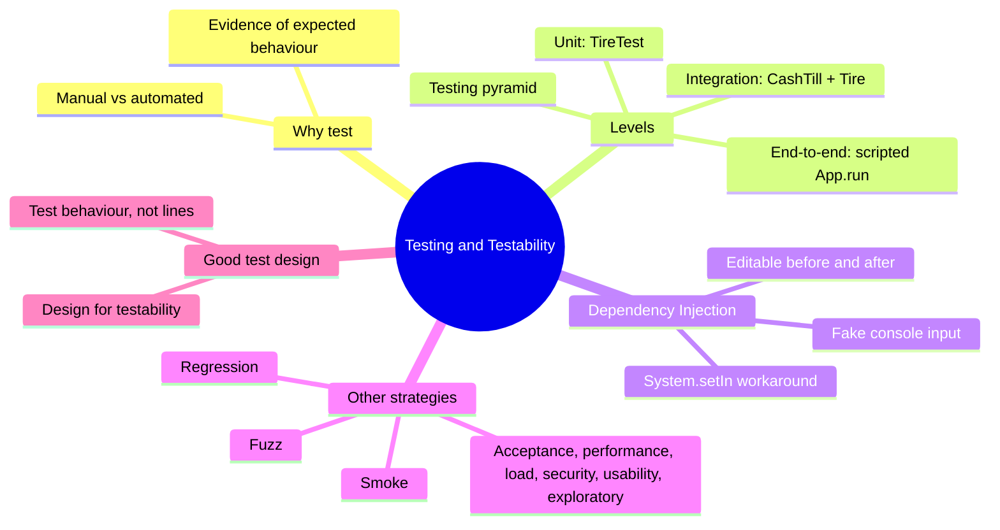
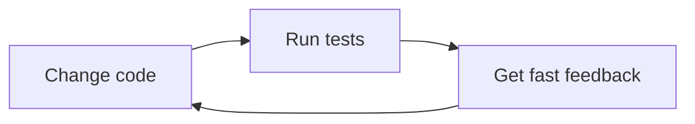
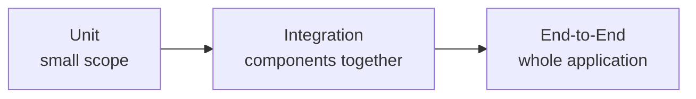
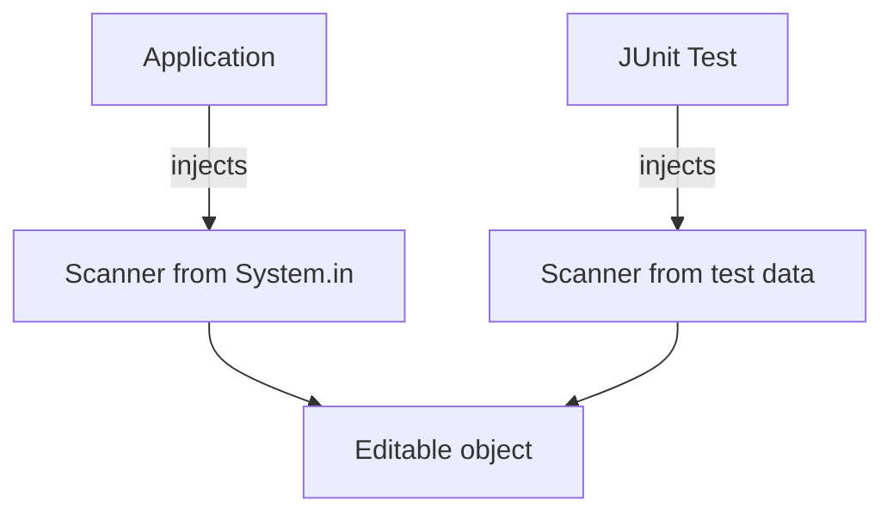
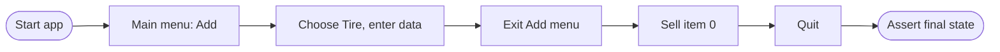
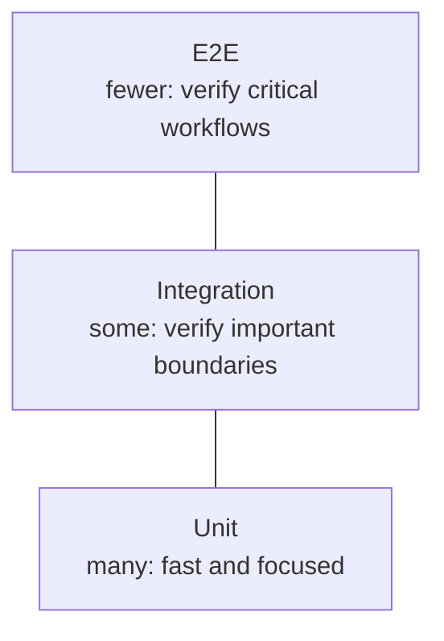
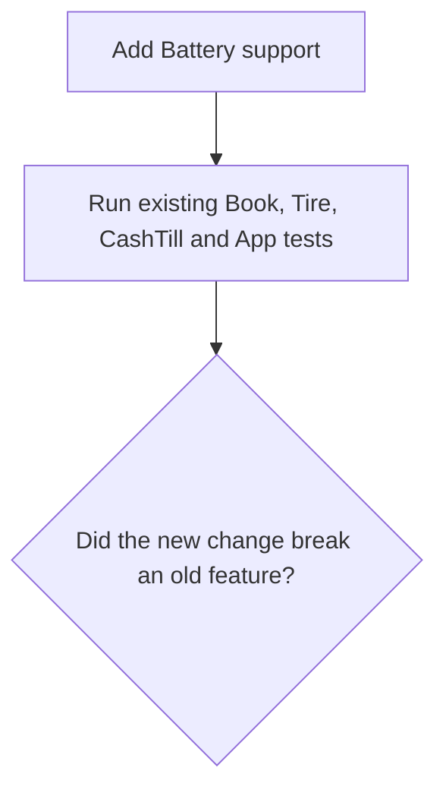

# Testing and Dependency Injection

> [!note] Where this lecture fits
> Lecture 04 ("Testing & Testability: unit, integration, end-to-end, and more") moves the course from checking the bookstore app by hand to checking it with automated **[[JUnit]]** tests. Along the way it shows why **[[Dependency Injection]]** (DI) makes code easier to test, using the `Editable` interface, `Tire`, `Battery` and `CashTill` classes from the labs.

By the end of the lecture you should be able to:

- tell apart **[[Unit Testing|unit]]**, **[[Integration Testing|integration]]** and **[[End-to-End Testing|end-to-end]]** tests
- write JUnit tests with the **[[Arrange-Act-Assert]]** pattern
- explain why dependency injection makes code easier to test
- replace interactive (keyboard) input with controlled test input
- test how `CashTill` works together with concrete products
- explain where manual, smoke, regression, fuzz and performance testing fit
- pick a suitable level of testing for a particular risk



---

## Why test?

> [!important] The core idea
> Testing gives us **evidence** that software **behaves as expected**.

A test answers a question about the program. The lecture lists the kinds of questions we want answered:

| Question | What it's about |
|---|---|
| Does this **class or method** behave correctly? | one small piece |
| Do these **components work together**? | two or more pieces talking to each other |
| Does the **whole application** complete a user workflow? | the full program |
| Did a change **break behaviour that used to work**? | changes over time |
| What happens with **unexpected input**? | strange or bad data |

No single kind of test answers all of these questions. That's why the rest of the lecture introduces several kinds.

### Manual testing still matters

In the earlier labs, all testing was **[[Manual Testing|manual]]**:

1. run the application
2. navigate the app
3. type some values
4. inspect the result

Manual testing is still useful for:

- exploratory testing (poking around to see what breaks)
- UX and UI problems
- trying unusual workflows
- investigating bugs
- checking things that are hard to automate

> [!warning] The real problem
> Manual testing on its own is the problem. If it's the *only* testing you do, every check depends on someone remembering to do it, and doing it exactly the same way each time.

### Why automate tests?

Manual checks are hard to repeat exactly. **Automated tests** can be:

- repeated quickly
- run after every change
- run by every developer
- executed in **[[Continuous Integration|CI]]** (Continuous Integration) without a human present
- precise about the expected result

A useful automated test becomes a **repeatable specification of behaviour**: it writes down, in code, what the program is supposed to do, and checks it every time it runs.



---

## Testing at different scales

Tests come in different sizes, depending on how much of the program they cover.



As the scope grows, tests usually become:

- more realistic
- slower
- more dependent on other parts of the system
- harder to diagnose when they fail (more code is involved, so it's harder to tell *where* the problem is)

We normally want tests at **multiple levels**, because each level catches different problems.

---

## Unit tests

> [!note] Definition
> A **unit test** checks a small piece of behaviour **in isolation**. When it fails, it should tell you: *what specific behaviour failed?*

Typical "units" are:

- a method
- a class
- a small group of highly related code

In the course's application, each product class gets its own test class:

```
TireTest    → Tire
BatteryTest → Battery
BookTest    → Book
```

### Arrange, Act, Assert

Most unit tests follow the same three steps, called **[[Arrange-Act-Assert]]** (AAA):

| Step | What you do |
|---|---|
| **Arrange** | Set up the starting conditions (create objects, prepare data). |
| **Act** | Perform the behaviour you want to test (call the method). |
| **Assert** | Check that the result is what you expected. |

The lecture's example tests that selling an item adds its price to the till's total:

```java
@Test
void sellingItemAddsItsPriceToTotal() {
    // Arrange
    CashTill till = new CashTill();
    ...

    // Act
    till.sellItem(item);

    // Assert
    assertEquals(expected, till.getRunningTotal(), 0.001);
}
```

- `@Test` marks the method as a JUnit test, so JUnit knows to run it.
- `assertEquals(expected, actual, delta)` passes only if `expected` and `actual` match. The third argument (`0.001`) is a **tolerance** for `double` values.

> [!tip] Why the `0.001`?
> Computers store decimal numbers like `250.00` as `double`s, which can't hold every decimal exactly. A tiny rounding difference (like `249.99999999`) would make an exact comparison fail. The delta says "close enough within 0.001 counts as equal". You only need it for `double`/`float`; for `int` and `String` you compare exactly.

Reference: [JUnit 5 User Guide](https://junit.org/junit5/docs/current/user-guide/) and [GeeksforGeeks: Introduction to JUnit 5](https://www.geeksforgeeks.org/introduction-to-junit-5/)

---

## The interactive I/O problem

Here's the snag. Products in the app are filled in by asking the user:

```java
Tire tire = new Tire();
tire.initialize(...);
```

`initialize()` needs input. A person could type:

```
Michelin
250.00
18
```

But **automated tests should run without a person sitting at the keyboard**. If `initialize()` waits for someone to type, the test just hangs.

### `Editable` before DI

This is roughly how `Editable` used to work. It was an **[[Abstract Classes|abstract class]]** with its own `Scanner`:

```java
abstract class Editable extends SaleableItem {
    private Scanner input = new Scanner(System.in);
    ...
}
```

The dependency (the `Scanner`) is **hardcoded inside the class**. The class decides both:

- **what** input it needs, and
- **where** that input comes from (always `System.in`, the keyboard).

That makes substitution difficult: there's no way to hand it a different source of input.

> [!important] Why the old design is hard to test
> The test can't easily say: *"Use these prepared answers instead of waiting for a human."*
>
> `Scanner` itself is fine. The trouble is that **the class creates its own dependency**.

### `Editable` with DI

Now `Editable` is an **[[Interfaces|interface]]**, and the dependency is supplied by the caller:

```java
public interface Editable {
    void initialize(Scanner input);
    void edit(Scanner input);
}
```

The same method can now read from anywhere:

| Who calls it | What they pass in |
|---|---|
| Production code (the real app) | `new Scanner(System.in)` (the keyboard) |
| A test | `new Scanner(preparedInput)` (a string written in the test) |

---

## Dependency Injection (DI)

> [!note] Definition
> **[[Dependency Injection]]** means an object or method **receives a dependency from outside** rather than **creating it internally**.

A *dependency* is anything a class needs to do its job: here, a `Scanner` to read input. "Injecting" it just means passing it in (as a method parameter or constructor argument) instead of calling `new` inside the class.



The same `Editable` object works with both. The application gives it the real keyboard; the JUnit test gives it prepared data.

DI is useful well beyond testing, but **testability is a major benefit**: we can replace a real dependency with a controlled one.

> [!example] Everyday analogy
> A coffee machine that only works with water from one specific tap is hard to test: you'd have to stand at that tap. A machine with a removable tank lets you pour in whatever water you want. Passing the `Scanner` in is like giving `Tire` a removable tank.

> [!tip] Connection to last lecture
> This is the same idea as the `Service(Repository repository)` constructor from [[Week 3.3 - SOLID Principles|SOLID Principles]] (the [[Dependency Inversion Principle]]). There the dependency was a repository; here it's a `Scanner`.

### Fake console input

A test can simulate what a user would type by building a `Scanner` over a string:

```java
String inputData = "Michelin\n250.00\n18\n";
Scanner input = new Scanner(
    new ByteArrayInputStream(inputData.getBytes())
);
```

- Each `\n` is a newline, like the user pressing Enter after each answer.
- `getBytes()` turns the string into bytes.
- `ByteArrayInputStream` wraps those bytes as an *input stream*, the same kind of thing `System.in` is.
- `new Scanner(...)` reads from that stream exactly as it would read from the keyboard.

Now `initialize` reads from our prepared data rather than the keyboard:

```java
Tire tire = new Tire();
tire.initialize(input);
```

Reference: [Oracle Docs: ByteArrayInputStream](https://docs.oracle.com/javase/8/docs/api/java/io/ByteArrayInputStream.html), [Oracle Docs: Scanner](https://docs.oracle.com/javase/8/docs/api/java/util/Scanner.html)

### Unit test: `Tire`

Putting it together:

```java
@Test
void initializeStoresTireData() {
    String data = "Michelin\n250.00\n18\n";
    Scanner input = new Scanner(
        new ByteArrayInputStream(data.getBytes())
    );
    Tire tire = new Tire();
    tire.initialize(input);
    assertEquals("Michelin", tire.getManufacturer());
    assertEquals(250.00, tire.getPrice(), 0.001);
    assertEquals(18, tire.getDiameter());
}
```

The AAA steps are all there even without comments: the first four lines **arrange**, `tire.initialize(input)` is the **act**, and the three `assertEquals` calls **assert**.

### What does this test prove?

| The `Tire` test gives evidence that... | It does **not** prove that... |
|---|---|
| `Tire.initialize()` consumes the expected input | `CashTill` can sell the tire |
| values are converted correctly (`"250.00"` becomes the number `250.0`) | the menu creates the correct object |
| values are stored in the expected fields | the whole application workflow works |

Those other questions need different tests at different levels.

> [!warning] Input order must match exactly
> The prepared string has to list the answers in the **same order** `initialize()` asks for them. If `Tire.initialize()` asks for price first, `"Michelin"` gets read as a price and the test crashes or fails. When a fake-input test fails, check the order of the lines first.

---

## Integration tests

> [!note] Definition
> An **[[Integration Testing|integration test]]** checks that **multiple components collaborate correctly**. Its question: *do these components agree on how they interact?*

Instead of isolating one class, we deliberately **cross a boundary** between parts of the system. Examples:

```
CashTill    ↔ Book
CashTill    ↔ Tire
Service     ↔ Repository
Application ↔ Database
```

### `CashTill` + product

`CashTill` depends on the `SaleableItem` contract (the methods every saleable thing promises to have):

```java
public void sellItem(SaleableItem item) {
    runningTotal += item.getPrice();
    item.sellItem();
}
```

`CashTill` adds the price to its total, then tells the item it was sold (which lowers its stock).

A useful integration test can use a **real concrete product**, not a mock (a fake stand-in object):

```
CashTill → Tire → Product/SaleableItem behaviour
```

Now we're testing the collaboration between real implementations.

```java
@Test
void cashTillSellsARealTire() {
    Tire tire = new Tire();
    Scanner input = new Scanner(
        new ByteArrayInputStream("Michelin\n250.00\n18\n10".getBytes())
    );
    tire.initialize(input);
    CashTill till = new CashTill();
    till.sellItem(tire);
    assertEquals(250.00, till.getRunningTotal(), 0.001);
    assertEquals(9, tire.getStock());
}
```

The test checks both sides of the interaction: the till's total went up by the tire's price, **and** the tire's stock went down by one.

> [!note] About the input string
> This string has a fourth line, `10`, which the earlier unit test didn't have. Since the test expects stock to be `9` after one sale, `10` is the starting stock. The slides don't show the full `Tire.initialize()` code, so check your lab's version to see exactly which values it reads and in what order.

### Why is that integration?

| | Unit test | Integration test |
|---|---|---|
| Structure | `TireTest → Tire` | `CashTillTest → CashTill → Tire` |
| Focus | "Does `Tire` behave correctly?" | "Do `CashTill` and a real `Tire` work together correctly?" |

> [!important] The boundary is under test
> In an integration test, **the boundary between the components** is part of what we're testing. If `CashTill` calls `getPrice()` but `Tire` returned the wrong field, a `CashTill` test with a fake product would never notice. A test with a real `Tire` would.

---

## End-to-end tests

> [!note] Definition
> An **[[End-to-End Testing|end-to-end (E2E) test]]** exercises a **complete application workflow** through its **normal entry point**. Its question: *does this specific use case work correctly?*

### An E2E test example

In the bookstore application, a simple E2E test might:

1. start the application
2. navigate menus
3. create a `Tire`
4. sell it
5. quit
6. verify the final state of the application (for example the `CashTill` running total, or the `Tire` stock)



### E2E test input

The input is a script of everything a user would type, in order:

```java
StringBuilder script = new StringBuilder();

script.append("1\n");        // Add
script.append("5\n");        // Tire
script.append("Goodyear\n"); // Manufacturer
script.append("150.00\n");   // Price
script.append("17\n");       // Diameter
script.append("99\n");       // Exit Add menu

script.append("4\n");        // Sell
script.append("0\n");        // Item 0
script.append("99\n");       // Quit
```

The input represents a **complete user interaction**, from the first menu choice to quitting.

### E2E test execution

```java
System.setIn(new ByteArrayInputStream(
    script.toString().getBytes()
));
App app = new App() {
    @Override
    public void populate() {
        // Start with predictable state
    }
};
app.run();
assertEquals(1, app.getItemsCount());
```

What's going on:

- `System.setIn(...)` replaces the program's keyboard input with the script.
- `new App() { ... }` creates an **[[Anonymous Classes|anonymous subclass]]** of `App` that overrides `populate()` with an empty method. Normally `populate()` would fill the app with sample products; overriding it means the test **starts with a predictable state** (an empty inventory).
- `app.run()` runs the real program, which reads the script as if a user typed it.
- `assertEquals(1, app.getItemsCount())` checks that exactly one item (the Goodyear tire) is in the app at the end.

> [!important] Assert the result, not just "no crash"
> A good E2E assertion verifies the **observable result of the workflow**, not merely that the application didn't crash. A test with no `assertEquals` at the end would pass even if the tire was never added.

### Why `System.setIn()`?

`App` still creates its own scanner internally:

```java
Scanner input = new Scanner(System.in);
```

So the test **can't inject a `Scanner` directly**. Instead, it replaces the **global input stream**:

```java
System.setIn(new ByteArrayInputStream(script.getBytes()));
```

### Room for improvement

- Replacing `System.in` works, but it's a **global change** that affects all code in the [[JVM]]. Any other code reading `System.in` during the test also gets the script.
- Compare this with `Editable`: **injection gives a cleaner testing seam than replacing global state.** (A *seam* is a place where a test can swap in its own version of something.)
- `App` could be refactored to accept a `Scanner` in its constructor. That would make it easier to test without touching global state.

```java
// Possible refactor (same idea as Editable)
public App(Scanner input) {
    this.input = input;
}
```

> [!note] About the snippet above
> The slides only say `App` *could* take a `Scanner` in its constructor. The snippet is a sketch of what that looks like, not code from the lecture.

---

## Three levels, three questions

| Level | Example | Main question |
|---|---|---|
| **Unit** | `TireTest` | Does this class behave correctly? |
| **Integration** | `CashTill` + `Tire` | Do these components collaborate correctly? |
| **End-to-end** | scripted `App.run()` | Does the complete user workflow work? |

- A failure at each level tells you something different. A failing unit test points at one class; a failing E2E test only tells you *something* in the workflow is broken.
- The categories are useful concepts, not perfectly rigid borders. Some tests sit between two levels.

### The testing pyramid



The **[[Testing Pyramid]]** is a common strategy:

- **many unit tests**: fast and focused
- **some integration tests**: verify important boundaries
- **fewer E2E tests**: verify critical workflows

> [!warning] Guideline, not a rule
> The pyramid is a **guideline**, not a required ratio. There's no "correct" number of each kind. The shape reminds you that slow, fragile E2E tests shouldn't be your main safety net.

Reference: [Martin Fowler: The Practical Test Pyramid](https://martinfowler.com/articles/practical-test-pyramid.html)

---

## Other kinds of testing

### Regression testing

> [!note] Definition
> A **[[Regression Testing|regression]]** is when a change breaks behaviour that previously worked. **Regression testing** means rerunning tests to detect those failures.



An automated test suite is especially valuable because it becomes a reusable **regression suite**. Every test you write today keeps protecting that behaviour in the future, for free.

### Smoke testing

> [!note] Definition
> A **[[Smoke Testing|smoke test]]** is a small, quick set of checks that asks: *is the build healthy enough for deeper testing?*

Examples:

- the application starts
- the main menu appears
- a database connection can be established
- one critical workflow completes

Smoke tests are intentionally **broad and shallow**: they touch many parts of the app but don't check anything in depth. If they fail, there may be little value in running a long test suite afterward. (If the app doesn't even start, a thousand detailed tests will all fail for the same reason.)

### Fuzz testing

> [!note] Definition
> **[[Fuzz Testing]]** feeds large amounts of unexpected, malformed or random input into software.

For input-heavy code, try values such as:

```
""                       (empty string)
"abc"                    where a number is expected
-1
99999999999999999999
unusual Unicode
very long strings
```

The goal is often **not** to predict every exact result. It's to discover crashes, hangs, uncaught exceptions, or assumptions we didn't realize we'd made.

> [!example] Fuzzing `Tire.initialize()`
> What happens if the price line is `"abc"`? With `Scanner.nextDouble()`, Java throws an `InputMismatchException`. If nothing catches it, the whole app crashes. Fuzz testing finds problems like this before a user does.

### Other useful strategies

| Strategy | What it asks |
|---|---|
| **[[Acceptance Testing]]** | Does the software satisfy a requirement or user need? |
| **[[Performance Testing]]** | Is it fast and responsive under expected load? |
| **Load/stress testing** | What happens as demand approaches or exceeds expected limits? |
| **[[Security Testing]]** | Can inputs, permissions or interfaces be abused? |
| **[[Usability Testing]]** | Can real users understand and operate it effectively? |
| **[[Exploratory Testing]]** | What problems can a human discover by actively investigating? |

### Automated vs. manual

| Automated is best for | Manual is best for |
|---|---|
| repeatable checks | exploration |
| regression suites | usability |
| precise assertions | visual judgement |
| CI pipelines | investigating surprises |
| many input combinations | workflows not yet automated |

---

## Good tests are designed

A useful automated test should usually be:

| Quality | Meaning |
|---|---|
| **Focused** | clear about what behaviour matters |
| **Repeatable** | same starting state, same expected result |
| **Independent** | doesn't depend on the order tests run in |
| **Readable** | the intent is obvious when it fails |
| **Fast enough** | for how often it runs |
| **Meaningful** | checks behaviour, not merely implementation details |

> [!important] Tests are code too
> A test suite is software. It needs maintenance and good design, just like the program it tests.

### Test behaviour, not lines

- Avoid tests whose main purpose is simply to execute every line.
- Prefer names that describe behaviour:

```
initializeStoresTireDiameter()
sellingItemAddsPriceToRunningTotal()
addingTireThroughMenuStoresTire()
```

- A test name should help explain the failure **before you even open the test code**. If `sellingItemAddsPriceToRunningTotal` fails, you already know what's broken.
- **[[Code Coverage]]** (how many lines your tests run) can reveal **untested code**, but high coverage alone doesn't prove the tests are good. A test can run every line and never check a single result.

> [!warning] Coverage without assertions
> ```java
> @Test
> void testTire() {
>     Tire tire = new Tire();
>     tire.initialize(input);   // runs every line of initialize()
> }                             // ...but checks nothing
> ```
> This gives 100% coverage of `initialize()` and still passes when `initialize()` stores the wrong values.

---

## Design for testability

Compare these two designs:

```java
// Design 1
void initialize() {
    Scanner input = new Scanner(System.in);
    ...
}
```

```java
// Design 2
void initialize(Scanner input) {
    ...
}
```

- The second design doesn't contain any "test code".
- It simply gives the **caller control over a dependency**.
- That produces software that is:
  - easier to test
  - easier to reuse (it could read from a file just as easily)
  - less coupled to one environment

### Testing exposes design

Difficulty testing a class can reveal a design problem. Warning signs:

- constructors or methods that create many dependencies internally
- heavy reliance on global/static state
- business logic mixed with console or database I/O
- one test requiring most of the application to run
- no easy way to substitute an external resource

> [!important] Testing gives design feedback
> Testing does more than find bugs. It gives feedback about the **structure of the software**. If a class is painful to test, that's often a sign it breaks principles like the [[Single Responsibility Principle]] or the [[Dependency Inversion Principle]].

---

## Key takeaways

- **Manual testing remains useful**, but automated tests make important checks repeatable.
- **Unit tests** focus on small pieces of behaviour.
- **Integration tests** verify collaboration between components.
- **End-to-end tests** exercise complete application workflows.
- **Dependency injection** makes dependencies replaceable and therefore easier to control in tests.
- `Editable` became easier to test when `Scanner` was **passed in** rather than created internally.
- Smoke, regression, fuzz, performance, security, usability and exploratory testing address other important risks.
- Testing and design reinforce each other.

---

## Exercises

### Exercise 1 (Direct application, from the lecture)
Write a unit test for `Battery.initialize()` using this prepared input:
```
Duracell
180.00
850
```
Your test should construct a `Scanner` over the prepared input, inject it into `Battery.initialize()`, and verify the manufacturer, price, and **cold cranking amps (CCA)** value.

> [!success]- Answer key
> ```java
> @Test
> void initializeStoresBatteryData() {
>     // Arrange
>     String data = "Duracell\n180.00\n850\n";
>     Scanner input = new Scanner(
>         new ByteArrayInputStream(data.getBytes())
>     );
>     Battery battery = new Battery();
>
>     // Act
>     battery.initialize(input);
>
>     // Assert
>     assertEquals("Duracell", battery.getManufacturer());
>     assertEquals(180.00, battery.getPrice(), 0.001);
>     assertEquals(850, battery.getColdCrankingAmps());
> }
> ```
> It follows the same shape as `initializeStoresTireData()`. Each answer is on its own line ending with `\n`, in the order `initialize()` asks for them. The price is a `double`, so it gets the `0.001` delta; CCA is a whole number, so it's compared exactly. (The getter name `getColdCrankingAmps()` is assumed. Use whatever your `Battery` class calls it.)

### Exercise 2 (Direct application, from the lecture)
The lecture's follow-up question: what additional **invalid or boundary inputs** would be worth testing for `Battery.initialize()`? List at least five and say what you'd want to happen.

> [!success]- Answer key
> Using the fuzz testing list from the lecture:
> - **Empty manufacturer** (`""`): should it be rejected, or is a blank name allowed?
> - **Text where a number is expected** (`"abc"` for price or CCA): `Scanner.nextDouble()`/`nextInt()` throws `InputMismatchException`. Does the code catch it and re-ask, or does the app crash?
> - **Negative values** (`-1` for price or CCA): a battery can't have a negative price or negative cranking amps. The code should probably refuse it.
> - **Zero** (`0.00` price, `0` CCA): a boundary value. Is a free battery valid?
> - **Huge numbers** (`99999999999999999999`): too big for an `int`, so reading CCA would fail.
> - **Very long strings or unusual Unicode** for the manufacturer: does anything break when it's printed or stored?
>
> The point, as the lecture says, isn't to predict every exact result but to find crashes, hangs, uncaught exceptions, or hidden assumptions.

### Exercise 3 (Direct application, from the lecture)
Write an integration test for `CashTill` + `Battery`. Arrange a real `Battery` with a known price, call `cashTill.sellItem(battery)`, then verify the till's running total and the battery's stock.

> [!success]- Answer key
> ```java
> @Test
> void cashTillSellsARealBattery() {
>     // Arrange: a real Battery, starting stock 5
>     Battery battery = new Battery();
>     Scanner input = new Scanner(
>         new ByteArrayInputStream("Duracell\n180.00\n850\n5".getBytes())
>     );
>     battery.initialize(input);
>     CashTill cashTill = new CashTill();
>
>     // Act
>     cashTill.sellItem(battery);
>
>     // Assert
>     assertEquals(180.00, cashTill.getRunningTotal(), 0.001);
>     assertEquals(4, battery.getStock());
> }
> ```
> This mirrors `cashTillSellsARealTire()`. It's integration because a **real** `Battery` crosses the boundary into `CashTill`: `sellItem` calls the battery's own `getPrice()` and `sellItem()`. Checking both the total and the stock verifies both directions of that collaboration. (The extra `5` line assumes `initialize()` reads a starting stock last, like the `10` in the tire test. Adjust to match your class.)

### Exercise 4 (Applied variation)
Classify each test as **unit**, **integration**, **end-to-end**, **smoke**, or **regression**, and explain why.

(a) A test that creates a `Book`, calls `book.initialize(input)` with prepared data, and checks the title.
(b) A script that starts `App`, adds a book through the menus, sells it, quits, and checks `app.getItemsCount()`.
(c) After adding `Laptop` support, the team reruns every existing test.
(d) A quick check run on every new build: the app starts and the main menu appears.
(e) A test that sells a real `Book` through `CashTill` and checks the running total.

> [!success]- Answer key
> (a) **Unit.** One class (`Book`) in isolation, like `TireTest → Tire`.
>
> (b) **End-to-end.** It drives a complete workflow through the normal entry point (`App.run()`) with scripted input, then checks the final state.
>
> (c) **Regression testing.** The goal is to find out whether the new change broke behaviour that used to work, like the lecture's "Add Battery support" example.
>
> (d) **Smoke test.** Broad and shallow; it only asks if the build is healthy enough for deeper testing.
>
> (e) **Integration.** It crosses the `CashTill ↔ Book` boundary with a real product (listed on the slide as an integration example).
>
> Note that (c) isn't a "level" at all: a regression run can include unit, integration, and E2E tests. That's why the lecture says the categories are useful concepts, not rigid borders.

### Exercise 5 (Applied variation)
This class is hard to test. Identify which "Testing exposes design" warning signs it shows, then refactor it so a JUnit test can control the input.

```java
public class Book extends SaleableItem {
    private String title;
    private double price;

    public void initialize() {
        Scanner sc = new Scanner(System.in);
        System.out.print("Title: ");
        title = sc.nextLine();
        System.out.print("Price: ");
        price = sc.nextDouble();
    }
}
```

> [!success]- Answer key
> Warning signs:
> - The method **creates its dependency internally** (`new Scanner(System.in)`).
> - There's **no easy way to substitute an external resource** (the keyboard).
> - The only way to test it is through **global state** (`System.setIn`).
>
> Refactor, the same way `Editable` was changed:
> ```java
> public class Book extends SaleableItem implements Editable {
>     private String title;
>     private double price;
>
>     @Override
>     public void initialize(Scanner input) {
>         System.out.print("Title: ");
>         title = input.nextLine();
>         System.out.print("Price: ");
>         price = input.nextDouble();
>     }
> }
> ```
> Production passes `new Scanner(System.in)`; a test passes `new Scanner(new ByteArrayInputStream("Dune\n19.99\n".getBytes()))`. The method contains no test code. It just lets the caller decide where input comes from.

### Exercise 6 (Applied variation)
A teammate wrote this test. List what's wrong with it using the "good tests are designed" qualities, and rewrite it.

```java
@Test
void test1() {
    Tire tire = new Tire();
    Scanner input = new Scanner(
        new ByteArrayInputStream("Michelin\n250.00\n18\n".getBytes())
    );
    tire.initialize(input);
    System.out.println(tire.getPrice());
}
```

> [!success]- Answer key
> Problems:
> - **Not readable:** `test1` says nothing about the behaviour. When it fails you learn nothing before opening the code.
> - **Not meaningful:** there's no assertion. It prints a value for a human to look at, so it passes even if the price is wrong. It runs the lines without checking behaviour ("test behaviour, not lines").
> - **Not really automated:** someone has to read the console output, which is manual checking.
>
> Rewrite:
> ```java
> @Test
> void initializeStoresTirePrice() {
>     Scanner input = new Scanner(
>         new ByteArrayInputStream("Michelin\n250.00\n18\n".getBytes())
>     );
>     Tire tire = new Tire();
>
>     tire.initialize(input);
>
>     assertEquals(250.00, tire.getPrice(), 0.001);
> }
> ```

### Exercise 7 (Challenge)
Write an E2E test script (the `StringBuilder` part and the assertion) for this workflow: add a tire (Pirelli, 199.99, 16), add a second tire (Bridgestone, 120.00, 15), exit the Add menu, sell item 1, and quit. Use the same menu numbers as the lecture. What would you assert at the end, and why is one assertion on `getItemsCount()` not enough to prove the sale worked?

> [!success]- Answer key
> ```java
> StringBuilder script = new StringBuilder();
> script.append("1\n");           // Add
> script.append("5\n");           // Tire
> script.append("Pirelli\n");
> script.append("199.99\n");
> script.append("16\n");
> script.append("5\n");           // Tire again (assumes the Add menu loops until 99)
> script.append("Bridgestone\n");
> script.append("120.00\n");
> script.append("15\n");
> script.append("99\n");          // Exit Add menu
> script.append("4\n");           // Sell
> script.append("1\n");           // Item 1 (Bridgestone)
> script.append("99\n");          // Quit
>
> System.setIn(new ByteArrayInputStream(script.toString().getBytes()));
> App app = new App() {
>     @Override
>     public void populate() { }   // predictable, empty start
> };
> app.run();
>
> assertEquals(2, app.getItemsCount());
> ```
> `getItemsCount() == 2` only proves both tires were **added**. Selling doesn't remove an item from the list, so the count is the same whether the sale worked or not. To check the sale, you'd also assert the **observable result** the lecture mentions: the `CashTill` running total is `120.00` and Bridgestone's stock went down by one (this needs getters on `App` to reach the till and items). That's the lecture's point that an E2E assertion should check the result of the workflow, not just that the app finished.
>
> (Whether the Add menu loops back after one product depends on your `App`. The lecture's script adds one item and then sends `99`.)

### Exercise 8 (Challenge)
The E2E test uses `System.setIn`, which the lecture calls a global change. Refactor `App` so the test can inject a `Scanner` directly, show the new E2E test, and explain two reasons it's better.

> [!success]- Answer key
> ```java
> public class App {
>     private final Scanner input;
>
>     public App(Scanner input) {
>         this.input = input;
>     }
>
>     public App() {
>         this(new Scanner(System.in));   // production default
>     }
>     ...
> }
> ```
> Test:
> ```java
> Scanner input = new Scanner(
>     new ByteArrayInputStream(script.toString().getBytes())
> );
> App app = new App(input) {
>     @Override
>     public void populate() { }
> };
> app.run();
> assertEquals(1, app.getItemsCount());
> ```
> Why it's better:
> 1. **No global state.** `System.setIn` affects all code in the JVM. Injection only affects this one `App` object, so other tests can't be disturbed and the test is more **independent**.
> 2. **Cleaner testing seam**, matching `Editable`: the dependency is visible in the constructor, so anyone reading `App` can see it needs a `Scanner`. This is the same DI and DIP idea as `Service(Repository)` from the SOLID lecture.

### Exercise 9 (Challenge)
For each risk, pick the most suitable kind of testing from the lecture and justify it.

(a) A new developer's change might have broken `CashTill`'s total calculation.
(b) Users keep pressing the wrong menu number because the options are confusing.
(c) The store expects 500 people to use the web version at once on Black Friday.
(d) Someone could type a 10,000-character string as a manufacturer name.
(e) The nightly build sometimes fails to connect to the database, and the team wastes an hour running the full suite before noticing.

> [!success]- Answer key
> (a) **Regression testing** with the existing automated unit/integration tests (`CashTillTest`). The risk is that a change broke something that worked before.
>
> (b) **Usability testing** (and manual/exploratory testing). Only real users can show whether they understand and can operate the menus; that's "visual judgement" territory, which suits manual testing.
>
> (c) **Performance and load/stress testing.** The question is whether it stays responsive as demand approaches or exceeds expected limits.
>
> (d) **Fuzz testing** (and possibly security testing). Very long strings are on the lecture's fuzz list; the goal is to find crashes or hidden assumptions.
>
> (e) **Smoke testing.** A quick "can it connect to the database?" check runs first; if it fails, there's no point running the long suite.

---

## Feynman practice

Write each answer in your own words before looking back at the notes.

### Feynman: Unit, integration and end-to-end tests

- [ ] **1. Explain it to a 12-year-old.** Imagine checking a bicycle: testing just the brakes on their own, testing that pulling the brake lever actually stops the wheel, and riding the whole bike around the block. Which one is a unit test, which is integration, and which is end-to-end? How do these map to `TireTest`, `CashTill` + `Tire`, and the scripted `App.run()`?
- [ ] **2. Find your gaps.** Reread what you wrote and ==highlight== any word a 12-year-old wouldn't know ("isolation", "component", "boundary", "workflow", "entry point").
- [ ] **3. Go back and simplify.** For each highlighted word, write an analogy or example. Why does an E2E failure tell you *less* about where the bug is than a unit test failure?
- [ ] **4. Organize and test.** In 3-5 sentences, explain why the testing pyramid has many unit tests at the bottom and few E2E tests at the top, and why it's only a guideline.

### Feynman: Dependency injection

- [ ] **1. Explain it to a 12-year-old.** A toy robot that can only listen to one specific remote control, versus one where you can plug in any remote. Which one is the old `Editable` with its own `Scanner`, and which is `initialize(Scanner input)`?
- [ ] **2. Find your gaps.** ==Highlight== "dependency", "inject", "hardcoded", "caller", "seam".
- [ ] **3. Go back and simplify.** The lecture says "the problem is not `Scanner` itself". Then what is the problem? Why can't a test say "use these prepared answers" to the old design?
- [ ] **4. Organize and test.** In 3-5 sentences, explain how the same `Tire` object can read from the keyboard in the real app and from a string in a test, without any test code inside `Tire`.

### Feynman: Fake input and global state

- [ ] **1. Explain it to a 12-year-old.** How can a test "pretend to be a person typing"? Walk through what `"Michelin\n250.00\n18\n"` and `ByteArrayInputStream` do, step by step.
- [ ] **2. Find your gaps.** ==Highlight== "input stream", "bytes", "global", "JVM".
- [ ] **3. Go back and simplify.** Why does the E2E test have to use `System.setIn()` instead of passing a `Scanner`? What could go wrong when you change something global?
- [ ] **4. Organize and test.** In 3-5 sentences, explain why refactoring `App` to accept a `Scanner` in its constructor would be a cleaner design.

### Feynman: Other testing strategies

- [ ] **1. Explain it to a 12-year-old.** Use a restaurant kitchen: checking the stove turns on before service (smoke), making sure a new dish didn't ruin the old recipes (regression), and having someone order the weirdest possible combinations (fuzz).
- [ ] **2. Find your gaps.** ==Highlight== "build", "regression suite", "malformed input", "load".
- [ ] **3. Go back and simplify.** Why are smoke tests "broad and shallow" on purpose? Why is the goal of fuzz testing usually *not* to predict exact results?
- [ ] **4. Organize and test.** In 3-5 sentences, explain when you'd choose manual testing over automated testing, using the lecture's lists.

### Feynman: Testing and design

- [ ] **1. Explain it to a 12-year-old.** If a toy is really hard to check (you have to take the whole thing apart just to test one button), what does that tell you about how it was built?
- [ ] **2. Find your gaps.** ==Highlight== "coupled", "testability", "coverage", "implementation detail".
- [ ] **3. Go back and simplify.** Why can a test suite with 100% coverage still be a bad test suite? Why should test names describe behaviour?
- [ ] **4. Organize and test.** In 3-5 sentences, explain what "testing and design reinforce each other" means, using the warning signs from the "Testing exposes design" slide.

---

## Flashcards

An Anki import file for this lecture is at `Flashcards/testing-and-dependency-injection-flashcards.txt` (tab-separated, tags in column 3). In Anki: **File > Import**, select the file, and check the field mapping.

---

## Tags

#computer_science #programming #java #oop #testing #software_testing #junit #unit_testing #integration_testing #end_to_end_testing #dependency_injection #testability #regression_testing #smoke_testing #fuzz_testing #testing_pyramid #software_design #csd214 #study_notes
