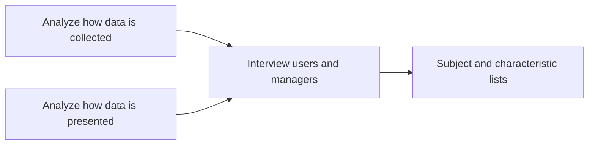
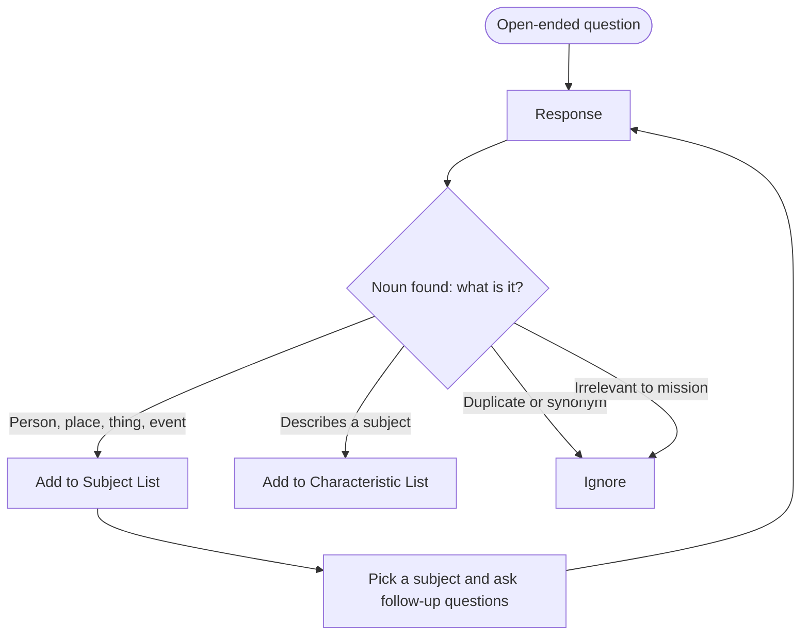
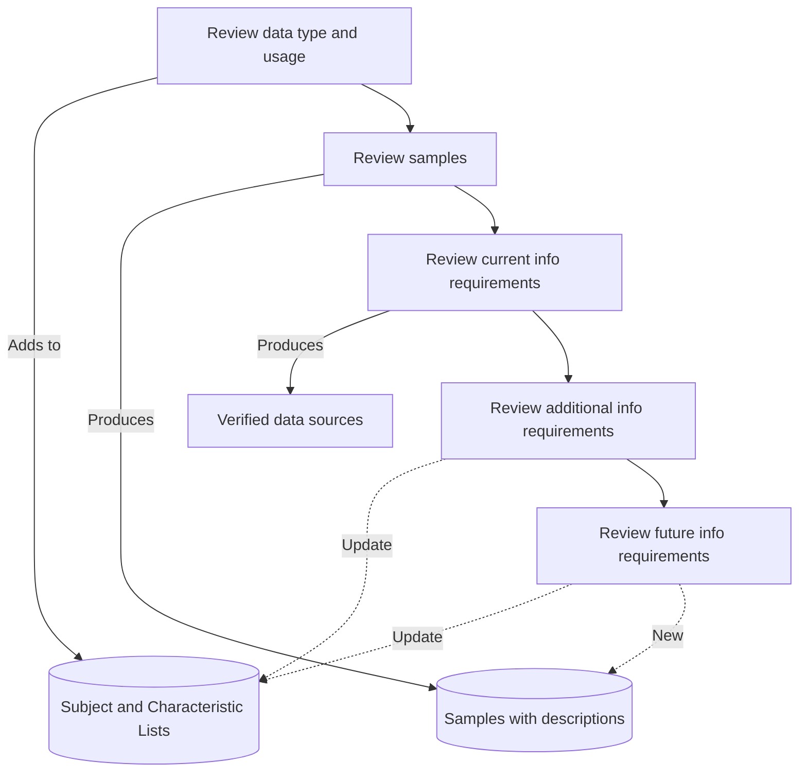
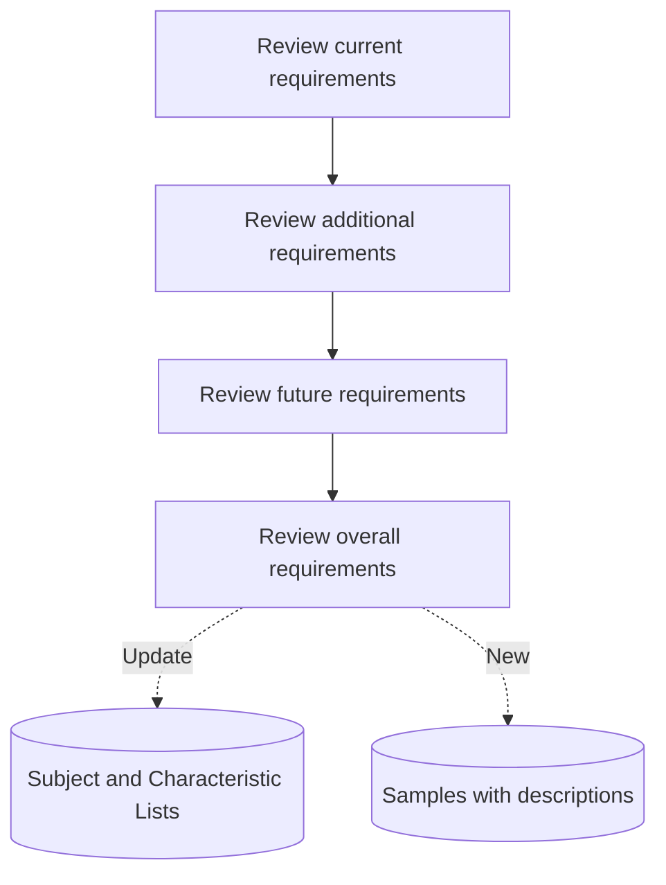
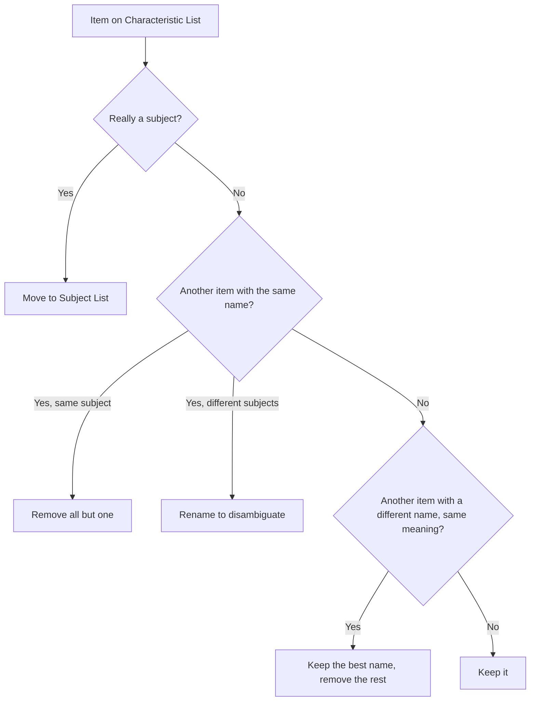
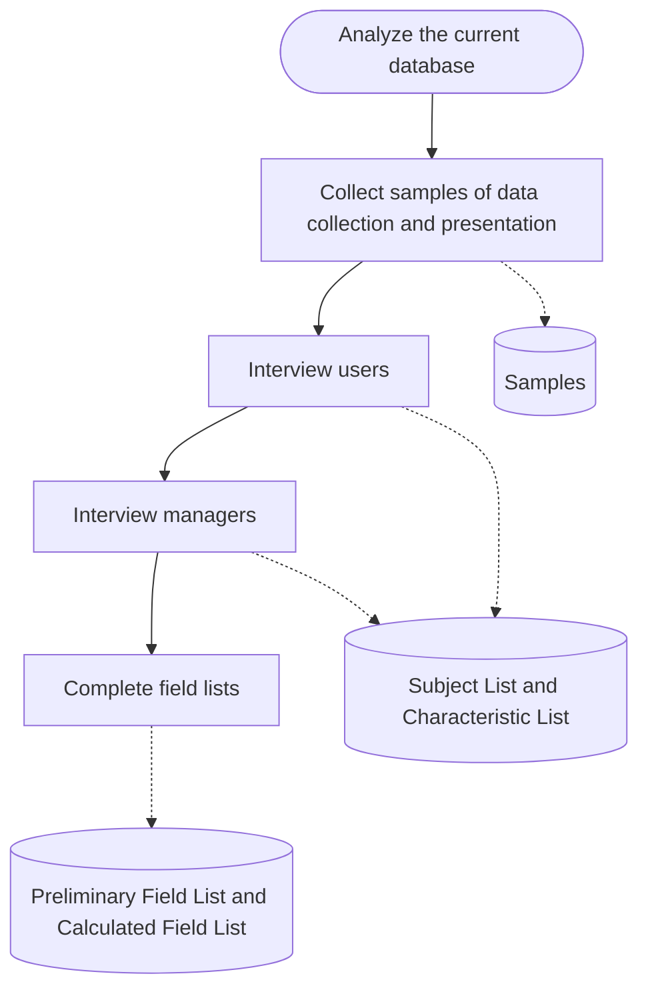
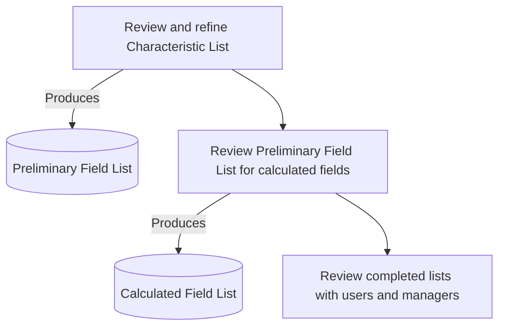

Recommended reading: *Database Design for Mere Mortals*, Chapter 6.

By the end of this lesson, you should be able to:
- Describe the key activities in analyzing an existing database
- Distinguish between a subject and a characteristic
- Use the subject and characteristic identification techniques to find subjects and characteristics in interviews, forms, and report samples
- Refine a list of characteristics into a preliminary field list
- Identify value lists and calculated fields

This is step 2 of the seven-step methodology from [[Week 2 - The Database Mission]]. Step 1 gave you a [[Database Mission Statement]] and a set of [[Mission Objectives]]. Step 2 is about looking at what the organization already has, so you know where you're starting from.

> [!important] The idea behind this step
> "To determine where you should go, you must first understand where you are."
>
> Before designing a new database, you need a clear picture of the data the organization uses today and how it uses it.

## Why analyze the existing database?

Understanding an organization's current database (or databases) tells you a lot. The analysis tries to answer these questions:

- What types of data are being recorded?
- How is that data being viewed and used?
- How is the data managed and maintained?
- Are there any deficiencies in the current system?
- How do things need to evolve to support information needs?

### There is always a database of some kind

Even an organization that says "we don't have a database" is storing data somewhere. It usually takes one of three forms:

| Kind of database | What it looks like | Typical problem |
|---|---|---|
| *Human knowledge base* | Information that only lives in people's heads | Nobody else can see or check it |
| *Paper-based database* | Notes, reports, forms, printouts | Prone to inconsistencies and errors |
| *Digital database* | Spreadsheets, database programs, apps | More structured, but often has design deficiencies |

> [!example] The human knowledge base
> Think of the one employee who "just knows" which supplier is cheapest for brake pads, or which customers pay late. That knowledge is data. If the new database needs it, you have to get it out of that person's head through interviews.

### Learn from it, but don't copy it

> [!warning] Do not adopt the existing design as your starting point
> If the old database didn't have problems, nobody would be asking you to build a new one. Copying its structure means copying its flaws.

What you *should* do is use the existing database to learn about the organization's needs:

- It can help you identify the [[Fields]] and [[Tables]] the new database will need.
- Analyzing it can reveal design deficiencies you'll want to avoid.
- It helps you start understanding the organization's overall workflow, and each individual's specific workflow.

With that understanding, you create a **new** design that meets the organization's needs.

## The three activities

Analyzing an existing database comes down to three activities:

1. Analyze how data is **collected**
2. Analyze how data is **presented**
3. **Interview** users and managers about 1 and 2



## Analyzing how data is collected

Copy *typical* samples of every different source of data and every data entry form that is relevant to the database mission. Then take note of any *exceptions* to the typical source.

A "typical" sample is the normal case: the standard customer form everyone fills in. An exception is the odd case, like a customer form someone modified by hand because it had no space for a second phone number. Exceptions often point to data the current system forgot about.

Data sources come in two broad groups:

| Paper-based data sources | Digital data sources |
|---|---|
| Index cards | Digital files, forms, documents |
| Forms | Spreadsheets |
| Hand-written notes | Databases |
| Notebooks and binders | Computer programs |
| Paper filing system | Mobile apps |
| | Web apps |

## Analyzing how data is presented

> [!note] Definition: report
> A **report** is any document, paper or digital, that is used to present *information*. A report is generated from the organization's *data*.

Recall the difference from Week 1: data is what you store, information is what you get when data is processed and presented in a useful way. Reports are where that presentation happens.

As with data collection, copy *typical* samples of every different kind of report relevant to the database mission, and note the *exceptions* to the typical reports. Look in all of these places:

- Printed reports
- Digital report files (don't forget form emails and slide shows)
- Report screens in computer programs, database programs, mobile apps, and web apps

> [!tip] Reports hide in unexpected places
> A form email that says "Dear {customer name}, your order {order number} has shipped" is a report. So is the dashboard screen a manager checks every morning. If it presents information built from the organization's data, collect a sample.

## Conducting interviews

Once you have samples, interviews fill in what the samples can't tell you on their own. Interviews help you:

- Get more detailed information about the samples you just gathered
- Get more information about how data is used
- Determine the initial fields and tables
- Reveal future information requirements

Two techniques do most of the work during these interviews: the subject identification technique and the characteristic identification technique.

## Subjects vs. characteristics

> [!note] Definitions
> A **subject** is a person, place, thing, or event that the database is about. Customers, products, and sales orders are subjects. Subjects will later tend to become [[Tables]].
>
> A **characteristic** describes an aspect of a subject. A customer's name, a product's price, and an order's date are characteristics. Characteristics will later tend to become [[Fields]].

Both usually show up as **nouns** when people talk. The difference is what the noun refers to: a subject stands on its own, while a characteristic belongs *to* a subject.

## The subject identification technique

The [[Subject Identification Technique]] works like this:

1. Analyze the response to an open-ended question for *subjects*.
   - Subjects are usually revealed in the **nouns** of a response.
   - Subjects identify a person, place, thing, or event.
2. Compile a *list of subjects* as you work through the design process.
3. Use the list of subjects as the basis for further questions. Along the way:
   - Identify (and ignore) *duplicates and synonyms*
   - Identify (and set aside) *characteristics* of subjects, since you'll use these later
   - Identify (and ignore) items *irrelevant* to the database mission and objectives

> [!example] Finding subjects in an interview response
> An account representative says:
>
> "As an ==account representative==, I'm responsible for ten ==clients==. Each of my clients makes an ==appointment== to come into the ==showroom== to view the ==merchandise== we have to offer for the current ==season==. Part of my ==job== is to answer any ==questions== they have about our merchandise and make ==recommendations== regarding the most popular ==items==. Once they make a ==decision== on the merchandise they'd like to purchase, I write up a ==sales order== for the client. Then I give the sales order to my ==assistant==, who promptly fills the order and sends it to the client."
>
> Subject list: Account representative, Appointment, Assistant, Client, Decision, Item, Job, Merchandise, Question, Recommendation, Sales order, Season, Showroom.

Notice this first list is raw. It still contains possible synonyms (is an "item" the same thing as "merchandise"?) and nouns that may not matter to the mission. Step 3 of the technique is where you use follow-up questions to sort those out.

## The characteristic identification technique

The [[Characteristic Identification Technique]] builds on the subject list:

1. Pick a subject from the subject list and discuss it.
2. Use the subject identification technique to find any new subjects, and add them to the list.
3. Look for *characteristics of the subject* in question.
   - Again, these are usually nouns.
   - They often come right after a possessive form of the subject, like "the **client's** name".
4. Compile a *list of characteristics* as you work through the process.
5. Repeat for each subject in the subject list.

> [!important] Keep the two lists separate
> The Subject List and the Characteristic List must be **separate documents**. Both lists help identify tables in a later step of the process, and they may point to slightly different sets of tables.

> [!example] Finding characteristics
> Interviewer: "Tell me about sales orders. What does it take to complete a sales order for a client?"
>
> Participant: "Well, I enter all the client information first, such as the client's ==name==, ==address==, ==phone number==, and ==email address==. Then I tally up the ==totals== and I'm done. Oh, I do also include the client's ==fax number== and ==shipping address==."
>
> Characteristic list: Client address, Client email address, Client fax number, Client name, Client phone number, Client shipping address, Total.

Notice the possessive pattern: "the client's name, address, phone number..." Every characteristic that follows "client's" gets recorded with the subject attached ("Client name", not just "Name").



## Interviewing users

Interview users first. The interview has three purposes:

1. Identify the type and usage patterns of the data users work with
2. Provide detail on the samples collected in the previous step
3. Identify the types of information required for daily work

### Identify data type and usage

- Use **open-ended questions** to get as much information as possible.
  - Analyze the responses with the subject identification technique.
  - Add subjects to the Subject List.
- Then **focus on each identified subject in turn**.
  - Use open-ended *and* closed questions to get specific details about that subject.
  - Analyze the responses with the subject identification technique, and add any new subjects.
  - Analyze the responses with the characteristic identification technique, and add any new characteristics to the Characteristic List.

> [!example] A land-use office interview
> **Interviewer:** What kind of work do you do on a day-to-day basis?
> **Participant:** I accept land-use ==applications== that are submitted by various ==people==, log them in, and set a ==hearing date== with the ==hearing examiner==. I also assist ==applicants== if they have any ==questions== regarding a specific application.
>
> Subject List: Applicant, Application, Hearing Date, Hearing Examiner, People, Questions.
>
> The interviewer now focuses on one subject with pointed questions:
>
> **Interviewer:** Tell me more about the applications. What details are recorded for each application?
> **Participant:** There are many! There are facts concerning the ==type and name of the application==, its ==designation== and ==address==, and its ==location==.
> **Interviewer:** What are these facts concerning the type and name?
> **Participant:** We record four things: the type of application, the ==name of the subdivision==, the ==purpose of the project==, and a ==description of the project==.
>
> Characteristic List: Application address, Application designation, Application location, Application type, Project purpose, Project description, Subdivision name.

The follow-up question "What are these facts concerning the type and name?" matters. The participant's first answer ("type and name") was vague, and asking again turned it into four specific characteristics.

### Review samples

Go through the samples with the user:

- **How are the objects represented by the samples used?** Connect each sample with the earlier discussion about data type and usage. You can apply the subject and characteristic identification techniques here too.
- **Clarify anything you don't understand.** Don't make assumptions. For example, ask what every acronym stands for.
- **Attach a short description of each sample's purpose and use** to the sample itself.

### Review information requirements

First, find out whether users receive *information* based on *data* they don't control or maintain. Then discuss three kinds of information requirements:

| Requirement | Question to ask | What to do |
|---|---|---|
| **Current** | Which reports do you use now? | Discover the *origin* of the data behind each report. Does this user provide or maintain that data, or does someone else? If someone else does, note who, for a follow-up with that person. |
| **Additional** | Do you need *more information* than you get now? | Look for additional reports or additions to existing reports. Discuss them thoroughly and update the Subject and Characteristic Lists. |
| **Future** | What information may be needed as the organization evolves? | Answers are speculative, and some users won't know the organization's direction, but they may still reveal new data requirements. Discussing may involve sketching new reports or forms. Update the lists as needed. |



## Interviewing managers

> [!tip] Order matters
> Interview managers **after** users. By then you have a good sense of the users' information requirements, which makes it easier to understand management's perspective and needs.

With managers, you discuss the same **current**, **additional**, and **future** information requirements, plus the organization's **overall** information requirements.

- **Current requirements.** Discuss the manager's day-to-day work and responsibilities, and the reports they use. Specifically ask if there are any reports *missing* from your samples. If there are, get samples and review them for subjects and characteristics.
- **Additional requirements.** Does the manager need more information than they currently receive, such as new reports or additions to existing ones? Discuss these thoroughly.
- **Future requirements.** What information may be needed as the organization evolves? Managers are more likely than users to understand the organization's future needs. The answers are still speculative, but they can reveal new data requirements, and the discussion may involve sketching new reports or forms.
- **Overall requirements.** The goal here is to catch any information requirement that none of the previous interviews revealed. Review all the reports again and ask if there's any other information that would be useful to receive.

In all of these discussions, keep using the subject and characteristic identification techniques to add to the lists.



## Creating the preliminary field list

After the interviews, you turn the Characteristic List into a [[Preliminary Field List]] in two steps:

1. Review and refine the Characteristic List
2. Identify any new characteristics from the samples

### Review and refine the Characteristic List

At this point the Characteristic List is probably a mess. It holds input from many users and managers, it has duplicates and synonyms, and some items may not really be characteristics. Time to clean it up.

| Situation | Example | What to do |
|---|---|---|
| Same name, same characteristic of the same subject | "Client name" recorded in three different interviews | *Remove* all but one |
| Same name, but a common characteristic of different subjects | "Name" for clients and "Name" for employees | *Rename* them to tell them apart: Client name, Employee name |
| Different names, same characteristic | Product #, Product No., Product Number | Pick the name that best represents the characteristic, then remove the others |
| Item is really a subject | Something that has its own details, rather than being a detail of something else | Remove it from the Characteristic List and add it to the Subject List |

> [!note] How to recognize a real characteristic
> A characteristic:
> - Describes an aspect of a subject
> - Represents a component, detail, or piece of a subject
> - Is usually singular
> - Usually cannot be broken down into smaller pieces



The refined Characteristic List is the first version of the Preliminary Field List.

### Review samples for new characteristics

Some characteristics only appear on a form or report and never came up in conversation. To catch them:

1. Highlight each characteristic on each sample.
2. Cross out characteristics that are already on the Preliminary Field List. Be careful to match different terms that mean the same characteristic ("Qty" on a form might be "Quantity on hand" on your list).
3. Add any remaining highlighted characteristics to the Preliminary Field List.

## Value lists

As you work through the interviews, look for characteristics that have a fixed set of possible values. Record that [[Value Lists|value list]] next to the characteristic name in the Characteristic List.

| Characteristic | Value list |
|---|---|
| Category | Accessories, Bikes, Clothing, Components, Maintenance, Racks, Wheels |
| Department | Accessories, Bikes, Clothing, Service |
| Sales Rep | The name of every employee in the organization whose position is sales rep |
| Ship Via | DHL, FedEx, Postal Service, UPS |

Notice that "Sales Rep" is a value list defined by a rule rather than a fixed set of words: the allowed values are whatever employees currently hold that position.

## Calculated fields

> [!note] Definition (recall)
> A **[[Calculated Fields|calculated field]]** is a field whose value can be determined using the values of other fields.

Go through the Preliminary Field List and look for calculated fields. Common signs are words like total, sum, average, minimum, largest, and count. For each one you find:

- *Remove* it from the Preliminary Field List
- *Add* it to a separate **Calculated Field List**

> [!example] Why "Total" gets moved
> In the sales order example, the participant said "I tally up the totals." The total is just the item prices added together, so you don't need to store it: you can always compute it from the other fields. That's why "Total" goes to the Calculated Field List.

## Two reminders

> [!warning] Your lists are probably not complete
> The lists you have now are *preliminary* and will evolve. You've probably missed some subjects and characteristics, and you'll find more as the design process continues.

> [!tip] Organization is important
> Every step involves updating lists and samples. There's no single right way to stay organized, but you must be able to understand your own records when you come back to them. Some good ideas:
> - Use a tool like OneNote
> - Date your updates
> - Archive older copies of lists
> - Use folders to organize files

## The whole process at a glance



The last stage, completing the field lists, breaks down like this:



## Case study: Mike's Bikes

Mike's Bikes carries on from Week 2.

**Mission statement:** "The purpose of the Mike's Bikes database is to maintain the data we need to support our bike sales and customer service operations."

**Objectives:**
- Maintain complete inventory information
- Maintain complete customer information
- Track all customer sales
- Maintain complete supplier information
- Maintain complete employee information

### 1. Collect samples

The samples collected include:

- **A hand-written customer index card**: "Steven Horst, 232 363-9755, Apartment 2B, 2380 Redbird Lane, Seattle, WA 98115. He's primarily interested in mountain bike stuff. Keep him abreast of the summer bike tours."
- **A printed Supplier Phone List**, with columns Company Name, Contact Name, and Phone Number (ACME Cycle Supplies, B & M Bike Supplies, CycleWorks, Evanstone's Cycle Warehouse).
- **A Product Information spreadsheet**, with columns Product ID, Product Description, Category, SRP, and Qty On Hand.

| Product ID | Product Description | Category | SRP | Qty On Hand |
|---|---|---|---|---|
| 9001 | Shur-Lok U-Lock | Accessories | 75.00 | |
| 9002 | SpeedRite Cyclecomputer | | 65.00 | 20 |
| 9003 | SteelHead Microshell Helmet | Accessories | 36.00 | 33 |
| 9004 | SureStop 133-MB Brakes | Components | 23.50 | 16 |
| 9005 | Diablo ATM Mountain Bike | Bikes | 1,200.00 | |
| 9006 | UltraVision Helmet Mount Mirrors | | 7.45 | 10 |

This mix is realistic: one paper card, one printed report, one spreadsheet. Notice the spreadsheet has blank cells in Category and Qty On Hand. That's the kind of detail worth asking about in an interview instead of assuming.

### 2. Interview Mike's staff

- Identify data types and the usage patterns of that data
- Review samples, discuss their usage, and attach a description to each
- Identify the staff's current, additional, and future information requirements, referring to the samples

> [!example] An additional requirement surfaces
> During the staff interviews, someone attaches a sticky note to the Supplier Phone List: "Can we include the email address? Some suppliers are easier to contact via email than by phone."
>
> That's an *additional information requirement*, and it adds a new characteristic (supplier email address) to the list.

### 3. Interview Mike

- Identify current, additional, and future information needs
- Identify new subjects and characteristics
- Refer to the report samples
- Identify missing or needed reports

One report sample reviewed here is a hand-written **Bike Sales Summary**, with columns Company Name, Bike Model, and Total Units Sold (for example, Altair Bicycles: ATB 600-A sold 12, Cruiser 500 sold 7; Bandido Bikes: Baja Delight sold 16, Diablo Rojo sold 9).

### 4. Refine the characteristics list

The raw lists, dated 02/13/20:

| List of Subjects | List of Characteristics |
|---|---|
| Customers, Employees, Products, Sales, Suppliers | Address, Birth Date, Category, City, Comments, First Name, Home Phone, Last Name, Name, Phone, Product No., State |

After refinement, dated 02/16/20:

| Preliminary Field List | Calculated Field List |
|---|---|
| Birth Date, Employee Name, Employee Address, Employee City, Customer Name, Customer Address, Office Phone, Product Name, Category, Unit Price, Invoice Number, Invoice Date | Discount Amount, Grand Total, Item Total, Subtotal |

Compare the two versions. Generic items like "Name", "Address", and "City" were renamed to say whose they are (Employee Name, Customer Address). Totals and amounts that can be computed moved to the Calculated Field List. The lists are also dated, which follows the organization advice above.

## Summary

- When designing a new database, you need a thorough understanding of the needs the existing system serves.
- Collecting samples of data entry and data presentation helps identify the database's information requirements.
- The subject and characteristic identification techniques work in interviews and when analyzing form and report samples. They find the subjects and characteristics that will form the basis of the database design.
- Stay organized as you work through the design process.

See also [[Week 2 - The Database Mission]] for the mission statement and objectives this step builds on, and [[Database Design]] for the methodology as a whole.

Further reading:
- [Requirements elicitation (overview)](https://en.wikipedia.org/wiki/Requirements_elicitation)
- [Open-ended vs. closed-ended questions](https://www.nngroup.com/articles/open-ended-questions/)
- [Computed columns in SQL Server](https://learn.microsoft.com/en-us/sql/relational-databases/tables/specify-computed-columns-in-a-table), one way calculated fields end up implemented in a real database

## Exercises

### Exercise 1 (Direct application)
Apply the subject identification technique to this interview response. List every candidate subject.

"I run the front desk at a veterinary clinic. When a pet owner calls, I book an appointment with one of our veterinarians. On the day of the visit, I check the pet in and print its medical record for the vet."

> [!success]- Answer key
> Look for nouns that name a person, place, thing, or event: **front desk**, **veterinary clinic**, **pet owner**, **appointment**, **veterinarian**, **visit**, **pet**, **medical record**.
>
> That's the raw list. Following step 3 of the technique, you'd then ask follow-up questions to clean it up. "Visit" and "appointment" may be synonyms (ask whether a visit can happen without an appointment). "Front desk" is probably irrelevant, since it's a place in the building and not something the database tracks. "Veterinary clinic" might be irrelevant too if there's only one clinic. Don't delete anything based on a guess; confirm it with the participant.

### Exercise 2 (Direct application)
Apply the characteristic identification technique to this response, recording each characteristic with its subject.

Interviewer: "Tell me about the pets. What do you record for each one?"
Participant: "We write down the pet's name, species, breed, and date of birth. We also note the owner's phone number so we can call about test results."

> [!success]- Answer key
> The possessive "the pet's" introduces the pet characteristics: **Pet name**, **Pet species**, **Pet breed**, **Pet date of birth**.
>
> "The owner's phone number" is a characteristic of a different subject: **Owner phone number**. It belongs on the Characteristic List, and "Owner" should already be on the Subject List (as "pet owner"). If it weren't, you'd add it there too, because step 2 of the technique says to catch new subjects while discussing a characteristic.
>
> "Test results" is worth a follow-up question. It might be a new subject (a test has its own date, type, and result), so it could go on the Subject List.

### Exercise 3 (Applied variation)
Refine this raw Characteristic List gathered from several interviews at a bookstore. Say what you do with each item and why.

`Customer Name, Name, Book Title, Title, ISBN, ISBN #, Publisher, Customer Phone, Employee Name, Order Total, Book Price`

Assume "Name" came from an employee interview about coworkers, and "Title" came from the same conversation as "Book Title".

> [!success]- Answer key
> - **Name**: same name as a common characteristic of multiple subjects. Since it came from a conversation about coworkers, it's the employee's name, which is already on the list as "Employee Name". Remove it.
> - **Book Title / Title**: same characteristic of the same subject with different names. Keep the clearer one, "Book Title", and remove "Title".
> - **ISBN / ISBN #**: different names for the same characteristic. Keep one, for example "ISBN".
> - **Publisher**: a publisher probably has its own details (name, address, contact), so it may really be a subject. Ask about it, and if so, move it to the Subject List.
> - **Order Total**: this is a calculated field (sum of the book prices on the order). Remove it from the Preliminary Field List and add it to the Calculated Field List.
> - **Customer Name, Customer Phone, Employee Name, Book Price**: keep as they are.

### Exercise 4 (Applied variation)
Look at the Mike's Bikes Product Information spreadsheet above. Name one characteristic that should have a value list, give the values the sample suggests, and explain why the blank cells in that column are worth raising in an interview.

> [!success]- Answer key
> **Category** fits a value list. The spreadsheet shows Accessories, Components, and Bikes, and the value list table in the lesson gives the full set: Accessories, Bikes, Clothing, Components, Maintenance, Racks, Wheels.
>
> The SpeedRite Cyclecomputer and the UltraVision Helmet Mount Mirrors have no category. That could mean someone forgot to fill it in, or that no existing category fits those products. Either way it's an exception to the typical sample, and the lesson says to note exceptions and not make assumptions. The interview is where you find out which one it is.

### Exercise 5 (Applied variation)
A user tells you: "Every Friday I get a report showing how many hours each technician worked. I don't enter the hours myself, I just read the report." What kind of information requirement is this, and what should you do next?

> [!success]- Answer key
> It's a **current information requirement**: a report the user already receives. It's also a case where the user gets information based on data they don't control or maintain.
>
> Following the lesson, you'd discover the origin of the data (who enters technician hours, and where), note who that person is, and follow up with them in a separate interview. You'd also collect a sample of the Friday report if you don't have one, attach a description of its purpose and use, and run the characteristic identification technique on it (technician name, hours worked, week).

### Exercise 6 (Challenge)
You're analyzing a small dental office. The owner says, "We don't really have a database, it's all in Maria's head and a few binders." Plan the analysis: which samples you'd collect, who you'd interview and in what order, and one question you'd ask each group.

> [!success]- Answer key
> There is always a database of some kind. Here it's a mix of a *human knowledge base* (Maria) and a *paper-based database* (the binders).
>
> **Samples:** copy typical pages from each binder (patient records, appointment book, billing sheets) and note exceptions like hand-written additions in the margins. Collect any reports, even informal ones, such as a printed daily schedule or reminder letters sent to patients.
>
> **Interview order:** users first (Maria and the other staff), then managers (the owner). The owner is interviewed last because by then you understand the day-to-day requirements.
>
> **Sample questions:**
> - Maria (open-ended, data type and usage): "Walk me through what you do when a new patient calls." Then focus on each subject she mentions.
> - Maria (reviewing samples): "What does this abbreviation in the binder mean?" Don't assume.
> - The owner (future and overall requirements): "Where do you see the practice in a few years, and what information would you need then?" and, after reviewing every report, "Is there any other information that would be useful to receive?"
>
> Because so much is in Maria's head, the interviews carry more weight than usual here. The samples alone won't show what she knows.

### Exercise 7 (Challenge)
Explain why the Subject List and Characteristic List must be separate documents, using an example where one noun could end up on either list.

> [!success]- Answer key
> The lesson says both lists help identify tables later, and they may identify slightly different sets of tables. Mixing them would blur that distinction.
>
> Example: "Address". For most businesses it's a characteristic (Customer address). But for a land-use office, an address might have its own zoning, owner, and history, which would make it a subject. Keeping separate lists forces you to decide which role the noun plays in *this* organization. During refinement, an item that turns out to be a subject gets moved from one list to the other, which only works if the lists are separate.

## Feynman practice

Write the answers in your own words. Don't look at the note while writing step 1.

### Feynman: Why analyze the existing database at all

- [ ] **1. Explain it as if to a 12-year-old.** Your family wants to reorganize a messy garage. Using that picture, explain why you'd look at how things are stored now before building new shelves, and why you wouldn't just copy the old layout.
- [ ] **2. Find the gaps.** Reread what you wrote. Mark with `[?]` any word a 12-year-old wouldn't understand (for example "deficiency", "workflow").
- [ ] **3. Go back to the source and simplify.** For each `[?]`, write an analogy or a concrete example.
- [ ] **4. Organize and test.** Rewrite the explanation in 3 to 5 sentences. Could you teach it in 2 minutes?

### Feynman: Subjects vs. characteristics

- [ ] **1. Explain it as if to a 12-year-old.** How would you explain the difference between a subject and a characteristic using a school class (students, teacher, a student's name, a teacher's subject)? How can a kid tell which is which from the way someone talks?
- [ ] **2. Find the gaps.** Mark with `[?]` any term you used without explaining it (for example "noun", "possessive", "attribute").
- [ ] **3. Go back to the source and simplify.** For each `[?]`, write an example sentence that shows it.
- [ ] **4. Organize and test.** Rewrite in 3 to 5 sentences. Can you explain why an item sometimes moves from the Characteristic List to the Subject List?

### Feynman: Interviewing users, then managers

- [ ] **1. Explain it as if to a 12-year-old.** Why would you talk to the people who do the daily work before talking to the boss? What does each group know that the other doesn't?
- [ ] **2. Find the gaps.** Mark with `[?]` any term like "current, additional, future requirements" that you used without explaining.
- [ ] **3. Go back to the source and simplify.** For each `[?]`, give a one-line example from a pizza shop or another place you know.
- [ ] **4. Organize and test.** Rewrite in 3 to 5 sentences. Could someone follow your explanation and run a simple interview?

### Feynman: From a messy list to a preliminary field list

- [ ] **1. Explain it as if to a 12-year-old.** Imagine five friends each wrote a shopping list for the same party, and you need to merge them. How does that compare to refining the Characteristic List? What do you do with "chips", "Chips", and "potato chips"?
- [ ] **2. Find the gaps.** Mark with `[?]` anything unclear, especially "synonym", "disambiguate", and "calculated field".
- [ ] **3. Go back to the source and simplify.** For each `[?]`, write a concrete example. Why doesn't a "total" need to be stored?
- [ ] **4. Organize and test.** Rewrite in 3 to 5 sentences, including where value lists fit in.

## Flashcards

Copy the block below into a `.txt` file and import it into Anki (File > Import), mapping column 1 to Front, column 2 to Back, and column 3 to Tags.

```
#separator:tab
#html:false
#tags column:3
Which step of Hernandez's seven-step methodology is "analyze existing databases"?	Step 2, right after defining the mission statement and objectives.	csd216 week-03
Why shouldn't you adopt an existing database design as your starting point?	If the old database had no problems, nobody would be asking for a new one. Copying it copies its flaws.	csd216 week-03
What should you use the existing database for, if not as a starting design?	To learn about the organization's needs: necessary fields and tables, design deficiencies, and workflows.	csd216 week-03
What are the three kinds of existing "database" an organization may have?	A human knowledge base, a paper-based database, and a digital database.	csd216 week-03
What is the typical weakness of a paper-based database?	It is prone to inconsistencies and errors.	csd216 week-03
What is the typical weakness of an existing digital database?	It is more structured, but often has design deficiencies.	csd216 week-03
What are the three activities of analyzing an existing database?	Analyze how data is collected, analyze how data is presented, and interview users and managers about both.	csd216 week-03
When collecting samples of data sources and reports, what two things do you record?	Typical samples of every relevant source or report, and exceptions to the typical ones.	csd216 week-03
What is a report, in this course's definition?	Any document, paper or digital, used to present information generated from the organization's data.	csd216 week-03
Name two easily forgotten kinds of digital report.	Form emails and slide shows.	csd216 week-03
In an interview response, what part of speech usually reveals subjects?	Nouns.	csd216 week-03
What four kinds of things does a subject identify?	A person, place, thing, or event.	csd216 week-03
In the subject identification technique, what three kinds of items do you filter out of the subject list?	Duplicates or synonyms (ignore), characteristics (set aside for later), and items irrelevant to the mission (ignore).	csd216 week-03
What grammatical clue often signals a characteristic?	It comes right after a possessive form of the subject, as in "the client's name".	csd216 week-03
Why must the Subject List and Characteristic List be separate documents?	Both help identify tables later, and they may identify slightly different sets of tables.	csd216 week-03
What are the three purposes of interviewing users?	Identify data types and usage patterns, add detail to the collected samples, and identify information needed for daily work.	csd216 week-03
What should you attach to each sample after reviewing it with users?	A short description of its purpose and use.	csd216 week-03
When reviewing a user's current reports, what should you find out about the data behind them?	Its origin: whether the user maintains it or someone else does. If someone else does, note them for a follow-up interview.	csd216 week-03
Why interview managers after users?	You already understand users' requirements, so you can better understand management's perspective and needs.	csd216 week-03
Which information requirement is discussed with managers but not with users?	Overall information requirements.	csd216 week-03
Why are managers better sources for future information requirements than users?	Managers are more likely to understand the organization's direction and future needs.	csd216 week-03
Two items share the same name but belong to different subjects (Name for clients and employees). What do you do?	Rename them to disambiguate, for example Client Name and Employee Name.	csd216 week-03
Product #, Product No., and Product Number appear on the list. What do you do?	Pick the name that best represents the characteristic and remove the others.	csd216 week-03
What four properties does a true characteristic usually have?	It describes an aspect of a subject, is a component or detail of it, is singular, and usually can't be broken into smaller pieces.	csd216 week-03
What is the first version of the Preliminary Field List?	The refined Characteristic List.	csd216 week-03
What is a value list?	The fixed set of possible values for a characteristic, recorded next to it in the Characteristic List.	csd216 week-03
What is a calculated field?	A field whose value can be determined from the values of other fields.	csd216 week-03
What do you do with calculated fields found on the Preliminary Field List?	Remove them and add them to a separate Calculated Field List.	csd216 week-03
Give three Mike's Bikes calculated fields.	Any three of: Discount Amount, Grand Total, Item Total, Subtotal.	csd216 week-03 mikes-bikes
```

## Tags

#databases #database_design #requirements_analysis #interviews #field_list #calculated_fields #value_lists #CSD216
