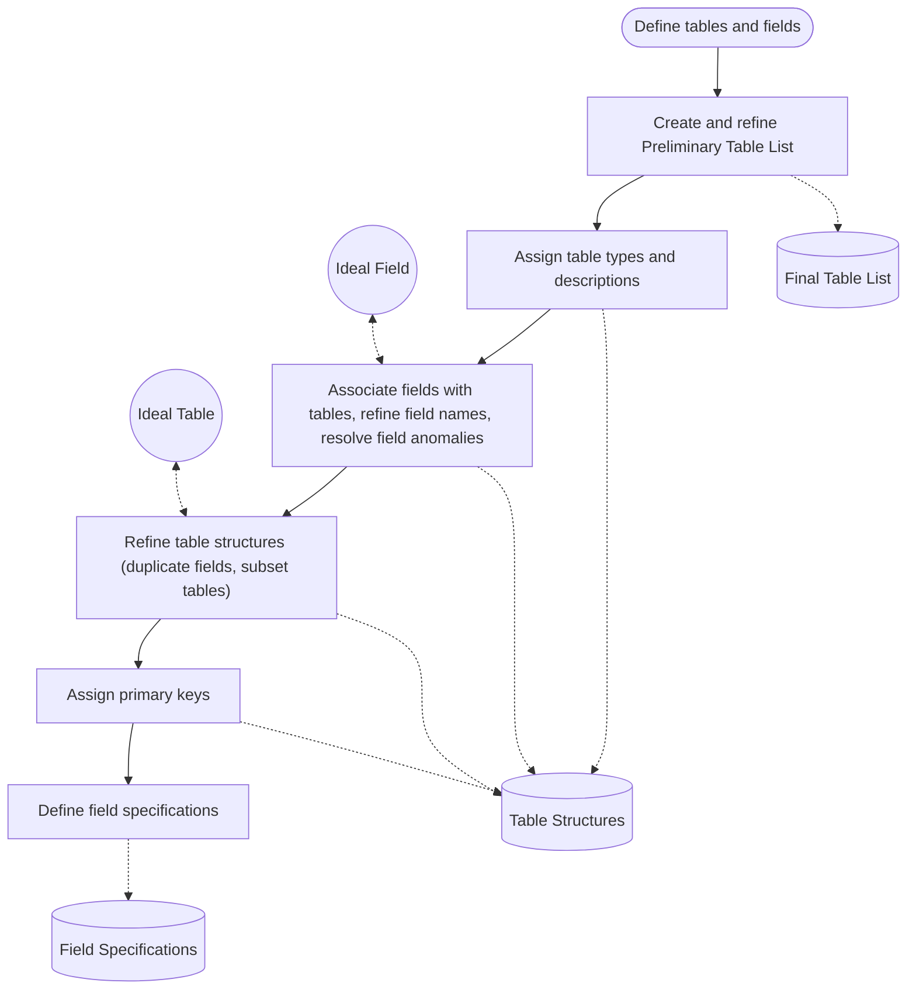
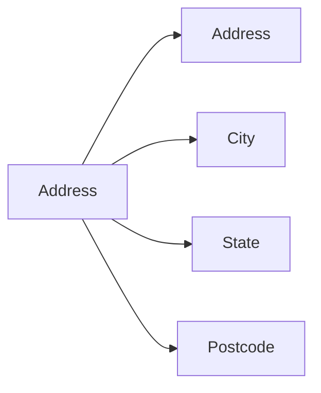
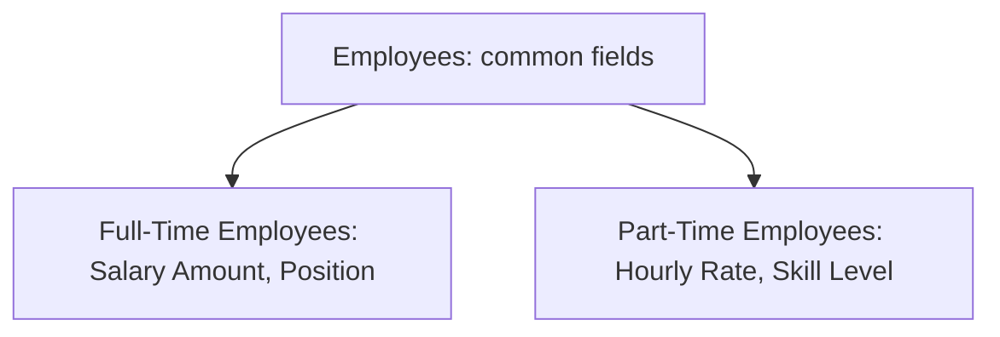

[[[]()]()]()Recommended reading: *Database Design for Mere Mortals*, Chapters 7 to 9.

By the end of this lesson, you should be able to:
- Identify and define a set of table structures for a database
- Assign fields to tables
- Resolve field and table anomalies by comparing them with an ideal field and an ideal table
- Assign primary keys to tables
- Complete field specifications for each field in a database

In [[Week 3 - Analyzing Existing Databases]] you finished with a Subject List, a [[Preliminary Field List]], and a Calculated Field List. This week turns those lists into actual [[Tables]] with [[Fields]], [[Primary Key|primary keys]], and [[Field Specifications|field specifications]].

## Tables and fields

> [!note] Definitions
> A **table** represents one individual *subject* in a well-designed database.
>
> **Fields** are the columns of a table. Each field represents one individual *characteristic* of the table's subject.

This is the same subject/characteristic split from Week 3, now with its final names: subjects become tables, and characteristics become fields.

Here is the whole process covered by this lesson. Each box gets its own section below.



The inputs to the first step are the three documents you already have: the Mission Objectives, the Subject List, and the Preliminary Field List.

## Building the preliminary table list

You create a **Preliminary Table List** by working through three sources, in this order:

1. The Preliminary Field List
2. The Subject List
3. The Mission Objectives

### Step 1: identify subjects in the Preliminary Field List

Review every field on the Preliminary Field List and look for groups of characteristics that all describe the same subject. Each subject you spot goes on the Preliminary Table List.

> [!example] Grouping fields into subjects
> A school's Preliminary Field List contains:
>
> | Field | Suggests |
> |---|---|
> | Course Code, Course Name, Course Description, Lab Fee | **Courses** |
> | Faculty First Name, Faculty Last Name, Date Hired, Phone Extension | **Faculty** |
> | Student First Name, Student Last Name, Home Phone, Address, City, State, Phone Extension, Status | **Students** |
>
> Nobody wrote "Faculty" on this list as a subject. The fields reveal it because four of them clearly describe a faculty member.

### Step 2: merge with the Subject List

Add the subjects from the Subject List to the Preliminary Table List. Now the list has items from two sources, so you'll run into two kinds of overlap.

**Duplicate subjects (same name).** Subjects with the same name may represent:

| Situation | What to do | Example |
|---|---|---|
| The same subject | *Remove* all but one | "Students" from the field list and "Students" from the Subject List |
| Two distinct subjects | *Rename* them to disambiguate | "Equipment" used for both tools and vehicles becomes "Tools" and "Vehicles" |

**Different names, same subject.** Some items have different names but mean the same thing, such as Client and Customer, Employee and Staff, or Product and Item. To resolve them:

1. Pick the name that best represents the subject.
2. Remove all the others.

### Table naming guidelines

While merging, you'll also be choosing names. Table names should be:

- **Unique**, because each one represents a different subject
- **Meaningful and descriptive**, so the subject is obvious
- **Unambiguous**, so only a *single* possible subject is implied
- **Short**, but don't use acronyms or abbreviations, and do use multiple words when that makes the name clearer

Three more guidelines point to deeper design problems:

> [!warning] Avoid words like "file", "record", "table", and "report"
> These words often mean the "subject" is really several subjects bundled together. A table called "Patient Record" should probably be broken down into **Patient**, **Examination**, and **Doctor**.

> [!warning] Avoid proper names
> A proper name makes the table too specific. "Southwest Region Employees" should probably just be **Employees**. The region is a characteristic of an employee, not a separate subject.

> [!tip] Consider using the plural form
> A plural name (Employees, Courses) tells you the table holds a *collection of instances* of the subject. It also separates table names from field names, which must be singular (Employee Name, Course Code).

### Step 3: cross-reference with the Mission Objectives

Review the Mission Objectives from Week 2 and apply the [[Subject Identification Technique]] to them. Add any new subjects to the Preliminary Table List, and watch for duplicates and items that represent the same subject, just like in step 2.

### The Final Table List

After reviewing all three sources, the Preliminary Table List becomes the **Final Table List**.

> [!important] The Final Table List is not final
> The name is misleading. You'll keep changing it as the design moves forward. It's called "final" because it's the primary list of tables you work with from now on.

Every table on the Final Table List gets three things: a **name**, a **type**, and a **description**.

## Table types

Assign every table a type. At this point, every table on the list is a **data table**. Later in the process you'll add three other types: *linking*, *subset*, and *validation* tables. Subset tables show up later in this lesson.

## Table descriptions

Every table needs a description that contains two things:

- A **definition** of what data the table stores
- The **reason** the table is required

Guidelines for writing them:

- Keep descriptions clear and succinct.
- Describe *why* the table is needed, not *how* the table is used.
- A description must not depend on another description. No "See X for further information."
- Don't include examples or implementation details.

> [!example] Why vs. what
> Two descriptions of a Suppliers table:
>
> **A.** "Suppliers: the people and organizations from which we purchase ingredients and equipment. This data enables sourcing of ingredients and equipment necessary in our operations."
>
> **B.** "Suppliers: the people and organizations from which we purchase ingredients and equipment. This allows us to keep track of the names, addresses, phone numbers, and contact names of our suppliers."
>
> **A is better.** It says *why* the organization needs the table. B only lists what's stored in it, which is a job for the fields.

> [!example] Too short, too long, the wrong reason, just right
> Four descriptions of a Student Schedules table:
>
> | Description | Verdict |
> |---|---|
> | "The class schedule of students." | Too short. No reason given. |
> | "All the classes that each student will attend (including the days, times, and faculty conducting the class) during the school year. This data lets students know the name of their classes and when and where they will be as well as the name of the teacher." | Too much detail. |
> | "Those classes students are scheduled to attend during this school year. This data is used by the registrar via the Student Admissions menu in the Registration Program." | Answers *how*, not *why*. It names a menu and a program, which are implementation details. |
> | "Those classes students are scheduled to attend during this school year. This data helps students implement effective time management and enables the school to determine class and student loads." | **Just right.** A definition plus a reason. |

When the list is done, review the Final Table List with representative users and managers, and verify that the descriptions are complete and accurate.

> [!example] Part of a Final Table List
> | Name | Type | Description |
> |---|---|---|
> | Classrooms | Data | The spaces or areas within a facility reserved for the purpose of conducting class proceedings. Information regarding the physical aspects, on-site resources, and availability of these areas is useful because it allows us to assign classes to the facility that can make the best use of these areas. |
> | Courses | Data | The programs of instruction conducted through courses offered by this institution. Course information must always reflect the addition of new courses, the deletion of old courses, and the continuing evolution of existing courses. |

## Assigning fields to tables

For each table on the Final Table List, assign the appropriate fields from the Preliminary Field List. Keep the rule in mind: tables represent subjects, and each field represents one specific characteristic of one specific subject.

> [!tip] A simple way to do it
> Start with a blank document and write the table names as column headings (for example Courses, Subjects, Instructors, Students). Then go through the Preliminary Field List one field at a time and put each field under the right table.

> [!note] Don't stress about getting it perfect
> You'll verify the field assignments later when you refine the table structures.

## Refining field names

Once the fields are assigned, update their names. The guidelines match the ones for tables. Field names should be:

- **Unique**, because each one represents a different characteristic
- **Meaningful and descriptive**, so it's obvious what data the field stores
- **Unambiguous**, so only a *single* possible characteristic is implied
- **Short**, without acronyms or abbreviations, using multiple words when that's clearer

### Prefixes for globally unique names

Consider adding a prefix so every field name is unique across the whole database. In a Customers table, use `CustomerName` (or `CustName`) instead of just `Name`.

- The field name tells you which table it belongs to.
- It reduces miscommunication when people discuss similar fields from different tables ("which Name do you mean?").

> [!note] Design-time only
> These prefixes probably will *not* be used when you implement the database in an [[RDBMS]]. They help during design discussions.

## Resolving field anomalies: the ideal field

Review the fields of each table, compare each one with the **ideal field**, and fix anything that diverges from it.

> [!important] The ideal field
> 1. Represents a distinct characteristic of its table's subject
> 2. Contains only a single value
> 3. Cannot be deconstructed into smaller components
> 4. Does not contain a calculated value
> 5. Is unique within the entire database structure

Three anomalies break these rules:

| Anomaly | Rule it breaks | Why it's a problem |
|---|---|---|
| [[Calculated Fields\|Calculated field]] | "Does not contain a calculated value" | Needs constant maintenance to stay in sync with the values it depends on |
| [[Multipart Fields\|Multipart field]] | "Cannot be deconstructed into smaller components" | Hard to get information out of the field without parsing strings |
| [[Multivalued Fields\|Multivalued field]] | "Contains only a single value" | Hard to filter or sort all the rows that have a specific value |

> [!tip] Fill in sample data
> Looking at field names alone often isn't enough to spot an anomaly. Write a few rows of realistic sample data and the problems become visible.
>
> | InstName | InstAddress | InstPhone | Categories Taught |
> |---|---|---|---|
> | Kira Bently | 3131 Mockingbird Lane, Seattle, WA 98157 | 221 363-9948 | DTP, SS, WP |
> | Bill Champlin | 7402 Kingman Drive, Redmond, WA 98115 | 230 527-4992 | WP, DB, OS |
> | Shannon Black | 4141 Lake City Way, Seattle, WA 98136 | 230 336-5992 | DB, SS |
> | Estela Rosales | 970 Phoenix Avenue, Bellevue, WA 98046 | 221 336-6992 | DTP, WP, PG |
>
> With data in it, **InstAddress** is obviously a multipart field (street, city, state, and zip in one cell), and **Categories Taught** is obviously multivalued (several categories in one cell). InstName is also multipart: it holds a first and a last name.

### Resolving multipart fields

Create a separate field for each subcomponent.



Applied to the Instructors table, InstName becomes InstFirst Name and InstLast Name, and InstAddress becomes InstStreet Address, InstCity, InstState, and InstZipcode.

### Resolving multivalued fields

1. Remove the field from the table.
2. Create a new table containing the multivalued field, and rename the field appropriately (usually to the singular).
3. Add the field(s) from the original table that will relate each entry in the new table to the matching entry in the original table.
4. Give the new table a name, a type (data), and a description, and add it to the Final Table List.

> [!example] Splitting out Categories Taught
> Categories Taught leaves the Instructors table. A new **Instructor Categories** table holds one row per instructor per category. InstFirst Name and InstLast Name are copied in so each row can be matched back to its instructor.
>
> | InstFirst Name | InstLast Name | Category Taught |
> |---|---|---|
> | Kira | Bently | DTP |
> | Kira | Bently | SS |
> | Kira | Bently | WP |
> | Bill | Champlin | WP |
> | Bill | Champlin | DB |
> | Bill | Champlin | OS |
> | Shannon | Black | DB |
> | Shannon | Black | SS |
>
> Description: "Instructor Categories: The categories of software programs that an instructor is qualified to teach. The information this table provides allows us to make certain that an adequate number of instructors exists for each software category."

Now you can find every instructor who teaches DB with a simple filter, which was awkward when "DB" was buried inside a comma-separated list.

#### When there are several multivalued fields

> [!example] Related multivalued fields go together
> A different version of Instructors has three multivalued fields:
>
> | InstFirst Name | InstLast Name | Campus Phone | Categories Taught | Maximum Level Taught | Languages Spoken |
> |---|---|---|---|---|---|
> | Kira | Bently | 221 363-9948 | DTP, OS, SS, WP | Intermediate, Basic, Advanced, Basic | French, Spanish |
> | Bill | Champlin | 230 527-4992 | DB, OS, UT, WP | Intermediate, Basic, Basic, Advanced | German, Spanish |
> | Shannon | Black | 230 336-5992 | DB, PG, SS | Advanced, Intermediate, Intermediate | French, German |
> | Estela | Rosales | 221 336-6992 | DTP, PG, WP | Basic, Intermediate, Basic | French, Italian, Spanish |
>
> Count the values: Kira has 4 categories and 4 levels, Shannon has 3 and 3. That correspondence means Categories Taught and Maximum Level Taught are **related**: each level belongs to one category. Languages Spoken has no such link.
>
> So the related pair goes into one new table, and the unrelated field gets its own:
> - **Instructors**: InstFirst Name, InstLast Name, Campus Phone
> - **Instructor Categories**: InstFirst Name, InstLast Name, Category Taught, Maximum Level
> - **Instructor Languages**: InstFirst Name, InstLast Name, Language Spoken

> [!important] Key insight
> **A multivalued field indicates a missed subject.** Resolving it is a matter of carefully identifying the true subject and its characteristics. "Categories an instructor teaches" was a subject all along; you just hadn't named it yet.

## Refining table structures: the ideal table

After resolving field-level anomalies, you also resolve table-level anomalies. The goal is to make sure the correct fields have been assigned to the correct tables.

> [!important] The ideal table
> - Represents a single subject (an object or an event)
> - Has a primary key
> - Does NOT contain multipart fields, multivalued fields, calculated fields, or duplicated fields (unless a duplicate is used to relate one table to another)
> - Contains an absolute minimum of redundant data

### Redundant data and duplicate fields

> [!note] Definitions
> **[[Redundant Data|Redundant data]]** is data repeated in multiple fields. It causes problems with data consistency and integrity. One goal of database design is to minimize it.
>
> A **duplicate field** is a field that appears in two or more tables. Duplicate fields introduce redundant data. There is only **one** acceptable reason for a duplicate field: relating two tables.

Duplicate fields that serve only as *reference information* are unnecessary. You can use [[SQL]] and [[Views]] to combine information from several tables whenever you need it. Keeping the duplicates means somebody has to maintain the data in both places to keep it consistent.

> [!example] Instruments and Manufacturers
> The Instruments table has these fields: Instrument ID, Instrument Description, Category, Price, Manufacturer, ManPhone, Web Site.
>
> The Manufacturers table has: Manufacturer, ManStreet Address, ManCity, ManState, ManZipcode, ManPhone, Web Site.
>
> - **Manufacturer** in Instruments is a duplicate, and that's fine: it relates each instrument to its manufacturer.
> - **ManPhone** and **Web Site** in Instruments are unnecessary duplicates. Fender's phone number appears on every Fender instrument row. Remove both from Instruments.

To see why the removed fields aren't lost, here is roughly how a query would bring them back when needed. (Illustration only; SQL syntax is covered separately.)

```sql
-- Phone and web site still come from Manufacturers, stored once
SELECT i.InstrumentDescription, i.Price, m.ManPhone, m.WebSite
FROM Instruments AS i
JOIN Manufacturers AS m ON m.Manufacturer = i.Manufacturer;
```

#### Repeating groups: Instrument 1, Instrument 2, Instrument 3

Duplicate fields can also appear inside a single table.

> [!example] A Students table with numbered fields
> | StdFirst Name | StdLast Name | StdStreet Address | Instrument 1 | Instrument 2 | Instrument 3 |
> |---|---|---|---|---|---|
> | Scott | Baker | 2904 Madison Ave | Guitar | Tenor Sax | |
> | Michael | Chow | 7410 Taxco Drive | Tenor Sax | Clarinet | Electric Piano |
> | Debbie | McGuire | 332 158th Ave SE | Drum Set | Bass Guitar | |
> | Angie | Thomson | 970 Pine Blvd | Guitar | Electric Piano | Snare Drum |
>
> Instrument 1, 2, and 3 are three occurrences of the same *type* of value. They are a characteristic of a subject nobody identified: **Student Instruments**. The fix is the same as for a multivalued field: move them into a new table with one row per student per instrument (StdFirst Name, StdLast Name, Instrument).
>
> If each instrument also has a Checkout Date 1, 2, 3, those dates move into Student Instruments too, as a single Checkout Date field. The instrument and its checkout date together describe the missed subject.

### Identifying subset tables

There are two situations that point to [[Subset Tables|subset tables]].

**1. Fields that are only sometimes filled.** In some tables, certain fields only have values for certain rows. Sometimes that means the table fails the "represents a single subject" rule.

> [!example] Inventory
> | Always filled | Only for equipment | Only for books |
> |---|---|---|
> | Item Name, Item Description, Current Value, Insured Value, Date Entered | Manufacturer, Model, Warranty Expiration Date | Publisher, Author, ISBN, Category |
>
> Create a new table for each subset and relate it to the original table:
> - **Inventory**: Item Name, Item Description, Current Value, Insured Value, Date Entered
> - **Equipment**: Item Name, Manufacturer, Model, Warranty Expiration Date
> - **Books**: Item Name, Publisher, Author, ISBN, Category
>
> Item Name stays in all three because it relates each subset row to its inventory row.

**2. Several very similar tables.** Ask whether they represent different *kinds* of the same subject. If they do:

1. Make a new table containing all the fields the tables share.
2. Remove those common fields from the original tables, except the relating fields.
3. The original tables become subset tables.

> [!example] Full-time and part-time employees
> Before:
> - **Full-Time Employees**: FTEFirst Name, FTELast Name, FTEDate Hired, Salary Amount, Position, FTEStreet Address, FTECity, FTEState
> - **Part-Time Employees**: PTEFirst Name, PTELast Name, PTEDate Hired, Hourly Rate, Skill Level, PTEStreet Address, PTECity, PTEState
>
> After:
> - **Employees**: EmpFirst Name, EmpLast Name, Date Hired, EmpStreet Address, EmpCity, EmpState
> - **Full-Time Employees**: EmpFirst Name, EmpLast Name, Salary Amount, Position
> - **Part-Time Employees**: EmpFirst Name, EmpLast Name, Hourly Rate, Skill Level

> [!note] Subset tables represent "is-a" relationships
> A full-time employee **is an** employee. A book **is an** inventory item.
> - *Specific* fields go in the subset tables.
> - Fields *common* to the subsets go in the table the subsets refer to.
>
> This kind of relationship is also called [[Supertype and Subtype|supertype/subtype]].



> [!warning] New tables need a type and a description too
> Every table you create while refining fields or tables (Instructor Categories, Student Instruments, Equipment, Books...) must get a type and a description, and be added to the Final Table List.

### Summary so far

1. Build the preliminary table list from the Preliminary Field List, the Subject List, and the Mission Objectives. Resolve duplicates and items that represent the same subject.
2. Refine it into the Final Table List by refining table names, setting the table type to data, and assigning table descriptions.
3. Associate fields with tables and refine field names.
4. Use the ideal field to resolve field anomalies: eliminate multipart and multivalued fields.
5. Use the ideal table to refine table structures: eliminate duplicate fields and identify subset tables.

## Case study: Mike's Bikes

**1. Build the preliminary table list.** From the Preliminary Field List (Birth Date, Employee Name, Employee Address, Employee City, Customer Name, Customer Address, Office Phone, Product Name, Category, Unit Price, Invoice Number, Invoice Date), the Subject List (Customers, Employees, Products, Sales, Suppliers), and the Mission Objectives, the Preliminary Table List becomes: **Customers, Employees, Invoices, Products, Vendors**.

"Sales" and "Suppliers" were crossed off the Subject List. Invoice Number and Invoice Date on the field list point to an **Invoices** subject, which covers what "Sales" meant, and "Suppliers" was renamed **Vendors**.

**2. Refine to the Final Table List.**

| Name | Type | Description |
|---|---|---|
| Customers | Data | The people who purchase the products we have to offer. Keeping track of our customers allows us to promote our business and obtain valuable feedback in assessing the quality of our customer service. |
| Employees | Data | The people who work for our company in various capacities. This information is important for tax purposes, health benefits, and work-related issues. |

**3. Associate fields with tables.**

| Customers | Employees | Invoices | Products |
|---|---|---|---|
| Customer First Name | Employee Name | Invoice Number | Product Name |
| Customer Last Name | Employee Address | Invoice Date | Product Description |
| Customer Phone | Employee Phone | Employee Name | Category |
| Customer Address | SSN | Customer Last Name | Wholesale Price |
| Status | Date Hired | Customer First Name | Retail Price |
| | Position | Customer Phone | Quantity |

**4. Use the ideal field to resolve field anomalies.** Employee Name and Employee Address are multipart fields. After splitting them, adding prefixes, and clarifying names (SSN becomes Social Security Number, Quantity becomes Quantity On Hand):

| Customers | Employees | Invoices | Products |
|---|---|---|---|
| CustFirst Name | EmpFirst Name | Invoice Number | Product Name |
| CustLast Name | EmpLast Name | Invoice Date | Product Description |
| CustHome Phone | EmpHome Phone | EmpFirst Name | Category |
| CustStreet Address | Social Security Number | EmpLast Name | Wholesale Price |
| CustCity | EmpStreet Address | CustFirst Name | Retail Price |
| CustState | EmpCity | CustLast Name | Quantity On Hand |
| CustZipcode | EmpState | CustHome Phone | |

**5. Use the ideal table to refine table structures.**
- **CustHome Phone** in Invoices is an unnecessary duplicate of CustHome Phone in Customers. Remove it from Invoices. (CustFirst Name and CustLast Name stay, because they relate the invoice to the customer.)
- The Products table also has Service Name, Service Description, Service Category, Service Type, Materials Charge, and Service Charge. A service seems to be a special *kind of* product, so **Services** becomes a subset table of Products: Product Name (relating field), Service Type, Materials Charge, Service Charge.

## Keys

The next step is to assign keys to each table. Keys:

- Ensure that each record in a table can be specifically **identified**
- Help establish and enforce various types of **integrity**
- Are required for establishing table **relationships**

### Candidate keys

> [!note] Definition
> A **[[Candidate Key|candidate key]]** is a field or set of fields that uniquely identifies a single instance of the table's subject. Only **one row** can have a given value (or set of values) for the candidate key fields.

A candidate key must meet all of these requirements:

- Each value uniquely determines one record in the table.
- Each value *exclusively* identifies the value of every other field in that record.
- Its possible values must uniquely identify each record, so no two rows can ever have the same value.
- It has a minimal number of fields.
- It cannot contain a multipart field.
- It cannot contain null values. No part of it may be optional.
- Its values cannot cause security or privacy breaches.
- Its value never (or extremely rarely) changes.

> [!example] Which fields in Employees could be a candidate key?
> | Employee ID | Social Security Number | EmpFirst Name | EmpLast Name | EmpStreet Address | EmpCity | EmpState | EmpZipcode | EmpHome Phone |
> |---|---|---|---|---|---|---|---|---|
> | 1000 | 987-65-9938 | Kira | Bently | 1204 Bryant Road | Seattle | WA | 98157 | 221 363-9948 |
> | 1001 | 987-65-6531 | Katherine | Erlich | 101 C Street, Apt. 32 | Bellevue | WA | 98046 | 235 322-6992 |
> | 1002 | 987-65-0039 | Bill | Champlin | 7402 Kingman Drive | Redmond | WA | 98115 | 235 527-4992 |
> | 1003 | 987-65-1299 | Shannon | Black | 4141 Lake City Way | Seattle | WA | 98136 | 221 336-5992 |
> | 1004 | 987-65-6529 | Susan | Black | 2100 Mineola Avenue | Seattle | WA | 98115 | 230 572-9948 |
> | 1005 | 987-65-5583 | Estela | Rosales | 101 C Street, Apt. 32 | Bellevue | WA | 98046 | 235 322-6992 |
> | 1006 | 987-65-1734 | Bill | Sherman | 66 NE 120th | Bothell | WA | 98216 | 222 522-3232 |
>
> | Field | Eligible? | Why |
> |---|---|---|
> | Employee ID | **Eligible** | Unique, single field, never changes |
> | Social Security Number | Ineligible | Exposes private information |
> | EmpFirst Name, EmpLast Name | Ineligible | Not unique: two Bills, two Blacks |
> | EmpZipcode | Ineligible | Not unique: 98046 and 98115 each appear twice |
> | EmpHome Phone | Ineligible | Not unique: Erlich and Rosales share 235 322-6992 |

### Surrogate (artificial) keys

Some tables have no candidate key at all. You can always create a **[[Surrogate Key|surrogate key]]**: a field whose only purpose is to be a candidate key for the table.

Surrogate keys are useful even in tables that already have candidate keys, because they are:
- Always single-field and integer-based
- Easier to work with
- More efficient

> [!tip] Rule of thumb
> Unless a table has an obvious single-field, integer-based ID, always add a surrogate key.

### Primary keys

For each table, select **one** of the candidate keys to be the [[Primary Key|primary key]]. It identifies individual records of the table throughout the whole database, and it has to meet the same requirements as any candidate key.

How to choose:
- Prefer **single-field** (simple) keys over multi-field (composite) keys.
- Prefer **integer-based** keys over non-integer keys.
- A surrogate key is almost always a good choice.

> [!important] Subset tables share the parent's primary key
> A subset table must have the same primary key as its parent table. For example, Full-Time Employees and Part-Time Employees would both use Employee ID.

### Double-check the primary key with functional dependence

It's vital that the primary key meets this requirement: each value *exclusively* identifies the value of every other field in the record. In other words, **each field in a table must be functionally dependent on ONLY candidate keys** (including the primary key).

> [!note] Functional dependence
> Column B is **[[Functional Dependency|functionally dependent]]** on column A if the value in B can be determined from the value in A.
>
> Notation: **A → B**, read "A determines B" or "B is functionally dependent on A".

> [!example] Sales Invoices
> | Invoice Number | Invoice Date | CustFirst Name | CustLast Name | EmpFirst Name | EmpLast Name | EmpHome Phone |
> |---|---|---|---|---|---|---|
> | 13000 | 06/15/20 | Frank | DeSoto | Estela | Rosales | 235 363-9948 |
> | 13001 | 06/15/20 | Gregory | Mattson | Katherine | Erlich | 235 322-6992 |
> | 13002 | 06/15/20 | Carmen | Aguilar | Kira | Bently | 221 527-4992 |
> | 13003 | 06/16/20 | David | Cunningham | Kira | Bently | 221 527-4992 |
> | 13004 | 06/16/20 | Carmen | Aguilar | Shannon | Black | 221 572-9948 |
> | 13005 | 06/17/20 | Frank | DeSoto | Estela | Rosales | 235 322-6992 |
>
> Yes, Invoice Number → EmpHome Phone. But EmpHome Phone is *also* functionally dependent on (EmpFirst Name, EmpLast Name), which is **not** a candidate key for this table. That extra dependency means EmpHome Phone doesn't belong here and can be removed. It's a characteristic of the employee, not of the invoice.
>
> Look at Estela Rosales: invoice 13000 lists her phone as 235 363-9948 and invoice 13005 lists 235 322-6992. Storing her phone on every invoice has already produced inconsistent data.

### Review table designs

At this point, review the table designs with users and management:

- Make sure all necessary subjects are represented by tables.
- Make sure table names and descriptions are suitable and meaningful.
- Make sure field names are suitable and meaningful.
- Verify that fields have been assigned to the appropriate tables.

> [!note] Keys summary
> 1. Identify candidate keys for each table.
> 2. Assign surrogate keys if there are no integer-based single-field candidate keys.
> 3. For each table, make one of the candidate keys the primary key. Subset tables must have the same primary key as their parent table.
> 4. Review the table structures with stakeholders.

## Field specifications

Developing field specifications is the final step in defining the initial table structure. Field specifications:

- Help establish and enforce field-level (domain) integrity
- Improve overall data integrity
- Force a thorough understanding of the nature and purpose of the data
- Guide the physical database implementation

> [!note] Field-level (domain) integrity means...
> - The field conforms to the requirements of the ideal field.
> - The identity and purpose of the field are clear.
> - All tables in which the field appears have been identified.
> - Field definitions are consistent throughout the database.
> - Field values are consistent and valid.
> - The allowable types of modifications have been identified for the field.

A field specification has three groups of elements:

| Group | What it covers |
|---|---|
| **General elements** | The field's fundamental nature and purpose |
| **Physical elements** | The structure of the field |
| **Logical elements** | Constraints on the possible values of the field |

### General elements

- **Field name**
- **Parent table**: the table the field belongs to
- **Specification type**: whether the specification is Unique, Generic, or Replica
- **Source specification**: only used in Replica specifications, to say which specification this one is a replica of
- **Shared by**: used in primary key fields to list other related tables
- **Description**: a concise description of the field

(One slide lists the second specification type as "General", but the later slides and the example form call it **Generic**.)

### Physical elements

- **Data type**: numeric, text, date, etc.
- **Decimal places**: for numbers, how many digits to the right of the decimal point
- **Length**: for text, constraints on the length of values
- **Character support**: for text, which characters are valid (letters A to Z, numbers 0 to 9, keyboard symbols like `. , / $ # %`, special symbols like `© ® ™ Σ π`)

### Logical elements

- **Key type**: whether the field is a key, and what kind (non-key, primary, foreign, alternate)
- **Key structure**: simple or composite
- **Uniqueness**: whether the field's values must be unique in the table
- **Null support**: whether the field is nullable
- **Values entered by**: the user or the system
- **Required value**: whether a value is required
- **Default value**: the value used if none is supplied
- **Range of values**: the possible values for the field
- **Edit rule**: when the value can be set for a new record, and whether it can be changed later (Enter Now/Edits Allowed, Enter Now/Edits Not Allowed, Enter Later/Edits Allowed, Enter Later/Edits Not Allowed, Not Determined At This Time)

> [!example] A complete specification: Employee ID Number
> **General elements**
>
> | Element | Value |
> |---|---|
> | Field Name | Employee ID Number |
> | Parent Table | Employees |
> | Specification Type | Unique |
> | Source Specification | (none) |
> | Shared By | Full-Time Employees, Part-Time Employees, Customers |
> | Description | A unique number used to identify each employee within our organization. It is assigned during the first day of Employee Orientation and remains with the employee throughout the duration of his or her employment. |
>
> **Physical elements**
>
> | Element | Value |
> |---|---|
> | Data Type | Numeric |
> | Length | 4 |
> | Decimal Places | 0 |
> | Character Support | Numbers (0-9) |
>
> **Logical elements**
>
> | Element | Value |
> |---|---|
> | Key Type | Primary |
> | Key Structure | Simple |
> | Uniqueness | Unique |
> | Null Support | No Nulls |
> | Values Entered By | System |
> | Required Value | Yes |
> | Range of Values | 1000 - 9999 |
> | Edit Rule | Enter Now, Edits Not Allowed |

The specification is still a design document, but it maps closely onto the eventual table definition. As an illustration of how it could guide implementation:

```sql
CREATE TABLE Employees (
    EmployeeID INT NOT NULL PRIMARY KEY          -- Primary, simple, unique, no nulls
        CHECK (EmployeeID BETWEEN 1000 AND 9999) -- Range of values
    -- other fields...
);
```

### Unique, generic, and replica specifications

| Type | Used for |
|---|---|
| **Unique** | Fields that are unique in the database |
| **Generic** | Specifying the attributes of fields that appear in many places in the database. Useful for common fields like FirstName, Province, or Address. |
| **Replica** | Marking a field as a replica of a generic field. A replica can (and should) override attributes set in the generic specification. |

> [!example] How the three work together
> You write one **Generic** specification for "First Name" (text, letters only, some maximum length). CustFirst Name and EmpFirst Name are **Replica** specifications that point to it as their source specification, and each one overrides what it needs to, such as its parent table and description. Employee ID Number appears nowhere else as a template, so it gets a **Unique** specification.

## Summary

- A table represents one subject, and each field represents one characteristic of that subject.
- The Preliminary Table List is built from the Preliminary Field List, the Subject List, and the Mission Objectives, with duplicates and synonyms resolved. It becomes the Final Table List once every table has a name, a type, and a description that says *why* the table is needed.
- The ideal field has a single, atomic, non-calculated value. Multipart fields are split into separate fields; multivalued fields move into a new table because they reveal a missed subject.
- The ideal table represents one subject, has a primary key, and keeps redundant data to a minimum. Duplicate fields are only allowed for relating tables. Tables with sometimes-filled fields, or several very similar tables, become supertype/subtype (subset) structures.
- Every table needs a primary key chosen from its candidate keys, preferably a single-field integer, often a surrogate key. Every field must depend only on candidate keys.
- Field specifications (general, physical, and logical elements) establish domain integrity and guide the physical implementation.

See also [[Week 3 - Analyzing Existing Databases]] for where the Subject List and Preliminary Field List came from, and [[Database Design]] for the methodology as a whole.

Further reading:
- [SQL PRIMARY KEY constraint (W3Schools)](https://www.w3schools.com/sql/sql_primarykey.asp)
- [Candidate key in DBMS (GeeksforGeeks)](https://www.geeksforgeeks.org/dbms/candidate-key-in-dbms/)
- [Functional dependency and attribute closure (GeeksforGeeks)](https://www.geeksforgeeks.org/dbms/functional-dependency-and-attribute-closure/)
- [PostgreSQL: constraints (NOT NULL, CHECK, UNIQUE, PRIMARY KEY)](https://www.postgresql.org/docs/current/ddl-constraints.html), how many field specification elements end up enforced in a real database
- [SQL views (W3Schools)](https://www.w3schools.com/sql/sql_view.asp)

## Exercises

### Exercise 1 (Direct application)
A Preliminary Field List for a veterinary clinic contains: Pet Name, Species, Breed, Owner First Name, Owner Last Name, Owner Phone, Visit Date, Visit Reason, Vet First Name, Vet Last Name, Vet Specialty. The Subject List contains: Pets, Owners, Clients, Veterinarians, Appointments. Build the Preliminary Table List and explain each decision.

> [!success]- Answer key
> **From the field list:** the fields group into Pets (Pet Name, Species, Breed), Owners (Owner First/Last Name, Owner Phone), Visits (Visit Date, Visit Reason), and Veterinarians (Vet First/Last Name, Vet Specialty).
>
> **Merging with the Subject List:**
> - "Pets", "Owners", and "Veterinarians" are duplicates of subjects already found. Remove all but one of each.
> - "Owners" and "Clients" have different names but represent the same subject. Pick the name that best represents it (for a vet clinic, "Owners" or "Clients" both work; choose one) and remove the other.
> - "Visits" and "Appointments" may be the same subject. If an appointment is simply a scheduled visit, keep one name. If the clinic also tracks walk-ins without appointments, you'd need to ask before deciding.
>
> A reasonable result: **Pets, Owners, Veterinarians, Appointments**. You'd still cross-reference the Mission Objectives before calling it the Final Table List.

### Exercise 2 (Direct application)
Fix these table names and say which guideline each one breaks: `Cust`, `Toronto Store Sales`, `Order Record`, `Stuff`, `Product`.

> [!success]- Answer key
> - **Cust**: uses an abbreviation. Rename to **Customers**.
> - **Toronto Store Sales**: contains a proper name, so it's too specific. Rename to **Sales** (the store becomes a characteristic of a sale).
> - **Order Record**: contains "record", which suggests several subjects bundled together. It probably breaks down into **Orders**, **Order Details** (or similar), and whatever else the record holds, like **Customers**.
> - **Stuff**: not meaningful or descriptive, and ambiguous. Ask what it holds and name the real subject (for example **Inventory Items**).
> - **Product**: not wrong, but consider the plural **Products** to show the table holds a collection and to separate it from singular field names.

### Exercise 3 (Direct application)
Write a table description for a **Vendors** table at Mike's Bikes. Then write a *bad* version that answers "how" instead of "why".

> [!success]- Answer key
> **Good:** "Vendors: the companies from which we purchase the bikes, parts, and accessories we sell. This data allows us to reorder stock reliably and compare vendors when making purchasing decisions."
> It has a definition (what is stored) and a reason (why the business needs it). It doesn't list fields, mention software, or give examples.
>
> **Bad (how, not why):** "Vendors: the companies we buy from. This data is entered by the manager through the Purchasing screen and printed on the weekly Vendor Report." It describes how the table is used and includes implementation details (a screen, a report).

### Exercise 4 (Applied variation)
A Members table for a gym has these fields and sample row:

| MemName | MemAddress | Classes Attended | Membership Fee | Fee With Tax |
|---|---|---|---|---|
| Ana Souza | 12 King St, Sault Ste. Marie, ON P6A 1A1 | Yoga, Spin, Pilates | 50.00 | 56.50 |

Identify every field anomaly, name its type, and resolve it.

> [!success]- Answer key
> - **MemName** is multipart (first and last name). Split into MemFirst Name and MemLast Name.
> - **MemAddress** is multipart. Split into MemStreet Address, MemCity, MemProvince, MemPostcode.
> - **Classes Attended** is multivalued. Remove it, create a new table **Member Classes** with a single Class field (renamed from the plural), and copy in the fields that relate each row back to the member (for now, MemFirst Name and MemLast Name; later, the primary key). Give the new table a type (data) and a description, and add it to the Final Table List.
> - **Fee With Tax** is a calculated field (Membership Fee plus tax). Remove it; it would need constant maintenance to stay in sync with Membership Fee.
>
> Membership Fee itself is fine: one single, atomic value.

### Exercise 5 (Applied variation)
An Orders table has: Order Number, Order Date, Customer Name, Customer Email, Customer Phone, Product 1, Qty 1, Product 2, Qty 2, Product 3, Qty 3. A separate Customers table already has Customer Name, Customer Email, and Customer Phone. Refine the Orders table using the ideal table.

> [!success]- Answer key
> - **Customer Email** and **Customer Phone** in Orders are unnecessary duplicates of fields in Customers. They're reference information only, so remove them. You can combine the tables with SQL or a view when you need them.
> - **Customer Name** is also a duplicate, but it relates each order to its customer, which is the one acceptable reason. Keep it (later it will be replaced by the customer's primary key).
> - **Product 1/2/3** and **Qty 1/2/3** are repeating duplicate fields. Each Product/Qty pair is related (the quantity belongs to that product), so both move into one new table, for example **Order Items**, with Order Number (relating field), Product, and Quantity, one row per product per order. Like related multivalued fields, related repeating fields go into the same new table.
> - Give Order Items a type and a description.

### Exercise 6 (Applied variation)
Using the Sales Invoices example in this note, list every functional dependency you can find that involves EmpHome Phone, and explain which ones break the primary key rule.

> [!success]- Answer key
> - **Invoice Number → EmpHome Phone.** Invoice Number is the primary key, so this dependency is expected.
> - **(EmpFirst Name, EmpLast Name) → EmpHome Phone.** An employee's name determines their home phone. But (EmpFirst Name, EmpLast Name) is not a candidate key for Sales Invoices: Kira Bently and Estela Rosales each appear on more than one invoice.
>
> The rule says each field must be functionally dependent on **only** candidate keys. The second dependency breaks it, so EmpHome Phone belongs in the Employees table, not here. The sample data proves the damage: Estela Rosales has two different phone numbers across invoices 13000 and 13005.

### Exercise 7 (Challenge)
A college has two tables: **Students** (StdFirst Name, StdLast Name, StdEmail, Date Enrolled, Program, GPA) and **Alumni** (AlmFirst Name, AlmLast Name, AlmEmail, Date Enrolled, Graduation Date, Employer). Decide whether subset tables apply, design the result, choose primary keys, and justify each step.

> [!success]- Answer key
> The tables are very similar and share first name, last name, email, and date enrolled. Ask: are they different *kinds* of the same subject? A current student **is a** person who studied at the college, and so is an alumnus. So yes: this is an is-a (supertype/subtype) relationship.
>
> 1. Create a new table with the shared fields, for example **College Members** (or **People**): PersonFirst Name, PersonLast Name, PersonEmail, Date Enrolled.
> 2. Remove the common fields from the originals, except the relating fields.
> 3. The originals become subset tables: **Current Students** (Program, GPA) and **Alumni** (Graduation Date, Employer).
>
> **Keys:** names aren't unique, and email may change (graduates often lose their college address), so neither is a good candidate key. There's no obvious single-field integer ID, so add a **surrogate key** such as Person ID. Both subset tables must use the same primary key as the parent, Person ID, which also relates them to it.
>
> **GPA:** it's worth asking whether GPA is a calculated field (computed from grades). If the database stores grades elsewhere, GPA should be removed.
>
> Don't forget to give all three tables a type and a description.

### Exercise 8 (Challenge)
Write the full field specification (general, physical, and logical elements) for a **Province** field that appears in the Customers, Employees, and Vendors tables. Use generic and replica specifications where appropriate.

> [!success]- Answer key
> Province appears in several places, so write **one Generic specification** and a **Replica** for each table.
>
> **Generic: Province**
> - General: Field Name: Province. Specification Type: Generic. Description: "The province or territory in which an address is located."
> - Physical: Data Type: Text (alphanumeric). Length: 2. Decimal Places: n/a. Character Support: Letters (A-Z).
> - Logical: Key Type: Non. Key Structure: n/a. Uniqueness: Non-unique. Null Support: No Nulls. Values Entered By: User. Required Value: Yes. Range of Values: the 13 two-letter codes (AB, BC, MB, NB, NL, NS, NT, NU, ON, PE, QC, SK, YT). Edit Rule: Enter Now, Edits Allowed.
>
> **Replica: CustProvince**
> - Field Name: CustProvince. Parent Table: Customers. Specification Type: Replica. Source Specification: Province. Description overridden: "The province or territory of the customer's mailing address." Everything else inherited.
>
> **Replica: EmpProvince**, **VendProvince**: same pattern with their own parent table and description. A replica can override other attributes too; for instance, if vendors can be outside Canada, VendProvince might allow nulls or a wider range of values.
>
> The benefit: the rules for "Province" are defined once and stay consistent throughout the database, which is part of field-level integrity.

## Feynman practice

Write the answers in your own words. Don't look at the note while writing step 1.

### Feynman: From lists to a Final Table List

- [ ] **1. Explain it as if to a 12-year-old.** You're organizing a school library and have three piles of sticky notes from different people describing what the library holds. How would you turn those piles into a clean list of shelves, and what would you do with "Books" written twice, or "Comics" and "Graphic Novels" written separately?
- [ ] **2. Find the gaps.** Reread what you wrote. Mark with `[?]` any word a 12-year-old wouldn't understand (for example "disambiguate", "subject", "mission objective").
- [ ] **3. Go back to the source and simplify.** For each `[?]`, write an analogy or a concrete example. Why does a table description need a *reason*, and not just a list of what's in it?
- [ ] **4. Organize and test.** Rewrite the explanation in 3 to 5 sentences. Could you teach it in 2 minutes, including why the "Final" Table List isn't final?

### Feynman: The ideal field

- [ ] **1. Explain it as if to a 12-year-old.** Imagine a school form where one box says "Address" and another says "Favourite sports". Explain why a computer has trouble finding "everyone who lives in Sault Ste. Marie" or "everyone who plays hockey" from those boxes.
- [ ] **2. Find the gaps.** Mark with `[?]` terms like "multipart", "multivalued", "calculated", "parsing".
- [ ] **3. Go back to the source and simplify.** For each `[?]`, write an everyday example. Why does a multivalued field mean you "missed a subject"?
- [ ] **4. Organize and test.** Rewrite in 3 to 5 sentences covering all five properties of the ideal field.

### Feynman: Duplicate fields and subset tables

- [ ] **1. Explain it as if to a 12-year-old.** If your phone number is written in ten different notebooks and you get a new number, what happens? Use that to explain why duplicate fields are bad, and the one case where copying a field is fine.
- [ ] **2. Find the gaps.** Mark with `[?]` words like "redundant", "integrity", "is-a relationship", "supertype".
- [ ] **3. Go back to the source and simplify.** For each `[?]`, give an example. How are "a book is an inventory item" and "a full-time employee is an employee" the same idea?
- [ ] **4. Organize and test.** Rewrite in 3 to 5 sentences. Could someone use your explanation to decide where a "Salary Amount" field goes?

### Feynman: Candidate keys, primary keys, and functional dependence

- [ ] **1. Explain it as if to a 12-year-old.** In a classroom, why is a student number a better way to find exactly one student than their first name, their phone number, or their postal code? Why not use their social insurance number?
- [ ] **2. Find the gaps.** Mark with `[?]` terms like "candidate key", "surrogate", "null", "functionally dependent".
- [ ] **3. Go back to the source and simplify.** For each `[?]`, write a concrete example. Explain "A → B" using something from real life (a student number determines a student's name).
- [ ] **4. Organize and test.** Rewrite in 3 to 5 sentences. Can you explain why EmpHome Phone doesn't belong in a Sales Invoices table?

### Feynman: Field specifications

- [ ] **1. Explain it as if to a 12-year-old.** A field specification is like the rules printed on a form ("use capital letters", "numbers only", "must fill in"). Explain what the general, physical, and logical parts each describe.
- [ ] **2. Find the gaps.** Mark with `[?]` terms like "domain integrity", "nullable", "edit rule", "replica".
- [ ] **3. Go back to the source and simplify.** For each `[?]`, give an example using the Employee ID Number specification.
- [ ] **4. Organize and test.** Rewrite in 3 to 5 sentences, including why generic and replica specifications save work.

## Flashcards

Copy the block below into a `.txt` file and import it into Anki (File > Import), mapping column 1 to Front, column 2 to Back, and column 3 to Tags.

```
#separator:tab
#html:false
#tags column:3
In a well-designed database, what does a table represent?	One individual subject.	csd216 week-04
In a well-designed database, what does a field represent?	One individual characteristic of the table's subject.	csd216 week-04
What three documents are used to build the Preliminary Table List?	The Preliminary Field List, the Subject List, and the Mission Objectives.	csd216 week-04
Two subjects share a name but mean different things (e.g. "Equipment" for tools and vehicles). What do you do?	Rename them to disambiguate, e.g. Tools and Vehicles.	csd216 week-04
Several items have different names but mean the same subject (Client, Customer). What do you do?	Pick the name that best represents the subject and remove the others.	csd216 week-04
Why avoid words like "file", "record", "table", or "report" in a table name?	They often indicate an incorrect subject that should be broken down into several subjects.	csd216 week-04
Why avoid proper names in table names, e.g. "Southwest Region Employees"?	They make the table too specific; it should probably just be Employees.	csd216 week-04
Why consider plural table names?	They show the table holds a collection of instances and distinguish tables from fields, which must be singular.	csd216 week-04
In what sense is the Final Table List "not final"?	It will keep changing, but it is the primary list of tables you work with from now on.	csd216 week-04
What type are all tables on the initial Final Table List?	Data tables.	csd216 week-04
Besides data tables, what three table types will be added later?	Linking, subset, and validation tables.	csd216 week-04
What two things must a table description contain?	A definition of what data the table stores and the reason the table is required.	csd216 week-04
A table description should describe why the table is needed, not what?	How the table is used.	csd216 week-04
Name two things a table description must not include.	Examples, implementation details, or references to other descriptions ("See X").	csd216 week-04
Why add prefixes like Cust or Emp to field names during design?	To make field names globally unique, show which table they belong to, and reduce miscommunication.	csd216 week-04
Are design-time field name prefixes usually kept in the implemented RDBMS?	No, they probably won't be used in the implementation.	csd216 week-04
List the five properties of the ideal field.	Distinct characteristic of its table's subject; single value; can't be broken into smaller parts; not calculated; unique within the whole database.	csd216 week-04
Why avoid calculated fields?	They need constant maintenance to stay in sync with the values they depend on.	csd216 week-04
Why avoid multipart fields?	It's hard to get information out of them without parsing strings.	csd216 week-04
Why avoid multivalued fields?	They make it hard to filter or sort rows that have a specific value.	csd216 week-04
What is the best way to spot field anomalies that names alone don't reveal?	Fill in sample data.	csd216 week-04
How do you resolve a multipart field?	Create a separate field for each subcomponent (e.g. Address, City, State, Postcode).	csd216 week-04
What are the four steps to resolve a multivalued field?	Remove it; create a new table with it (renamed); add relating fields from the original table; give the new table a name, type, and description and add it to the Final Table List.	csd216 week-04
What does a multivalued field indicate about the design?	A missed subject.	csd216 week-04
Two multivalued fields always have matching numbers of values per row. What does that mean?	They are related and go into the same new table.	csd216 week-04
List the properties of the ideal table.	Single subject; has a primary key; no multipart, multivalued, calculated, or unnecessary duplicate fields; minimal redundant data.	csd216 week-04
What is redundant data?	Data repeated in multiple fields; it causes consistency and integrity problems.	csd216 week-04
What is a duplicate field?	A field that appears in two or more tables.	csd216 week-04
What is the only acceptable reason for a duplicate field?	Relating two tables.	csd216 week-04
Why are duplicate fields used only as reference information unnecessary?	SQL and views can combine data from multiple tables, and duplicates must be maintained for consistency.	csd216 week-04
What two situations suggest subset tables?	Fields that are only sometimes filled, and several very similar tables representing kinds of the same subject.	csd216 week-04
What kind of relationship do subset tables represent?	An is-a relationship, also called supertype/subtype.	csd216 week-04
In a supertype/subtype design, where do common fields and specific fields go?	Common fields go in the supertype (referred-to) table; specific fields go in the subset tables.	csd216 week-04
What three things do keys do for a table?	Identify each record, help enforce integrity, and allow table relationships.	csd216 week-04
What is a candidate key?	A field or set of fields that uniquely identifies a single instance of the table's subject.	csd216 week-04
Why is Social Security Number ineligible as a candidate key?	Its values can cause a security or privacy breach.	csd216 week-04
Can a candidate key contain null values?	No; no part of it may be optional.	csd216 week-04
Name four requirements of a candidate key besides uniqueness.	Any four of: minimal fields, no multipart field, no nulls, no privacy/security risk, value rarely or never changes, exclusively determines every other field.	csd216 week-04
What is a surrogate key?	An artificial field whose only purpose is to be a candidate key for the table.	csd216 week-04
Why are surrogate keys useful even when a table has a candidate key?	They are single-field and integer-based, easier to work with, and more efficient.	csd216 week-04
When should you add a surrogate key?	Unless the table has an obvious single-field, integer-based ID.	csd216 week-04
How many candidate keys become the primary key?	Exactly one.	csd216 week-04
When choosing a primary key, what do you prefer?	Single-field over composite, integer-based over non-integer; a surrogate key is almost always a good choice.	csd216 week-04
What primary key must a subset table have?	The same primary key as its parent table.	csd216 week-04
What does A → B mean?	A determines B; B is functionally dependent on A.	csd216 week-04
What functional dependency rule must every field in a table meet?	It must be functionally dependent only on candidate keys (including the primary key).	csd216 week-04
EmpHome Phone depends on (EmpFirst Name, EmpLast Name) in a Sales Invoices table. What should you do?	Remove it from the table; the name pair is not a candidate key, so the field belongs elsewhere.	csd216 week-04
What kind of integrity do field specifications help enforce?	Field-level (domain) integrity.	csd216 week-04
What are the three groups of elements in a field specification?	General, physical, and logical elements.	csd216 week-04
What do the physical elements of a field specification describe?	The field's structure: data type, decimal places, length, character support.	csd216 week-04
What do the logical elements of a field specification describe?	Constraints on possible values: key type, key structure, uniqueness, null support, values entered by, required, default, range, edit rule.	csd216 week-04
What is the "Shared by" general element used for?	In primary key fields, to list other related tables.	csd216 week-04
What is the "Source specification" general element used for?	In Replica specifications, to indicate which specification this one is a replica of.	csd216 week-04
What is a Generic field specification used for?	Defining attributes of fields that appear in many places, like FirstName, Province, or Address.	csd216 week-04
What is a Replica field specification?	A specification for a field that copies a generic one and can (and should) override its attributes.	csd216 week-04
What is the edit rule for the Employee ID Number example?	Enter Now, Edits Not Allowed.	csd216 week-04
In Mike's Bikes, why is Services made a subset of Products?	A service is a special kind of product; its common fields stay in Products and its specific fields go in Services.	csd216 week-04 mikes-bikes
In Mike's Bikes, which field is removed from Invoices as an unnecessary duplicate?	CustHome Phone.	csd216 week-04 mikes-bikes
```

## Tags

#databases #database_design #tables #fields #field_anomalies #subset_tables #primary_keys #candidate_keys #surrogate_keys #functional_dependency #field_specifications #CSD216
