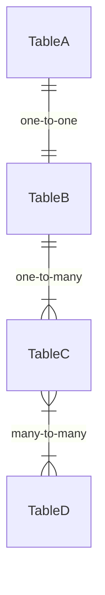
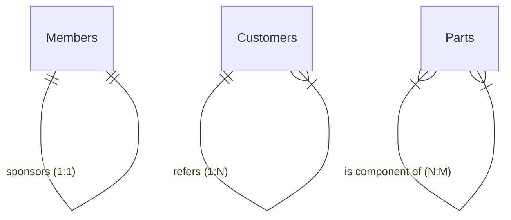
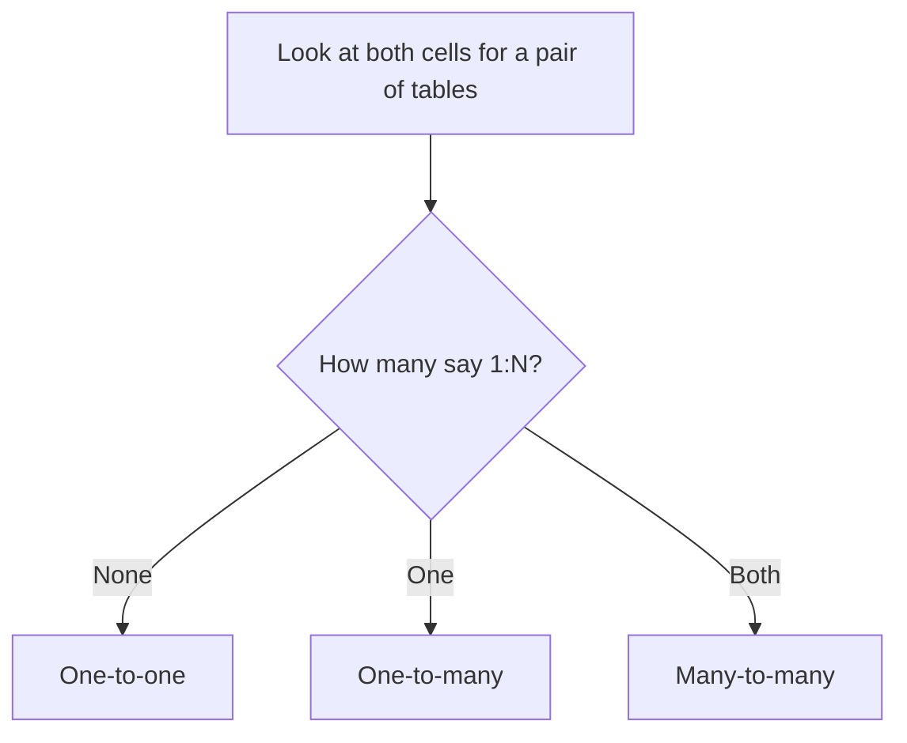
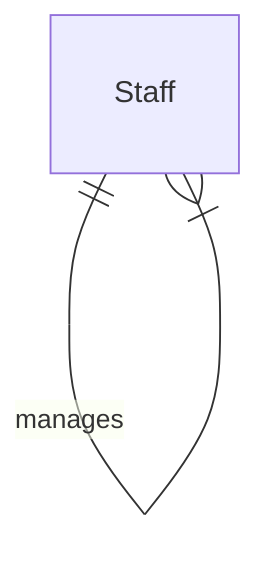
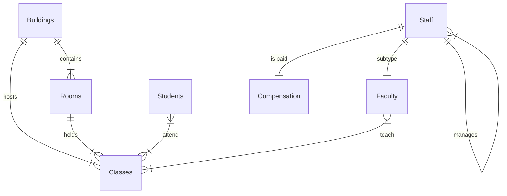
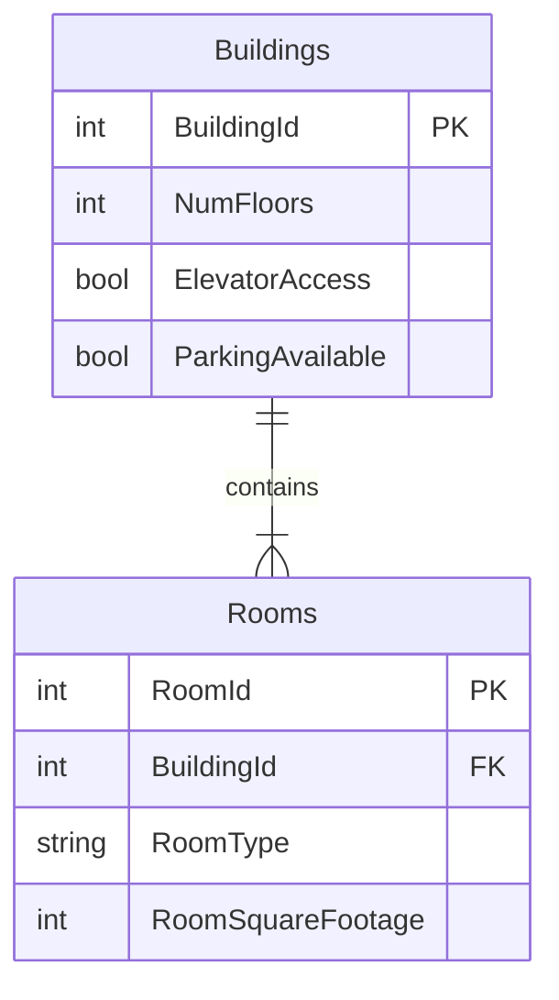
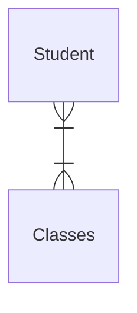
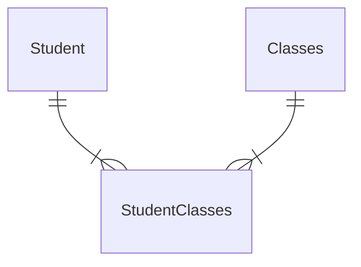
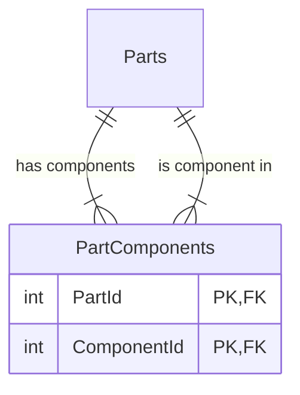
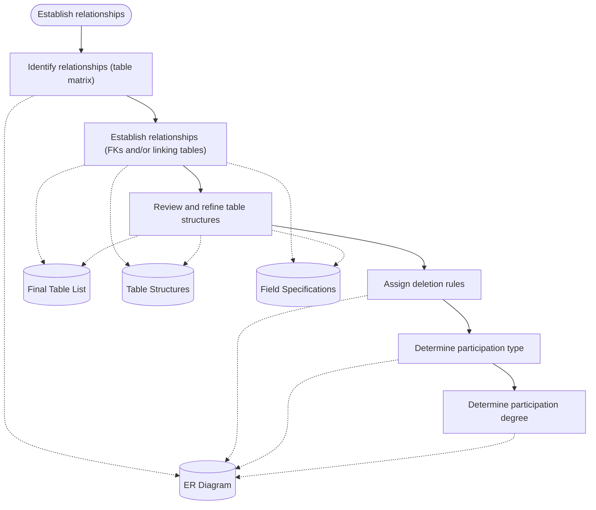

Recommended reading: *Database Design for Mere Mortals*, Chapter 10.

By the end of this lesson, you should be able to:
- Accurately read an ERD
- Identify a one-to-one, one-to-many and many-to-many relationship
- Identify recursive relationships
- Use a matrix to identify relationships between tables
- Consolidate many-to-many relationships
- Establish deletion rules, participation type and participation degree

In [[Week 4 - Defining Tables and Fields]] you ended up with a set of table structures: a Final Table List, fields assigned to tables, primary keys, and field specifications. The next step is to connect those tables to each other by establishing **relationships**.

## What a relationship is

> [!note] Definition
> A **relationship** between two tables can be formed in two ways:
> - Matching a [[Foreign Key]] value with a [[Primary Key]] value
> - Adding a join table (also called an *associative* or [[Linking Table|linking]] table)

Relationships are worth the effort for three reasons:

- They enable multi-table queries and [[Views]].
- They help reduce [[Redundant Data|redundant data]].
- They help implement relationship-level integrity, also called [[Referential Integrity|referential integrity]].

> [!important] Three properties of every relationship
> Every relationship has a **relationship type**, a **participation type**, and a **participation degree**. The first half of the lesson deals with the type. Participation type and degree come at the end.

## Entity-Relationship Diagrams (ERDs)

An [[Entity-Relationship Diagram]] (ERD) is the most common way to document relationships between tables. Each table is drawn as a box listing its fields, with `(PK)` and `(FK)` marking primary and foreign keys.

The slide's example has four tables:

| Table | Fields | What to notice |
|---|---|---|
| TableA | (PK) Attribute1, Attribute2, Attribute3 | Ordinary table |
| TableB | (PK,FK) Attribute1, Attribute2, Attribute3 | Drawn as a **rounded rectangle**: it's a [[Subset Tables\|subset table]]. Its PK is also an FK. |
| TableC | (PK) Attribute1, (FK) Attribute2, Attribute3 | Has a separate FK field |
| TableD | (PK) Attribute1, Attribute2, Attribute3 | Ordinary table |

The lines are TableA to TableB (one-to-one), TableB to TableC (one-to-many, with the "many" end at TableC), and TableC to TableD (many-to-many).

> [!tip] Reading an ERD
> - A **rounded rectangle** means a subset table.
> - The **lines** connecting tables show the relationship type, participation, and degree.
> - A single bar at the end of a line means "one". A three-pronged "crow's foot" means "many".

Mermaid can draw the same kind of diagram in Obsidian:



> [!note] About the Mermaid diagrams in this note
> Mermaid always draws two marks at each end of a line (a minimum and a maximum). Until the participation section near the end, only pay attention to the outer mark: a bar for "one" or a crow's foot for "many".

## Relationship types

### One-to-one (1:1)

Two tables A and B have a one-to-one relationship if:
- *Each* record in B is related to **one** record in A, and
- *Each* record in A is related to **one** record in B.

Facts about 1:1 relationships:
- The FK in the **child** refers to the PK in the **parent**.
- It sometimes models a [[Supertype and Subtype|supertype/subtype]] relationship.
- It is sometimes used to implement business rules.

> [!example] Employees and Compensation
> | Employee ID | Employee First Name | Employee Last Name | Home Phone |
> |---|---|---|---|
> | 100 | Zachary | Erlich | 221 553-3992 |
> | 101 | Susan | Black | 221 790-3992 |
> | 102 | Joe | Rosales | 230 551-4993 |
>
> | Employee ID | Hourly Rate | Commission Rate |
> |---|---|---|
> | 100 | 19.75 | 3.5 % |
> | 101 | 25.00 | 5.0 % |
> | 102 | 22.50 | 5.0 % |
>
> Employee 100 has exactly one Compensation row, and that Compensation row belongs to exactly one employee. The Employee ID links them.

### One-to-many (1:N)

Two tables A and B have a one-to-many relationship if:
- *Each* record in B is related to **one** record in A, and
- *Each* record in A may be related to **many** records in B.

Facts about 1:N relationships:
- The FK goes in B, the "many" side, which is the **child**. It refers to the PK in A, the "one" side, which is the **parent**.
- This is the **most common** relationship type.

> [!example] Customers and Customer Rentals
> | Customer ID | CustFirst Name | CustLast Name |
> |---|---|---|
> | 9001 | Paul | Litwin |
> | 9002 | Alison | Balter |
> | 9003 | Andy | Baron |
> | 9004 | Chris | Kunicki |
> | 9005 | Mary | Chipman |
>
> | Customer ID | Item ID | Checkout Date |
> |---|---|---|
> | 9002 | 80115 | 09/26/20 |
> | 9001 | 64558 | 09/28/20 |
> | 9003 | 10202 | 09/28/20 |
> | 9003 | 11354 | 09/28/20 |
> | 9003 | 78422 | 10/02/20 |
> | 9005 | 30556 | 09/26/20 |
> | 9004 | 20655 | 10/05/20 |
>
> Andy Baron (9003) has three rentals, so one customer relates to many rentals. Each rental row points back to only one customer.

### Many-to-many (N:M)

Two tables A and B have a many-to-many relationship if:
- *Each* record in B may be related to **many** records in A, and
- *Each* record in A may be related to **many** records in B.

Facts about N:M relationships:
- They **always** involve a third join table.
- The PK of the join table is a composition of two FKs, one to each table in the relationship.

#### The challenge of many-to-many relationships

Take a Students table (Student ID, StudFirst Name, StudLast Name, address fields, StudHome Phone, StudEmail Address, Social Security Number) and a Classes table (Class ID, Class Name, Class Category, Credits, Instructor ID, Classroom, Class Description, Catalog Code). A student takes many classes and a class has many students. How do you *easily* associate rows in one table with rows in the other?

**Naive solution #1: add columns.** Add Class ID 1 through Class ID 8 to Students, or Student ID 1 through Student ID 24 to Classes, so each row can refer to many rows in the other table.

> [!warning] Problem
> This is difficult to work with when retrieving data. To find every student in class 900004, you'd have to search eight different columns. And what happens when a student takes a ninth class?

**Naive solution #2: one row per reference.** Keep a single Class ID column in Students, but create one row for each class a student takes.

| Student ID | Student First Name | Student Last Name | Class ID | Class Name | Instructor ID |
|---|---|---|---|---|---|
| 60001 | Zachary | Erlich | 900009 | Introduction to Political Science | 220087 |
| 60001 | Zachary | Erlich | 900002 | Advanced Music Theory | 220039 |
| 60001 | Zachary | Erlich | 900003 | American History | 220148 |
| 60001 | Zachary | Erlich | 900004 | Computers in Business | 220121 |
| 60002 | Susan | Black | 900009 | Introduction to Political Science | 220087 |
| ... | ... | ... | ... | ... | ... |

> [!warning] Problem
> This creates redundant data and modification problems. Zachary's name is stored four times, and "Introduction to Political Science" is stored once for every student in it. If Zachary changes his last name, four rows must be updated.

**The correct solution** is a **linking table**. The lesson builds it later (see [[#Establishing many-to-many relationships]]). While you are still *identifying* relationships, just annotate the relationship with the many-to-many ER symbol and leave the columns in the tables as they are.

### Recursive relationships

Most relationships are between two *different* tables. Sometimes a field refers to a row within the *same* table.

> [!note] Definition
> A **[[Recursive Relationship|recursive relationship]]** is one where a field refers to another row in the same table. In other words, the Foreign Key refers to the Primary Key of the same table. It is also known as a **self-referencing relationship**.

A recursive relationship can be one-to-one, one-to-many, or many-to-many.

> [!example] Members: recursive one-to-one
> | Member ID | MbrFirst Name | MbrLast Name | Sponsor ID |
> |---|---|---|---|
> | 1001 | Zachary | Erlich | |
> | 1002 | Susan | Black | 1001 |
> | 1003 | Joe | Rosales | |
> | 1004 | Diana | Price | 1003 |
> | 1005 | Tom | Wickerath | 1002 |
>
> Tom's Sponsor ID is 1002, which is Susan's Member ID, a row in the same table. Each member sponsors at most one other member.

> [!example] Customers: recursive one-to-many
> | Customer ID | CustFirst Name | CustLast Name | Referred By |
> |---|---|---|---|
> | 9001 | Paul | Litwin | |
> | 9002 | Alison | Balter | |
> | 9003 | Andy | Baron | 9001 |
> | 9004 | Chris | Kunicki | 9003 |
> | 9005 | Mary | Chipman | 9001 |
>
> Paul (9001) referred both Andy and Mary, so one customer can refer many customers.

> [!example] Parts: recursive many-to-many
> | Part ID | Part Name |
> |---|---|
> | 701 | Top Clamp |
> | 702 | Bottom Clamp |
> | 703 | Fastening Bolt |
> | 704 | Clamp Assembly |
> | 705 | Saddle |
> | 706 | Seatpost |
> | 707 | Seat Assembly |
> | 708 | Body Tube |
> | 709 | Front Fork Tube |
> | 710 | Rear Stay Tube |
> | 711 | Frame Assembly |
>
> The Clamp Assembly (704) is made of 701, 702, and 703. The Clamp Assembly itself is a component of both the Seat Assembly (707) and the Frame Assembly (711). A part can have many components, and a part can be a component of many other parts.

In an ERD, a recursive relationship is a line that leaves a table and loops back into the same table:



## Identifying relationships with a matrix

### Building the matrix

Create a matrix that lists **all tables** in both the column headers and the row headers. The lesson's example uses seven tables:

| | Buildings | Classes | Compensation | Faculty | Rooms | Staff | Students |
|---|---|---|---|---|---|---|---|
| **Buildings** | | | | | | | |
| **Classes** | | | | | | | |
| **Compensation** | | | | | | | |
| **Faculty** | | | | | | | |
| **Rooms** | | | | | | | |
| **Staff** | | | | | | | |
| **Students** | | | | | | | |

*Systematically* work through each cell, and decide whether the two tables for that cell have a **direct** relationship.

> [!example] Direct vs. indirect
> - **Classes and Students** have a *direct* relationship: each student is registered in a set of classes.
> - **Classes and Staff** have an *indirect* relationship. It is Faculty (a subtype of Staff) that is assigned to a class. Every faculty member is staff, but not every staff member is faculty. So the relationship belongs between Classes and Faculty, not Classes and Staff.

Leave a cell **blank** if the two tables have no direct relationship.

### Asking the right questions

Use user and management interviews to help identify relationships. Ask questions that are **associative** or **contextual**. Contextual questions come in two flavours: *ownership-oriented* and *action-oriented*.

| Question type | Pattern | Example | Recursive example |
|---|---|---|---|
| Associative | Can a single record in table A be *associated with* one or more records in table B? | Can a single record in CLASSES be associated with one or more records in BUILDINGS? | Can a single staff member be associated with one or more other staff members? |
| Ownership-oriented | Can a single \<entity A\> *own / have / be part of / contain* one or more \<entity B\>s? | Can a single order contain one or more products? | Can a single part consist of one or more other parts? |
| Action-oriented | Does a single \<entity A\> *make / visit / teach / place / attend / meet with / etc.* one or more \<entity B\>s? | Does a single flight instructor teach one or more classes? | Can a single staff member manage one or more other staff members? |

For action-oriented questions, use the kinds of entities involved to pick the right verb. "Teach" makes sense for instructors and classes; "place" makes sense for customers and orders.

### Filling in the cells

> [!important] Ask from the perspective of ONE record in the left-column table
> For each cell, the question is about a *single record* of the table in the **row header**.
>
> For the cell in row Compensation, column Staff: "Can EACH RECORD of the Compensation table be associated with one or more records in the Staff table?"
>
> The answer gives the relationship type **from that table's perspective**. Each Compensation record is associated with *one* Staff record, so the cell gets **1:1**.

Write **1:1** in the cell when each record relates to one record in the other table, and **1:N** when it can relate to many.

Every cell has a **corresponding cell** for the same two tables, seen from the opposite perspective. Row Compensation / column Staff pairs with row Staff / column Compensation. The **combination** of the two cells gives the relationship type for the pair of tables:

| Cell 1 | Cell 2 | Relationship |
|---|---|---|
| 1:1 | 1:1 | One-to-one |
| 1:1 | 1:N | One-to-many |
| 1:N | 1:N | Many-to-many |



Then follow these steps for each pair of tables:

1. Select a pair of tables.
2. Find the two cells associated with this pair.
3. Identify the relationship type using the combination table above.
4. Add the appropriate diagram to an ER diagram.
5. Cross out both entries on the matrix.

> [!example] Compensation and Staff
> Row Compensation / column Staff says 1:1. Row Staff / column Compensation also says 1:1. 1:1 + 1:1 means Compensation and Staff have a **one-to-one** relationship, drawn as a line with a single bar at each end.

### Recursive relationships in the matrix

> [!important] The diagonal
> The **diagonal cells** (Buildings/Buildings, Classes/Classes, and so on) represent recursive relationships. For these you MUST consider the relationship from the perspective of EACH record on BOTH sides of the relationship, because there is no second cell to cover the opposite view.

> [!example] Staff managers vs. managed
> Q: Can each staff member be associated with one or more other staff members in any way?
> A: Yes, each staff member can **manage** one or more other staff members.
>
> Q: And can each staff member be **managed by** one or more other staff members?
> A: No, each staff member is managed by at most one other staff member.
>
> Manager side: 1:N. Managed side: 1:1. Together that is a recursive **one-to-many**.

> [!warning] A cell may hold more than one relationship
> The interview continues: "Oh, AND each staff member can be the spouse of another staff member." Now the Staff/Staff cell holds two relationships:
> - 1:N (manager)
> - 1:1 (spouse)
>
> Each one gets its own line on the ER diagram: a recursive one-to-one loop for spouses, and a recursive one-to-many loop for managers.



### Worked example: the full matrix

| | Buildings | Classes | Compensation | Faculty | Rooms | Staff | Students |
|---|---|---|---|---|---|---|---|
| **Buildings** | | 1:N | | | 1:N | | |
| **Classes** | 1:1 | | | 1:N | 1:1 | | 1:N |
| **Compensation** | | | | | | 1:1 | |
| **Faculty** | | 1:N | | | | 1:1 | |
| **Rooms** | 1:1 | 1:N | | | | | |
| **Staff** | | | 1:1 | 1:1 | | 1:N | |
| **Students** | | 1:N | | | | | |

Combining the pairs:

| Pair | Cells | Relationship |
|---|---|---|
| Buildings and Classes | 1:N + 1:1 | One-to-many (one building, many classes) |
| Buildings and Rooms | 1:N + 1:1 | One-to-many (one building, many rooms) |
| Classes and Faculty | 1:N + 1:N | Many-to-many |
| Classes and Rooms | 1:1 + 1:N | One-to-many (one room, many classes) |
| Classes and Students | 1:N + 1:N | Many-to-many |
| Compensation and Staff | 1:1 + 1:1 | One-to-one |
| Faculty and Staff | 1:1 + 1:1 | One-to-one |
| Staff and Staff | 1:N (diagonal) | Recursive one-to-many |

The resulting ER diagram (in the slide, Faculty is drawn as a rounded rectangle because it is a subset table of Staff):



## Establishing relationships

Identifying a relationship only says *that* two tables are related. Establishing it means changing the table structures so the relationship actually exists:

- Use **Foreign Keys** to establish a relationship between two tables.
- Each type of relationship has a **distinct Foreign Key configuration**.
- This involves updating tables with new fields and creating new tables, so the **Final Table List, Table Structures, and Field Specifications must be updated**.

### Establishing one-to-one relationships

1. Choose a **parent** and a **child** table. It can be either table; usually the "less important" table is the child.
2. Then:
   - If each record of the child **represents the same subject** as the parent, the **PK of the child becomes an FK** that refers to the PK of the parent.
   - Otherwise, **add an FK** to the child that refers to the PK of the parent.

> [!example] Compensation, Staff, and Faculty
> - **Staff**: (PK) StaffId, StaffFirstName, StaffLastName, StaffStreet, StaffCity, StaffState, StaffZipCode, StaffPhone, StaffPosition, StaffDateHired
> - **Compensation**: (PK,FK) StaffId, SalaryAmount, InvestmentPlanType, MedicalPlanType, LifeInsurancePlan
> - **Faculty** (subset table): (PK,FK) StaffId, FacultyTitle, FacultyStatus, FacultyTenured
>
> Both Compensation and Faculty records hold further information about a Staff member. Faculty is a subtype of Staff. Compensation is kept separate from Staff for security, but it still represents the same subject. So the PKs of Compensation and Faculty become FKs referencing Staff's PK.

> [!example] Managers and Departments
> - **Staff**: (PK) StaffId, ...
> - **Managers** (subset of Staff): (PK,FK) StaffId
> - **Departments**: (PK) DepartmentId, (FK) ManagerId, DeptName, DeptCategory, MaxStaffLevel
>
> Managers is a subtype of Staff: each Managers record is the same subject as a Staff record, so its PK is also an FK to Staff's PK.
>
> Departments is a *separate* subject from Managers, so it needs a separate FK field (ManagerId). Either Managers or Departments could work as the child here. The choice is quite arbitrary.

As an illustration of how this looks once implemented (SQL syntax is covered separately):

```sql
-- Same subject: the child's PK is also the FK
CREATE TABLE Compensation (
    StaffId      INT PRIMARY KEY REFERENCES Staff (StaffId),
    SalaryAmount DECIMAL(10, 2)
);

-- Different subject: a separate FK field in the child
CREATE TABLE Departments (
    DepartmentId INT PRIMARY KEY,
    ManagerId    INT UNIQUE REFERENCES Managers (StaffId),  -- UNIQUE keeps it 1:1
    DeptName     VARCHAR(50)
);
```

### Establishing one-to-many relationships

- The "one" side is the **parent**, and the "many" side is the **child**. Remember: EACH record on the "many" side may refer to only ONE record in the parent.
- **Add to the child an FK** that references the parent's PK.

> [!example] Buildings and Rooms
> - **Buildings**: (PK) BuildingId, NumFloors, ElevatorAccess, ParkingAvailable
> - **Rooms**: (PK) RoomId, (FK) BuildingId, RoomType, RoomSquareFootage
>
> Rooms is the "many" side, so Rooms gets the FK.



> [!tip] A multivalued field was a one-to-many relationship all along
> Recall from Week 4 how you resolved a multivalued field: you created a new table with the multivalued field and used field(s) from the original table to relate the new table to the original.
>
> Now you can see that a multivalued field often represents a **one-to-many relationship with a previously unrecognized subject**. The field that relates the new table to the original should be an **FK referencing the original table's PK**.

> [!example] Instructor Categories, fixed
> In Week 4, Instructor Categories used InstFirst Name and InstLast Name to point back to Instructors. That works poorly: names aren't a key.
>
> Instead, give Instructors a PK (Instructor ID) and use it as the FK:
>
> | Instructor ID | Category Taught |
> |---|---|
> | 60001 | DTP |
> | 60001 | SS |
> | 60001 | WP |
> | 60002 | WP |
> | 60002 | DB |
> | 60002 | OS |
> | 60003 | DB |
> | 60003 | SS |
>
> Use an FK referencing the PK of the original table, not just any set of fields.

### Establishing many-to-many relationships

Create a **linking table**:

1. Give it a name reflecting the purpose of the relationship it establishes.
2. Add **two FKs**, each referencing one of the two PKs in the relationship.
3. Set the combination of the two FKs as the [[Composite Key|composite PK]] of the linking table.
4. **IMPORTANT:** Check whether any fields from the two original tables should really be in the linking table.
5. Add the linking table to your table structures and Final Table List.

> [!example] Students and Classes
> - **Students**: (PK) StudentId, StudentFirstName, StudentLastName, ... StudentSocialSecurityNumber
> - **StudentClasses**: (PK, FK1) StudentId, (PK, FK2) ClassId
> - **Classes**: (PK) ClassId, ClassName, ClassDescription, (FK) InstructorId, ClassCategory
>
> Each row of StudentClasses says "this student is in this class". Zachary taking four classes means four short StudentClasses rows, and his name is stored once in Students.

> [!important] The many-to-many line disappears
> After a many-to-many relationship is established, there is **no longer** a many-to-many line between the two tables. It is replaced by two one-to-many relationships, one from each original table to the linking table.

After *identifying* the relationship:



After *establishing* it:



#### Extra fields in the linking table

Sometimes the linking table needs extra fields. For two tables A and B in a many-to-many relationship:

| If a field is a characteristic of... | ...it belongs in |
|---|---|
| ALL instances of A | Table A |
| ALL instances of B | Table B |
| a SPECIFIC instance of A related to a SPECIFIC instance of B | The linking table |

> [!example] Orders, Products, and OrderDetails
> First attempt:
> - **Orders**: (PK) OrderId, CustomerId, OrderDate, ShipDate, EmployeeId, ProductId, QuantityOrdered, QuotePrice
> - **OrderDetails**: (PK, FK1) OrderId, (PK, FK2) ProductId
> - **Products**: (PK) ProductId, ProductName, ProductDescription, ProductCategory, WholesalePrice, QuotePrice
>
> QuantityOrdered and QuotePrice describe a SPECIFIC product on a SPECIFIC order. There isn't one QuotePrice per order, because an order may hold many products. There isn't one QuotePrice per product either, because each product may appear on many orders at different quote prices.
>
> If Orders kept these fields, order 1000 would repeat its customer (9001) and date (05/16/20) on eight rows, one per product. So much redundant data.
>
> | Order Number | Customer Number | Order Date | Product Number | Quantity Ordered | Quote Price |
> |---|---|---|---|---|---|
> | 1000 | 9001 | 05/16/20 | 410001 | 4 | 8.95 |
> | 1000 | 9001 | 05/16/20 | 410004 | 12 | 3.75 |
> | 1000 | 9001 | 05/16/20 | 410005 | 6 | 5.99 |
> | ... | ... | ... | ... | ... | ... |
> | 1001 | 9012 | 05/16/20 | 410011 | 5 | 6.50 |
>
> The fix: move QuantityOrdered and QuotePrice into the linking table, and drop ProductId from Orders.
> - **Orders**: (PK) OrderId, CustomerId, OrderDate, ShipDate, EmployeeId
> - **OrderDetails**: (PK, FK1) OrderId, (PK, FK2) ProductId, QuantityOrdered, QuotePrice
> - **Products**: (PK) ProductId, ProductName, ProductDescription, ProductCategory, WholesalePrice
>
> Now you can record the quantity and quote price for each specific product on each specific order.

```sql
-- Illustration: the linking table with its composite PK and extra fields
CREATE TABLE OrderDetails (
    OrderId         INT REFERENCES Orders (OrderId),
    ProductId       INT REFERENCES Products (ProductId),
    QuantityOrdered INT,
    QuotePrice      DECIMAL(8, 2),
    PRIMARY KEY (OrderId, ProductId)
);
```

### Establishing recursive relationships

Same as for a non-recursive relationship of the same type, **except** the FK references the PK of the **same** table.

| Type | Table | How it's established |
|---|---|---|
| Recursive one-to-one | Members | Member ID (PK) and Sponsor ID (FK) referencing Member ID |
| Recursive one-to-many | Staff | Staff ID (PK) and Manager ID (FK) referencing Staff ID |
| Recursive many-to-many | Parts + Part Components | Linking table Part Components with Part ID (CPK/FK) and Component ID (CPK/FK). **Both** FKs reference the PK of Parts. |

> [!example] Part Components
> | Part ID | Component ID |
> |---|---|
> | 704 | 701 |
> | 704 | 702 |
> | 704 | 703 |
> | 707 | 704 |
> | 707 | 705 |
> | 707 | 706 |
> | 711 | 704 |
> | 711 | 708 |
> | 711 | 709 |
> | 711 | 710 |
>
> Each part may have many other parts as components (704 has three), AND each part may be a component of many other parts (704 is used in 707 and 711).



## Verifying foreign keys

A foreign key must have these elements:

- ~~It has the same name as the PK it references.~~ (Crossed out on the slide: the FK does **not** need the same name. ManagerId references StaffId, for example.)
- Its **field specification is a replica** of the PK it references.
- It **draws its values from** the PK it references.

> [!tip] Connecting to Week 4
> "Replica" is the same specification type from [[Field Specifications|field specifications]]. The FK's specification points to the PK's specification as its source, so both fields share the same data type, length, and range of values.

## Reviewing table structures

Once relationships are established, review each table again by comparing it to the **ideal table**. Recall that the ideal table:

- Represents a single subject, which can be an object or event
- Has a primary key
- Does not contain multipart or multivalued fields
- Does not contain calculated fields
- Does not contain unnecessary duplicate fields
- Contains only an absolute minimum amount of redundant data

> [!important] Don't forget to update
> - **Final Table List**: add the new linking tables
> - **Table Structures**: add the new linking tables
> - **Field Specifications**: add the new Foreign Key columns

## Deletion rules

For each relationship, decide what should happen when a record from the **parent** table is **deleted**, and assign one of these [[Deletion Rules|deletion rules]]:

| Rule | What the RDBMS does |
|---|---|
| **Restrict** | Refuses to delete the record until all related child records are deleted first |
| **Cascade** | Deletes the record AND all related child records |
| **Deny** | Sets the record as "inactive" instead of deleting it |
| **Nullify** | Deletes the record and sets the FK of all related child records to NULL |
| **Set Default** | Deletes the record and sets the FK of all related child records to a default value |

> [!tip] Default choice
> Use **Restrict** unless there is a reason to use one of the others.

> [!example] Employees and Orders
> - **Employees**: (PK) EmployeeId, (FK) ManagerId
> - **Orders**: (PK) OrderId, (FK1) CustomerId, (FK2) EmployeeId
>
> What should happen when an Employees record is deleted?
>
> | Business answer | Rule |
> |---|---|
> | Deletion isn't allowed until all orders that refer to the employee are deleted first | Restrict |
> | All related orders are deleted automatically | Cascade |
> | Employee records are never deleted; they get set to "inactive" | Deny |
> | All related orders get their EmployeeId set to NULL | Nullify |
> | All related orders get their EmployeeId set to the lead sales person's Id | Set Default |

Once you choose a rule, **annotate it on the ER diagram** next to the parent end of the line, for example "(Deny)" on the Employees-Orders line.

> [!warning] Cascade is dangerous
> Cascade on Employees-Orders would erase a company's sales history every time someone quits. Pick the rule from what the business needs, and when in doubt, use Restrict.

Most rules map onto SQL `ON DELETE` options. In PostgreSQL, for example:

```sql
CREATE TABLE Orders (
    OrderId    INT PRIMARY KEY,
    EmployeeId INT REFERENCES Employees (EmployeeId)
        ON DELETE RESTRICT       -- or CASCADE, SET NULL, SET DEFAULT
);
```

Deny has no `ON DELETE` option. It is normally implemented by never deleting the row and setting an "active" field to false instead. Support also varies between products: MySQL's InnoDB engine, for instance, rejects `SET DEFAULT`.

## Participation type

For **each table** in **each relationship**, determine the participation type. For recursive relationships, consider the participation of **both sides** of the relationship.

> [!note] Definitions
> In a relationship between two tables A and B:
> - A's participation is **mandatory** if a record in A must exist before adding records to B.
> - A's participation is **optional** if no records in A are required before adding records to B.

The **inside mark** of the relationship line (the one closer to the middle of the line) shows the participation type:

- A **single hash mark** means **mandatory** participation.
- A **circle** means **optional** participation.

> [!example] Reading participation marks
> In the slide's diagram, the A end of the line has a hash mark and the B end has a circle with a crow's foot. A's participation is mandatory and B's is optional.
>
> ```mermaid
> erDiagram
>     A ||--o{ B : ""
> ```

> [!example] Participation in a recursive relationship
> Staff has (PK) StaffId and (FK) ManagerId.
> - Each staff member MAY manage many other staff.
> - Each staff member MAY be managed by another staff member. At the highest level, managers have no further manager.
>
> Both sides are optional, so both inside marks are circles.
>
> ```mermaid
> erDiagram
>     Staff |o--o{ Staff : "manages"
> ```

## Participation degree

> [!note] Slide title
> The slide that introduces this step is titled "Participation type", but its content is about participation *degree*.

For **each table** in **each relationship**, determine the participation degree. For recursive relationships, consider the participation degree of **both sides**.

> [!note] Definition
> In a relationship between two tables A and B, the **degree of participation for A** gives the **minimum and maximum** number of records in B that **each** record in A may be related to.

In the slide's example, the line between A and B has "1,4" written at B's end: each record in A is related to at least 1 and at most 4 records in B.

Annotate each participation degree on the ER diagram:

| Participation degree | Symbol at the line end |
|---|---|
| Min 0, Max 1 (0,1) | circle + single bar |
| Min 1, Max 1 (1,1) | two bars |
| Min 0, Max unlimited (0,N) | circle + crow's foot |
| Min 1, Max unlimited (1,N) | bar + crow's foot |
| Specific numbers (?,?) | bar + crow's foot, with the numbers written next to it, e.g. (1,4) |

> [!tip] The two marks work together
> Look at the symbol table again. The inside mark is the **minimum** (circle = 0 = optional, bar = 1 = mandatory), and the outside mark is the **maximum** (bar = 1, crow's foot = many). That's why participation type and participation degree are drawn on the same line end.

Mermaid's ER diagram markers follow the same idea:

| Mermaid marker (right side) | Meaning |
|---|---|
| `\|o` | 0 or 1 |
| `\|\|` | exactly 1 |
| `o{` | 0 or more |
| `\|{` | 1 or more |

Mermaid has no marker for specific limits like (0,12), so write those in the label.

> [!example] A manager limit
> The Staff self-relationship from before, with (0,12) written at the "many" end, means a staff member may manage up to 12 other staff.
>
> ```mermaid
> erDiagram
>     Staff |o--o{ Staff : "manages (0,12)"
> ```

## Verifying relationships

Use this checklist to verify you have established all relationships:

- [ ] Each relationship has been **identified**.
- [ ] Each relationship has been properly **established**.
- [ ] Each foreign key complies with the **elements of a foreign key**.
- [ ] Relationship **participation** has been identified for both ends of each relationship.
- [ ] Relationship **degree** has been identified for both ends of each relationship.

## Relationship-level (referential) integrity

Establishing proper relationships gives you **[[Referential Integrity|referential integrity]]**. Each part of the process contributes one piece:

| Guarantee | Where it comes from |
|---|---|
| The connection between the two tables is sound | FK/PK pairs and/or linking tables |
| New records can be inserted into each table in a meaningful manner | Identifying relationship participation |
| Records can be deleted without adverse effects | Assigning deletion rules |
| Limits on the number of interrelated records have been considered | Identifying relationship degree |

## Process diagram



On the slide, all six steps feed into the same four documents: the Final Table List, Table Structures, Field Specifications, and the ER Diagram. The diagram above shows the main link for each step.

## Summary

- A relationship links two tables through an FK/PK match or a linking table. Every relationship has a type, a participation type, and a participation degree.
- **1:1**: the FK in the child refers to the parent's PK. If the child is the same subject (a subtype, or data split off for security), the child's PK is also the FK.
- **1:N**: the most common type. The "many" side is the child and gets the FK.
- **N:M**: needs a linking table whose composite PK is made of two FKs. Fields that describe a specific A paired with a specific B belong in the linking table. After establishing, the N:M line becomes two 1:N lines.
- **Recursive**: the FK points to the PK of the same table. It can be 1:1, 1:N, or N:M (the last one needs a linking table whose two FKs both point to the same table).
- A **table matrix** finds relationships. Ask from the perspective of one record in the row table, then combine each pair of cells: 1:1 + 1:1 = 1:1, 1:1 + 1:N = 1:N, 1:N + 1:N = N:M. Diagonal cells are recursive, and one cell may hold several relationships.
- An FK's specification is a replica of the PK it references, and it draws its values from that PK. It doesn't need the same name.
- **Deletion rules** (Restrict, Cascade, Deny, Nullify, Set Default) say what happens to child rows when a parent row is deleted. Default to Restrict.
- **Participation type** (mandatory or optional) is the inside mark. **Participation degree** (min, max) combines both marks, or gets explicit numbers.
- Together these give referential integrity.

See also [[Week 4 - Defining Tables and Fields]] for subset tables, multivalued fields, primary keys, and replica specifications, and [[Database Design]] for the methodology as a whole.

Further reading:
- [SQL FOREIGN KEY constraint (W3Schools)](https://www.w3schools.com/sql/sql_foreignkey.asp)
- [PostgreSQL: foreign keys and ON DELETE actions](https://www.postgresql.org/docs/current/ddl-constraints.html#DDL-CONSTRAINTS-FK)
- [MySQL: FOREIGN KEY constraints and referential actions](https://dev.mysql.com/doc/refman/8.0/en/create-table-foreign-keys.html)

## Exercises

### Exercise 1 (Direct application)
For each pair, give the relationship type (1:1, 1:N, or N:M) and say which table is the parent and which is the child (or whether a linking table is needed):
a) Countries and Capital Cities (each country has one capital; each capital belongs to one country)
b) Authors and Books (an author writes many books; a book can have many authors)
c) Departments and Employees (each employee works in one department)
d) Employees and Employee Parking Permits (each employee has at most one permit; each permit belongs to one employee)

> [!success]- Answer key
> a) **1:1.** Either table could be the parent. Capital Cities is the "less important" table here, so make it the child: add a CountryId FK to Capital Cities. (A capital city is a different subject from a country, so the FK is a separate field, not the PK.)
>
> b) **N:M.** Create a linking table such as BookAuthors with (PK, FK1) AuthorId and (PK, FK2) BookId.
>
> c) **1:N.** Departments is the "one" side (parent). Employees is the "many" side (child) and gets a DepartmentId FK.
>
> d) **1:1.** Employees is the parent, Parking Permits the child. A permit is its own subject (it has its own number, expiry date, etc.), so add an EmployeeId FK to Parking Permits rather than making it the permit's PK.

### Exercise 2 (Direct application)
Fill in these cells of a matrix and combine them. Tables: Customers, Orders.
- Can each record of Customers be associated with one or more records in Orders?
- Can each record of Orders be associated with one or more records in Customers?

Then draw the result as a Mermaid ER diagram showing only the relationship type.

> [!success]- Answer key
> - Row Customers / column Orders: a customer can place many orders, so **1:N**.
> - Row Orders / column Customers: each order belongs to one customer, so **1:1**.
>
> 1:N + 1:1 = **one-to-many**, with Customers as the parent.
>
> ```mermaid
> erDiagram
>     Customers ||--|{ Orders : "places"
> ```
>
> Then cross out both cells in the matrix.

### Exercise 3 (Direct application)
A library's Members table has a "Referred By" column. Every member can refer any number of new members, but each member was referred by at most one person. What kind of relationship is this, and how is it established?

> [!success]- Answer key
> It's a **recursive one-to-many** relationship. From the referrer's side it is 1:N; from the referred member's side it is 1:1. Because this is a diagonal cell, you had to ask the question from both sides.
>
> Establish it like any 1:N, except the FK points to the same table: Members has (PK) MemberId and (FK) ReferredById, which references MemberId. ReferredById must allow nulls for members nobody referred.

### Exercise 4 (Applied variation)
A gym has Members and FitnessClasses (many-to-many). The analyst lists these fields to place: MemberName, ClassName, ClassMaxCapacity, MemberBirthDate, DateEnrolledInClass, AttendanceCount. Design the linking table and put each field in the right table.

> [!success]- Answer key
> Use the rule from the lesson: a characteristic of ALL instances of one table goes in that table; a characteristic of a SPECIFIC member in a SPECIFIC class goes in the linking table.
>
> - **Members**: (PK) MemberId, MemberName, MemberBirthDate. These describe the member no matter which class.
> - **FitnessClasses**: (PK) ClassId, ClassName, ClassMaxCapacity. These describe the class no matter which member.
> - **MemberClasses** (linking table, named for its purpose): (PK, FK1) MemberId, (PK, FK2) ClassId, DateEnrolledInClass, AttendanceCount. The enrolment date and attendance count differ for each member-class pair.
>
> Add MemberClasses to the Final Table List and Table Structures, and add field specifications for the two FKs (replicas of the PKs they reference).

### Exercise 5 (Applied variation)
Complete the matrix for three tables (Patients, Doctors, Appointments) given these business answers:
- A patient can have many appointments; each appointment is for one patient.
- A doctor can have many appointments; each appointment is with one doctor.
- A patient sees many doctors, and a doctor sees many patients, but only through appointments.

Which pairs have a direct relationship, and what is the final ER diagram?

> [!success]- Answer key
> | | Patients | Doctors | Appointments |
> |---|---|---|---|
> | **Patients** | | | 1:N |
> | **Doctors** | | | 1:N |
> | **Appointments** | 1:1 | 1:1 | |
>
> - Patients and Appointments: 1:N + 1:1 = **1:N**.
> - Doctors and Appointments: 1:N + 1:1 = **1:N**.
> - Patients and Doctors: the relationship is *indirect*. It goes through Appointments (like Classes and Staff going through Faculty), so those cells stay **blank**.
>
> ```mermaid
> erDiagram
>     Patients ||--|{ Appointments : "books"
>     Doctors ||--|{ Appointments : "attends"
> ```
>
> Appointments works much like a linking table between Patients and Doctors. It has its own subject (an appointment, with a date and time), so it could have its own surrogate PK.

### Exercise 6 (Applied variation)
For each scenario, choose a deletion rule and justify it.
a) Deleting a Customer who has Orders. Orders are legal financial records.
b) Deleting a BlogPost whose Comments make no sense without the post.
c) Deleting a SalesRep; their Customers should be reassigned to the "House Account" rep.
d) Deleting a Category from Products; products can exist uncategorized.

> [!success]- Answer key
> a) **Restrict** (or **Deny**). Orders must not disappear. Restrict blocks the delete while orders exist. Deny keeps the customer and marks them inactive, which suits a business that never wants to lose history.
>
> b) **Cascade.** Comments depend entirely on their post, so deleting the post should delete them too.
>
> c) **Set Default.** The FK in Customers gets set to the default value, the House Account rep's Id.
>
> d) **Nullify.** Products stay, and their CategoryId becomes NULL. This only works if the FK allows nulls.

### Exercise 7 (Challenge)
Draw the full ER diagram (type, participation, and degree) for Buildings and Rooms given these rules:
- A room must belong to a building, and to only one.
- A building can be entered in the database before any rooms are added, and has at most 200 rooms.

Then say where the FK goes and which deletion rule you'd suggest.

> [!success]- Answer key
> - **Type:** each building has many rooms; each room belongs to one building. 1:N, with Buildings as the parent. Rooms gets (FK) BuildingId.
> - **Buildings' participation is mandatory**: a building record must exist before you can add a room (the room has to point to it).
> - **Rooms' participation is optional**: a building can exist with no rooms.
> - **Degree:** each building relates to 0 to 200 rooms, so (0,200) at the Rooms end. Each room relates to exactly 1 building, so (1,1) at the Buildings end.
>
> ```mermaid
> erDiagram
>     Buildings ||--o{ Rooms : "contains (0,200)"
> ```
>
> **Deletion rule:** Restrict, the default. You shouldn't be able to delete a building that still has rooms recorded. (Cascade could also be argued if a demolished building's rooms are meaningless, but Restrict is the safe default.)

### Exercise 8 (Challenge)
A company tracks Employees and Projects. An employee can work on many projects, and a project has many employees. Each employee has a role on each project (for example "lead" on one, "tester" on another) and logs hours per project. Also, each employee can mentor at most one other employee, and each employee has at most one mentor. Design all tables and FKs, and draw the ER diagram showing relationship types.

> [!success]- Answer key
> **Employees and Projects: N:M.** Create a linking table **ProjectAssignments**: (PK, FK1) EmployeeId, (PK, FK2) ProjectId, Role, HoursLogged. Role and hours belong to a *specific* employee on a *specific* project, so they go in the linking table, not in Employees or Projects.
>
> **Mentoring: recursive 1:1.** Asked from both sides (diagonal cell): each employee mentors at most one, and each has at most one mentor. Establish it with (FK) MentorId in Employees referencing EmployeeId, marked unique so no mentor is used twice.
>
> Tables:
> - **Employees**: (PK) EmployeeId, EmpFirstName, EmpLastName, (FK) MentorId
> - **Projects**: (PK) ProjectId, ProjectName, ...
> - **ProjectAssignments**: (PK, FK1) EmployeeId, (PK, FK2) ProjectId, Role, HoursLogged
>
> ```mermaid
> erDiagram
>     Employees ||--|{ ProjectAssignments : "is assigned"
>     Projects ||--|{ ProjectAssignments : "has"
>     Employees ||--|| Employees : "mentors"
> ```
>
> Update the Final Table List and Table Structures (new linking table) and Field Specifications (new FKs EmployeeId, ProjectId, MentorId, each a replica of the PK it references).

## Feynman practice

Write the answers in your own words. Don't look at the note while writing step 1.

### Feynman: The three relationship types

- [ ] **1. Explain it as if to a 12-year-old.** Using people you know, describe one relationship that is one-to-one (like a person and their passport), one that is one-to-many, and one that is many-to-many. How do you tell them apart?
- [ ] **2. Find the gaps.** Reread what you wrote. Mark with `[?]` any word a 12-year-old wouldn't understand (for example "parent", "child", "foreign key").
- [ ] **3. Go back to the source and simplify.** For each `[?]`, write an analogy or a concrete example. Why does the FK go on the "many" side and never on the "one" side?
- [ ] **4. Organize and test.** Rewrite the explanation in 3 to 5 sentences. Could you teach it in 2 minutes?

### Feynman: The relationship matrix

- [ ] **1. Explain it as if to a 12-year-old.** Imagine a grid with all your classmates' names along the top and down the side. How would you use it to record who sits next to whom? Now explain why each pair of tables gets *two* cells, and what you learn by combining them.
- [ ] **2. Find the gaps.** Mark with `[?]` terms like "perspective", "direct relationship", "diagonal", "recursive".
- [ ] **3. Go back to the source and simplify.** For each `[?]`, give an example. Why must you ask the question from both sides for a diagonal cell, like the Staff manager example?
- [ ] **4. Organize and test.** Rewrite in 3 to 5 sentences, including the 1:1 + 1:N = 1:N rule. Can you explain why Classes and Staff stay blank?

### Feynman: Linking tables

- [ ] **1. Explain it as if to a 12-year-old.** A school has students and clubs. Why can't you just write every club on the student's card, or every student on the club's card? Describe the "sign-up sheet" that fixes it.
- [ ] **2. Find the gaps.** Mark with `[?]` terms like "composite primary key", "redundant", "linking table".
- [ ] **3. Go back to the source and simplify.** For each `[?]`, give an example. Where does QuotePrice go in the Orders/Products example, and why not in Orders or Products?
- [ ] **4. Organize and test.** Rewrite in 3 to 5 sentences. Could someone use your explanation to decide where a "grade" field goes for students and classes?

### Feynman: Deletion rules

- [ ] **1. Explain it as if to a 12-year-old.** A teacher leaves the school. What could happen to the list of classes they were teaching? Describe five different policies the school could pick.
- [ ] **2. Find the gaps.** Mark with `[?]` terms like "cascade", "nullify", "child record".
- [ ] **3. Go back to the source and simplify.** For each `[?]`, give an example from the Employees/Orders case. Why is Restrict the default?
- [ ] **4. Organize and test.** Rewrite in 3 to 5 sentences covering all five rules.

### Feynman: Participation type and degree

- [ ] **1. Explain it as if to a 12-year-old.** A team must exist before a player can join it, but a team can exist with no players and has room for at most 15. Explain which part of that is "mandatory/optional" and which part is "minimum/maximum".
- [ ] **2. Find the gaps.** Mark with `[?]` terms like "participation", "degree", "crow's foot", "hash mark".
- [ ] **3. Go back to the source and simplify.** For each `[?]`, draw or describe the line end. Why does a circle mean "optional" and also "minimum 0"?
- [ ] **4. Organize and test.** Rewrite in 3 to 5 sentences. Could you read the Staff (0,12) diagram aloud to someone?

## Flashcards

Copy the block below into a `.txt` file and import it into Anki (File > Import), mapping column 1 to Front, column 2 to Back, and column 3 to Tags.

```
#separator:tab
#html:false
#tags column:3
What are the two ways a relationship between two tables can be formed?	Matching a foreign key value with a primary key value, or adding a join (associative/linking) table.	csd216 week-05
Name three benefits of establishing relationships.	They enable multi-table queries and views, reduce redundant data, and implement referential integrity.	csd216 week-05
What three properties does every relationship have?	Relationship type, participation type, and participation degree.	csd216 week-05
What is the most common way to document relationships between tables?	An Entity-Relationship Diagram (ERD).	csd216 week-05
In an ERD, what does a rounded rectangle indicate?	A subset table.	csd216 week-05
In an ERD, what do the lines connecting tables indicate?	Relationship type, participation, and degree.	csd216 week-05
When do tables A and B have a one-to-one relationship?	Each record in A is related to one record in B, and each record in B is related to one record in A.	csd216 week-05
Name two things a one-to-one relationship is sometimes used for.	Modelling a supertype/subtype relationship, and implementing business rules.	csd216 week-05
What is the most common relationship type?	One-to-many.	csd216 week-05
In a one-to-many relationship, which table gets the foreign key?	The "many" side (the child); it references the PK of the "one" side (the parent).	csd216 week-05
What does every many-to-many relationship always involve?	A third join (linking) table.	csd216 week-05
What is the primary key of a linking table?	A composite of two FKs, one referencing each table in the relationship.	csd216 week-05
Why is adding numbered columns (Class ID 1, Class ID 2...) a bad way to model many-to-many?	It is difficult to work with when retrieving data.	csd216 week-05
Why is storing one row per reference (repeating the student on each class row) a bad way to model many-to-many?	It creates redundant data and modification problems.	csd216 week-05
What is a recursive relationship?	One where a field refers to another row in the same table; the FK references the PK of the same table.	csd216 week-05
What is another name for a recursive relationship?	A self-referencing relationship.	csd216 week-05
Which relationship types can a recursive relationship be?	One-to-one, one-to-many, or many-to-many.	csd216 week-05
What headers does a relationship identification matrix have?	All tables, listed in both the column headers and the row headers.	csd216 week-05
What do you put in a matrix cell when the two tables have no direct relationship?	Leave it blank.	csd216 week-05
Why do Classes and Staff have an indirect relationship?	It is Faculty (a subtype of Staff) that is assigned to classes; not every staff member is faculty.	csd216 week-05
What are the two kinds of questions to ask in interviews when identifying relationships?	Associative and contextual (ownership-oriented and action-oriented).	csd216 week-05
Give the pattern of an ownership-oriented question.	Can a single <entity A> own/have/be part of/contain one or more <entity B>s?	csd216 week-05
Give the pattern of an action-oriented question.	Does a single <entity A> make/visit/teach/place/attend/meet with one or more <entity B>s?	csd216 week-05
From whose perspective is each matrix cell's question asked?	One record of the table in the left column (row header).	csd216 week-05
In the matrix, 1:1 + 1:1 implies what relationship?	One-to-one.	csd216 week-05
In the matrix, 1:1 + 1:N implies what relationship?	One-to-many.	csd216 week-05
In the matrix, 1:N + 1:N implies what relationship?	Many-to-many.	csd216 week-05
What do the diagonal cells of the matrix represent?	Recursive relationships.	csd216 week-05
Why must you ask the question from both sides for a diagonal cell?	There is no corresponding second cell, so you must consider each record on both sides (e.g. manager and managed).	csd216 week-05
Can one matrix cell hold more than one relationship?	Yes, e.g. Staff/Staff holds 1:N (manager) and 1:1 (spouse).	csd216 week-05
After identifying relationships, what documents must be updated when establishing them?	Final Table List, Table Structures, and Field Specifications.	csd216 week-05
In a one-to-one relationship, which table is usually the child?	The "less important" table.	csd216 week-05
In a 1:1 relationship where the child represents the same subject as the parent, how is the FK set up?	The child's PK also becomes the FK referencing the parent's PK.	csd216 week-05
In a 1:1 relationship where the child is a different subject, how is the FK set up?	Add a separate FK field to the child that references the parent's PK.	csd216 week-05
Why is Compensation separate from Staff even though it is the same subject?	For security.	csd216 week-05
What does a multivalued field often represent, now that you know relationships?	A one-to-many relationship with a previously unrecognized subject.	csd216 week-05
What should relate the new table (from a multivalued field) to the original table?	An FK referencing the original table's PK.	csd216 week-05
What are the five steps to create a linking table?	Name it for its purpose; add two FKs; make them the composite PK; check if fields from the original tables belong in it; add it to table structures and the Final Table List.	csd216 week-05
After a many-to-many relationship is established, what happens to the N:M line?	It disappears; it is replaced by two one-to-many lines to the linking table.	csd216 week-05
In an N:M relationship, where does a field describing a specific A related to a specific B go?	In the linking table.	csd216 week-05
Why do QuantityOrdered and QuotePrice belong in OrderDetails?	They describe a specific product on a specific order, not all orders or all products.	csd216 week-05
How does establishing a recursive relationship differ from a non-recursive one of the same type?	The FK references the PK of the same table.	csd216 week-05
In a recursive many-to-many relationship like Part Components, what do the two FKs reference?	Both reference the PK of the same table (Parts).	csd216 week-05
Must a foreign key have the same name as the PK it references?	No (crossed out on the slide).	csd216 week-05
What two elements must a foreign key have?	Its field specification is a replica of the referenced PK, and it draws its values from that PK.	csd216 week-05
What does the Restrict deletion rule do?	The RDBMS refuses to delete the record until all related child records are deleted first.	csd216 week-05
What does the Cascade deletion rule do?	The RDBMS deletes the record and all related child records.	csd216 week-05
What does the Deny deletion rule do?	The RDBMS marks the record as inactive instead of deleting it.	csd216 week-05
What does the Nullify deletion rule do?	The RDBMS deletes the record and sets the FK of related child records to NULL.	csd216 week-05
What does the Set Default deletion rule do?	The RDBMS deletes the record and sets the FK of related child records to a default value.	csd216 week-05
Which deletion rule should you use by default?	Restrict, unless there is a reason to use another.	csd216 week-05
Where do you record the chosen deletion rule?	As an annotation on the relationship line in the ER diagram, e.g. "(Deny)".	csd216 week-05
When is A's participation in a relationship with B mandatory?	When a record in A must exist before adding records to B.	csd216 week-05
When is A's participation in a relationship with B optional?	When no records in A are required before adding records to B.	csd216 week-05
Which mark on the relationship line shows participation type?	The inside mark: a hash mark for mandatory, a circle for optional.	csd216 week-05
What is the participation degree for A?	The minimum and maximum number of records in B that each record in A may be related to.	csd216 week-05
What symbol shows a participation degree of (0,N)?	A circle and a crow's foot.	csd216 week-05
What symbol shows a participation degree of (1,1)?	Two bars (hash marks).	csd216 week-05
How do you show a specific degree like (0,12)?	Write the numbers next to the line end.	csd216 week-05
Name the five items on the relationship verification checklist.	Each relationship identified; properly established; FKs comply with FK elements; participation identified for both ends; degree identified for both ends.	csd216 week-05
What provides the guarantee that the connection between two related tables is sound?	FK/PK pairs and/or linking tables.	csd216 week-05
What provides the guarantee that records can be deleted without adverse effects?	Assigning deletion rules.	csd216 week-05
What provides the guarantee that new records can be inserted in a meaningful manner?	Identifying relationship participation.	csd216 week-05
What provides the guarantee that limits on interrelated records have been considered?	Identifying relationship degree.	csd216 week-05
```

## Tags

#databases #database_design #relationships #ERD #foreign_keys #linking_tables #recursive_relationships #referential_integrity #deletion_rules #participation #CSD216
