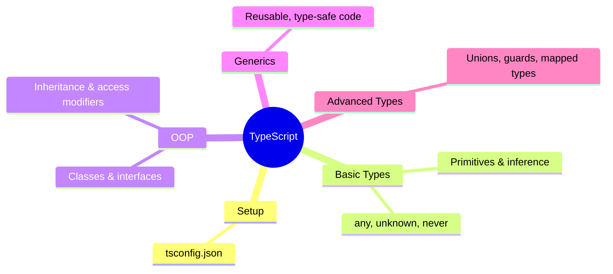
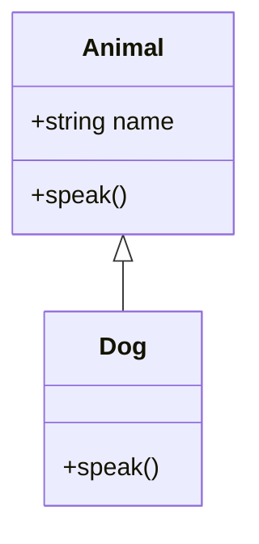

> [!note] Where this fits in web development
> Plain [[JavaScript]] never checks your types until the code actually runs in the browser or on the server. In a small script that's fine; in a large frontend codebase or a [[Node.js]] backend, a typo in a property name can slip through code review and only surface as a bug in production. [[TypeScript]] is a superset of JavaScript that adds a type system on top, catching that class of mistake while you're still writing the code. It compiles down to ordinary JavaScript, so it runs anywhere JavaScript already runs, in the browser, in [[Node.js]], and inside frameworks like [[React]] and Angular.

# What is TypeScript?

- A **superset of JavaScript**: every valid JavaScript file is already valid TypeScript. You adopt it incrementally, you don't rewrite an existing project from scratch.
- Adds **static typing**: variables, function parameters, and return values can be given explicit types that are checked before the code runs.
- **Compiles to plain JavaScript**: browsers and Node.js can't run `.ts` files directly. The TypeScript compiler (`tsc`) turns them into ordinary `.js` files first, the same files you'd deploy from a plain JavaScript project.

> [!important] Why it matters for web projects
> - Catches type errors **before runtime**, instead of a user finding a broken page in production.
> - Gives editors much better autocomplete, since the editor knows exactly what shape an API response or a component's props are.
> - Makes larger frontend and backend codebases easier to maintain, since a function's signature documents what it expects and returns without needing to read its body.

# Setting up a TypeScript project

## Installing TypeScript

```bash
npm install -g typescript
```

This installs the `tsc` compiler globally, so any project on your machine can use it.

## Initializing a project

```bash
tsc --init
```

This creates a `tsconfig.json` file in the current folder, which controls how the compiler treats your code.

## `tsconfig.json` basics

| Option | What it controls |
|---|---|
| `target` | Which version of JavaScript the compiled output should use (e.g. `ES2020`) |
| `module` | Which module system to compile to (e.g. `CommonJS` for older Node.js, `ESNext` for modern bundlers) |
| `strict` | Turns on strict type checking; without it TypeScript is much more forgiving |

> [!tip] Turn `strict` on from day one
> It's much easier to start a project with `strict: true` than to retrofit it once hundreds of loosely-typed lines already exist, which is exactly how most half-adopted TypeScript codebases end up.

# Basic types

## Primitive types

TypeScript recognizes the same primitives JavaScript has:

- `string`
- `number`
- `boolean`
- `bigint`
- `symbol`
- `undefined`
- `null`

## Variable declarations

```ts
let mutable = 10;
const immutable = 20;
```

`let` can be reassigned later; `const` can't. This is standard modern JavaScript, not something TypeScript introduces, but `const` also helps the compiler narrow types more precisely.

## Type inference

You don't have to annotate every variable. TypeScript looks at the value you assign and works the type out on its own:

```ts
let inferred = 5;          // number
let inferredString = "hi"; // string
```

## Explicit type annotations

You can also state the type directly, which matters most for function parameters or a variable that starts without a value:

```ts
let count: number = 42;
```

## Arrays and tuples

Arrays hold values of one type:

```ts
let numbers: number[] = [1, 2, 3];
let strings: Array<string> = ["a", "b"];
```

A **tuple** is an array with a fixed length where each position has its own type, handy for something like a `[key, value]` pair coming back from an API:

```ts
let person: [string, number] = ["Alice", 30];
```

## `any` and `unknown`

- `any`: disables type checking for that value entirely.
- `unknown`: also accepts any value, but forces you to narrow it (check what it actually is) before you can use it.

> [!warning] Avoid `any` in frontend and backend code alike
> `any` is easy to reach for when a third-party library or an API response doesn't have types, but it silently turns off checking everywhere that value flows. Prefer `unknown` and narrow it, or write a proper interface for the response shape.

## `void`, `null`, `undefined`, and `never`

`void` marks a function that returns nothing, common for event handlers and logging helpers:

```ts
function log(msg: string): void {
  console.log(msg);
}
```

`null` and `undefined` are their own types, each with exactly one possible value:

```ts
let x: undefined = undefined;
let y: null = null;
```

`never` marks a function that never returns normally, either because it always throws or loops forever:

```ts
function fail(message: string): never {
  throw new Error(message);
}
```

## Literal types and enums

A **literal type** restricts a value to one exact set of options, useful for things like a fixed set of HTTP methods or UI states:

```ts
type Direction = "up" | "down" | "left" | "right";
```

An **enum** names a fixed set of related constants:

```ts
enum Color { Red, Green, Blue }
```

> [!note] Literal types vs enums
> Literal unions are a compile-time-only check that leaves no trace in the compiled JavaScript. Enums generate an actual JavaScript object at runtime. In frontend bundles where every kilobyte matters, that's a real reason to reach for literal unions unless you specifically need the enum's runtime object.

# Object-oriented TypeScript

## Interfaces

An [[Interfaces|interface]] describes the shape an object must have, without providing any implementation, which is exactly what you need to describe an API response or a component's props:

```ts
interface Person {
  name: string;
  age: number;
}
```

## Class syntax

```ts
class Animal {
  constructor(public name: string) {}
  speak() { console.log(`${this.name} makes a noise`); }
}
```

## Inheritance

A class can extend another one, reusing its properties and methods and overriding what needs to change:

```ts
class Dog extends Animal {
  speak() { console.log(`${this.name} barks`); }
}
```

## Access modifiers

| Modifier | Visibility |
|---|---|
| `public` (default) | Accessible from anywhere |
| `private` | Only accessible inside the declaring class |
| `protected` | Accessible inside the declaring class and its subclasses |

## Getters and setters

```ts
class Person {
  private _age: number;
  get age() { return this._age; }
  set age(value: number) { this._age = value; }
}
```

## Static members

```ts
class Counter {
  static count = 0;
  static increment() { Counter.count++; }
}
```

`static` members belong to the class itself, not to any individual instance, so `Counter.count` is shared everywhere that class is used.

## Constructor parameter properties

```ts
class User {
  constructor(private id: number, public name: string) {}
}
```

Prefixing a constructor parameter with `private` or `public` both declares the property on the class and assigns it from the argument, saving you from writing `this.id = id;` by hand.

## Method overloading

```ts
class Calculator {
  add(a: number, b: number): number;
  add(a: string, b: string): string;
  add(a: any, b: any): any { return a + b; }
}
```

The first two lines declare the valid call signatures; the third is the actual implementation, which has to handle every case those signatures allow.

# Generics

[[Generics]] let a function, interface, or class work with a type that's decided at the call site instead of being locked to one specific type. They show up constantly in web development, from typed API clients to reusable UI components.

## Basic generic functions

```ts
function identity<T>(arg: T): T { return arg; }
```

## Generic interfaces

```ts
interface Box<T> {
  content: T;
}
```

> [!example] Where this shows up in practice
> A typed API response wrapper often looks like `interface ApiResponse<T> { data: T; status: number; }`, so `ApiResponse<User>` and `ApiResponse<Product[]>` share one definition instead of duplicating the wrapper for every endpoint.

## Generic constraints

```ts
interface Lengthwise { length: number; }
function logLength<T extends Lengthwise>(arg: T) {
  console.log(arg.length);
}
```

`T extends Lengthwise` restricts `T` to any type that has a `length` property, so the function body can safely read `arg.length` no matter what concrete type gets passed in.

# Advanced type system features

## Utility types

Built-in helpers that transform an existing type into a new one:

| Utility | Effect |
|---|---|
| `Partial<T>` | Makes every property of `T` optional, useful for a PATCH-style update object |
| `Readonly<T>` | Makes every property of `T` read-only |
| `Record<K, V>` | Builds an object type with keys of type `K` and values of type `V` |

See the [TypeScript utility types reference](https://www.typescriptlang.org/docs/handbook/utility-types.html) for the full list.

## Type aliases

```ts
type Point = { x: number; y: number; };
```

A `type` alias just gives a name to a type shape. Unlike an interface, it can also name unions, primitives, and tuples, not just object shapes.

## Intersection and union types

An **intersection** combines multiple types into one that must satisfy all of them:

```ts
type Admin = { level: number };
type User = { name: string };
type SuperUser = Admin & User;
```

A [[Union Types|union]] means a value can be one of several types:

```ts
type ID = number | string;
```

## Type guards

A **type guard** narrows a union down to one specific type inside a conditional block, so the code after the check can safely assume that narrower type:

- `typeof` for primitives (`typeof value === "string"`)
- `instanceof` for class instances
- Custom guard functions for anything more specific, such as checking the shape of an API response before trusting it

## Discriminated unions

```ts
type Shape =
  | { kind: "circle"; radius: number }
  | { kind: "square"; side: number };
```

Each member of the union shares a common field (`kind` here) with a different literal value. Checking that field is enough for TypeScript to narrow which shape you're dealing with, and to know which other fields are available. This pattern is common for representing UI states like `{ status: "loading" } | { status: "success"; data: T } | { status: "error"; message: string }`.

## Mapped types

```ts
type Readonly<T> = { readonly [P in keyof T]: T[P] };
```

A mapped type builds a new type by looping over the keys of an existing one (`keyof T`) and transforming each property, here by adding `readonly`.

## Conditional types

```ts
type IsString<T> = T extends string ? true : false;
```

Conditional types pick between two types based on whether `T` matches a condition, similar to a ternary operator, but evaluated at the type level instead of at runtime.

# Modern JavaScript/TypeScript syntax

These aren't TypeScript-exclusive, modern JavaScript has them too, but they show up constantly in both frontend and backend TypeScript code.

## Optional chaining

```ts
const name = user?.profile?.name;
```

If `user` or `user.profile` is `null` or `undefined`, the whole expression short-circuits to `undefined` instead of throwing, which matters a lot when rendering UI from data that might not have loaded yet.

## Nullish coalescing

```ts
const value = input ?? defaultValue;
```

Falls back to `defaultValue` only when `input` is `null` or `undefined`, unlike `||`, which would also fall back on `0`, `""`, or `false`, a distinction that matters for things like a quantity field where `0` is a valid, meaningful value.

## Template literals

```ts
const name = "Bob";
const greeting = `Hello, ${name}!`;
```

Backtick strings that let you embed expressions directly with `${...}`, used everywhere from building API URLs to generating HTML strings.

Reference: [MDN - Optional chaining](https://developer.mozilla.org/en-US/docs/Web/JavaScript/Reference/Operators/Optional_chaining), [MDN - Nullish coalescing](https://developer.mozilla.org/en-US/docs/Web/JavaScript/Reference/Operators/Nullish_coalescing)

# Visual overview

## The TypeScript landscape



## The Animal/Dog example



`Dog` inherits `name` and the constructor from `Animal`, then overrides `speak()` with its own implementation.

# Summary

- [[TypeScript]] is a superset of [[JavaScript]] that adds static typing and compiles down to plain JavaScript that runs anywhere JavaScript already runs.
- `tsc --init` generates `tsconfig.json`, which controls how the compiler behaves (`target`, `module`, `strict`, and more).
- Types can be left to inference or written explicitly; `any` disables checking entirely and should be avoided in favor of `unknown`.
- [[Interfaces]], classes, [[Inheritance]], and access modifiers (`public`/`private`/`protected`) bring familiar object-oriented patterns to JavaScript, with static members, getters/setters, and constructor parameter properties as convenient shortcuts.
- [[Generics]] let functions, interfaces, and classes work with a type decided at the call site, which is why they show up so often in typed API clients and reusable components.
- [[Union Types|Unions]], intersections, type guards, and discriminated unions make it possible to model values that can take several shapes, like UI or API states, while still being checked safely.
- Mapped and conditional types transform existing types into new ones based on their keys or on a condition.
- Optional chaining (`?.`), nullish coalescing (`??`), and template literals (`` ` ``) are modern JavaScript features that TypeScript web code relies on constantly.

# Exercises

### Exercise 1 (Direct application)
Write an `interface` called `ApiUser` describing a user object with an `id` (`number`), an `email` (`string`), and an `isActive` (`boolean`) field.

> [!success]- Answer key
> ```ts
> interface ApiUser {
>   id: number;
>   email: string;
>   isActive: boolean;
> }
> ```
> An interface only describes the shape the object must have. Any API response object with those three fields (and the right types) satisfies `ApiUser`.

### Exercise 2 (Direct application)
Write a literal union type called `HttpMethod` that only allows `"GET"`, `"POST"`, `"PUT"`, or `"DELETE"`.

> [!success]- Answer key
> ```ts
> type HttpMethod = "GET" | "POST" | "PUT" | "DELETE";
> ```
> Assigning any other string to a variable typed `HttpMethod` becomes a compile error, which catches typos like `"GTE"` before the request ever gets sent.

### Exercise 3 (Direct application)
Given `const input = 0;` and `const defaultValue = 10;`, what does `input ?? defaultValue` evaluate to, and how does that differ from `input || defaultValue`?

> [!success]- Answer key
> `input ?? defaultValue` evaluates to `0`, because `??` only falls back when the left side is `null` or `undefined`, and `0` is neither.
> `input || defaultValue` would evaluate to `10` instead, because `0` is falsy, and `||` falls back on any falsy value. This difference matters for numeric fields like a price or quantity, where `0` is a valid value that shouldn't be replaced by a default.

### Exercise 4 (Applied variation)
Write a generic interface `ApiResponse<T>` with a `data` field of type `T` and a `status` field of type `number`. Then write the type of a response containing an array of `ApiUser` (from Exercise 1).

> [!success]- Answer key
> ```ts
> interface ApiResponse<T> {
>   data: T;
>   status: number;
> }
>
> type UsersResponse = ApiResponse<ApiUser[]>;
> ```
> `ApiResponse<T>` is reusable for any endpoint. Plugging in `ApiUser[]` describes a response whose `data` field is an array of users, without writing a separate interface for every endpoint's response shape.

### Exercise 5 (Applied variation)
This code has a type error. Find it and explain why it's wrong:

```ts
function getUser(id: number): ApiUser {
  if (id < 0) {
    return undefined;
  }
  return { id, email: "a@b.com", isActive: true };
}
```

> [!success]- Answer key
> The function's declared return type is `ApiUser`, but the first branch returns `undefined`, which isn't a valid `ApiUser`. Either change the return type to `ApiUser | undefined`, or throw an error instead of returning `undefined` for the invalid case:
> ```ts
> function getUser(id: number): ApiUser | undefined {
>   if (id < 0) {
>     return undefined;
>   }
>   return { id, email: "a@b.com", isActive: true };
> }
> ```

### Exercise 6 (Challenge)
Model a loading UI state as a discriminated union `RequestState<T>` with three variants: `{ status: "loading" }`, `{ status: "success"; data: T }`, and `{ status: "error"; message: string }`. Then write a function `render(state: RequestState<string>): string` that returns `"Loading..."`, the data itself, or `` `Error: ${message}` `` depending on the variant.

> [!success]- Answer key
> ```ts
> type RequestState<T> =
>   | { status: "loading" }
>   | { status: "success"; data: T }
>   | { status: "error"; message: string };
>
> function render(state: RequestState<string>): string {
>   if (state.status === "loading") {
>     return "Loading...";
>   } else if (state.status === "success") {
>     return state.data;
>   } else {
>     return `Error: ${state.message}`;
>   }
> }
> ```
> Checking `state.status` acts as a type guard: inside each branch, TypeScript narrows `state` to that exact variant, so `state.data` is only valid in the `"success"` branch and `state.message` only in the `"error"` branch. This is the same pattern real frontend apps use to render loading spinners, results, and error banners from one state value.

# External resources

- [TypeScript Handbook](https://www.typescriptlang.org/docs/handbook/intro.html)
- [MDN: JavaScript guide](https://developer.mozilla.org/en-US/docs/Web/JavaScript/Guide)
- [W3Schools: TypeScript tutorial](https://www.w3schools.com/typescript/)
- [GeeksforGeeks: TypeScript basics](https://www.geeksforgeeks.org/typescript/)

# Tags

#webdevelopment #typescript #javascript #frontend #backend #static_typing #software
