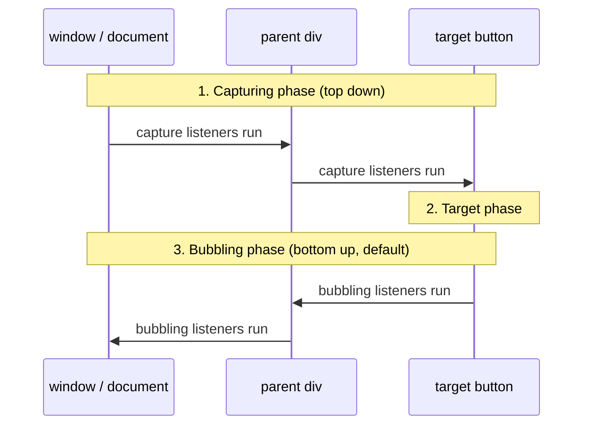
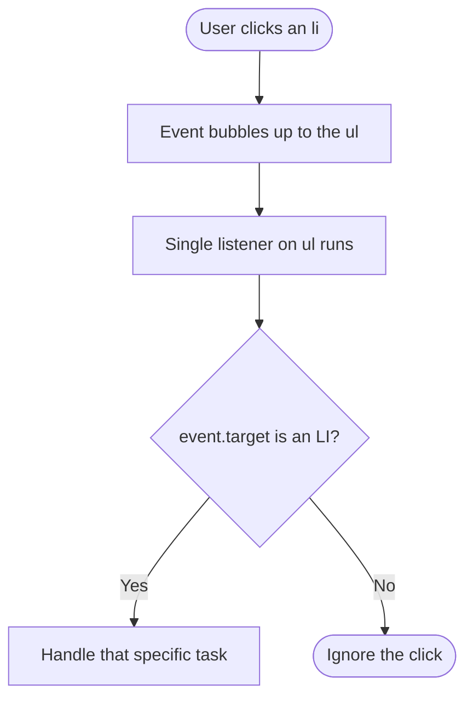
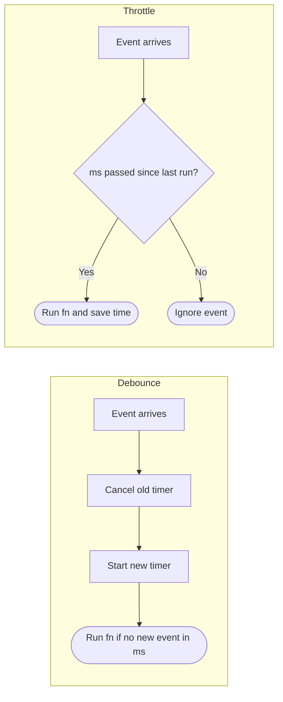
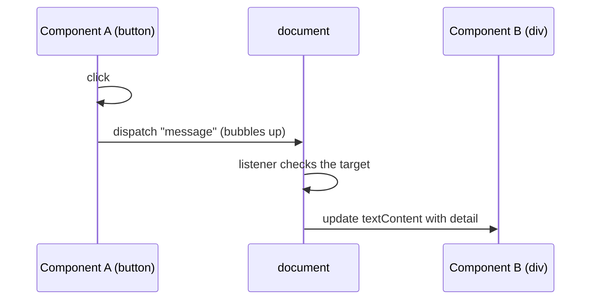
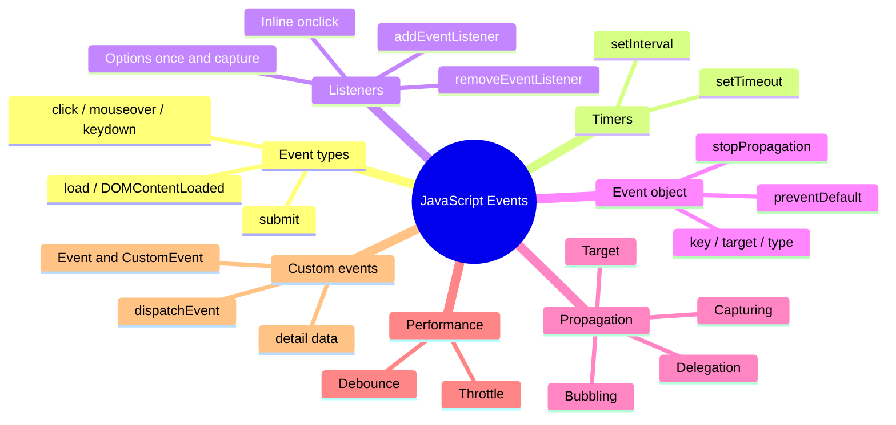

# Why events matter

An **event** is something that happens on the page: the user clicks a button, presses a key, submits a form, or the page finishes loading. [[JavaScript]] can "listen" for these moments and run code when they happen.

Events let a web page:

- respond to user interactions,
- change what's on screen without reloading the whole page,
- behave like an app instead of a static document.

That's why events are at the center of modern [[Frontend]] development. Almost every interactive feature you've used on a website (dropdown menus, live form validation, "like" buttons) is built on top of them.

> [!tip]
> This lecture builds directly on [[Week 1 - The DOM]]. Every listener you write is attached to a DOM element you first have to find with `getElementById`, `querySelector`, and so on.

# Basic event types

| Type | When it fires | Typical use |
|---|---|---|
| `click` | Mouse button pressed and released | Button presses |
| `mouseover` | Pointer enters an element | Tooltips |
| `keydown` | Any key is pressed | Form validation |
| `submit` | A form is submitted | Preventing the page reload |
| `load` | The page *and all its dependent resources* (images, stylesheets, etc.) have finished loading | Initial setup |
| `DOMContentLoaded` | The DOM is ready, possibly before the dependent resources finish loading | Initial setup |

> [!note] `load` vs `DOMContentLoaded`
> Both are used for "run this once the page is ready" code. The difference is how long they wait:
> - `DOMContentLoaded` fires as soon as the HTML has been parsed into the [[DOM]]. Images might still be downloading.
> - `load` waits until *everything* is done, images and stylesheets included, so it fires later.
>
> If your code only needs to find and change elements, `DOMContentLoaded` is usually enough.

> [!warning] Typo on the slide
> The slide spells it "DomConentLoaded". The real event name is `DOMContentLoaded`, with capital "DOM" and "Content" spelled out. Event names are case sensitive, so a typo means your listener silently never runs.

# Timers

Timers are not user events, but they also run code "later" instead of right away, so they belong in the same family of ideas.

## `setTimeout()`: run code once

```javascript
let timerId = setTimeout(funcToCall, millisecondsToWait);
```

- The first parameter is a **function object** that gets called after the time has passed.
- The second parameter is how many **milliseconds** to wait before calling it (1000 ms = 1 second).
- The return value (`timerId`) identifies this timer. If you change your mind before the time runs out, cancel it with `clearTimeout(timerId)`.

> [!example]
> ```javascript
> const timerId = setTimeout(() => {
>   console.log('3 seconds have passed');
> }, 3000);
>
> // Changed our mind? Cancel it before it fires:
> clearTimeout(timerId);
> ```

## `setInterval()`: run code repeatedly

```javascript
let intervalId = setInterval(funcToCall, millisecondsToWait);
```

- The first parameter is the function to call **every time** the interval passes.
- The second parameter is the number of milliseconds between calls.
- The return value (`intervalId`) can be passed to `clearInterval(intervalId)` to stop the repetition.

> [!warning] Common mistake
> Pass the function itself, not the result of calling it.
> - `setTimeout(sayHi, 1000)` is correct: JavaScript calls `sayHi` after 1 second.
> - `setTimeout(sayHi(), 1000)` calls `sayHi` *immediately* and hands its return value (usually `undefined`) to `setTimeout`.

| | `setTimeout` | `setInterval` |
|---|---|---|
| Runs the function | once | repeatedly |
| Cancel with | `clearTimeout(id)` | `clearInterval(id)` |

# Event listeners

> [!note] Definition
> An **[[Event Listeners|event listener]]** (also called an *event handler*) is a function that runs when a specific event happens. It's attached to a DOM element, and it can be defined either inline in the HTML or through JavaScript.

## Inline event handlers

```html
<button onclick="alert('Clicked!')">Inline Click</button>
```

This is quick to write, but it has two problems:

- It mixes HTML (structure) and JavaScript (behavior) in the same place.
- It's not reusable. If ten buttons need the same behavior, you copy the code ten times.

## Adding listeners in JavaScript with `addEventListener`

```html
<button id="jsBtn">JS Click</button>
<script>
  const btn = document.getElementById('jsBtn');
  btn.addEventListener('click', () => {
    alert('Clicked via JS!');
  });
</script>
```

The pattern is always the same:

1. Find the element.
2. Call `element.addEventListener(eventType, handlerFunction)`.

This keeps structure and behavior separate, and an element can have **more than one listener** for the same event.

> [!important] Prefer `addEventListener`
> In real projects, `addEventListener` is the standard way to attach behavior. Inline `onclick` attributes show up mostly in quick demos and older code.

## Step by step: clicking a button with a named function

```html
<button id="stepBtn">Step Button</button>
<script>
  const btn = document.getElementById('stepBtn');
  btn.addEventListener('click', function handleClick() {
    console.log('Button was clicked.');
  });
</script>
```

Giving the handler a name (`handleClick`) means you can reuse it, or remove it later with `removeEventListener`. An anonymous arrow function has no name to refer back to, so you can't remove it afterwards.

## Multiple listeners on one element

```html
<button id="multiBtn">Multi Listener</button>
<script>
  const btn = document.getElementById('multiBtn');
  btn.addEventListener('click', () => console.log('First listener'));
  btn.addEventListener('click', () => console.log('Second listener'));
</script>
```

Clicking the button prints `First listener` and then `Second listener`. Listeners run in the **order they were registered**.

## Listeners on multiple elements

When several elements need the same behavior, select them all and loop:

```html
<div class="box" style="width:50px;height:50px;background:#f00;"></div>
<div class="box" style="width:50px;height:50px;background:#0f0;"></div>
<div class="box" style="width:50px;height:50px;background:#00f;"></div>
<script>
  document.querySelectorAll('.box').forEach(box => {
    box.addEventListener('mouseenter', e => {
      e.target.style.opacity = '0.5';
    });
    box.addEventListener('mouseleave', e => {
      e.target.style.opacity = '1';
    });
  });
</script>
```

Each box fades to half opacity when the pointer moves over it and returns to full opacity when the pointer leaves. (`mouseenter` and `mouseleave` are a close relative of `mouseover` from the table above.)

## Handling multiple event types on one element

One element can listen for different kinds of events:

```html
<input id="multiInput" placeholder="Type or click" />
<script>
  const inp = document.getElementById('multiInput');
  inp.addEventListener('keydown', e => console.log(`Key: ${e.key}`));
  inp.addEventListener('click', () => console.log('Input clicked'));
</script>
```

This keeps all the logic related to that input grouped together.

# The `event` object

When an event fires, the browser automatically passes an **[[Event Object|event object]]** to your handler. It holds information about what happened.

```html
<input id="keyInput" placeholder="Press a key" />
<script>
  const input = document.getElementById('keyInput');
  input.addEventListener('keydown', event => {
    console.log(`Key pressed: ${event.key}`);
  });
</script>
```

| Property | What it tells you |
|---|---|
| `event.key` | Which key was pressed (for keyboard events) |
| `event.target` | The element where the event actually happened |
| `event.type` | The event's name, like `"click"` or `"keydown"` |

> [!tip]
> You'll often see the parameter named `e` or `evt` instead of `event`. The name doesn't matter; the browser always passes the object as the first argument.

## Preventing default behavior

Some elements come with built-in browser behavior. A link navigates to another page, and a form reloads the page on submit. `event.preventDefault()` cancels that behavior.

```html
<a href="https://example.com" id="preventLink">No Navigation</a>
<script>
  const link = document.getElementById('preventLink');
  link.addEventListener('click', event => {
    event.preventDefault();
    console.log('Navigation prevented.');
  });
</script>
```

Clicking the link logs a message and stays on the page. This is useful for **form validation** (stop the submit if a field is wrong) and **custom link handling**.

# Event propagation: capturing, target, and bubbling

When you click a button inside a `<div>`, you've technically also clicked the `<div>`, and the `<body>`, and so on up the tree. The browser handles this by sending the event through the DOM in **three phases**.

> [!note] The three phases of an event
> 1. **Capturing phase.** The browser travels *down* the [[DOM]] tree, from the outermost element (`window`, `document`) toward the target element. Listeners configured for capturing run on the parent elements during this trip, *before* the target's own listeners.
> 2. **Target phase.** The event reaches the element that was actually clicked, and the listeners on that element run.
> 3. **Bubbling phase (the default).** The event travels back *up* from the target to its parent, then the grandparent, and so on until the root of the DOM. Normal listeners (the ones you add without options) run during this phase.



> [!important]
> Because of **[[Event Bubbling|bubbling]]**, a listener on a parent element also hears events that happened on its children. That one fact powers both `stopPropagation()` and event delegation below.

For an animated walkthrough of the phases, the slides point to [javascript.info: Bubbling and capturing](https://javascript.info/bubbling-and-capturing).

## Event bubbling demo

```html
<ul id="list">
  <li>Item 1</li>
  <li>Item 2</li>
  <li>Item 3</li>
</ul>
<script>
  const list = document.getElementById('list');
  list.addEventListener('click', event => {
    console.log(`Clicked on ${event.target.textContent}`);
  });
</script>
```

There is **one** listener, on the `<ul>`. Clicking any `<li>` still triggers it, because the click bubbles up from the `<li>` to the `<ul>`. Bubbling lets a single listener on the parent replace one listener per child.

## Stopping propagation

Sometimes you *don't* want the parent to react when the child is clicked. `event.stopPropagation()` stops the event from bubbling any further.

```html
<div id="parent" style="padding:20px;background:#eee;">
  <button id="child">Child Button</button>
</div>
<script>
  const child = document.getElementById('child');
  const parent = document.getElementById('parent');
  child.addEventListener('click', event => {
    console.log('Child clicked');
    event.stopPropagation();
  });
  parent.addEventListener('click', () => {
    console.log('Parent clicked');
  });
</script>
```

| Where you click | Output |
|---|---|
| The button | `Child clicked` only |
| The grey area of the div | `Parent clicked` |

This keeps the child's action isolated from the parent.

> [!warning] Don't confuse these two
> - `preventDefault()` cancels the **browser's built-in action** (navigation, form submit). The event still bubbles.
> - `stopPropagation()` stops the **event from traveling** to parent elements. The browser's built-in action still happens.
>
> They solve different problems, and sometimes you need both.

## Listening during the capture phase

By default, listeners run in the bubbling phase. Passing `{ capture: true }` as a third argument makes the listener run during the capturing phase instead:

```html
<div id="capturing">
  <button id="capturedBtn">Capture</button>
</div>
<script>
  const btn = document.getElementById('capturedBtn');
  btn.addEventListener('click', e => console.log('Captured listener'), { capture: true });
  btn.addEventListener('click', e => console.log('Bubbling listener'));
</script>
```

The `capture: true` listener runs **before** the bubbling listeners, so the output is `Captured listener` and then `Bubbling listener`.

# Event delegation

> [!note] Definition
> **[[Event Delegation]]** means putting *one* listener on a parent element instead of one on each child, then using `event.target` to figure out which child was actually clicked. It works because of bubbling.

```html
<div id="menu">
  <a href="#" data-page="home">Home</a>
  <a href="#" data-page="about">About</a>
  <a href="#" data-page="contact">Contact</a>
</div>
<script>
  const menu = document.getElementById('menu');
  menu.addEventListener('click', event => {
    if (event.target.matches('a')) {
      event.preventDefault();
      console.log(`Navigate to ${event.target.dataset.page}`);
    }
  });
</script>
```

What each piece does:

- `event.target.matches('a')` checks whether the clicked element matches a [[CSS]] selector. Clicks on empty space inside the `<div>` are ignored.
- `event.preventDefault()` stops the `href="#"` link from jumping to the top of the page.
- `event.target.dataset.page` reads the custom `data-page` attribute (the `data-` attributes from last week).

One listener handles all the links. This is especially efficient for **dynamic lists**: if you add a new link later with JavaScript, it already works, because the listener lives on the parent, which was there from the start.

## Using `event.target` in delegation

```html
<ul id="taskList">
  <li>Read book</li>
  <li>Write code</li>
  <li>Take coffee</li>
</ul>
<script>
  const list = document.getElementById('taskList');
  list.addEventListener('click', event => {
    if (event.target.tagName === 'LI') {
      console.log(`Task clicked: ${event.target.textContent}`);
    }
  });
</script>
```

`event.target` points to the exact `<li>` that was clicked. This time the check uses `tagName` instead of `matches()`.

> [!warning] Common mistake
> `tagName` is always **uppercase** for HTML elements. `event.target.tagName === 'li'` will never be true; compare against `'LI'`.



# Listener options and removing listeners

## `{ once: true }`

```html
<button id="onceBtn">Once</button>
<script>
  const btn = document.getElementById('onceBtn');
  btn.addEventListener('click', () => console.log('Clicked once'), { once: true });
</script>
```

`{ once: true }` removes the listener automatically after it runs the first time. Clicking again does nothing.

## Before the `once` option existed

You had to remove the listener yourself from inside the handler:

```javascript
const button = document.getElementById('myButton');

function handleClick() {
  console.log('This message will also only appear once!');
  button.removeEventListener('click', handleClick);
}

button.addEventListener('click', handleClick);
```

> [!important]
> `removeEventListener` needs the **same event type and the same function reference** that was passed to `addEventListener`. That's why this example uses a named function (`handleClick`). An anonymous arrow function written again inside `removeEventListener` would be a *different* function, and nothing would be removed.

| Option (third argument) | Effect |
|---|---|
| `{ once: true }` | Listener is removed after its first call |
| `{ capture: true }` | Listener runs during the capturing phase |

# Debouncing and throttling

Some events fire *a lot*. A user can click a button ten times in a second, and a `scroll` event can fire dozens of times per second. Running heavy code on every one of those is wasteful. Debouncing and throttling are two patterns that control how often a handler actually runs. Both are built on top of the timer and closure ideas from earlier.

## Debouncing click events

> [!note] Debounce
> **[[Debouncing]]** waits until the events *stop* for a set amount of time, then runs the handler once. Every new event resets the countdown.

```html
<button id="debounceBtn">Debounce Click</button>
<script>
  function debounce(fn, ms) {
    let timeout;
    return (...args) => {
      clearTimeout(timeout);
      timeout = setTimeout(() => fn.apply(this, args), ms);
    };
  }
  const btn = document.getElementById('debounceBtn');
  // The end of this line is cut off on the slide; a delay in ms goes last
  btn.addEventListener('click', debounce(() => console.log('Clicked with debounce'), 500));
</script>
```

How it works:

1. `debounce` returns a **new function**, and that new function is the actual listener.
2. Each click calls `clearTimeout(timeout)`, cancelling any timer still waiting from the previous click.
3. It then starts a fresh `setTimeout`. Only if no click happens for `ms` milliseconds does the timer finish and run `fn`.
4. `timeout` lives in the outer function, so it is remembered between clicks (a [[Closures|closure]]).

The result: rapid repeated clicks produce **one** log, after the user stops clicking. This prevents accidental double submissions.

## Throttling scroll events

> [!note] Throttle
> **[[Throttling]]** lets the handler run at most once every `ms` milliseconds, no matter how many events arrive in between.

```html
<div style="height:2000px;">Scroll down</div>
<script>
  function throttle(fn, ms) {
    let last;
    return (...args) => {
      const now = Date.now();
      if (!last || now - last >= ms) {
        last = now;
        fn.apply(this, args);
      }
    };
  }
  window.addEventListener('scroll', throttle(() => {
    console.log('Scroll event fired');
  }, 200));
</script>
```

How it works:

1. `last` stores the time the handler last ran (also kept alive by a closure).
2. On every scroll event, `Date.now()` gives the current time in milliseconds.
3. If the handler never ran (`!last`) or at least `ms` milliseconds have passed, it runs and updates `last`. Otherwise the event is ignored.

While the user keeps scrolling, the message prints about once every 200 ms instead of on every single scroll event.

| | Debounce | Throttle |
|---|---|---|
| Runs when | the events **stop** for `ms` | at most **once per** `ms` while events keep coming |
| During a long burst of events | runs once, at the end | runs regularly, spaced out |
| Slide example | Button clicks | Scrolling |

> [!tip] A way to remember the difference
> Debounce is like an elevator door: every new person resets the timer, and it only closes once people stop arriving. Throttle is like a bus that leaves every 10 minutes no matter how many people show up.



# Custom events

Besides the built-in events (`click`, `keydown`, ...), you can create and fire **your own** events with any name you want.

## Defining a custom event

```javascript
const myEvent = new Event('myCustom', {
  bubbles: true,
  cancelable: true
});
```

| Option | Meaning |
|---|---|
| `bubbles` | Lets the event propagate up to parent elements |
| `cancelable` | Lets a listener stop it with `preventDefault()` |

> [!warning] Custom events don't bubble by default
> If you leave out `bubbles: true`, the event only reaches listeners on the element that dispatched it. Parents won't hear it.

## Dispatching custom events with `CustomEvent`

Creating an event doesn't do anything on its own. You have to **fire** it on an element with `dispatchEvent()`. To send data along with it, use **[[CustomEvent]]** and put the data in `detail`.

```html
<div id="box" style="width:100px;height:100px;background:#ccc;"></div>
<script>
  const box = document.getElementById('box');
  const ev = new CustomEvent('boxClicked', {
    detail: { color: 'blue' },
    bubbles: true
  });
  box.addEventListener('boxClicked', e => {
    console.log('Custom event data:', e.detail);
    box.style.background = e.detail.color;
  });
  box.addEventListener('click', () => box.dispatchEvent(ev));
</script>
```

The flow: a normal `click` on the box dispatches the custom `boxClicked` event, and the `boxClicked` listener reads `e.detail.color` and turns the box blue.

- `CustomEvent` carries data in its `detail` property.
- This is useful for letting different parts (components) of a page talk to each other.

## Custom event with `detail` data

`detail` can hold anything: a string, a number, or an object with as many fields as you need.

```html
<button id="dataBtn">Send Data</button>
<script>
  const btn = document.getElementById('dataBtn');
  btn.addEventListener('click', () => {
    const ev = new CustomEvent('dataSent', {
      detail: { user: 'Alice', id: 42 }
    });
    btn.dispatchEvent(ev);
  });
  btn.addEventListener('dataSent', e => console.log('Data received:', e.detail));
</script>
```

Clicking the button logs `Data received: { user: 'Alice', id: 42 }`.

## Custom event propagation

With `bubbles: true`, custom events travel up the tree just like a click does:

```html
<div id="grandParent">
  <div id="parent">
    <button id="childBtn">Trigger</button>
  </div>
</div>
<script>
  const child = document.getElementById('childBtn');
  const parent = document.getElementById('parent');
  const grandParent = document.getElementById('grandParent');
  const ev = new CustomEvent('propagate', { bubbles: true });

  child.addEventListener('click', () => child.dispatchEvent(ev));
  parent.addEventListener('propagate', () => console.log('Parent received'));
  grandParent.addEventListener('propagate', () => console.log('Grandparent received'));
</script>
```

The event travels from child to parent to grandparent, so the output is `Parent received` and then `Grandparent received`.

## Cross-component communication with custom events

```html
<!-- Component A -->
<button id="compA" data-target="compB">Send to B</button>

<!-- Component B -->
<div id="compB">Waiting...</div>

<script>
  const compA = document.getElementById('compA');
  const compB = document.getElementById('compB');

  compA.addEventListener('click', () => {
    const ev = new CustomEvent('message', { detail: 'Hello B', bubbles: true });
    compA.dispatchEvent(ev);
  });

  document.addEventListener('message', e => {
    if (e.target.id === 'compB') {
      compB.textContent = `Received: ${e.detail}`;
    }
  });
</script>
```

Component A fires a `message` event, which bubbles all the way up to `document`, where a single listener decides what to do with it. A and B never call each other's code directly. This is called **[[Loose Coupling|loose coupling]]**: you can change or replace one component without breaking the other, as long as the event name and data shape stay the same.

> [!warning] Look closely at this example
> As written on the slide, the event is dispatched from `compA`, so `e.target.id` is `'compA'`, not `'compB'`. The `if` check fails and the text never changes. One way to make it work is to check `e.target.dataset.target === 'compB'` instead, using the `data-target` attribute already on the button. Exercise 6 below walks through it.



# Visual overview



# Summary

- Events let a page react to the user without reloading. Common ones are `click`, `mouseover`, `keydown`, `submit`, `load`, and `DOMContentLoaded`.
- `setTimeout` runs a function once after a delay; `setInterval` runs it repeatedly. Cancel them with `clearTimeout` / `clearInterval` using the returned ID.
- `addEventListener` is the preferred way to attach behavior. It keeps HTML and JS separate and allows several listeners per element, which run in registration order.
- The browser passes an `event` object to every handler, with properties like `key`, `target`, and `type`.
- `preventDefault()` cancels the browser's built-in action; `stopPropagation()` stops the event from bubbling to parents.
- Events go through three phases: capturing (down), target, and bubbling (up, the default). `{ capture: true }` makes a listener run in the capturing phase.
- Event delegation puts one listener on a parent and uses `event.target` to find the clicked child. It's efficient and works for elements added later.
- `{ once: true }` removes a listener after one call. Before it existed, you called `removeEventListener` inside the handler with a named function.
- Debounce runs a handler after events stop; throttle limits it to once per time window.
- `new Event()` and `new CustomEvent()` create your own events, `detail` carries data, `bubbles: true` lets them propagate, and `dispatchEvent()` fires them. This allows loosely coupled communication between components.

# Exercises

### Exercise 1 (Direct application)
Write the JavaScript for a button with `id="saveBtn"` that logs `"Saved!"` to the console when it is clicked. Use `addEventListener`, not an inline handler.

> [!success]- Answer key
> ```javascript
> const saveBtn = document.getElementById('saveBtn');
> saveBtn.addEventListener('click', () => {
>   console.log('Saved!');
> });
> ```
> First find the element (`getElementById`), then attach the listener with the event type as a string (`'click'`, no "on" prefix) and the function to run. Using `addEventListener` keeps the behavior out of the HTML and allows adding more click listeners later.

### Exercise 2 (Direct application)
Write code that logs `"Tick"` every 2 seconds, and stops automatically after 10 seconds.

> [!success]- Answer key
> ```javascript
> const intervalId = setInterval(() => console.log('Tick'), 2000);
>
> setTimeout(() => {
>   clearInterval(intervalId);
>   console.log('Stopped');
> }, 10000);
> ```
> `setInterval` handles the repetition and returns an ID. A separate `setTimeout` waits 10 000 ms (10 seconds) and then passes that ID to `clearInterval`. You'll see "Tick" about 5 times. Remember that both functions take milliseconds, so 2 seconds is `2000`.

### Exercise 3 (Direct application)
A form has `id="signup"` and an input with `id="email"`. Stop the form from reloading the page on submit, and log `"Email is required"` if the input is empty.

> [!success]- Answer key
> ```javascript
> const form = document.getElementById('signup');
> const email = document.getElementById('email');
>
> form.addEventListener('submit', event => {
>   event.preventDefault();
>   if (email.value === '') {
>     console.log('Email is required');
>   }
> });
> ```
> The `submit` event is listened for on the **form**, not the button. `event.preventDefault()` cancels the browser's default action (sending the form and reloading the page), which is exactly the "form validation" use case from the slides.

### Exercise 4 (Applied variation)
Given the HTML below, predict the console output when the user clicks the button. Then change **one line** so that only `"Button"` is logged.

```html
<div id="outer">
  <div id="inner">
    <button id="btn">Go</button>
  </div>
</div>
<script>
  document.getElementById('outer').addEventListener('click', () => console.log('Outer'));
  document.getElementById('inner').addEventListener('click', () => console.log('Inner'));
  document.getElementById('btn').addEventListener('click', () => console.log('Button'));
</script>
```

> [!success]- Answer key
> **Output:** `Button`, then `Inner`, then `Outer`.
>
> These listeners have no options, so they run in the bubbling phase: first the target (the button), then each ancestor going up.
>
> To log only `"Button"`, stop propagation in the button's listener:
> ```javascript
> document.getElementById('btn').addEventListener('click', e => {
>   console.log('Button');
>   e.stopPropagation();
> });
> ```
> Bonus: if you instead added `{ capture: true }` to the `outer` listener, the order would become `Outer`, `Button`, `Inner`, because capture listeners run on the way *down*, before the target.

### Exercise 5 (Applied variation)
A to-do list `<ul id="todos">` starts empty, and new `<li>` items are added with JavaScript whenever the user types a task. Clicking a task should toggle a `done` class on it. Write the click handling so it works for items added *later*, using a single listener.

> [!success]- Answer key
> ```javascript
> const todos = document.getElementById('todos');
>
> todos.addEventListener('click', event => {
>   if (event.target.tagName === 'LI') {
>     event.target.classList.toggle('done');
>   }
> });
> ```
> This is **event delegation**. The listener is on the `<ul>`, which exists from the start. Clicks on any `<li>`, including ones created later, bubble up to it. `event.target` is the actual `<li>` clicked, and the `tagName` check (uppercase `'LI'`) ignores clicks on anything else. Adding a listener to each `<li>` in a loop would *not* work for new items, because the loop only runs once on the items that existed at that moment. `classList.toggle` comes from last week's DOM lecture.

### Exercise 6 (Challenge)
The slide's cross-component example never updates Component B, because the `if (e.target.id === 'compB')` check fails. Explain why, then fix it so that clicking "Send to B" changes B's text to `Received: Hello B`, without making component A reference `compB` directly in its click handler.

> [!success]- Answer key
> **Why it fails:** `e.target` is the element the event was *dispatched on*. A calls `compA.dispatchEvent(ev)`, so `e.target` is the button, and `e.target.id` is `'compA'`. The condition is never true.
>
> **Fix:** use the `data-target` attribute already on the button to say who the message is for, and let the document-level listener route it:
> ```javascript
> compA.addEventListener('click', () => {
>   const ev = new CustomEvent('message', { detail: 'Hello B', bubbles: true });
>   compA.dispatchEvent(ev);
> });
>
> document.addEventListener('message', e => {
>   const targetId = e.target.dataset.target; // "compB"
>   const receiver = document.getElementById(targetId);
>   if (receiver) {
>     receiver.textContent = `Received: ${e.detail}`;
>   }
> });
> ```
> A still knows nothing about B's code, it only names a target in its HTML. `bubbles: true` is required so the event reaches `document`. This keeps the components loosely coupled: you could point the button at a different component by changing only the `data-target` attribute.

### Exercise 7 (Challenge)
A search box fires an expensive request on every `keydown`, and a "back to top" button should appear when `window.scrollY > 500`. For each one, decide whether debounce or throttle fits better, and write the listener using the `debounce` and `throttle` functions from the slides.

> [!success]- Answer key
> **Search box: debounce.** You only want to search after the user *stops typing*. Searching after every key wastes requests on half-typed words.
> ```javascript
> const search = document.getElementById('search');
> search.addEventListener('keydown', debounce(() => {
>   console.log(`Searching for: ${search.value}`);
> }, 400));
> ```
> **Back-to-top button: throttle.** The button should react *while* the user is scrolling, not only after they stop, but checking on every scroll event is unnecessary.
> ```javascript
> const topBtn = document.getElementById('topBtn');
> window.addEventListener('scroll', throttle(() => {
>   topBtn.style.display = window.scrollY > 500 ? 'block' : 'none';
> }, 200));
> ```
> The rule of thumb: debounce when only the *final* state matters, throttle when you need *regular updates* during a continuous stream of events. Note that `debounce(...)` and `throttle(...)` are *called* when passed to `addEventListener`, because they return the real listener function.

# External resources

- [Eloquent JavaScript: Handling Events](https://eloquentjavascript.net/15_event.html)
- [MDN: Introduction to events](https://developer.mozilla.org/en-US/docs/Learn_web_development/Core/Scripting/Events)
- [MDN: EventTarget.addEventListener()](https://developer.mozilla.org/en-US/docs/Web/API/EventTarget/addEventListener)
- [MDN: CustomEvent](https://developer.mozilla.org/en-US/docs/Web/API/CustomEvent)
- [javascript.info: Bubbling and capturing](https://javascript.info/bubbling-and-capturing)
- [javascript.info: Event delegation](https://javascript.info/event-delegation)
- [MDN: setTimeout()](https://developer.mozilla.org/en-US/docs/Web/API/Window/setTimeout)
- [W3Schools: JavaScript HTML DOM Events](https://www.w3schools.com/js/js_htmldom_events.asp)

# Tags

#webdevelopment #javascript #events #dom #frontend #html #software
