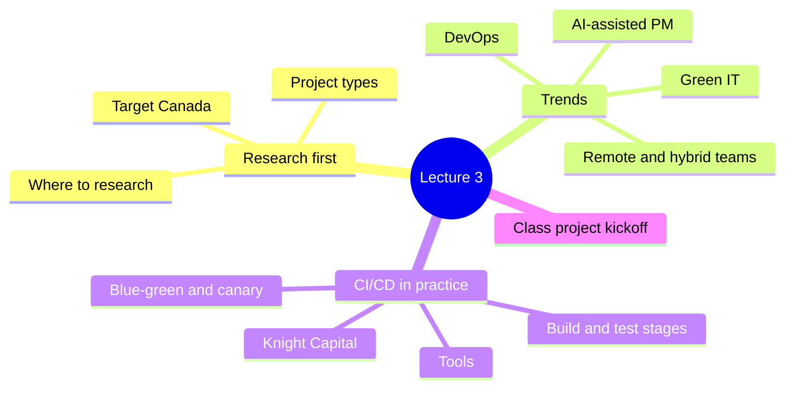
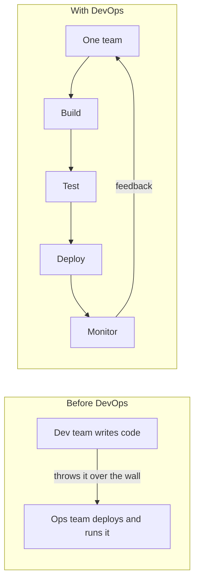
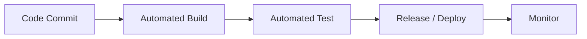
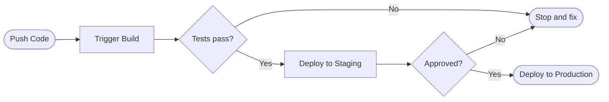
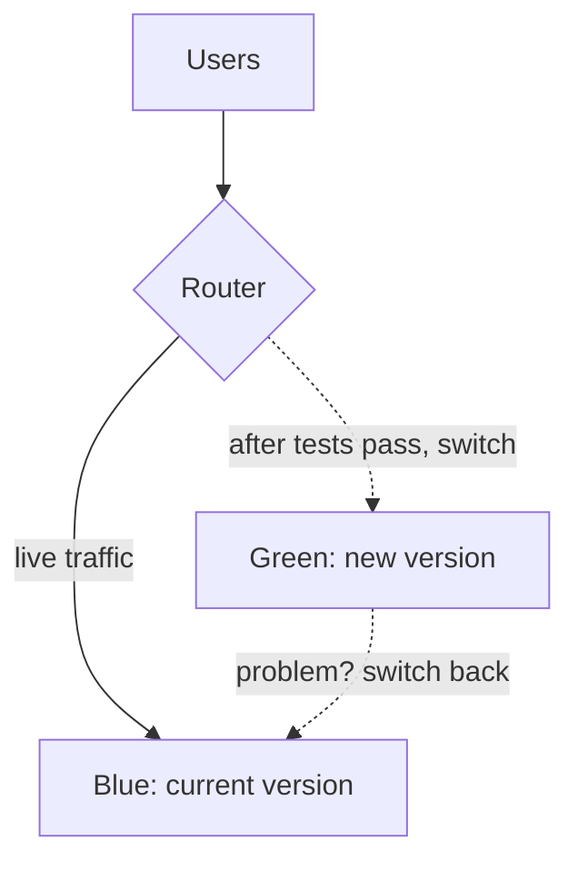
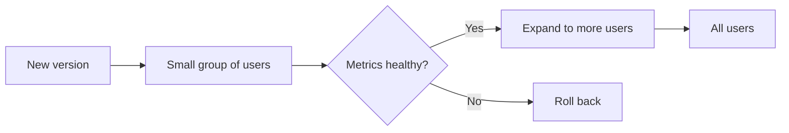

> [!note] What this lecture covers
> Week 2 introduced methodologies, the life cycle, and the basic [[CI/CD]] pipeline. This week has four parts. Part 1 shows why you should research similar projects before planning your own. Part 2 covers four trends changing how IT projects are run. Part 3 goes inside the CI/CD pipeline and looks at safer ways to deploy. Part 4 starts the class project.

> [!example] Santayana on the past
> "Those who cannot remember the past are condemned to repeat it."
> *George Santayana*
>
> Most IT projects have been tried before by someone. If you read how their project went, you can avoid making the same mistakes on yours.



---
# Part 1: Researching Real-World IT Projects

## The Project Types You Already Know

Most IT projects fall into one of three types. Each type measures success in a different way.

| Project type | What it involves | How success is measured |
|---|---|---|
| **Hardware & Infrastructure** | Physical or virtualized systems: network upgrades, server migrations, data center builds | Uptime, capacity, reliability |
| **Software Development** | New applications, features, or integrations | Working software, user adoption, defect rates |
| **Network & Security** | Firewalls, access control, compliance projects | Reduced risk and passed audits |

> [!warning] Security projects are hard to "show"
> When a security project works, *nothing happens*: no breach, no failed audit. That makes it the hardest type to demonstrate visibly to stakeholders, because there is no new screen or faster server to point at.

## Why Research Before You Plan

- Almost every "new" IT project has already been attempted somewhere, maybe in another company, another decade, or another industry. Research is how you find it.
- A documented [[Case Study]] tells you the real budget, the real timeline, and the real failure points. A vendor's sales pitch will never volunteer that information.
- For your class project, starting in this week's lab, find at least one comparable project before you write a [[Project Charter|Charter]], and ask what actually happened.

## Where to Research an IT Project

| # | Source | What you get from it |
|---|---|---|
| 1 | **Documented case studies** | Post-mortems and retrospectives (like the ones in this lecture), written after a real project succeeded or failed |
| 2 | **Industry & analyst reports** | Gartner, Forrester, and vendor whitepapers on typical costs, timelines, and adoption trends for a project type |
| 3 | **Open-source project history** | GitHub issues, commit history, and changelogs show how a real software project evolved, mistakes included |
| 4 | **Professional communities** | PMI's case library, LinkedIn groups, and conference talks from PMs who have run a similar project |

> [!tip] Useful starting points
> - [PMI (Project Management Institute)](https://www.pmi.org) for its case library and articles
> - [GitHub](https://github.com) to browse the issues and commit history of open-source projects similar to yours

## Case Study 1: Target Canada's Launch (2013)

> [!example] The project
> Target expanded into Canada and opened 133 stores in a single year. This was a huge supply-chain and IT undertaking, built on a brand-new [[ERP]] system from SAP that was supposed to run inventory, pricing, and logistics from day one.

> [!warning] The failure
> The data fed into the new system was full of errors: wrong product dimensions, wrong weights, wrong costs. There wasn't time to research and clean the data against the systems it replaced. Shelves sat empty while warehouses overflowed, and Target closed every Canadian store within two years.

> [!important] Lessons from Target Canada
> - SAP itself wasn't the problem. The data and processes behind it were never checked against what already existed.
> - A fixed, aggressive launch date pushed the team to go live with known data problems they planned to "fix later." Later never came in time.
> - Before adopting a new system, research how it will interact with what's already in place. A vendor demo only shows the product working on clean data. (Your best friend's uncle's cousin's opinion isn't research either.)

---
# Part 2: Modern Trends in IT Project Management

Four trends are changing how IT projects are run today:

| # | Trend | In one line |
|---|---|---|
| 1 | **[[DevOps]] culture** | Development and Operations merge into one continuous flow, building on the CI/CD basics from Lecture 2 |
| 2 | **Remote & hybrid teams** | Teams spread across time zones are now the default for many IT projects |
| 3 | **AI-assisted PM** | AI tools support scheduling, risk flagging, status reporting, and meeting summaries |
| 4 | **Sustainability & [[Green IT]]** | Energy use, e-waste, and carbon impact are now written into project requirements from the start |

## Trend 1: DevOps, Merging Dev and Ops

> [!note] What DevOps means
> **[[DevOps]]** joins two groups that used to work separately: *Development* (the people who write the code) and *Operations* (the people who run it in production). One team owns the whole path from writing code to keeping it running.

| Before DevOps | With DevOps |
|---|---|
| Separate Development and Operations teams | One team owns build, test, deploy, and monitor |
| Developers "throw code over the wall" to Ops | Developers and Ops share on-call responsibility |
| Deployments are rare, large, and risky | Deployments are frequent, small, and low-risk |
| Outages spark blame between teams | Outages trigger a [[Blameless Post-Mortem\|blameless review]] |



> [!example] Real-world example: Etsy's continuous deployment culture
> At its peak, Etsy's engineers deployed changes to production roughly **50 times a day**, often within minutes of a developer finishing their code.
>
> That pace only works with heavy automation and a "blameless" culture. When something breaks, the team fixes the part of the pipeline that let the bug through. Nobody gets blamed for writing it.

> [!important] What this means for a PM
> Adopting DevOps also changes how the team is managed. The team has to treat mistakes as information to learn from. If people get punished for incidents, they start hiding them.

## Trend 2: Managing Remote & Hybrid Teams

- **Communication defaults to asynchronous**: written updates, recorded demos, and shared docs. Nobody in any time zone has to be online at the same moment as everyone else.
- **Meetings become the exception.** A well-written status update replaces most "quick syncs."
- **The PM's job shifts** from watching people work to making sure the work itself is visible, through tools the team already uses, like Basecamp.

> [!note] Synchronous vs. asynchronous
> *Synchronous* communication happens live, with everyone present at once (a video call). *Asynchronous* communication happens on each person's own time (a written post, a recorded demo, a shared document). Remote teams lean on asynchronous communication because their working hours don't overlap much.

> [!example] Real-world example: GitLab's all-remote playbook
> GitLab is an "all-remote" company, with team members in dozens of countries and no central office. It publishes its entire way of working in a public online handbook that anyone can read.
>
> Every process, from onboarding to how meetings run, is written down. A new team member in any time zone can find an answer without waiting for someone to come online.
>
> The takeaway for your own team: the more you write down in Basecamp's **Message Board** and **Docs & Files**, the less your project depends on everyone being online at the same time.
>
> More: [GitLab Handbook: All-Remote](https://handbook.gitlab.com/handbook/company/culture/all-remote/)

## Trend 3: AI-Assisted Project Management

- AI tools are increasingly used to draft status reports, summarize long meeting recordings, and flag schedule or budget risks before a human notices the trend.
- They are *assistive*. They don't act on their own. An AI tool can suggest that a task is at risk based on patterns in the data, but the PM still decides what to do about it.
- Whatever tools you use later in your career, the [[PMBOK]] skills from this course ([[Project Scope|scope]], [[Risk Management|risk]], [[Communication Management|communication]]) are what the AI tool supports. It doesn't replace them.

| AI can help with | Still needs a human |
|---|---|
| Summarizing long meeting notes | Judging whether a risk is worth escalating |
| Drafting a first-pass status report | Having a hard conversation with a [[Stakeholders\|stakeholder]] |
| Flagging schedule slippage patterns | Deciding trade-offs between scope, cost, and time |
| Generating first drafts of routine documents | Taking accountability for the outcome |

> [!tip] A quick way to remember the split
> The left column is about processing information: summarizing, drafting, spotting patterns. The right column needs judgment, relationships, and responsibility. Those stay with the PM.

> [!note] Scope, cost, and time trade-offs
> The "trade-offs between scope, cost, and time" refer to the [[Triple Constraint]]: changing one of the three usually forces a change in at least one of the others. Deciding which one gives is a management call.

## Trend 4: Sustainability & Green IT Projects

- Energy-efficient data centers, e-waste recycling programs, and carbon-reporting dashboards are now common IT project types on their own. They used to be side effects of other projects.
- Cloud providers now publish sustainability metrics. IT project teams are increasingly asked to report against them, the same way they report cost or schedule.
- Sustainability projects fit the same PMBOK process groups you're already learning. They just add an extra success metric next to scope, cost, and schedule.

> [!example] Real-world example: Microsoft's Project Natick
> Microsoft researched an unusual idea: sink a sealed data center capsule to the ocean floor and let seawater cool it naturally. Cooling is one of the biggest expenses in running a data center, so this could cut energy costs a lot.
>
> Technically, the research worked. Servers in the underwater unit had a **lower failure rate** than the same kind of servers on land, which proved the concept was sound.
>
> Microsoft still ended the underwater program in 2024. Turning underwater data centers into a commercial product was too expensive and impractical, even though the experiment succeeded.
>
> More: [Microsoft: Project Natick](https://natick.research.microsoft.com/)

> [!important] Lesson from Natick
> A project can succeed technically and in research and still get closed. A PM tracks whether the project makes business sense, and that is a separate question from whether the engineering worked.

---
# Part 3: CI/CD in Practice

## CI/CD Pipeline: Quick Recap

From Lecture 2, the basic [[CI/CD]] pipeline has five stages:



This week goes one level deeper into what happens inside each stage, and you'll work with it hands-on in the lab.

## Inside the Build and Test Stages

| Automated Build | Automated Test |
|---|---|
| Compiles or packages the code | **[[Unit Testing\|Unit tests]]** check individual pieces of code |
| Runs static analysis / linting to catch style problems and obvious bugs | **[[Integration Testing\|Integration tests]]** check that the pieces work together |
| Fails fast: a broken build blocks everything after it | **Security scans** check for known vulnerabilities before release |

> [!note] Terms worth knowing
> - **Static analysis / linting**: a tool reads the code *without running it* and flags style problems or obvious mistakes, a bit like a spell-checker for code.
> - **Fail fast**: if the build breaks, the pipeline stops right there. No point testing or deploying code that doesn't even compile.
> - **Unit vs. integration test**: a unit test checks one small part in isolation (does this function add correctly?). An integration test checks that parts work together (does the checkout page actually talk to the payment system?).

## Popular CI/CD Tools

| Tool | What makes it distinct |
|---|---|
| **GitHub Actions** | Pipelines are defined in a YAML file that lives right next to the code, in the same GitHub repository |
| **Jenkins** | One of the oldest and most configurable CI/CD tools. Self-hosted, with a huge library of plugins |
| **GitLab CI/CD** | Built directly into GitLab, so source control, pipeline, and issue tracking all live in one platform |

> [!tip] Official docs
> - [GitHub Actions documentation](https://docs.github.com/en/actions)
> - [Jenkins](https://www.jenkins.io)
> - [GitLab CI/CD documentation](https://docs.gitlab.com/ee/ci/)

## A Simple Pipeline, Step by Step

This is the flow you'll configure by hand in this week's lab. It has six stages, and each one has to pass before the next one can start.



> [!note] Staging vs. production
> **Staging** is a copy of the real environment used for a final check. **Production** is the live system real users depend on. The **Approve** step is a human sign-off between the two.

## Case Study 2: Knight Capital's $460 Million Deployment (2012)

> [!example] The deployment
> Knight Capital rolled out new trading software **by hand** to eight production servers. One server didn't get the update. It was accidentally left running old, dormant test code from years earlier.

> [!warning] The failure
> When the markets opened, the leftover code on that one server started firing trades nobody intended. It took **45 minutes** to diagnose and stop. By then Knight Capital had lost about **$460 million**, and the company nearly collapsed overnight.

> [!important] Lessons from Knight Capital
> - A manual, inconsistent deployment across servers is the exact failure CI/CD automation exists to prevent. Every server should get the same tested build.
> - Nothing automatically checked whether one server was running different code from the other seven. Deployment verification belongs inside the pipeline.
> - There was no fast, automated [[Rollback]]. Stopping the damage took 45 minutes of manual diagnosis. A tested rollback plan matters as much as the deployment itself.

## Safer Deployment Techniques

> [!note] Blue-Green Deployment
> Run two identical production environments, "blue" and "green." Deploy the new version to the idle one and test it there, then switch all traffic over at once. If something is wrong, switch back just as fast.



> [!note] Canary Release
> Roll the new version out to a small slice of users first, like the canary miners used to carry into coal mines as an early warning. If the metrics stay healthy, gradually expand to everyone. If something is wrong, only a small percentage of users were ever affected.



| | Blue-Green | Canary |
|---|---|---|
| Who gets the new version first | Everyone, all at once, after testing on the idle environment | A small slice of users |
| How you recover | Switch traffic back to the old environment | Stop the rollout. Only the small group was affected |
| Main idea | Instant switch, instant switch-back | Deploy small, verify, then expand |

> [!example] Real-world example: canary releases at scale
> Large platforms, including Meta/Facebook, commonly release new code to a small internal or limited external group first. They watch error rates and performance before expanding to the full user base.
>
> A canary release turns "did the deployment work?" into something you measure during a gradual rollout, with an automatic off-ramp if something looks wrong.
>
> Compare this with Knight Capital. The same idea (deploy small, verify, then expand) would very likely have limited the $460 million loss to a fraction of one server's traffic.

## This Week in Lab: Hands-On CI/CD

- In **Lab 3** you'll work with a real CI/CD pipeline. You push a small change and watch it move through the build, test, and deploy stages yourself.
- You'll also select or confirm your class project from the Lab 2 ideas list and start defining it with a **project checklist**. This is the first real [[Project Life Cycle|Initiating-stage]] work of the term.
- Bring the research habit from Part 1: look at one comparable project before you finalize your own scope.

---
# Part 4: Kicking Off Your Class Project

## Before Lab 3

1. Review the example project list from Lab 2 (Hardware/Infrastructure, Software Development, Network & Security) and narrow it down to one or two options for your team.
2. Skim for at least one comparable real project, even with a quick search, and note its rough scope, its timeline, or a problem it ran into.
3. Come ready to start your project checklist: *what needs to be true before you can call this project "Initiated"?*

> [!tip] Connecting it back to Week 2
> "Initiated" refers to the first stage of the [[Project Life Cycle]]: defining the project and getting authorization to begin. Your checklist should cover what the project is, why it exists, and who has agreed to it.

---
# Key Takeaways

- **Research before you plan.** Every project type has been tried before somewhere. Find it, read it, and learn from it before you write your Charter.
- **Trends change the toolkit, not the fundamentals.** DevOps, remote teams, AI, and sustainability all change how you work. The PMBOK process groups underneath stay the same.
- **Small, verified deployments beat big, risky ones.** Knight Capital's manual rollout and a modern canary release show the same thing from opposite sides: the safest deployment is the smallest one you can measure.
- **This week, the work becomes yours.** Lab 3 kicks off your own class project, and the research and deployment habits from today apply to your own work right away.

---
# Exercises

### Exercise 1 (Direct application)
Your team is asked to replace the college's aging Wi-Fi access points across three buildings. Which of the three project types does this belong to, and what would you measure to decide whether it succeeded?

> [!success]- Answer key
> This is a **Hardware & Infrastructure** project: it replaces physical network equipment. Following the lecture, success is measured in **uptime** (is the Wi-Fi available when people need it?), **capacity** (can it handle the number of connected devices?), and **reliability** (does it stay stable without drops?). It isn't a Software Development project because no new application is being built, and it isn't mainly Network & Security because the goal is coverage and performance. Access control and compliance aren't the point.

### Exercise 2 (Direct application)
A developer pushes code, and the pipeline's build stage fails because of a syntax error. What should happen to the test and deploy stages, and why?

> [!success]- Answer key
> They should **not run**. The build stage is designed to *fail fast*: a broken build blocks everything after it. There's no point testing or deploying code that doesn't even compile or package correctly. Stopping early saves time and makes sure broken code never gets near staging or production.

### Exercise 3 (Direct application)
A team needs to release an update, and above all they want to be able to undo it within seconds if something goes wrong. Everyone should get the new version at the same moment. Which safer deployment technique fits best?

> [!success]- Answer key
> **Blue-green deployment.** The new version goes to the idle environment and is tested there, then all traffic switches over at once, so everyone gets it at the same moment. If there's a problem, traffic switches back to the old environment just as fast. A canary release doesn't fit because it gives the new version to a small slice of users first.

### Exercise 4 (Applied variation)
Your team of five is split between Toronto, Lagos, and Manila. The team lead wants a daily 30-minute video stand-up at 9 a.m. Toronto time. Using what the lecture says about remote teams and GitLab's approach, what would you suggest instead, and which Basecamp features would you use?

> [!success]- Answer key
> A fixed live meeting forces someone to join at an awkward hour (9 a.m. in Toronto is late evening in Manila). The lecture says remote teams should default to **asynchronous** communication and treat meetings as the exception. A better approach: each member posts a short written update on the **Message Board** at the start of their own day, with demos recorded when needed. Decisions and processes go into **Docs & Files** so anyone can find answers without waiting for someone to be online. Keep live meetings for the few conversations that really need them. This follows the GitLab lesson: the more you write down, the less the project depends on everyone being online at the same time.

### Exercise 5 (Applied variation)
Your AI-powered PM tool sends an alert: "Task 'Database migration' is 80% likely to slip past its deadline." Describe what the AI has done, and list at least two things the PM still has to do personally.

> [!success]- Answer key
> The AI has done its assistive job: it spotted a **schedule slippage pattern** in the data and flagged the risk early. From here the PM still has to:
> - **Judge whether the risk is worth escalating** (is 80% credible? how bad is the impact?).
> - **Decide the trade-off** between scope, cost, and time: cut scope, add resources, or move the deadline.
> - If needed, **have the conversation with stakeholders** about the delay.
> - **Take accountability** for the outcome.
>
> The tool suggests the task is at risk. The PM decides what to do about it.

### Exercise 6 (Applied variation)
Compare Target Canada and Knight Capital. Both were failures, but at different points. Where in the project did each one go wrong, and what practice from this lecture would have helped each?

> [!success]- Answer key
> - **Target Canada** went wrong *before and during go-live planning*: the product data was never researched and cleaned against the systems it replaced, and a fixed launch date pushed the team to go live with known problems. The fix is Part 1's habit: **research how the new system interacts with what already exists**, and don't let the date override known data issues.
> - **Knight Capital** went wrong *at deployment*: a manual rollout left one of eight servers running old code, nothing checked for the difference, and there was no quick rollback. The fix is Part 3's practice: **automated, consistent CI/CD deployment with verification and a tested rollback plan**, ideally with a canary-style gradual rollout.
>
> Both show a PM problem as much as a technical one. SAP worked, and trading software can be deployed safely. The failures came from process and discipline.

### Exercise 7 (Challenge)
A city hires your team to build a public parking-payment app. The city council also requires that the project "reduce the environmental impact of the city's IT." Using Part 2, explain how the sustainability requirement changes (and doesn't change) the way you manage the project.

> [!success]- Answer key
> **What doesn't change:** the project still goes through the same PMBOK process groups (Initiating, Planning, Executing, Monitoring & Controlling, Closing), and you still manage scope, cost, and schedule.
>
> **What changes:** sustainability becomes an **extra success metric next to scope, cost, and schedule**. In practice:
> - Write it into the requirements from the start. The lecture says it shouldn't be an afterthought.
> - If the app runs in the cloud, use the provider's published **sustainability metrics** and report against them the same way you report budget or schedule.
> - Monitor it during the project, like any other metric.
>
> This matches the key takeaway: trends change the toolkit, and the fundamentals stay the same.

### Exercise 8 (Challenge)
Your manager says: "Project Natick proved underwater servers fail less often, so it was obviously a successful project. Microsoft made a mistake cancelling it." As a PM, how would you respond?

> [!success]- Answer key
> Natick was a **technical and research success**: the underwater servers had a lower failure rate, which proved the concept. But a project also has to make **business sense**. Microsoft ended it in 2024 because turning underwater data centers into a commercial product was too expensive and impractical. A PM tracks both questions: *does the engineering work?* and *is it worth doing as a business?* Cancelling a project that can't justify its cost is a sound management decision. Closing it deliberately is also a proper use of the Closing stage.

---
# Feynman Practice

Write each explanation in your own words, without looking at the notes. Where the steps below say to mark a word, use `(?)` to flag it.

## Feynman: Researching Before You Plan
- [ ] **1. Explain it as if to a 12-year-old.** Imagine a friend is about to open a lemonade stand and asks why they should bother looking at other kids' stands first. Use Target Canada to explain what can go wrong if nobody checks what came before.
- [ ] **2. Find the jargon.** Reread what you wrote. Mark with `(?)` any word a 12-year-old wouldn't understand (e.g. "ERP," "case study," "post-mortem").
- [ ] **3. Simplify.** For each `(?)`, write an analogy or concrete example. Why is a case study more honest than a vendor's sales pitch?
- [ ] **4. Organize and test.** Rewrite it in 3-5 sentences. Could you explain it in 2 minutes, including where to look (the four research sources)?

## Feynman: DevOps and Blameless Culture
- [ ] **1. Explain it as if to a 12-year-old.** What does "throwing code over the wall" look like if you picture it as two groups in a restaurant (the cooks and the waiters)? What changes when they become one team?
- [ ] **2. Find the jargon.** Mark with `(?)` words like "Operations," "on-call," "production," "blameless."
- [ ] **3. Simplify.** Using Etsy, explain why deploying 50 times a day only works if people aren't punished when something breaks.
- [ ] **4. Organize and test.** Rewrite it in 3-5 sentences. Could you explain why DevOps affects how people are managed, and not only which tools they use?

## Feynman: Where AI Helps and Where It Doesn't
- [ ] **1. Explain it as if to a 12-year-old.** If an AI is like a very fast assistant who reads every meeting note, what jobs would you hand it, and which would you never hand it? Why?
- [ ] **2. Find the jargon.** Mark with `(?)` words like "escalating," "stakeholder," "trade-off," "accountability."
- [ ] **3. Simplify.** Give one concrete example of a scope/cost/time trade-off a PM might face, and explain why an AI suggestion isn't enough to settle it.
- [ ] **4. Organize and test.** Rewrite it in 3-5 sentences, ending with what "assistive, not autonomous" means.

## Feynman: The CI/CD Pipeline and Knight Capital
- [ ] **1. Explain it as if to a 12-year-old.** Describe the six-stage pipeline (Push Code to Deploy to Production) as a factory line where each station has to say "OK" before the next one starts. What would have stopped Knight Capital's broken server?
- [ ] **2. Find the jargon.** Mark with `(?)` words like "build," "linting," "staging," "rollback," "deployment verification."
- [ ] **3. Simplify.** Explain the difference between a unit test and an integration test with an everyday example.
- [ ] **4. Organize and test.** Rewrite it in 3-5 sentences. Could you explain in 2 minutes why automation plus rollback would have saved Knight Capital most of its $460 million?

## Feynman: Blue-Green vs. Canary
- [ ] **1. Explain it as if to a 12-year-old.** Why would someone keep two identical copies of a whole system? And where does the name "canary" come from, and why does it fit?
- [ ] **2. Find the jargon.** Mark with `(?)` words like "environment," "traffic," "metrics," "off-ramp."
- [ ] **3. Simplify.** Come up with your own analogy for each technique (e.g. a restaurant testing a new dish).
- [ ] **4. Organize and test.** In 3-5 sentences, explain when you'd pick one over the other.

---
# Flashcards (Anki)

Copy the block below into a `.txt` file and import it in Anki via **File > Import** (Basic note type, fields separated by tab).

```
#separator:tab
#html:false
#tags column:3
How is success measured in a Hardware & Infrastructure project?	Uptime, capacity, and reliability.	csd318 lecture-03 project-types
How is success measured in a Software Development project?	Working software, user adoption, and defect rates.	csd318 lecture-03 project-types
Why are Network & Security projects often the hardest to demonstrate visibly?	Success means reduced risk and passed audits, so when it works, nothing visible happens.	csd318 lecture-03 project-types
What does a documented case study tell you that a vendor's sales pitch won't?	The real budget, the real timeline, and the real failure points.	csd318 lecture-03 research
Name the four sources for researching an IT project.	Documented case studies; industry and analyst reports; open-source project history; professional communities.	csd318 lecture-03 research
What caused Target Canada's SAP rollout to fail if the SAP technology itself worked?	The product data (dimensions, weights, costs) was full of errors and was never researched or cleaned against the systems it replaced.	csd318 lecture-03 case-study
How did Target Canada's fixed launch date contribute to its failure?	It pushed the team to go live with known data problems to "fix later," and later never came in time.	csd318 lecture-03 case-study
Before DevOps, how did outages usually play out between teams?	They sparked blame between the Development and Operations teams.	csd318 lecture-03 devops
With DevOps, what happens after an outage?	A blameless review. The team fixes the process, and nobody is blamed.	csd318 lecture-03 devops
About how many times a day did Etsy deploy to production at its peak?	Roughly 50 times a day.	csd318 lecture-03 devops
What two things made Etsy's deployment pace possible?	Heavy automation and a blameless culture.	csd318 lecture-03 devops
What is the default communication style for remote and hybrid teams?	Asynchronous: written updates, recorded demos, and shared docs.	csd318 lecture-03 remote-teams
How does the PM's job shift on a remote team?	From watching people work to making sure the work itself is visible through shared tools.	csd318 lecture-03 remote-teams
What is the lesson from GitLab's all-remote handbook for your Basecamp team?	The more you write down (Message Board, Docs & Files), the less the project depends on everyone being online at the same time.	csd318 lecture-03 remote-teams
Why are AI PM tools described as "assistive, not autonomous"?	They can flag a risk from data patterns, but the PM still decides what to do about it.	csd318 lecture-03 ai
Name two PM tasks that still need a human even with AI tools.	Any two of: judging whether a risk is worth escalating; having a hard conversation with a stakeholder; deciding scope/cost/time trade-offs; taking accountability for the outcome.	csd318 lecture-03 ai
How do sustainability projects fit into PMBOK?	They use the same process groups and add an extra success metric next to scope, cost, and schedule.	csd318 lecture-03 green-it
Why did Microsoft end Project Natick in 2024 despite its technical success?	Commercializing underwater data centers was too expensive and impractical.	csd318 lecture-03 green-it
What does "fail fast" mean in the build stage of a pipeline?	A broken build immediately blocks everything after it in the pipeline.	csd318 lecture-03 cicd
What is the difference between unit tests and integration tests?	Unit tests check individual pieces of code; integration tests check that the pieces work together.	csd318 lecture-03 cicd
Which CI/CD tool defines pipelines in a YAML file stored in the same repository as the code?	GitHub Actions.	csd318 lecture-03 cicd
Which CI/CD tool is self-hosted, one of the oldest, and known for a huge plugin library?	Jenkins.	csd318 lecture-03 cicd
What went wrong in Knight Capital's 2012 deployment?	A manual rollout to eight servers missed one, which kept running old dormant test code that fired unintended trades.	csd318 lecture-03 case-study
How long did Knight Capital take to stop the failure, and how much did it lose?	45 minutes; about $460 million.	csd318 lecture-03 case-study
How does a blue-green deployment let you recover from a bad release?	Traffic switches back instantly to the other, still-running identical environment.	csd318 lecture-03 deployment
How does a canary release limit the damage of a bad release?	Only a small slice of users gets the new version first, so only they are affected if something is wrong.	csd318 lecture-03 deployment
```

---
# Further Reading

- [PMI (Project Management Institute)](https://www.pmi.org)
- [Atlassian: What is DevOps?](https://www.atlassian.com/devops)
- [GitLab Handbook: All-Remote](https://handbook.gitlab.com/handbook/company/culture/all-remote/)
- [Martin Fowler: Blue-Green Deployment](https://martinfowler.com/bliki/BlueGreenDeployment.html)
- [Martin Fowler: Canary Release](https://martinfowler.com/bliki/CanaryRelease.html)

---
# Tags

#project-management #CSD318 #devops #CI-CD #remote-teams #ai-in-pm #green-it #deployment-strategies #case-studies #PMBOK
