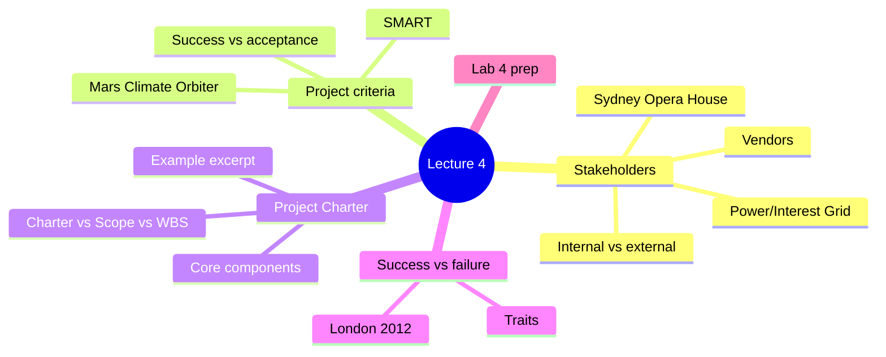
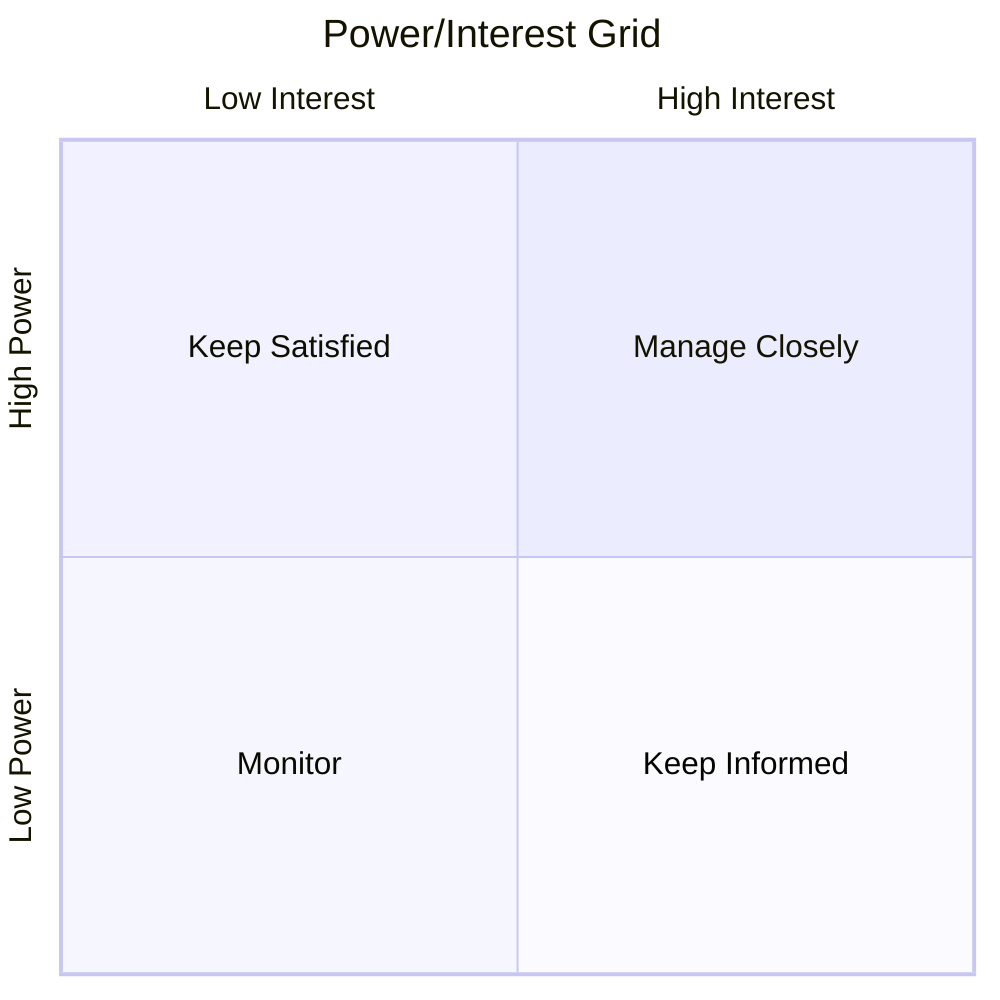
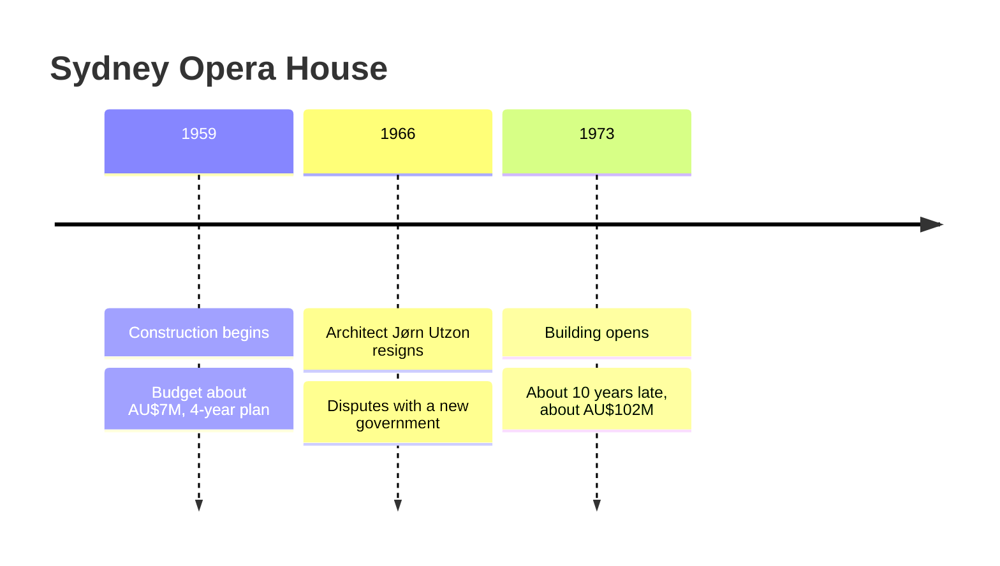
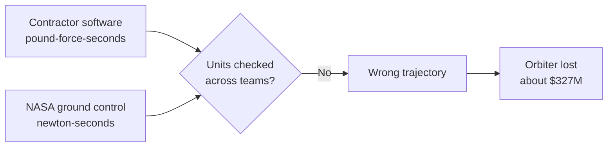
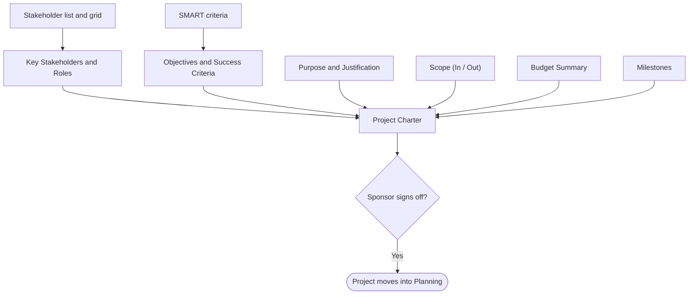

> [!note] What this lecture covers
> Week 3 kicked off the class project. This week gives you the tools to formally start it. Part 1 explains who your [[Stakeholders]] are and how to sort them with the [[Power-Interest Grid|Power/Interest Grid]]. Part 2 shows how to write [[Project Criteria]] using the [[SMART Criteria|SMART]] framework. Part 3 takes the [[Project Charter]] apart section by section. Part 4 compares successful and unsuccessful projects, and Part 5 prepares you for Lab 4.

> [!example] Henry Ford on teamwork
> "Coming together is a beginning; keeping together is progress; working together is success."
> *Henry Ford*
>
> A project only works when everyone who has a say in it pulls in the same direction. This lecture is about finding those people and getting them to agree, in writing, on what the project is.



---
# Part 1: Identifying Key Stakeholders

## What Is a Stakeholder?

> [!note] Definition
> A **[[Stakeholders|stakeholder]]** is any individual or group who can *affect*, or is *affected by*, your project's process or outcome. That includes more people than the ones doing the work.

The stakeholder list is bigger than your project team. Someone might never touch a single deliverable and still have the power to stall, fund, or cancel your project.

> [!important] Identify them early
> Identifying stakeholders is one of the first things a PM does in the *Initiating* stage of the [[Project Life Cycle]]. If you miss one, they tend to show up later, at a worse time, with an objection you didn't plan for.

## Internal vs. External Stakeholders

Stakeholders are usually split by whether they sit inside or outside your organization.

| Internal stakeholders | External stakeholders |
|---|---|
| **[[Project Sponsor]]**: funds and champions the project | **Customers / End users**: use what you build |
| **Project team**: does the hands-on work | **Vendors & suppliers**: provide materials, software, or contracted work |
| **Internal departments** (IT, Finance, HR): affected by the outcome | **Regulators**: enforce compliance requirements |
| **Executives / Leadership**: care about strategic fit | **Community / Public**: affected by visible, large-scale projects |

> [!example] A quick way to picture it
> Imagine your college is replacing its student portal. Internal stakeholders include the IT department building it, the Registrar's office that relies on it, and the executive who approved the budget. External stakeholders include the students who log in every day and the software vendor supplying the platform.

## The Power/Interest Grid

The **[[Power-Interest Grid|Power/Interest Grid]]** sorts stakeholders on two axes:

- **Power**: how much they can influence scope, budget, or approval.
- **Interest**: how much the outcome affects them personally.

Each quadrant tells you how to engage that group.



| Quadrant | Power / Interest | Who is usually here | How to engage |
|---|---|---|---|
| **Manage Closely** | High / High | Your project sponsor and key decision makers | Engage fully, involve them in major decisions, communicate frequently |
| **Keep Satisfied** | High / Low | Senior sponsors and executives who fund the project but aren't in the daily details | Keep them informed at a high level and don't overload them |
| **Keep Informed** | Low / High | End users and support staff affected by the outcome but with little formal authority | Keep them updated so they stay supportive |
| **Monitor** | Low / Low | Peripheral stakeholders with minimal involvement | Light-touch communication; watch for any change in their position |

> [!tip] One rule to remember
> The higher a stakeholder's power *and* interest, the more actively the PM should engage them. Know who has power, who has interest, and who has both.

### The "Minion" version of the grid

The lecture used a Minion-themed example of IT project stakeholders to make the quadrants easier to remember. Each character is a real role, and the quotes are the kind of thing that person tends to say.

| Quadrant | Roles | What they tend to say |
|---|---|---|
| **Manage Closely** ("talk to these a lot") | Project Sponsor, Project Manager, IT Manager / Tech Lead, Business Owner | "This project has my name on it!" / "According to my spreadsheet..." / "Did anyone check the network?" / "But does it solve the problem?" |
| **Keep Satisfied** ("keep these happy") | Executive Leadership, Finance / Budget Owner, Legal / Compliance, Senior Leadership | "Is it finished yet?" / "How much is THAT going to cost?" / "Did you fill out Form 37-B?" |
| **Keep Informed** ("keep these updated") | IT Technician, Business User, Help Desk / Support, End User / Customer | "Who broke it this time?" / "Can you make that button bigger?" / "Have you tried turning it off and on?" / "Wait... why did everything change?" |
| **Monitor** ("watch these") | Vendor / Supplier, Other Departments, Occasional Stakeholder, General Organization | "Your equipment will arrive... eventually." / "What's everyone working on?" / attends the meeting and says nothing |

## Using the Grid in Practice


1. **List everyone first**, internal and external, before plotting anyone. It's easier to drop someone later than to realize in Week 8 that you forgot them entirely.
2. **Plot each one** by power (ability to influence scope, budget, or approval) and interest (how much the outcome affects them personally). Then tailor your [[Communication Management|communication plan]] to their quadrant.
3. **Revisit the grid** as the project moves. A stakeholder's power and interest can shift a lot between Initiating and Closing.

> [!warning] The grid is not a one-time exercise
> A common mistake is to plot stakeholders once at the start and never look again. Someone in "Monitor" today might move to "Manage Closely" if the project starts to affect them directly.

## Don't Forget Your Vendors

- Vendors and suppliers are stakeholders too. You'll formally evaluate them through [[Request for Proposal|RFPs]] later in the course (Week 6), but their delivery timelines and reliability directly affect your schedule and [[Risk Register|risk register]].
- A vendor usually sits in **Keep Satisfied** or **Manage Closely**, depending on how critical their piece is to your project's success.

> [!note] Why does the example grid put vendors in "Monitor"?
> The Minion grid shows a vendor in "Monitor," while this slide says vendors usually belong in "Keep Satisfied" or "Manage Closely." The placement depends on the vendor. A supplier of minor, easily replaced items can sit in "Monitor." A vendor whose product the whole project depends on needs much closer attention.

## Case Study 1: The Sydney Opera House (1959-1973)

> [!example] The project
> One of the most architecturally ambitious buildings ever attempted. The New South Wales government commissioned it on a fixed political timeline, with an initial budget of about **AU$7 million** and a **4-year schedule**.

> [!warning] The failure
> Political stakeholders repeatedly overrode the original architect's design and budget decisions. In 1966, architect **Jørn Utzon** resigned in protest over funding and control disputes with a newly elected government. The building finally opened in 1973, about **10 years late**, at roughly **AU$102 million**, over 1,000% above its original budget.



> [!important] Lessons from the Sydney Opera House
> - No [[Project Charter]] locked in scope, budget, or decision-making authority up front, so every change in government became a change in project direction.
> - The architect, arguably the most critical "Manage Closely" stakeholder, never had a stable, protected relationship with the political sponsors funding the work.
> - A visionary result doesn't excuse a broken process. As a case study, the building is remembered as much for its cost and schedule overrun as for its architecture.

---
# Part 2: Setting Project Criteria

## What Are Project Criteria?

> [!note] Definition
> **[[Project Criteria]]** are the specific, agreed-upon conditions that define what "successful" and "complete" mean for a project. They turn a vague goal into something you can test against.

Criteria usually cover two things:

| Type | Question it answers |
|---|---|
| **[[Success Criteria]]** | How do we know the *project* achieved its purpose? |
| **[[Acceptance Criteria]]** | How do we know a specific *deliverable* is done and correct? |

Criteria are set during Initiating and Planning, alongside your stakeholder list. You can't write a Charter or a [[Scope Statement]] without them.

> [!example] Success vs. acceptance in a small project
> Say your team builds an online booking page for a campus gym. A **success criterion** might be that online bookings replace phone bookings for most members by the end of term. An **acceptance criterion** for one deliverable might be that the confirmation email arrives within one minute of booking. The first judges the whole project; the second judges one piece of it.

## The SMART Framework

A good criterion is **[[SMART Criteria|SMART]]**:

| Letter | Stands for | What it means |
|---|---|---|
| **S** | Specific | States exactly what will be done, with no vague language |
| **M** | Measurable | Includes a number or a clear yes/no test |
| **A** | Achievable | Realistic given the team's time, budget, and skills |
| **R** | Relevant | Tied directly to the project's actual purpose |
| **T** | Time-bound | Has a specific deadline or checkpoint |

## Vague vs. SMART

| Vague criterion | SMART criterion |
|---|---|
| "Improve system performance." | "Reduce average page load time from 4.2 seconds to under 1.5 seconds by Week 8, verified by load testing." |
| No number, no deadline, no way to test whether it has been achieved | A specific metric, a clear deadline, and an objective test anyone can run |
| Two people could disagree in Week 10 about whether this was ever "done" | No room for a Week 10 argument about whether it happened |

> [!tip] How to check a criterion
> Read it and ask: *if two different people checked this, would they reach the same answer?* If not, it isn't specific or measurable enough yet.

## Case Study 2: Mars Climate Orbiter (1999)

> [!example] The project
> A NASA spacecraft built to study the Martian atmosphere, developed jointly with contractor **Lockheed Martin**. The navigation software calculated thruster force in *pound-force-seconds*, the customary imperial unit.

> [!warning] The failure
> NASA's own ground-control software expected the metric unit, *newton-seconds*, and nobody caught the mismatch before launch. The orbiter approached Mars far too low and was destroyed in the atmosphere. Roughly **$327 million** in spacecraft and mission costs were lost.



> [!important] Lessons from the Mars Climate Orbiter
> - The specification never documented which unit system to use in a clear, unambiguous way. SMART criteria are meant to close exactly that kind of gap.
> - Two teams can each be internally consistent and still be catastrophically wrong together. Verifying criteria across teams matters as much as writing them down.
> - A criterion is only useful if it's specific enough that two different people checking it would reach the same conclusion.

---
# Part 3: Anatomy of the Project Charter

## What Is a Project Charter?

> [!note] Definition
> The **[[Project Charter]]** is the document that formally authorizes a project to exist. It marks the move from *Initiating* into *Planning*.

The Charter:

- names a **project manager** and gives them authority to use organizational resources;
- gives everyone (sponsor, team, and stakeholders) one shared, signed-off reference for what the project is;
- once approved, becomes the **baseline** you check every later decision against.

> [!important] The Charter as a baseline
> If a proposed change conflicts with the Charter, that's a signal to pause and get sign-off. You don't just proceed.

## Core Components of a Charter

| Component | What it contains |
|---|---|
| **Purpose & Justification** | Why the project exists and what business need it addresses |
| **Objectives & Success Criteria** | The SMART criteria that define "done" and "successful" |
| **Scope (In / Out)** | A clear boundary of what the project will and will not deliver |
| **Key Stakeholders & Roles** | Who's involved (from your Power/Interest Grid) and their authority |
| **Budget Summary** | A high-level estimate; detailed [[Budgeting|budgeting]] comes in Week 6 |
| **Milestones / Timeline** | Major checkpoints only; the full schedule is Week 8's job |
| **Sponsor Authorization** | A signature or formal sign-off that makes the project official |



> [!tip] How the three parts of the lecture connect
> Part 1 (stakeholders) feeds the *Key Stakeholders & Roles* section. Part 2 (SMART criteria) feeds *Objectives & Success Criteria*. The Charter pulls it all together into one signed document.

## Illustrative Charter Excerpt

The lecture showed a short example for a self-service check-in kiosk project.

| Section | Content |
|---|---|
| **Purpose** | Replace an aging, manual sign-in process with a self-service kiosk to cut front-desk wait times |
| **Objective (SMART)** | Reduce average front-desk wait time from 9 minutes to under 2 minutes by Week 10, verified by on-site timing logs |
| **In scope** | Kiosk hardware, check-in software, staff training |
| **Out of scope** | Building renovations, payment processing |
| **Success criteria** | Kiosk live in production; wait-time target met; staff trained and signed off |

> [!example] Why the "Out of scope" line matters
> Without it, someone could later ask, "While you're at it, can the kiosk take payments?" Because payment processing is written down as out of scope, that request becomes a formal change that needs sign-off. It can't quietly slip into the project.

## Reviewing Existing Charters (Before You Write Your Own)

- [[PMI]] publishes free Charter templates you can review as a baseline structure before adapting one for your own project.
- Many vendors and universities publish sample IT project charters online. Reading a few real examples makes it much easier to judge what level of detail is "enough."
- As you review, check whether each example's Scope, Success Criteria, and Stakeholders sections would actually prevent a Sydney-Opera-House-style argument later. That's the real test of a good Charter.

> [!tip] Where to find templates
> - [PMI (Project Management Institute)](https://www.pmi.org)

## Charter vs. Scope Statement vs. WBS

| | Project Charter (this week) | Scope Statement & [[Work Breakdown Structure\|WBS]] (Week 5) |
|---|---|---|
| **Level of detail** | High level: purpose, objectives, rough scope and budget, sponsor authorization | Detailed: every deliverable broken down into manageable, assignable pieces of work |
| **Question it answers** | "Should this project exist, and who's allowed to run it?" | "Exactly what has to get built, piece by piece?" |

> [!warning] Don't overload the Charter
> A common mistake is trying to put the full task list, detailed budget, or complete schedule into the Charter. Those belong in the Scope Statement, WBS, budget (Week 6), and schedule (Week 8). The Charter stays high level.

---
# Part 4: Successful vs. Unsuccessful Projects

## Traits of Successful vs. Unsuccessful Projects

| Successful projects | Unsuccessful projects |
|---|---|
| Clear Charter and SMART criteria agreed before work starts | Ambiguous or shifting scope |
| An engaged, available sponsor | Disengaged or conflicting stakeholders |
| Realistic scope and timeline for the resources available | Unrealistic deadlines set before real planning |
| Proactive [[Risk Management\|risk management]], not just reaction | Communication that only happens when something's wrong |
| Frequent, honest status communication | No [[Change Control\|change-control]] process, so [[Scope Creep\|scope creep]] goes unchecked |

> [!note] Scope creep
> **[[Scope Creep]]** is when small additions keep sneaking into a project without formal approval, until the project is far bigger than what was planned and budgeted. A change-control process stops this by forcing every change to be reviewed against the Charter.

## Case Study 3: London 2012 Olympic & Paralympic Games Construction

> [!example] The challenge
> One of the largest, most scrutinized construction programs in the world. It had an immovable opening-ceremony date, a public **£9.3 billion** budget, and dozens of government, community, and commercial stakeholders to coordinate.

> [!success] The outcome
> The venues were delivered on time and, according to the UK's National Audit Office, within the public sector's overall budget. The project is widely cited as a major public-project success story, credited to a single accountable delivery authority and disciplined, continuous stakeholder engagement.

> [!important] Lessons from London 2012
> - A single, clearly accountable delivery authority (the **Olympic Delivery Authority**) meant decisions got made in one place, unlike the shifting political control at the Sydney Opera House.
> - Transparent public progress reporting kept every stakeholder group (government, contractors, and the public) informed well before problems could become surprises.
> - The fixed opening-ceremony date was treated as a real constraint from day one, with contingency built into the plan. It wasn't discovered under pressure, the way the Denver Airport baggage system's problems were (Lecture 2).

## Sydney vs. London side by side

| | Sydney Opera House | London 2012 |
|---|---|---|
| Who made decisions | Shifting political control; each new government changed direction | One accountable delivery authority |
| Stakeholder handling | The architect had no stable relationship with the sponsors and resigned | Continuous, transparent reporting to all stakeholder groups |
| Deadline | Fixed political timeline that turned out unrealistic | Fixed date treated as a real constraint from day one, with contingency |
| Result | About 10 years late, over 1,000% over budget | On time, within the overall public-sector budget |

Both projects were equally ambitious. What separated them was accountable decision making and stakeholder discipline.

---
# Part 5: This Week in Lab: Your Charter

## Before Lab 4

1. Bring your team's finalized project definition from Week 3's **Basecamp Kickoff** post. You'll build directly on it.
2. Come ready to list every stakeholder you can think of for your own project, then plot them on the Power/Interest Grid.
3. Draft at least **two SMART success criteria** for your project before lab. You'll refine them as a team and put them straight into your Charter.

---
# Key Takeaways

- **Stakeholders are broader than your team.** Anyone who can affect or is affected by your project belongs on the list. Plot them by power and interest, then communicate accordingly.
- **Vague criteria cause arguments later.** SMART criteria turn "is this done?" from an opinion into a test everyone already agreed on.
- **The Charter is your baseline.** Once signed off, it's what every later scope or budget change gets checked against.
- **Process beats good intentions.** The Sydney Opera House and London 2012 built comparably ambitious things. What separated them was accountable decision making and stakeholder discipline.

---
# Exercises

### Exercise 1 (Direct application)
Your team is building a new online course-registration system for the college. Classify each of these as internal or external stakeholders: (a) the Registrar's office, (b) students, (c) the cloud hosting provider, (d) the college's Finance department, (e) a provincial privacy regulator.

> [!success]- Answer key
> - (a) **Internal**: an internal department affected by the outcome.
> - (b) **External**: customers/end users who use what you build. (Students are outside the organization running the project.)
> - (c) **External**: a vendor/supplier providing software or services.
> - (d) **Internal**: an internal department (Finance) affected by the outcome.
> - (e) **External**: a regulator enforcing compliance requirements.
>
> The test is whether the stakeholder is part of the organization doing the project. Being affected by the project doesn't make someone internal.

### Exercise 2 (Direct application)
Place each stakeholder in the correct quadrant of the Power/Interest Grid and say how you'd engage them: (a) the CFO who approved the budget but doesn't follow daily progress, (b) help-desk staff who will field calls about the new system, (c) the project sponsor, (d) a department that uses the system twice a year.

> [!success]- Answer key
> - (a) **Keep Satisfied** (high power, low interest). Give high-level updates and don't overload them with detail.
> - (b) **Keep Informed** (low power, high interest). Keep them updated so they stay supportive; they'll deal with users directly.
> - (c) **Manage Closely** (high power, high interest). Engage fully, involve them in major decisions, communicate frequently.
> - (d) **Monitor** (low power, low interest). Light-touch communication, and watch for any change in their position.

### Exercise 3 (Direct application)
Rewrite this criterion so it's SMART: "Make the help desk faster."

> [!success]- Answer key
> One possible answer: *"Reduce average help-desk ticket resolution time from 3 days to under 1 day by Week 10, measured from the ticketing system's reports."*
>
> - **Specific**: names what changes (ticket resolution time).
> - **Measurable**: gives a starting number and a target.
> - **Achievable**: a realistic target for the team's resources (you'd confirm this with the team).
> - **Relevant**: "faster help desk" is the actual goal.
> - **Time-bound**: a clear deadline (Week 10).
> - It also names a verification method, so two people checking it would reach the same answer.

### Exercise 4 (Applied variation)
A vendor supplies the only payment gateway your e-commerce project can use, and the launch depends on their integration arriving on time. Where would you place them on the grid, and what else should their role affect in your planning?

> [!success]- Answer key
> They belong in **Manage Closely** (or at least Keep Satisfied). The lecture says a vendor's placement depends on how critical their piece is, and here the whole launch depends on them. Their delivery timeline and reliability also directly affect your **schedule** and **risk register**, so their delivery date should appear as a tracked risk. Later in the course (Week 6) you'd evaluate vendors like this formally through an RFP.

### Exercise 5 (Applied variation)
Two months into your project, a manager asks the team to "just add" a reporting dashboard. It's not mentioned anywhere in the Charter. What should the PM do, and which trait from Part 4 does this situation test?

> [!success]- Answer key
> The PM should **check the request against the Charter**. Since the dashboard isn't in scope, it conflicts with the baseline, which is a signal to **pause and get sponsor sign-off** before doing any work. Proceeding quietly would be **scope creep**. This tests whether the project has a **change-control process**: the lecture lists its absence as a trait of unsuccessful projects.

### Exercise 6 (Applied variation)
For each item, say whether it belongs in the Project Charter or in the Scope Statement/WBS: (a) sponsor signature, (b) a list of 45 individual tasks with owners, (c) "In scope: mobile app; out of scope: desktop app," (d) a high-level budget estimate, (e) a breakdown of the login feature into UI, API, and database work.

> [!success]- Answer key
> - (a) **Charter**: sponsor authorization makes the project official.
> - (b) **Scope Statement/WBS**: detailed, assignable pieces of work.
> - (c) **Charter**: rough scope in/out boundaries.
> - (d) **Charter**: a budget summary (detailed budgeting comes in Week 6).
> - (e) **WBS**: a deliverable broken down piece by piece.
>
> The Charter answers "should this project exist, and who can run it?" The Scope Statement and WBS answer "exactly what gets built, piece by piece?"

### Exercise 7 (Challenge)
Using the Mars Climate Orbiter case, write one acceptance criterion that would have prevented the failure, and explain why writing it down alone might still not have been enough.

> [!success]- Answer key
> Example criterion: *"All thruster-force data exchanged between the contractor's navigation software and NASA ground control uses newton-seconds (SI), verified by a joint interface test between both teams before launch."*
>
> It's specific (names the data and the unit), measurable (pass/fail test), relevant (navigation correctness), and time-bound (before launch).
>
> Writing it down isn't enough on its own. The lecture points out that two teams can each be internally consistent and still be wrong together, so **cross-team verification** matters as much as writing the criterion. That's why the example includes a *joint* test instead of each team checking its own work.

### Exercise 8 (Challenge)
You're the new PM on a city project to build a public library whose funding comes from city council, and council elections happen halfway through. Using the Sydney Opera House and London 2012 cases, describe three things you'd put in place to protect the project.

> [!success]- Answer key
> 1. **A signed Project Charter** that locks in scope, budget, and decision-making authority up front. At the Sydney Opera House, the lack of one meant each new government changed the project's direction.
> 2. **A single, clearly accountable decision-making body**, like London's Olympic Delivery Authority, so decisions stay in one place even if council members change.
> 3. **Transparent, regular progress reporting** to all stakeholder groups (council, contractors, the public), so a newly elected council inherits a project it already understands, with no surprises.
>
> You'd also revisit the Power/Interest Grid after the election, since new council members' power and interest may shift. Other valid answers include protecting the relationship between the architect and the sponsors, and treating the election as a known constraint with contingency built in.

---
# Feynman Practice

Write each explanation in your own words, without looking at the notes. Where the steps below say to mark a word, use `(?)` to flag it.

## Feynman: Stakeholders and the Power/Interest Grid
- [ ] **1. Explain it as if to a 12-year-old.** Imagine you're planning a school dance. Who are the "stakeholders"? Which of them could cancel it, and which just care a lot about the music? How would you talk to each group differently?
- [ ] **2. Find the jargon.** Reread what you wrote. Mark with `(?)` any word a 12-year-old wouldn't understand (e.g. "stakeholder," "sponsor," "power," "interest," "regulator").
- [ ] **3. Simplify.** For each `(?)`, write an analogy or concrete example. Why is someone who never touches a deliverable still a stakeholder?
- [ ] **4. Organize and test.** Rewrite it in 3-5 sentences. Could you explain all four quadrants, and why the grid must be revisited, in 2 minutes?

## Feynman: SMART Criteria
- [ ] **1. Explain it as if to a 12-year-old.** If a parent says "clean your room," how could you and your parent disagree about whether it's done? How would you turn that into a SMART goal?
- [ ] **2. Find the jargon.** Mark with `(?)` words like "criteria," "measurable," "acceptance," "deliverable."
- [ ] **3. Simplify.** Using the Mars Climate Orbiter, explain why "two people checking it would reach the same conclusion" is the real test of a criterion.
- [ ] **4. Organize and test.** Rewrite it in 3-5 sentences, including the difference between success criteria and acceptance criteria.

## Feynman: The Project Charter
- [ ] **1. Explain it as if to a 12-year-old.** What is a Charter like in everyday life? (Think of a signed permission slip or a club's rules.) Why does a project need one before work starts?
- [ ] **2. Find the jargon.** Mark with `(?)` words like "authorize," "baseline," "scope," "sign-off."
- [ ] **3. Simplify.** Using the kiosk example, explain why writing "Out of scope: payment processing" protects the project.
- [ ] **4. Organize and test.** In 3-5 sentences, explain what a Charter contains and how it differs from a Scope Statement and WBS.

## Feynman: Why Process Beats Good Intentions
- [ ] **1. Explain it as if to a 12-year-old.** Two groups build equally amazing sandcastles. One finishes on time and one ends up ten times over its snack budget. Using the Sydney Opera House and London 2012, what did the successful group do differently?
- [ ] **2. Find the jargon.** Mark with `(?)` words like "accountable," "delivery authority," "contingency," "scope creep," "change control."
- [ ] **3. Simplify.** Explain "a single accountable delivery authority" with an everyday analogy.
- [ ] **4. Organize and test.** Rewrite it in 3-5 sentences. Could you name the traits that separate successful from unsuccessful projects?

---
# Flashcards (Anki)

Copy the block below into a `.txt` file and import it in Anki via **File > Import** (Basic note type, fields separated by tab).

```
#separator:tab
#html:false
#tags column:3
What is a stakeholder?	Any individual or group who can affect, or is affected by, the project's process or outcome.	csd318 lecture-04 stakeholders
Why can a stakeholder matter even if they never touch a deliverable?	They may still have the power to stall, fund, or cancel the project.	csd318 lecture-04 stakeholders
In which life-cycle stage does a PM first identify stakeholders?	Initiating.	csd318 lecture-04 stakeholders
What tends to happen if you miss a stakeholder early?	They surface later, at a worse time, with an objection you didn't plan for.	csd318 lecture-04 stakeholders
What is the project sponsor's role?	Funds and champions the project.	csd318 lecture-04 stakeholders
Why are executives/leadership stakeholders in a project?	They care about the project's strategic fit.	csd318 lecture-04 stakeholders
Name the four types of external stakeholders from the lecture.	Customers/end users; vendors and suppliers; regulators; community/public.	csd318 lecture-04 stakeholders
What role do regulators play as stakeholders?	They enforce compliance requirements.	csd318 lecture-04 stakeholders
What two axes does the Power/Interest Grid use?	Power (ability to influence scope, budget, or approval) and interest (how much the outcome affects them personally).	csd318 lecture-04 power-interest-grid
How should you engage a high-power, high-interest stakeholder?	Manage Closely: engage fully, involve them in major decisions, communicate frequently.	csd318 lecture-04 power-interest-grid
How should you engage a high-power, low-interest stakeholder?	Keep Satisfied: inform them at a high level without overloading them.	csd318 lecture-04 power-interest-grid
How should you engage a low-power, high-interest stakeholder?	Keep Informed: keep them updated so they stay supportive.	csd318 lecture-04 power-interest-grid
How should you engage a low-power, low-interest stakeholder?	Monitor: light-touch communication and watch for changes in their position.	csd318 lecture-04 power-interest-grid
Why should you revisit the Power/Interest Grid during a project?	A stakeholder's power and interest can shift substantially between Initiating and Closing.	csd318 lecture-04 power-interest-grid
Where does a vendor usually sit on the Power/Interest Grid?	Keep Satisfied or Manage Closely, depending on how critical their piece is to the project.	csd318 lecture-04 vendors
What charter-related problem made the Sydney Opera House overrun?	No Charter locked in scope, budget, or decision authority, so each change in government changed the project's direction.	csd318 lecture-04 case-study
How late and how far over budget was the Sydney Opera House?	About 10 years late; roughly AU$102M versus AU$7M, over 1,000% over budget.	csd318 lecture-04 case-study
What are project criteria?	The specific, agreed-upon conditions that define what "successful" and "complete" mean for the project.	csd318 lecture-04 criteria
What is the difference between success criteria and acceptance criteria?	Success criteria judge whether the project achieved its purpose; acceptance criteria judge whether a specific deliverable is done and correct.	csd318 lecture-04 criteria
What does each letter in SMART stand for?	Specific, Measurable, Achievable, Relevant, Time-bound.	csd318 lecture-04 smart
What makes a criterion "Measurable" in SMART?	It includes a number or a clear yes/no test.	csd318 lecture-04 smart
What caused the Mars Climate Orbiter loss?	Contractor software used pound-force-seconds while NASA ground software expected newton-seconds, and nobody caught the mismatch.	csd318 lecture-04 case-study
What is the lecture's test of a useful criterion?	It is specific enough that two different people checking it would reach the same conclusion.	csd318 lecture-04 criteria
What does a Project Charter do?	Formally authorizes the project, names the PM and gives them authority over resources, and marks the move from Initiating to Planning.	csd318 lecture-04 charter
What should happen if a proposed change conflicts with the signed Charter?	Pause and get sign-off instead of just proceeding.	csd318 lecture-04 charter
Name the seven core components of a Project Charter.	Purpose and justification; objectives and success criteria; scope (in/out); key stakeholders and roles; budget summary; milestones/timeline; sponsor authorization.	csd318 lecture-04 charter
What question does the Charter answer, compared with the Scope Statement and WBS?	Charter: "Should this project exist, and who's allowed to run it?" Scope/WBS: "Exactly what has to get built, piece by piece?"	csd318 lecture-04 charter
What two factors were credited for London 2012's success?	A single accountable delivery authority and disciplined, continuous stakeholder engagement.	csd318 lecture-04 case-study
Name two traits of unsuccessful projects from the lecture.	Any two of: ambiguous or shifting scope; disengaged or conflicting stakeholders; unrealistic deadlines set before real planning; communication only when something's wrong; no change control, so scope creep goes unchecked.	csd318 lecture-04 success-failure
```

---
# Further Reading

- [PMI (Project Management Institute)](https://www.pmi.org)
- [Atlassian: What is a project charter?](https://www.atlassian.com/work-management/project-management/project-charter)
- [Investopedia: Stakeholder](https://www.investopedia.com/terms/s/stakeholder.asp)
- [Investopedia: SMART Goals](https://www.investopedia.com/terms/s/smart-goal.asp)

---
# Tags

#project-management #CSD318 #stakeholders #power-interest-grid #project-charter #smart-criteria #project-initiation #scope #case-studies #PMBOK
