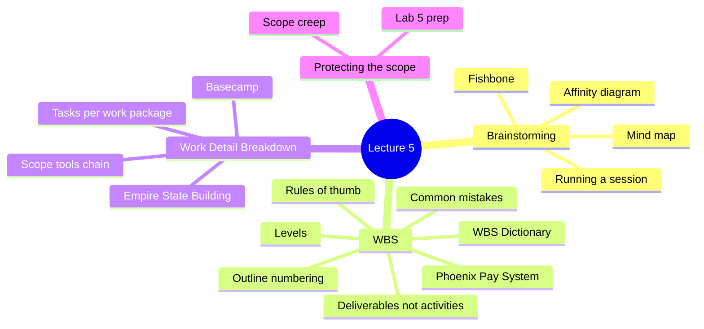
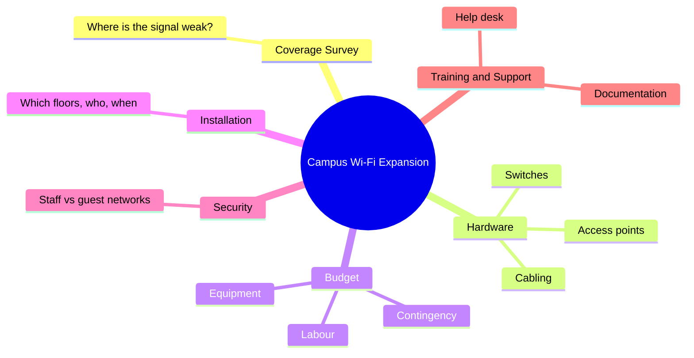
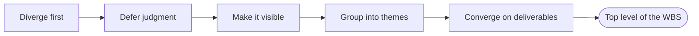
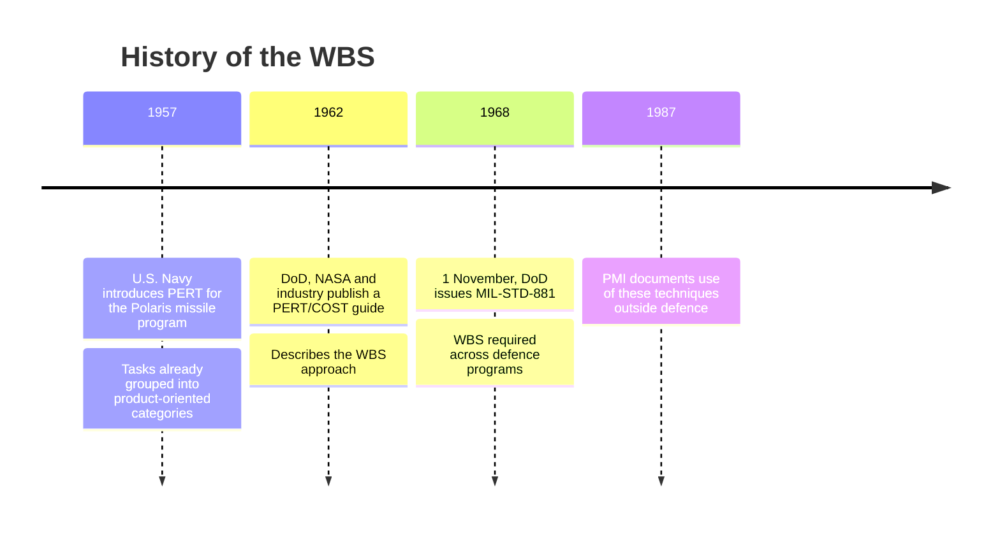
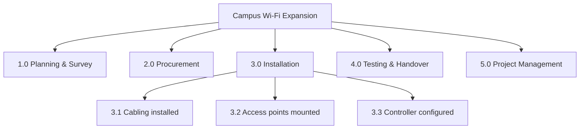
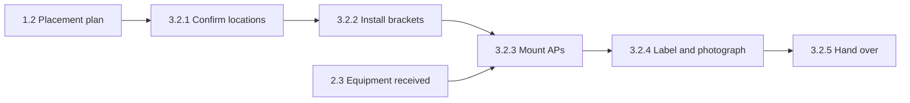
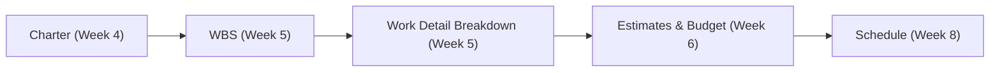
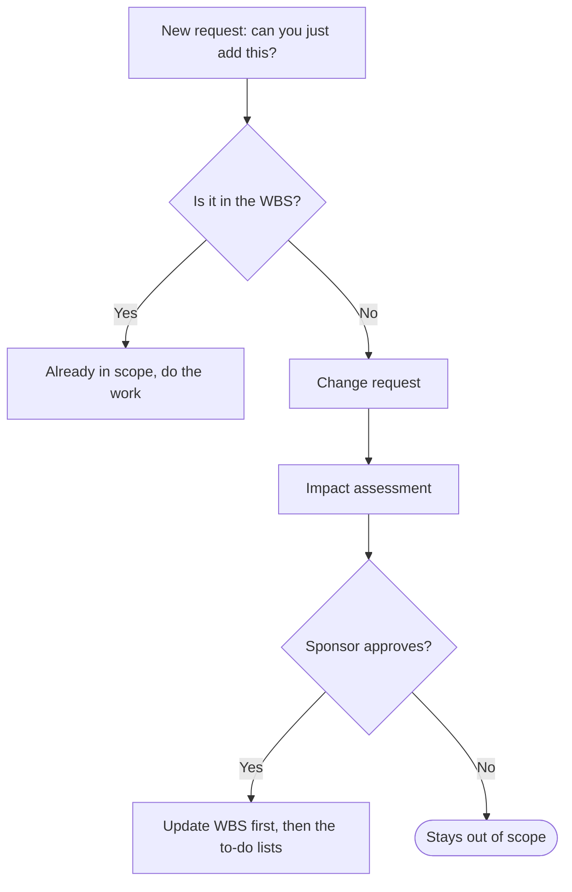

> [!note] What this lecture covers
> Last week you wrote the [[Project Charter]], which says what the project is. This week turns that Charter into a full picture of the work. Part 1 covers brainstorming diagrams that get ideas out of people's heads. Part 2 builds the [[Work Breakdown Structure]] (WBS) and its [[WBS Dictionary]]. Part 3 goes one level deeper with the [[Work Detail Breakdown]], the task list that feeds estimating and scheduling. Part 4 explains how the WBS protects you from [[Scope Creep]] and prepares you for Lab 5.

> [!example] René Descartes on breaking problems down
> "Divide each difficulty into as many parts as is feasible and necessary to resolve it."
> *René Descartes, Discourse on Method*
>
> That sentence is the whole idea behind a WBS. A project is too big to estimate, assign, or track as one block, so you keep splitting it until every piece is small enough to handle.



---
# Part 1: Visualizing the Project with Brainstorming Diagrams

## Why Draw the Project Before You Plan It?

The Charter tells you *what* the project is. It doesn't yet show you everything the project *involves*. Most of that detail still lives in people's heads, and scope that only lives in people's heads is scope that two people will remember differently by Week 9.

Drawing the project early helps in a few ways:

- Putting ideas on a page surfaces **hidden assumptions**, **forgotten [[Stakeholders|stakeholders]]**, and **missing pieces** while changing them still costs nothing.
- A good diagram gives the whole team **one shared picture** to point at. The WBS you build later is made from exactly this picture.

> [!important] Cheap now, expensive later
> Finding a missing piece on a whiteboard in Week 5 costs a sticky note. Finding the same piece after the budget and schedule are approved costs a change request, money, and time.

## Three Brainstorming and Visualization Tools

| Tool | How it works | Best for |
|---|---|---|
| **[[Mind Map]]** | Put the project in the centre and branch outward into major areas, then sub-areas | The first fast, flexible "get everything out of our heads" pass |
| **[[Affinity Diagram]]** | Write every idea on its own note, then sort the notes into natural groups | After a big brainstorm, when you have 40 loose ideas and need themes |
| **[[Fishbone Diagram\|Cause-and-Effect (Fishbone)]]** | Put a problem or risk at the "head" and trace possible causes along category "bones" | Risks and problems, rather than deliverables |

> [!tip] Picking the right tool
> Use a mind map or affinity diagram when you're figuring out *what the project will produce*. Save the fishbone for when you're asking *why something might go wrong*. That makes it more of a [[Risk Management|risk]] tool than a scope tool.

### Example: a mind map for a Campus Wi-Fi Expansion

The lecture used one running example throughout: expanding Wi-Fi across a college campus. Here is the mind map from the slides.



Notice that the branches are a mix of things to produce (hardware, training) and things to think about (budget, security). That's fine at this stage. A mind map is meant to be messy. You clean it up into deliverables when you build the WBS.

## Running a Good Brainstorming Session

A brainstorm moves in two directions. First you **diverge** (open up and collect as many ideas as possible), then you **converge** (narrow down into a structure).



1. **Diverge first.** Generate as many ideas as possible before anyone starts filtering. Quantity first, quality later.
2. **Defer judgment.** No "that won't work" during idea generation. That comment tends to silence the quiet team member who spotted the missing piece.
3. **Make it visible.** Capture everything on a shared board or document so nothing lives only in one person's memory.
4. **Group into themes.** Cluster related ideas. This is where a mind map or affinity diagram turns noise into structure.
5. **Converge on deliverables.** Turn each theme into a concrete thing the project will produce. Those become the top of your WBS.

> [!warning] Filtering too early
> The most common brainstorming mistake is judging ideas while they're still being generated. If people expect criticism, they stop sharing, and the ideas you lose are often the ones nobody else thought of.

---
# Part 2: The Work Breakdown Structure (WBS)

## What Is a Work Breakdown Structure?

> [!note] Definition
> A **[[Work Breakdown Structure]] (WBS)** is a *hierarchical*, *deliverable-oriented* breakdown of the total scope of the project. You start with the whole project at the top and keep decomposing it into smaller, more manageable pieces.

Three points to remember:

- The WBS answers one question: **what, exactly, do we have to deliver?** It does *not* say when or in what order. That comes later, in the schedule (Week 8).
- The WBS becomes part of your **[[Scope Baseline|scope baseline]]**. If work isn't in the WBS, it isn't in the project.
- Anything that *is* in the project should be traceable back to the WBS.

> [!important] The WBS is a "what" document
> A WBS lists deliverables. It has no dates, no order, and no arrows between boxes. If you catch yourself thinking "this happens before that," you're thinking about the schedule, not the WBS.

## Where the WBS Came From

The WBS started in the defence and aerospace world before it spread to every kind of project.



Because [[PMI]] carried the idea into non-defence organizations, the WBS is a core [[PMBOK]] tool today, including for IT projects like yours.

## Levels of a WBS

| Level | What it contains | Wi-Fi example |
|---|---|---|
| **1. The Project** | One box: the entire scope, named after the project | Campus Wi-Fi Expansion |
| **2. Major Deliverables** | The big pieces of the result (or, less ideally, major phases) | 3.0 Installation |
| **3. Sub-deliverables** | Each major deliverable split into the components that make it up | 3.2 Access points mounted |
| **4. [[Work Package\|Work Packages]]** | The lowest level: small enough to estimate, assign, and track | 3.2.1 Floor 1 APs mounted |

> [!note] Work package
> A **[[Work Package]]** is the bottom box of a WBS branch. It's the unit you can put a cost and an owner on. Everything above it is just grouping.

## Example WBS: Campus Wi-Fi Expansion

The slide showed the full WBS as a tree. Here is the top of the tree, with one branch (3.0 Installation) opened to show how decomposition works.



### The same WBS in outline form

A WBS can also be written as a numbered outline. It holds the same information as the tree and is easier to type into a document.

```
Campus Wi-Fi Expansion
1.0 Planning & Survey
    1.1 Coverage survey report
    1.2 Access-point placement plan
    1.3 Approved project plan
2.0 Procurement
    2.1 Access points & switches ordered
    2.2 Cabling & mounting hardware
    2.3 Equipment received
3.0 Installation
    3.1 Cabling installed
    3.2 Access points mounted
    3.3 Controller configured
4.0 Testing & Handover
    4.1 Coverage test results
    4.2 Staff training delivered
    4.3 Handover documentation
5.0 Project Management
    5.1 Status reports
    5.2 Change log
    5.3 Closeout report
```

> [!important] Why the numbers matter
> Every element gets a **unique ID**. That lets you tie a cost, an owner, or a risk to exactly one piece of the project. "The 3.2 budget" or "the risk on 2.3" can only mean one thing.

> [!important] Project management is project work
> Look at branch **5.0 Project Management**. Status reports, the change log, and the closeout report take real time and effort, so they belong in the WBS like any other deliverable.

## Deliverables, Not Activities

| Deliverable-oriented (preferred) | Activity-oriented (use with care) |
|---|---|
| Named with **nouns**: things the project *produces* | Named with **verbs**: things people *do* |
| "Coverage survey report"<br>"Access points mounted"<br>"Staff training delivered" | "Do the survey"<br>"Install stuff"<br>"Train people" |
| Easy to check: either the thing exists and is accepted, or it doesn't | Hard to check, and it's tempting to list the same work twice or leave gaps |

Activities still matter. They just belong one level lower, in the **Work Detail Breakdown** (Part 3).

> [!example] Turning an activity into a deliverable
> "Test the network" is an activity. You can't tell when it's finished. "Coverage test results" is a deliverable. Either the results document exists and the sponsor has accepted it, or it doesn't.

## Rules of Thumb for a Good WBS

1. **The [[100% Rule]].** The WBS must include 100% of the work in scope and nothing outside it. The children of a box must add up to their parent.
2. **No overlap.** Each piece of work appears in exactly one place. Overlap means double-counted cost and unclear ownership.
3. **Work packages are estimable.** The lowest level should be small enough to estimate cost and duration with confidence, and to give to one owner.
4. **Right-sized.** A common guideline is roughly **8 to 80 hours** of effort per work package, and **2 to 4 levels** for most projects.
5. **Include the invisible work.** Project management, testing, training, and documentation are work. If they're missing, they'll show up later as overruns.

> [!example] The 100% rule in the Wi-Fi WBS
> 3.0 Installation has three children: cabling installed, access points mounted, and controller configured. If those three together don't fully describe what "installation" means, something is missing. Maybe nobody listed removing the old equipment. Then that work isn't budgeted or assigned to anyone, even though it still has to happen.

## Common WBS Mistakes

| Too coarse or incomplete | Too fine, or mixed up |
|---|---|
| Work packages like "Do the installation" that can't be estimated or assigned | Breaking work into 30-minute steps, which turns the WBS into micromanagement |
| Missing testing, training, documentation, or project management work | Mixing verbs and nouns, or phases and deliverables, at the same level |
| Children that don't add up to the parent, so scope goes missing without anyone noticing | Uneven depth that makes one branch look 10 times bigger than another |

> [!warning] Both extremes hurt
> A WBS that is too coarse hides work you'll pay for later. A WBS that is too fine buries the team in tracking tiny steps. The 8 to 80 hour guideline is there to keep you between the two.

## The WBS Dictionary

A box labelled "3.3 Controller configured" doesn't tell a new team member what "configured" actually means. The **[[WBS Dictionary]]** fixes that.

> [!note] Definition
> The **WBS Dictionary** adds a short description for each WBS element: its deliverable, [[Acceptance Criteria|acceptance criteria]], owner, and any assumptions or constraints.

The slide's illustration showed a dictionary entry for a "Build homepage" work package (code 1.1.2) in a website launch project. Its fields included:

| Field | Example from the slide |
|---|---|
| WBS code and name | 1.1.2, Build homepage |
| Description | Design and develop the homepage, including layout, navigation, and responsive design |
| Deliverables | Functional homepage (desktop and mobile), source code in the repository, design assets |
| Acceptance criteria | Matches the approved mockups, works on the latest browsers, passes product-owner review |
| Responsible owner | Web development lead |
| Milestones, cost, duration | Milestone dates, an estimated $8,000, 10 working days |
| Resources and dependencies | One front-end developer, a part-time UI/UX designer; depends on 1.1.1 (development environment) |
| Assumptions, constraints, risks | Mockups approved on time; must follow company web standards; risk of delays in design approval |
| Approval | Signed off by the product owner |

> [!tip] Table of contents vs. the pages
> Think of the WBS as the **table of contents** and the dictionary as the **page that defines each entry**. The [[SMART Criteria|SMART criteria]] from last week plug straight into the acceptance-criteria field.

> [!important] The scope baseline
> Three documents together make up the **[[Scope Baseline|scope baseline]]**:
> 1. the approved [[Scope Statement|scope statement]]
> 2. the WBS
> 3. the WBS dictionary

## Case Study: The Phoenix Pay System (2016)

> [!example] The project
> In 2016 the Government of Canada rolled out **Phoenix**, a new pay system for federal employees, with an original estimate of about **C$310 million**. The project was under pressure to deliver on schedule and within budget.

> [!warning] The failure
> About **193,000 federal employees** were hit by pay errors: paid too much, too little, or nothing at all. The Auditor General found that:
> - more than **100 of 984** pay-processing functions had been deferred or removed;
> - **20% of a sampled 81 functions** failed testing and were never retested;
> - executives went live despite known problems.
>
> Costs climbed past **C$1.2 billion**. Her verdict: *"an incomprehensible failure of project management and oversight."*

> [!important] Lessons from Phoenix
> - **Scope cuts must be visible.** When over 100 functions were deferred or removed, the scope shrank and nobody re-examined the rest of the plan. Every scope cut should be visible against the baseline and approved, never made silently.
> - **Done means accepted.** A work package isn't done until its acceptance test passes. Functions that failed testing were never retested, so "complete" didn't mean "works."
> - **Write go-live criteria in advance.** Like the SMART criteria from last week, go-live criteria written down early stop schedule pressure from overriding them later.

---
# Part 3: Work Detail Breakdown

## From Work Package to Tasks

The WBS stops at work packages, which say **what** will be delivered. The **[[Work Detail Breakdown]]** goes one layer deeper and lists the **tasks** needed to deliver each work package. This is where the verbs go.

For each task, record:

| Field | What it means |
|---|---|
| **Short name** | A clear verb phrase for the task |
| **Owner** | One person responsible |
| **Effort estimate** | Hours of work |
| **Depends on** | Anything that must be finished first |
| **"Done when..."** | A clear statement of what counts as finished |

> [!important] The bridge to scheduling
> In Week 8 you'll sequence these tasks into a timeline. You can't schedule work you haven't listed, so the Work Detail Breakdown is the raw material for the schedule.

## Example: Work Package 3.2, Access Points Mounted

| ID | Task | Owner | Est. hrs | Depends on | Done when... |
|---|---|---|---|---|---|
| 3.2.1 | Confirm mount locations with facilities | Network lead | 4 | 1.2 | Locations signed off |
| 3.2.2 | Install mounting brackets (floors 1-2) | Installer | 12 | 3.2.1 | All brackets inspected |
| 3.2.3 | Mount access points on brackets | Installer | 10 | 3.2.2, 2.3 | Every AP powered on |
| 3.2.4 | Label and photograph each AP | Installer | 6 | 3.2.3 | Asset sheet updated |
| 3.2.5 | Hand over to configuration team | Network lead | 2 | 3.2.4 | Sign-off posted in Basecamp |

**Total: 34 hours**, comfortably inside the usual 8 to 80 hour guideline for a work package.

The "Depends on" column already hints at the order of work. Task 3.2.1 needs the placement plan (1.2), and task 3.2.3 needs both the brackets (3.2.2) and the delivered equipment (2.3):



> [!tip] Check the "done when" column
> Every "done when" statement here can be checked by someone else: signed off, inspected, powered on, sheet updated, sign-off posted. If a "done when" says something like "installer is happy with it," rewrite it.

## How the Scope Tools Chain Together



Each step feeds the next. A weak WBS means weak estimates, a weak [[Budgeting|budget]], and a schedule full of surprises.

## Putting It Into Basecamp

The course uses [[Basecamp]] to run projects. Here is how the scope documents map onto it:

| From your scope documents | In Basecamp |
|---|---|
| Each **Level 2 deliverable** from the WBS | A **to-do list** |
| Each **task** from the Work Detail Breakdown | A **to-do** with an owner and a due date |
| The **WBS diagram** and **WBS dictionary** | Posted to **Docs & Files**, so there's one approved version everyone works from |

> [!warning] Update order when scope changes
> Update the **WBS first** and the to-do lists second. The WBS document is the baseline. The to-do lists are how you carry it out. If you only change the to-dos, the baseline and the real work drift apart.

## Real-World Example: The Empire State Building (1930-31)

> [!example] The project
> Construction began on **March 17, 1930**, and the building opened on **May 1, 1931**, about **410 days** later. The steel frame rose roughly **four and a half stories a week**, and the final cost of about **$40.9 million** came in under budget.

That predictable pace is what repeatable, well-defined pieces of work make possible. When work is broken into units you can measure, you can forecast it week by week.

> [!warning] On time and on budget is not the same as success
> The building opened about **75% empty** during the Depression and didn't turn a real profit until the **1940s**. Your [[Success Criteria|success criteria]] need to include the business case, not just the schedule.

---
# Part 4: Protecting the Scope

## The WBS Is Your Defence Against Scope Creep

> [!note] Definition
> **[[Scope Creep]]** is the gradual growth of a project's requirements after the baseline is set. It's "just one more feature" repeated until the budget and schedule no longer fit.

With an approved WBS and dictionary, the answer to "can you just add this?" stops being an argument and becomes a process:



You'll build the full [[Change Control|change-control]] process in Weeks 9-10. This week the job is to make sure there's a baseline to protect.

> [!example] "Just one more item"
> The slide's cartoon showed a CEO cat saying "It's a small change! Just one more item. How hard could it be?" next to a growing to-do list and a timeline that keeps getting "slightly longer." Each request looks small. Added together, they're why the project no longer fits its plan.

## Before Lab 5

1. Bring your approved **Charter v1.0** and **Power/Interest Grid** from Lab 4. The Charter's scope section is where your WBS starts.
2. In Lab 5 you'll:
   - brainstorm your project as a **mind map**;
   - build a **WBS** with **at least four deliverables plus a Project Management branch**;
   - write a **Work Detail Breakdown for two of your work packages**.
3. Come ready to name each deliverable with a **noun**, and to defend where your team drew the line between "in scope" and "out of scope."

---
# Key Takeaways

- **Draw before you plan.** Mind maps and affinity diagrams turn a head full of ideas into a shared picture the whole team can react to.
- **The WBS is deliverables, not activities.** Decompose until each work package can be estimated and owned, and make sure the pieces add up to 100% of the scope.
- **Don't forget the invisible work.** Testing, training, documentation, and project management belong in the WBS, or they'll arrive later as overruns.
- **Tasks make it schedulable.** The Work Detail Breakdown adds owners, estimates, dependencies, and "done when" statements, the raw material for Weeks 6 and 8.

---
# Exercises

### Exercise 1 (Direct application)
Sort these WBS element names into deliverable-oriented (good) and activity-oriented (needs rewriting). Rewrite the activity-oriented ones as deliverables: (a) "User manual," (b) "Write the code," (c) "Database schema approved," (d) "Train the staff," (e) "Test the app."

> [!success]- Answer key
> - (a) **Deliverable.** A noun; either the manual exists and is accepted, or it doesn't.
> - (b) **Activity.** Rewrite as something like "Application source code delivered" or a specific module, e.g. "Login module built."
> - (c) **Deliverable.** It names a thing and a state you can check.
> - (d) **Activity.** Rewrite as "Staff training delivered" (the wording the lecture's Wi-Fi WBS uses).
> - (e) **Activity.** Rewrite as "Test results" or "User acceptance test report."
>
> The test: can someone check whether it exists and has been accepted? Verbs describe effort, which is hard to check. Nouns describe results.

### Exercise 2 (Direct application)
A work package in your WBS is estimated at 200 hours. Another is estimated at 2 hours. What does the lecture's guideline say about each, and what should you do?

> [!success]- Answer key
> The guideline is roughly **8 to 80 hours** per work package.
> - **200 hours** is too big. It's probably too coarse to estimate with confidence or give to one owner. Decompose it into two or more smaller work packages.
> - **2 hours** is too small. At that size the WBS starts turning into micromanagement. Merge it with a related work package, or treat it as a task in the Work Detail Breakdown.

### Exercise 3 (Direct application)
In the Wi-Fi Work Detail Breakdown, why can't task 3.2.3 "Mount access points on brackets" start as soon as the brackets are installed?

> [!success]- Answer key
> Task 3.2.3 depends on **two** things: 3.2.2 (brackets installed) **and** 2.3 (equipment received). If the access points haven't arrived from procurement, there's nothing to mount. This shows dependencies crossing between WBS branches (Installation depends on Procurement), which is why recording "depends on" matters before you build a schedule.

### Exercise 4 (Applied variation)
A team's WBS for a mobile banking app has these Level 2 elements: 1.0 App design, 2.0 Backend API, 3.0 Mobile app, 4.0 Security review. Using the rules of thumb, what is missing?

> [!success]- Answer key
> The **invisible work** is missing. There's no **project management** branch (status reports, change log, closeout report), and probably no **testing**, **training**, or **documentation** either, unless they're hidden inside other branches. The lecture warns that missing invisible work shows up later as **overruns**. This also breaks the **100% rule**, since the WBS doesn't include all the work in scope. A fix would be to add, for example, 5.0 Testing & Launch and 6.0 Project Management.

### Exercise 5 (Applied variation)
Under "3.0 Website," a WBS lists 3.1 Homepage, 3.2 Product pages, and 3.3 Checkout. Under "4.0 Payments," it also lists 4.1 Checkout payment form. What rule might this break, and what are the consequences?

> [!success]- Answer key
> It may break the **no overlap** rule. If the checkout payment form is already part of 3.3 Checkout, the same work appears in two places. The lecture names two consequences: **double-counted cost** (it gets estimated and budgeted twice) and **unclear ownership** (two owners each think the other is handling it, or both do it). Decide where the payment form lives and remove it from the other branch, or clearly define in the WBS dictionary what each element includes.

### Exercise 6 (Applied variation)
Halfway through the Wi-Fi project, a dean asks the team to also install digital signage screens in the lobby, since "you're already running cables." Using the WBS, walk through how the PM should respond.

> [!success]- Answer key
> 1. **Check the WBS.** Digital signage isn't in any branch, so it's out of scope.
> 2. **Raise a change request** instead of agreeing informally.
> 3. **Do an impact assessment.** How much extra cabling, hardware, labour, cost, and time would it add?
> 4. **Get sponsor approval.** The dean asking isn't enough; the sponsor decides.
> 5. If approved, **update the WBS first** (and the dictionary), then the Basecamp to-do lists.
>
> Agreeing on the spot would be scope creep: a "small" addition after the baseline was set.

### Exercise 7 (Challenge)
Pick one function the Phoenix team deferred, such as "overtime pay calculation." Write a WBS dictionary entry for that work package that would have made the problems the Auditor General found harder to hide.

> [!success]- Answer key
> One possible entry:
> - **WBS code / name:** 4.7 Overtime pay calculation
> - **Description:** Calculates overtime pay for all federal pay groups according to their collective agreements.
> - **Deliverable:** Overtime calculation module in production.
> - **Acceptance criteria:** Passes all test cases for every pay group; any failed test is fixed and **retested** before sign-off; results match a sample of manually calculated pay stubs.
> - **Owner:** Named lead for pay rules.
> - **Assumptions/constraints:** Collective-agreement rules are documented and frozen by a set date. **Removing or deferring this function requires a change request and sponsor approval.**
>
> This targets the Phoenix lessons directly. A scope cut becomes visible and approved instead of silent, and "done" is tied to a passing (re)test instead of just "built." The dictionary turns vague boxes into checkable commitments.

### Exercise 8 (Challenge)
You're the PM for a small project to set up a new computer lab (30 workstations, software, network, and printers). Build a WBS with at least four deliverables plus a Project Management branch, down to Level 3, using outline numbering. Then pick one work package and list three tasks for it with owner, estimate, dependency, and "done when."

> [!success]- Answer key
> Example WBS (many correct answers exist):
> ```
> Computer Lab Setup
> 1.0 Planning
>     1.1 Lab layout plan
>     1.2 Equipment list approved
> 2.0 Procurement
>     2.1 Workstations ordered
>     2.2 Printers and peripherals ordered
>     2.3 Equipment received
> 3.0 Hardware Installation
>     3.1 Furniture and power in place
>     3.2 Workstations installed
>     3.3 Printers installed
> 4.0 Software & Network
>     4.1 Network connections live
>     4.2 Software image deployed
> 5.0 Testing & Handover
>     5.1 Workstation test results
>     5.2 Lab user guide
> 6.0 Project Management
>     6.1 Status reports
>     6.2 Change log
>     6.3 Closeout report
> ```
> Example Work Detail Breakdown for **3.2 Workstations installed**:
>
> | ID | Task | Owner | Est. hrs | Depends on | Done when... |
> |---|---|---|---|---|---|
> | 3.2.1 | Unbox and place workstations | Technician | 8 | 2.3, 3.1 | All 30 at their desks |
> | 3.2.2 | Connect power and peripherals | Technician | 6 | 3.2.1 | Every station powers on |
> | 3.2.3 | Label and record asset tags | Technician | 4 | 3.2.2 | Asset sheet updated |
>
> Check your own answer: every element is a **noun**, there's a **PM branch**, there's **no overlap**, the children add up to their parent (**100% rule**), and the tasks (verbs) appear only in the Work Detail Breakdown. The total here (18 hours) sits inside the 8 to 80 hour guideline.

---
# Feynman Practice

Write each explanation in your own words, without looking at the notes. Where the steps below say to mark a word, use `(?)` to flag it.

## Feynman: Brainstorming before planning
- [ ] **1. Explain it as if to a 12-year-old.** Your class is planning a school fair. Why would you first throw every idea onto a big board before deciding anything? What happens to the shy kid's idea if someone keeps saying "that won't work"?
- [ ] **2. Find the jargon.** Reread what you wrote. Mark with `(?)` any word a 12-year-old wouldn't understand (e.g. "diverge," "converge," "affinity diagram," "deliverable").
- [ ] **3. Simplify.** For each `(?)`, write an analogy or concrete example. How is sorting sticky notes into piles like an affinity diagram? When would you use a fishbone instead of a mind map?
- [ ] **4. Organize and test.** Rewrite it in 3-5 sentences. Could you explain, in 2 minutes, how a messy brainstorm turns into the top level of a WBS?

## Feynman: The Work Breakdown Structure
- [ ] **1. Explain it as if to a 12-year-old.** How would you break "throw a birthday party" into smaller pieces, then break those pieces down again? When would you stop splitting?
- [ ] **2. Find the jargon.** Mark with `(?)` words like "hierarchical," "decompose," "work package," "scope baseline."
- [ ] **3. Simplify.** Using the Wi-Fi example, explain why "Access points mounted" is a better WBS name than "Install stuff." Why does 5.0 Project Management get its own branch?
- [ ] **4. Organize and test.** In 3-5 sentences, explain what a WBS is, what question it answers, and what it deliberately leaves out.

## Feynman: Rules for a good WBS
- [ ] **1. Explain it as if to a 12-year-old.** If you cut a pizza into slices, what does it mean for the slices to "add up to 100%"? What goes wrong if two people both think they own the same slice?
- [ ] **2. Find the jargon.** Mark with `(?)` words like "100% rule," "overlap," "estimable," "invisible work," "overrun."
- [ ] **3. Simplify.** Explain why the 8 to 80 hour guideline protects you from both "too coarse" and "too fine." Give one example of each mistake.
- [ ] **4. Organize and test.** Rewrite it in 3-5 sentences. Could you list the five rules of thumb and say why each one matters?

## Feynman: WBS Dictionary and the Work Detail Breakdown
- [ ] **1. Explain it as if to a 12-year-old.** If the WBS is a book's table of contents, what is the dictionary? And what is the Work Detail Breakdown, the to-do list for writing each chapter?
- [ ] **2. Find the jargon.** Mark with `(?)` words like "acceptance criteria," "dependency," "effort estimate," "done when."
- [ ] **3. Simplify.** Using the Phoenix Pay System, explain why "done" has to mean "passed its acceptance test" and not just "built."
- [ ] **4. Organize and test.** In 3-5 sentences, explain how the Charter, WBS, Work Detail Breakdown, budget, and schedule feed into one another.

## Feynman: The WBS against scope creep
- [ ] **1. Explain it as if to a 12-year-old.** Your parents agreed to a party with 10 friends. Every day you ask to invite "just one more." What happens by the end of the week, and how would a written guest list help?
- [ ] **2. Find the jargon.** Mark with `(?)` words like "scope creep," "baseline," "change request," "impact assessment."
- [ ] **3. Simplify.** Explain why "is it in the WBS?" turns an argument into a process.
- [ ] **4. Organize and test.** Rewrite it in 3-5 sentences, including why the WBS gets updated before the Basecamp to-do lists.

---
# Flashcards (Anki)

Copy the block below into a `.txt` file and import it in Anki via **File > Import** (Basic note type, fields separated by tab).

```
#separator:tab
#html:false
#tags column:3
Why draw the project before planning it?	Ideas on a page surface hidden assumptions, forgotten stakeholders, and missing pieces while changes still cost nothing, and give the team one shared picture.	csd318 lecture-05 brainstorming
How does a mind map work?	Put the project in the centre and branch outward into major areas, then sub-areas.	csd318 lecture-05 brainstorming
When is an affinity diagram most useful?	After a big brainstorm, when you have many loose ideas (e.g. 40) and need to sort them into themes.	csd318 lecture-05 brainstorming
What is a fishbone (cause-and-effect) diagram best used for?	Tracing possible causes of a problem or risk, rather than listing deliverables.	csd318 lecture-05 brainstorming
Why should you defer judgment during idea generation?	Saying "that won't work" silences people, often the quiet team member who spotted the missing piece.	csd318 lecture-05 brainstorming
What is the final step of a good brainstorming session, and what does it produce?	Converge on deliverables: each theme becomes a concrete thing the project will produce, forming the top of the WBS.	csd318 lecture-05 brainstorming
What is a Work Breakdown Structure (WBS)?	A hierarchical, deliverable-oriented breakdown of the total scope of the project, decomposed into smaller, manageable pieces.	csd318 lecture-05 wbs
What question does a WBS answer, and what does it NOT show?	What exactly do we have to deliver? It does not show when or in what order (that is the schedule).	csd318 lecture-05 wbs
What does it mean if work is not in the WBS?	It isn't in the project.	csd318 lecture-05 wbs
What program first used PERT, and in what year?	The U.S. Navy's Polaris missile program, in 1957.	csd318 lecture-05 wbs-history
What did the DoD issue on 1 November 1968?	MIL-STD-881, requiring a WBS across defence programs.	csd318 lecture-05 wbs-history
What is Level 1 of a WBS?	One box representing the entire scope, named after the project.	csd318 lecture-05 wbs-levels
What is a work package?	The lowest level of a WBS: small enough to estimate, assign, and track.	csd318 lecture-05 wbs-levels
Why does every WBS element get a unique number?	So a cost, owner, or risk can be tied to exactly one piece of the project.	csd318 lecture-05 wbs
Why does Project Management appear as a branch in the WBS?	Managing the project is project work too (status reports, change log, closeout report).	csd318 lecture-05 wbs
How should WBS elements be named: nouns or verbs?	Nouns (deliverables the project produces), not verbs (activities people do).	csd318 lecture-05 wbs
Where do activities (verbs) belong, if not in the WBS?	One level lower, in the Work Detail Breakdown.	csd318 lecture-05 work-detail-breakdown
What is the 100% rule?	The WBS includes 100% of the work in scope and nothing outside it; children must add up to their parent.	csd318 lecture-05 wbs-rules
What two problems does overlap in a WBS cause?	Double-counted cost and unclear ownership.	csd318 lecture-05 wbs-rules
What is the common size guideline for a work package?	Roughly 8 to 80 hours of effort.	csd318 lecture-05 wbs-rules
How many levels does a WBS have for most projects?	About 2 to 4 levels.	csd318 lecture-05 wbs-rules
What is the "invisible work" that must appear in a WBS?	Project management, testing, training, and documentation.	csd318 lecture-05 wbs-rules
What happens if invisible work is left out of the WBS?	It shows up later as overruns.	csd318 lecture-05 wbs-rules
Name one mistake of a WBS that is too fine or mixed up.	Any of: 30-minute steps (micromanagement); mixing verbs and nouns or phases and deliverables at one level; uneven depth across branches.	csd318 lecture-05 wbs-mistakes
What does a WBS Dictionary add?	A short description of each element: its deliverable, acceptance criteria, owner, and assumptions or constraints.	csd318 lecture-05 wbs-dictionary
Which three documents make up the scope baseline?	The approved scope statement, the WBS, and the WBS dictionary.	csd318 lecture-05 scope-baseline
What scope lesson does the Phoenix Pay System teach?	Over 100 of 984 functions were deferred or removed without re-examining the plan; every scope cut must be visible against the baseline and approved.	csd318 lecture-05 case-study
According to the Phoenix case, when is a work package done?	When its acceptance test passes, not just when it is built.	csd318 lecture-05 case-study
What does the Work Detail Breakdown list?	The tasks needed to deliver each work package.	csd318 lecture-05 work-detail-breakdown
What five things should you record for each task in a Work Detail Breakdown?	A short name, an owner, an effort estimate, dependencies, and a "done when" statement.	csd318 lecture-05 work-detail-breakdown
Why is the Work Detail Breakdown called the bridge to scheduling?	You can't schedule work you haven't listed; its tasks get sequenced into the timeline in Week 8.	csd318 lecture-05 work-detail-breakdown
What is the order of the scope tools chain?	Charter, WBS, Work Detail Breakdown, Estimates and Budget, Schedule.	csd318 lecture-05 scope-tools
In Basecamp, what does each Level 2 WBS deliverable become?	A to-do list.	csd318 lecture-05 basecamp
When scope changes, what do you update first: the WBS or the Basecamp to-do lists?	The WBS first; it is the baseline, and the to-do lists are how you carry it out.	csd318 lecture-05 basecamp
What made the Empire State Building's construction pace predictable?	Repeatable, well-defined, measurable pieces of work that could be forecast week by week.	csd318 lecture-05 case-study
Why was the Empire State Building not a full success despite being on time and under budget?	It opened about 75% empty during the Depression and didn't turn a real profit until the 1940s.	csd318 lecture-05 case-study
What is scope creep?	The gradual growth of a project's requirements after the baseline is set ("just one more feature").	csd318 lecture-05 scope-creep
What three things does an out-of-WBS request need?	A change request, an impact assessment, and sponsor approval.	csd318 lecture-05 scope-creep
```

---
# Further Reading

- [PMI (Project Management Institute)](https://www.pmi.org)
- [Atlassian: Work breakdown structure](https://www.atlassian.com/work-management/project-management/work-breakdown-structure)
- [Atlassian: Scope creep](https://www.atlassian.com/agile/project-management/scope-creep)
- [Investopedia: Work Breakdown Structure](https://www.investopedia.com/terms/w/work-breakdown-structure.asp)
- [Office of the Auditor General of Canada](https://www.oag-bvg.gc.ca) (reports on the Phoenix Pay System)

---
# Tags

#project-management #CSD318 #wbs #work-breakdown-structure #wbs-dictionary #work-detail-breakdown #brainstorming #mind-map #scope #scope-baseline #scope-creep #planning #case-studies #PMBOK
